# Technical Specification

# 0. Agent Action Plan

## 0.1 Core Feature Objective

Based on the prompt, the Blitzy platform understands that the new feature requirement is to transform an existing Node.js server tutorial project into a fully functional Express.js-based web server with multiple endpoints. Specifically, the platform interprets the requirement as follows:

**Primary Feature Requirements:**

- **Integrate Express.js Framework**: Add the Express.js web framework to the existing Node.js project, transitioning from a native Node.js HTTP server implementation to a more robust and feature-rich Express.js application architecture.

- **Maintain Existing "Hello World" Endpoint**: Preserve the functionality of the current endpoint that returns the response "Hello world", ensuring backward compatibility with any existing interactions or dependencies.

- **Implement New "Good Evening" Endpoint**: Create an additional HTTP endpoint that returns the response "Good evening", expanding the server's API surface area to support multiple routes.

**Implicit Requirements Detected:**

- **Project Initialization**: Since the repository currently contains only a README.md file with no Node.js project structure, the platform understands that a complete Node.js project initialization is required, including the creation of a package.json manifest file.

- **Dependency Management**: Establish proper Node.js dependency management by configuring package.json with appropriate metadata, scripts, and dependency declarations for Express.js.

- **Server Entry Point**: Create a main server file (commonly server.js or index.js) that serves as the application entry point, initializing Express.js and defining route handlers.

- **HTTP Method Selection**: Although not explicitly specified, the platform assumes standard GET HTTP methods for both endpoints, as this is the conventional approach for simple response endpoints in RESTful API design.

- **Port Configuration**: The server requires a configured listening port, with best practices suggesting either a configurable port via environment variables or a default port (typically 3000 for Express.js applications).

- **Response Format**: Both endpoints should return plain text responses, maintaining simplicity consistent with tutorial objectives.

**Feature Dependencies and Prerequisites:**

- **Node.js Runtime**: Requires Node.js version 18 or higher for optimal Express.js 5.x compatibility, or Node.js 14+ for Express.js 4.x compatibility. Current environment has Node.js v20.19.5 installed, satisfying all requirements.

- **NPM Package Manager**: Requires npm (Node Package Manager) for installing Express.js and managing project dependencies. Current environment has npm 10.8.2 installed.

- **Version Control**: The project already has Git initialized (.git directory present), enabling proper version tracking of the new Express.js implementation.

**Success Criteria:**

- Express.js successfully installed as a project dependency in package.json
- Server application starts without errors and listens on a configured port
- GET request to the first endpoint returns "Hello world" with HTTP 200 status
- GET request to the second endpoint returns "Good evening" with HTTP 200 status
- Code follows Express.js best practices and conventions
- Project structure is organized and maintainable for future tutorial extensions

## 0.2 Special Instructions and Constraints

**User-Provided Directives:**

User Request (Exact): *"this is a tutorial of node js server hosting one endpoint that returns the response 'Hello world'. Could you add expressjs into the project and add another endpoint that return the reponse of 'Good evening'?"*

**Architectural Requirements:**

- **Tutorial Context**: This is explicitly a tutorial project, which influences design decisions toward simplicity, clarity, and educational value over production-level complexity. The implementation should prioritize readability and ease of understanding for learning purposes.

- **Express.js Integration Pattern**: The requirement specifically calls for "adding Express.js into the project," indicating that the existing Node.js HTTP server approach should be replaced or enhanced with Express.js middleware and routing capabilities.

- **Endpoint Structure**: Both endpoints should follow RESTful conventions with clear, descriptive route paths. The implementation should demonstrate Express.js routing patterns in a straightforward manner suitable for tutorial consumption.

- **Minimal Dependencies**: As a tutorial project, the dependency tree should remain lean, including only Express.js and its required peer dependencies, avoiding unnecessary middleware or utility packages that could complicate the learning experience.

**Code Quality and Convention Standards:**

- **Express.js Best Practices**: Follow official Express.js documentation conventions, including proper middleware ordering, error handling patterns, and response methods (res.send(), res.json(), etc.).

- **Code Organization**: Maintain clean separation of concerns with clear route definitions, avoiding inline complex logic that could obscure the Express.js learning objectives.

- **Naming Conventions**: Use standard JavaScript naming conventions (camelCase for variables/functions, PascalCase for classes) and follow Express.js community standards for file naming (server.js, app.js, or index.js for entry points).

- **Documentation Standards**: Include inline comments explaining Express.js-specific concepts for tutorial readers who may be new to the framework.

**Backward Compatibility Considerations:**

- **Existing Endpoint Preservation**: The original "Hello world" endpoint functionality must be preserved in the Express.js implementation, maintaining the same response text exactly as specified.

- **Port Flexibility**: Support both hardcoded default ports and environment-variable-based port configuration to accommodate different deployment and testing scenarios.

**Security and Safety Constraints:**

- **Non-Interactive Installation**: All dependency installations and setup commands must use non-interactive flags to ensure compatibility with automated build systems and CI/CD pipelines.

- **Version Pinning Strategy**: While using latest versions is acceptable for a tutorial, the implementation should document the specific Express.js version being used to ensure reproducibility of tutorial results.

**Performance and Scalability Considerations:**

- **Tutorial Scope**: Performance optimization is explicitly out of scope for this initial implementation. The focus is on functional correctness and code clarity rather than high-throughput request handling.

- **No Production Hardening Required**: Advanced features like clustering, load balancing, request throttling, or comprehensive security middleware are not required for this tutorial-level implementation.

**Development Environment Constraints:**

- **Node.js Version Compatibility**: Must work with Node.js v20.19.5 (currently installed) while maintaining compatibility with Node.js 18+ for Express.js 5.x or Node.js 14+ for Express.js 4.x.

- **Cross-Platform Compatibility**: The solution should work on Windows, macOS, and Linux without platform-specific dependencies or commands.

**Exclusions and Out-of-Scope Elements:**

- No database integration required
- No authentication or authorization mechanisms needed
- No external API integrations necessary
- No front-end HTML/CSS/JavaScript files required
- No template engines (EJS, Pug, Handlebars) needed
- No testing framework setup required (though testing would be beneficial for production code)
- No logging frameworks or monitoring tools required
- No deployment configuration (Docker, Kubernetes, cloud platforms) needed

## 0.3 Technical Interpretation

These feature requirements translate to the following comprehensive technical implementation strategy, mapping each user requirement to specific technical actions:

**Requirement 1: Initialize Node.js Project Structure**

- **Technical Action**: Create a properly configured package.json file that serves as the project manifest, defining metadata, scripts, and dependency management for the Node.js application.
  
- **Implementation Details**: Execute `npm init` with appropriate flags to generate package.json, or create the file directly with required fields including name, version, description, main entry point, scripts (particularly "start" for running the server), and dependencies section.

- **Affected Components**: 
  - CREATE: `package.json` - Project manifest with Express.js dependency declaration
  - CREATE: `.gitignore` - Exclude node_modules and other non-repository files

**Requirement 2: Integrate Express.js Framework**

- **Technical Action**: Add Express.js as a production dependency to the project, selecting the appropriate version (4.21.2 for maximum stability or 5.1.0 for latest features) and installing it via npm.

- **Implementation Details**: Execute `npm install express --save` to add Express.js to the dependencies section of package.json and download the package to node_modules directory.

- **Affected Components**:
  - MODIFY: `package.json` - Add express to dependencies object with semantic version
  - CREATE: `node_modules/` directory - Contains Express.js and its dependency tree (excluded from Git)
  - CREATE: `package-lock.json` - Lock file ensuring deterministic dependency resolution

**Requirement 3: Create Express.js Server Application**

- **Technical Action**: Create the main server file that imports Express.js, initializes an Express application instance, configures middleware (if needed), defines routes for both endpoints, and starts the HTTP server on a configured port.

- **Implementation Details**: 
  - Import Express module using `const express = require('express')` or ES6 `import` syntax
  - Initialize app with `const app = express()`
  - Configure port with environment variable fallback: `const PORT = process.env.PORT || 3000`
  - Start server with `app.listen(PORT, callback)` to bind to the configured port

- **Affected Components**:
  - CREATE: `server.js` or `index.js` - Main application entry point
  - MODIFY: `package.json` - Set "main" field to point to server file and add start script

**Requirement 4: Implement "Hello World" Endpoint**

- **Technical Action**: Define a GET route handler using Express.js routing methods that responds to HTTP GET requests with the plain text response "Hello world".

- **Implementation Details**:
  - Use `app.get('/hello', (req, res) => { res.send('Hello world'); })` or similar route definition
  - Alternative path options: '/', '/api/hello', or any RESTful path appropriate for the endpoint
  - Ensure response uses appropriate Express.js response method (res.send() for text)

- **Affected Components**:
  - MODIFY: `server.js` - Add route definition for hello endpoint
  - HTTP Method: GET
  - Response Type: text/html or text/plain
  - Status Code: 200 OK (implicit default)

**Requirement 5: Implement "Good Evening" Endpoint**

- **Technical Action**: Define a second GET route handler that responds to HTTP GET requests with the plain text response "Good evening", following the same pattern as the hello endpoint.

- **Implementation Details**:
  - Use `app.get('/evening', (req, res) => { res.send('Good evening'); })` or similar route definition
  - Ensure route path is distinct from the hello endpoint to avoid conflicts
  - Maintain consistent response pattern with the hello endpoint

- **Affected Components**:
  - MODIFY: `server.js` - Add route definition for evening endpoint
  - HTTP Method: GET
  - Response Type: text/html or text/plain
  - Status Code: 200 OK (implicit default)

**Requirement 6: Enable Server Startup and Testing**

- **Technical Action**: Configure npm scripts to enable easy server startup via `npm start` command, and ensure the server logs startup confirmation with the listening port number.

- **Implementation Details**:
  - Add start script to package.json: `"start": "node server.js"`
  - Include console.log statement in server listen callback to confirm server is running
  - Support graceful shutdown signals for development convenience (optional enhancement)

- **Affected Components**:
  - MODIFY: `package.json` - Add or update scripts.start field
  - MODIFY: `server.js` - Add startup logging in listen callback

**Technical Dependencies and Sequencing:**

1. **Phase 1 - Project Foundation**: Create package.json and .gitignore before any code implementation
2. **Phase 2 - Dependency Installation**: Install Express.js after package.json exists
3. **Phase 3 - Server Implementation**: Create server.js with Express.js initialization and route definitions
4. **Phase 4 - Testing and Validation**: Start server and verify both endpoints respond correctly

**Integration Points:**

- **Express.js Router**: Primary integration point where all route handlers are registered with the Express application instance
- **HTTP Server**: Express.js internally creates and manages an http.Server instance, abstracting low-level HTTP handling
- **Request/Response Objects**: Express.js enhances Node.js native req and res objects with additional methods and properties

**Code Structure Pattern:**

```javascript
// server.js structure
const express = require('express');
const app = express();
// Middleware configuration (if needed)
// Route definitions
app.get('/hello', handler1);
app.get('/evening', handler2);
// Server startup
app.listen(PORT, callback);
```

This interpretation provides a clear, actionable roadmap for implementing the requested Express.js integration while maintaining tutorial simplicity and educational clarity.

## 0.4 Comprehensive File Analysis

This section provides an exhaustive analysis of all files that will be created, modified, or affected by the Express.js integration and endpoint addition.

### 0.4.1 Existing Files to Modify

**README.md** (MODIFY - Documentation Update)
- **Current State**: Contains only a single H1 header "# 7thNov_1" with no additional content
- **Required Modifications**: 
  - Add project description explaining this is a Node.js Express.js tutorial server
  - Add prerequisites section (Node.js version requirements)
  - Add installation instructions (`npm install`)
  - Add usage instructions (`npm start`)
  - Add endpoint documentation listing available routes and their responses
  - Add example curl commands or browser URLs for testing endpoints
- **Purpose**: Transform minimal placeholder README into functional project documentation
- **Lines Affected**: Entire file expansion from 1 line to approximately 30-50 lines

### 0.4.2 New Files to Create

**package.json** (CREATE - Project Manifest)
- **Purpose**: Node.js project configuration file defining metadata, dependencies, and npm scripts
- **Required Content**:
  - Project metadata: name, version (1.0.0), description, author, license (MIT recommended)
  - Main entry point: "main": "server.js"
  - Start script: "scripts": { "start": "node server.js" }
  - Dependencies: "express": "^4.21.2" or "^5.1.0"
  - Optional fields: repository, keywords, engines (specifying Node.js version)
- **File Location**: Root directory (/)
- **Format**: JSON with proper indentation (2 or 4 spaces)
- **Estimated Size**: 20-30 lines

**server.js** (CREATE - Main Application Entry Point)
- **Purpose**: Express.js server implementation with route definitions for both endpoints
- **Required Content**:
  - Express module import
  - Express app initialization
  - Port configuration with environment variable support
  - Route handler for "Hello world" endpoint
  - Route handler for "Good evening" endpoint  
  - Server listen invocation with startup logging
  - Optional: Basic error handling middleware
- **File Location**: Root directory (/)
- **Format**: JavaScript (CommonJS or ES6 modules depending on package.json configuration)
- **Estimated Size**: 25-40 lines for basic implementation
- **Key Functions**:
  - Express application initialization
  - GET /hello route returning "Hello world"
  - GET /evening route returning "Good evening"
  - HTTP server binding to port with listening confirmation

**.gitignore** (CREATE - Git Exclusion Rules)
- **Purpose**: Specify files and directories that should not be tracked by version control
- **Required Content**:
  - node_modules/ - Express.js dependencies directory
  - .env - Environment variable file (if created for configuration)
  - npm-debug.log* - npm error logs
  - .DS_Store - macOS system files
  - *.log - All log files
- **File Location**: Root directory (/)
- **Format**: Plain text with one pattern per line
- **Estimated Size**: 10-15 lines

**package-lock.json** (AUTO-GENERATED - Dependency Lock File)
- **Purpose**: Automatically created by npm during dependency installation to lock exact versions
- **Creation Trigger**: Generated when running `npm install express`
- **File Location**: Root directory (/)
- **Format**: JSON with nested dependency tree
- **Note**: Not manually edited; managed by npm automatically
- **Estimated Size**: 500-1000+ lines depending on Express.js dependency tree

**node_modules/** (AUTO-GENERATED - Dependencies Directory)
- **Purpose**: Contains all installed npm packages including Express.js and its dependencies
- **Creation Trigger**: Created during `npm install` execution
- **File Location**: Root directory (/)
- **Note**: Excluded from Git via .gitignore; not committed to repository
- **Contents**: Express.js package and approximately 50-60 transitive dependencies

### 0.4.3 Integration Point Discovery

**Express.js Framework Integration Points:**

- **HTTP Server Layer**: Express.js internally creates Node.js http.Server instance via app.listen(), integrating with Node.js native HTTP module without requiring explicit http.createServer() calls

- **Routing System**: Express.js Router acts as the primary integration point where application routes are registered and matched against incoming HTTP requests

- **Request/Response Enhancement**: Express.js augments Node.js native IncomingMessage (req) and ServerResponse (res) objects with additional convenience methods and properties

**No Existing API Endpoints**: The repository currently has no existing endpoints, so there are no integration conflicts or backward compatibility concerns with existing route definitions.

**No Database Integration**: No database models, migrations, or ORM configurations are required for this implementation.

**No Service Layer**: The simple nature of the endpoints (static string responses) eliminates the need for service classes, business logic layers, or data access objects.

**No Middleware Dependencies**: Basic implementation requires no additional Express.js middleware beyond what's built into the framework (no body-parser, cors, helmet, etc.).

**No Configuration Files**: No environment-specific configuration files (config/development.js, config/production.js) are required for this tutorial implementation.

### 0.4.4 File Organization Summary

```
project-root/
├── .git/                    (EXISTING - Git repository metadata)
├── .gitignore              (CREATE - 10-15 lines)
├── README.md               (MODIFY - Expand from 1 to 30-50 lines)
├── package.json            (CREATE - 20-30 lines)
├── package-lock.json       (AUTO-GENERATED - 500-1000+ lines)
├── server.js               (CREATE - 25-40 lines)
└── node_modules/           (AUTO-GENERATED - Excluded from Git)
    └── express/
        └── [dependency tree]
```

### 0.4.5 Test Files and Quality Assurance

**No Test Files Required**: As a tutorial project focused on basic Express.js concepts, formal unit or integration tests are not in scope. However, the following manual testing approach is recommended:

- Manual endpoint testing via browser navigation or curl commands
- Verification of server startup logs confirming port binding
- Confirmation of correct response text for both endpoints

**Future Testing Considerations**: If expanded beyond tutorial scope, the following test files would be beneficial:
- `test/server.test.js` - Unit tests for route handlers using Jest or Mocha
- `test/integration.test.js` - Integration tests using supertest library

### 0.4.6 Documentation Files

**README.md Updates**: As documented in section 0.4.1, the existing README.md requires significant expansion to serve as proper project documentation.

**No Additional Documentation Required**: Given the tutorial nature and simple functionality, no additional documentation files (API docs, architecture diagrams, deployment guides) are necessary.

### 0.4.7 Build and Deployment Files

**No Build Configuration**: Pure Node.js project requires no build step, transpilation, or bundling. The JavaScript code runs directly without compilation.

**No Deployment Configuration**: The following files are explicitly NOT required:
- Dockerfile - No containerization needed
- docker-compose.yml - No multi-container orchestration needed  
- .github/workflows/*.yml - No CI/CD pipeline required
- vercel.json, netlify.toml, or other platform configs - No deployment configuration needed

### 0.4.8 File Search Patterns Summary

For comprehensive coverage, the following search patterns confirm all relevant files have been identified:

- Source files: `*.js` (found: server.js to be created)
- Configuration files: `*.json` (found: package.json, package-lock.json to be created)
- Documentation files: `*.md` (found: README.md to be modified)
- Ignore files: `.gitignore`, `.npmignore` (found: .gitignore to be created)
- No additional patterns match any existing or required files

This analysis confirms that the identified file set is complete and comprehensive for the Express.js integration requirements.

## 0.5 Web Search Research Conducted

This section documents all web research performed to gather current best practices, version information, and implementation guidance for the Express.js integration.

### 0.5.1 Express.js Version Research

**Research Query**: Express.js latest stable version 2024

**Key Findings**:

- <cite index="5-2">Express.js latest version is 5.1.0, published 7 months ago</cite>

- <cite index="1-3,1-4">Express v5 requires Node.js version 18 or higher, dropping support for versions before v18</cite>

- <cite index="3-1,3-2">Express.js version 5.0 was published on October 15, 2024, marking a significant milestone after a 10-year wait since the initial pull request was opened in July 2014</cite>

**Version Compatibility Analysis**:

Based on the research and current environment:
- Node.js v20.19.5 is installed (exceeds v18 minimum requirement)
- Express.js 5.1.0 is fully compatible with the current Node.js version
- Express.js 4.21.2 (latest-4 tag) remains available for projects requiring broader Node.js compatibility

**Recommendation**: For this tutorial project, Express.js 4.21.2 is recommended for maximum stability and extensive community documentation, though Express.js 5.1.0 is also viable given the modern Node.js version in use.

### 0.5.2 Express.js Framework Best Practices

**Research Focus**: Implementation patterns for simple Express.js servers with multiple endpoints

**Best Practices Identified**:

- **Minimal Setup Pattern**: <cite index="5-1">Express.js is described as a "fast, unopinionated, minimalist web framework"</cite>, indicating that simple implementations should avoid unnecessary complexity

- **Route Definition**: Standard practice uses `app.get(path, handler)` for GET endpoints where the handler receives (req, res) parameters

- **Server Initialization**: <cite index="7-13,7-14">The standard pattern involves importing Express, initializing the app with `const app = express()`, and defining route handlers</cite>

- **Response Methods**: For plain text responses, `res.send()` is the appropriate Express.js method, automatically setting Content-Type headers based on the response data type

### 0.5.3 Express.js 5.x Breaking Changes (If Using v5)

**Research Focus**: Understanding changes between Express.js 4.x and 5.x that might affect implementation

**Critical Changes Documented**:

- <cite index="2-6">Express v5 dropped support for Node.js versions before v18</cite>

- <cite index="2-8">Express v5 added promise support, allowing middleware to return rejected promises that are caught by the router as errors</cite>

- <cite index="2-10">Express v5 removed old, deprecated API method signatures from Express v3/v4</cite>

**Impact Assessment**: For the simple tutorial endpoints being implemented, these breaking changes have minimal impact. The basic `app.get()` and `res.send()` patterns remain unchanged and fully compatible across both Express.js 4.x and 5.x.

### 0.5.4 Node.js Compatibility Research

**Research Focus**: Confirming Node.js version compatibility with Express.js versions

**Findings**:
- Current environment: Node.js v20.19.5 (LTS version)
- Compatible with both Express.js 4.x and 5.x
- No version upgrade or downgrade necessary

### 0.5.5 Security Considerations

**Research Focus**: Security features and considerations in recent Express.js versions

**Findings**:

- <cite index="2-1,2-12">Express v5 includes important security fixes, including improvements to prevent ReDoS attacks and mitigation for CVE-2024-45590</cite>

- <cite index="2-9">Express v5 includes body-parser changes with ability to customize urlencoded body depth</cite>

**Impact Assessment**: For this tutorial implementation with simple GET endpoints returning static strings, advanced security features are not immediately relevant. However, if the project expands to include POST endpoints with body parsing, these security improvements become important.

### 0.5.6 Installation and Package Management

**Research Focus**: Correct npm commands for Express.js installation

**Standard Installation Command**: <cite index="5-3">Installation is done using `npm i express` command</cite>

**Best Practice**: Use `npm install express --save` to automatically add Express.js to the dependencies section of package.json, though modern npm (5+) adds dependencies by default without requiring --save flag.

### 0.5.7 Express.js Ecosystem and Tooling

**Research Focus**: Available tools and utilities for Express.js development

**Findings**:

- <cite index="5-9,5-10">Express provides an executable express(1) to generate applications, with the executable's major version matching Express's version</cite>

**Decision**: For this tutorial project, manual file creation is preferred over using the express-generator tool, as it provides better learning visibility into each component's purpose and configuration.

### 0.5.8 Performance and Future Considerations

**Research Context**: Understanding Express.js roadmap and performance improvements

**Relevant Information**:

- <cite index="8-15,8-16">Express version 6 will focus on performance, modernization, and greater independence from Node's legacy HTTP internals, aiming to make Express faster, safer, and more modern without breaking existing apps</cite>

**Impact**: These future improvements do not affect the current tutorial implementation but indicate that Express.js remains actively maintained and evolving.

### 0.5.9 Research Application to Implementation

The web research conducted confirms:

1. **Version Selection**: Express.js 4.21.2 or 5.1.0 are both appropriate choices, with 4.21.2 recommended for maximum stability
2. **Implementation Pattern**: Standard app.get() and res.send() patterns are correct and current
3. **Security Posture**: For simple GET endpoints, no additional security middleware is required
4. **Compatibility**: Current Node.js v20.19.5 environment fully supports chosen Express.js versions
5. **Best Practices**: Minimal, unopinionated setup aligns with Express.js philosophy and tutorial objectives

### 0.5.10 Additional Resources Identified

- Official Express.js documentation: https://expressjs.com/
- Express.js 5.x API documentation: https://expressjs.com/en/5x/api.html
- Express.js migration guide (4.x to 5.x): https://expressjs.com/en/guide/migrating-5.html
- Express.js GitHub repository: https://github.com/expressjs/express
- NPM package page: https://www.npmjs.com/package/express

These resources provide authoritative guidance for any implementation questions or future feature additions beyond the current tutorial scope.

## 0.6 New File Requirements

This section provides detailed specifications for each new file that must be created to implement the Express.js server with dual endpoints.

### 0.6.1 New Source Files

**server.js** - Main Express.js Application Entry Point

- **Purpose**: Primary server file that initializes Express.js framework, defines route handlers for both endpoints, and starts the HTTP server
  
- **File Location**: `/server.js` (project root)

- **Detailed Implementation Requirements**:
  - Import Express.js module using CommonJS require syntax
  - Create Express application instance
  - Define PORT constant with environment variable fallback (PORT || 3000)
  - Register GET route for "Hello world" endpoint (suggested path: `/` or `/hello`)
  - Register GET route for "Good evening" endpoint (suggested path: `/evening` or `/good-evening`)
  - Implement app.listen() with port binding and startup confirmation logging
  - Include error handling for port conflicts or startup failures (optional enhancement)

- **Expected File Structure**:
```javascript
const express = require('express');
const app = express();
const PORT = process.env.PORT || 3000;

// Route handlers
app.get('/path1', handler1);
app.get('/path2', handler2);

// Server startup
app.listen(PORT, callback);
```

- **Estimated Lines of Code**: 25-40 lines including comments and whitespace
  
- **Dependencies**: Requires express package installed in node_modules

- **Integration Points**: Entry point referenced by package.json "main" field and "start" script

**Alternative Naming**: Could be named `index.js` or `app.js` instead of `server.js` - all are valid Express.js conventions. Recommend `server.js` for clarity in tutorial context.

### 0.6.2 New Configuration Files

**package.json** - Node.js Project Manifest

- **Purpose**: Defines project metadata, dependencies, and npm scripts for package management and project automation

- **File Location**: `/package.json` (project root)

- **Required Fields**:
  - `name`: "express-tutorial-server" or similar descriptive name
  - `version`: "1.0.0" (semantic versioning)
  - `description`: "A tutorial Node.js server using Express.js with multiple endpoints"
  - `main`: "server.js" (entry point reference)
  - `scripts.start`: "node server.js" (enables npm start command)
  - `dependencies.express`: "^4.21.2" or "^5.1.0" (Express.js version)
  - `keywords`: ["express", "tutorial", "node", "server"]
  - `author`: Project creator name or organization
  - `license`: "MIT" (recommended for tutorial projects)

- **Optional but Recommended Fields**:
  - `engines.node`: ">=18.0.0" (specifies Node.js version requirement)
  - `repository`: Git repository URL if hosted on GitHub/GitLab
  - `scripts.dev`: "nodemon server.js" (if nodemon added for development)

- **Example Structure**:
```json
{
  "name": "express-tutorial-server",
  "version": "1.0.0",
  "description": "Tutorial server with Express.js",
  "main": "server.js",
  "scripts": {
    "start": "node server.js"
  },
  "dependencies": {
    "express": "^4.21.2"
  },
  "keywords": ["express", "tutorial", "node"],
  "author": "",
  "license": "MIT"
}
```

- **Creation Method**: Either `npm init -y` followed by manual edits, or direct file creation with required content

- **Estimated Lines of Code**: 20-30 lines with proper JSON formatting

**.gitignore** - Git Version Control Exclusions

- **Purpose**: Specifies files and directories that should not be tracked by Git, preventing unnecessary files from being committed to the repository

- **File Location**: `/.gitignore` (project root)

- **Required Exclusion Patterns**:
```
# Dependencies
node_modules/

#### Environment variables
.env
.env.local
.env.*.local

#### Logs
*.log
npm-debug.log*
yarn-debug.log*
yarn-error.log*

#### Operating System
.DS_Store
Thumbs.db

#### IDE
.vscode/
.idea/
*.swp
*.swo
```

- **Critical Exclusions**:
  - `node_modules/` - Most important; prevents committing thousands of dependency files
  - `.env` - Protects sensitive configuration and environment variables
  - Log files - Prevents repository pollution with runtime logs

- **Estimated Lines of Code**: 15-25 lines including comments and sections

**package-lock.json** - Dependency Lock File

- **Purpose**: Automatically generated file that locks exact versions of all dependencies and sub-dependencies, ensuring reproducible installations

- **File Location**: `/package-lock.json` (project root)

- **Creation Method**: Auto-generated by npm during first `npm install` execution

- **Management**: Should be committed to Git for consistency across environments; not manually edited

- **Note**: This file is created automatically and does not require manual specification of contents

### 0.6.3 New Test Files

**Status**: No test files are required for initial tutorial implementation

**Rationale**: The tutorial scope focuses on basic Express.js concepts and endpoint creation. Formal testing infrastructure would add complexity beyond the learning objectives.

**Future Consideration**: If the project evolves beyond tutorial scope, the following test files would be appropriate:

- `test/server.test.js` - Unit tests for route handlers
  - Test framework: Jest or Mocha
  - HTTP testing: Supertest library for endpoint testing
  - Coverage: Verify both endpoints return correct responses with proper status codes

- `test/integration.test.js` - Integration tests for server startup and full request/response cycles
  - Verify server starts without errors
  - Test port binding behavior
  - Validate error handling for edge cases

### 0.6.4 New Documentation Files

**README.md Updates** - Enhanced Project Documentation

- **Purpose**: Transform minimal placeholder README into comprehensive tutorial documentation

- **File Location**: `/README.md` (existing file to be modified, covered in section 0.4.1)

- **Required New Sections**:
  - Project title and description
  - Prerequisites (Node.js version, npm availability)
  - Installation instructions
  - Usage/running instructions
  - API endpoints documentation
  - Testing examples with curl commands or browser URLs

**No Additional Documentation Files Required**:
- API specification (e.g., OpenAPI/Swagger) - Overkill for two simple endpoints
- Architecture diagrams - Unnecessary for simple single-file server
- Deployment guides - Out of scope for tutorial project

### 0.6.5 File Creation Sequence

The files must be created in the following order to avoid errors:

1. **First**: `.gitignore` - Prevents accidental commits during setup
2. **Second**: `package.json` - Required before installing dependencies
3. **Third**: Install Express.js via npm - Creates package-lock.json and node_modules/
4. **Fourth**: `server.js` - Main application code requiring Express.js dependency
5. **Fifth**: Update `README.md` - Documentation after implementation is complete

### 0.6.6 File Dependency Graph

```
.gitignore (standalone, no dependencies)
    ↓
package.json (standalone, no dependencies)
    ↓
npm install express (requires package.json)
    ↓ (creates)
package-lock.json (auto-generated)
node_modules/ (auto-generated)
    ↓ (provides express module)
server.js (requires express from node_modules)
    ↓ (documented by)
README.md (documents server.js usage)
```

### 0.6.7 File Size and Scope Summary

| File | Type | Lines | Status | Manual Edit |
|------|------|-------|--------|-------------|
| server.js | Source | 25-40 | CREATE | Yes |
| package.json | Config | 20-30 | CREATE | Yes |
| .gitignore | Config | 15-25 | CREATE | Yes |
| package-lock.json | Config | 500-1000+ | AUTO-GEN | No |
| node_modules/ | Directory | N/A | AUTO-GEN | No |
| README.md | Docs | 30-50 | MODIFY | Yes |

**Total Manual Work**: 3 new files + 1 modified file = 4 files requiring direct creation/editing
**Total Automated**: 2 items (package-lock.json, node_modules/) generated by npm

This file creation plan ensures a complete, functional Express.js server implementation with proper project structure and documentation.

## 0.7 Dependency Inventory

This section provides a comprehensive inventory of all dependencies, both public packages from npm and any private packages, including exact versions and purposes.

### 0.7.1 Public Package Dependencies

| Registry | Package Name | Version | Type | Purpose |
|----------|--------------|---------|------|---------|
| npm | express | 4.21.2 | Production | Web framework providing routing, middleware, and HTTP server abstraction for Node.js applications |
| npm | express | 5.1.0 | Production | Alternative: Latest major version with modern features and security improvements (requires Node.js 18+) |

**Recommended Version for This Project**: Express.js **4.21.2**

**Rationale for Version Selection**:
- Express 4.21.2 represents the mature, battle-tested stable branch
- Extensive community documentation and tutorials available
- Broader Node.js version compatibility (works with Node.js 14+)
- Tutorial projects benefit from established, well-documented versions
- No breaking changes or migration concerns from previous 4.x versions

**Alternative Version Consideration**: Express.js **5.1.0**
- Latest major release with modern JavaScript features
- Improved security with ReDoS attack prevention
- Native promise support in middleware
- Requires Node.js 18+ (satisfied by current environment with v20.19.5)
- Fewer tutorials and community examples available yet

### 0.7.2 Express.js Transitive Dependencies

Express.js includes the following key transitive dependencies (automatically installed, no manual specification required):

- **accepts** - Content negotiation for HTTP headers
- **array-flatten** - Flattens nested arrays
- **body-parser** - HTTP request body parsing middleware
- **content-disposition** - Creates Content-Disposition headers
- **cookie** - Cookie parsing and serialization
- **cookie-signature** - Signs and unsigns cookies
- **debug** - Debugging utility with namespace support
- **depd** - Deprecation warning utility
- **encodeurl** - Encodes URLs safely
- **escape-html** - Escapes HTML entities
- **etag** - Generates ETags for HTTP caching
- **finalhandler** - Final HTTP handler for middleware chains
- **fresh** - HTTP response freshness checking
- **merge-descriptors** - Merges object descriptors
- **methods** - HTTP method definitions
- **on-finished** - Executes callback when HTTP response finishes
- **parseurl** - Parses request URLs
- **path-to-regexp** - Converts path strings to regular expressions for routing
- **proxy-addr** - Determines request IP address
- **qs** - Querystring parsing and stringifying
- **range-parser** - Parses HTTP Range headers
- **safe-buffer** - Safer Buffer API for Node.js
- **send** - Sends file streams as HTTP responses
- **serve-static** - Serves static files
- **setprototypeof** - Sets object prototypes
- **statuses** - HTTP status code utilities
- **type-is** - Infers request content type
- **utils-merge** - Merges objects
- **vary** - Manages Vary HTTP headers

**Note**: These transitive dependencies total approximately 50-60 packages and are automatically managed by npm. No manual configuration required.

### 0.7.3 Private Package Dependencies

**Status**: No private packages required

This project uses only public npm packages. No internal company packages, private npm registries, or custom dependencies are needed.

### 0.7.4 Development Dependencies

**Status**: No development dependencies in initial scope

**Current Scope**: The tutorial implementation does not include:
- Testing frameworks (Jest, Mocha, Chai)
- Development servers (nodemon for auto-restart)
- Linting tools (ESLint)
- Code formatters (Prettier)
- Type checking (TypeScript, JSDoc validation)

**Future Consideration**: If the project evolves beyond tutorial scope, consider adding:

| Package Name | Version | Purpose |
|--------------|---------|---------|
| nodemon | ^3.0.0 | Automatically restarts server on file changes during development |
| jest | ^29.0.0 | Testing framework for unit and integration tests |
| supertest | ^6.3.0 | HTTP assertion library for testing Express.js endpoints |
| eslint | ^8.50.0 | JavaScript linting for code quality |

### 0.7.5 Peer Dependencies

Express.js has no required peer dependencies. The framework works independently once installed.

### 0.7.6 Optional Dependencies

Express.js has no optional dependencies in its current package specification.

### 0.7.7 Runtime Requirements

**Node.js Version Requirements**:

- **For Express.js 4.21.2**: Node.js >= 14.0.0
- **For Express.js 5.1.0**: Node.js >= 18.0.0
- **Current Environment**: Node.js v20.19.5 ✓ (satisfies both versions)

**NPM Version**:
- **Minimum Required**: npm >= 6.0.0
- **Current Environment**: npm 10.8.2 ✓ (exceeds minimum)

### 0.7.8 Dependency Installation Commands

**Primary Installation**:
```bash
npm install express@4.21.2 --save
```

**Alternative (Latest Version)**:
```bash
npm install express@5.1.0 --save
```

**Simplified Installation** (uses latest by default):
```bash
npm install express
```

**Note**: Modern npm versions (5+) automatically save dependencies to package.json, making the `--save` flag optional but recommended for clarity.

### 0.7.9 Dependency Security Considerations

**Express.js 4.21.2 Security Status**:
- Actively maintained with security patches
- No known high-severity vulnerabilities in latest 4.x release
- Security audit available via: `npm audit`

**Express.js 5.1.0 Security Enhancements**:
- Includes ReDoS (Regular Expression Denial of Service) attack prevention
- CVE-2024-45590 mitigation included
- Enhanced body-parser security with customizable depth limits

**Security Verification**:
After installation, run security audit:
```bash
npm audit
npm audit fix  # If any vulnerabilities found
```

### 0.7.10 Dependency Update Strategy

**Philosophy for Tutorial Projects**:
- Pin to specific minor versions using caret (^) notation in package.json
- Allows patch updates (bug fixes) automatically
- Prevents breaking changes from major version bumps
- Example: `"express": "^4.21.2"` allows 4.21.x and 4.22.x but not 5.x

**Update Commands**:
```bash
# Check for outdated packages
npm outdated

#### Update to latest compatible versions within semver range
npm update

#### Update to specific version
npm install express@4.21.2 --save
```

### 0.7.11 Dependency Manifest Summary

**package.json dependencies section** (recommended configuration):

```json
{
  "dependencies": {
    "express": "^4.21.2"
  }
}
```

**Alternative with Node.js version enforcement**:

```json
{
  "dependencies": {
    "express": "^4.21.2"
  },
  "engines": {
    "node": ">=18.0.0",
    "npm": ">=6.0.0"
  }
}
```

### 0.7.12 Dependency Verification

After installation, verify Express.js is correctly installed:

```bash
# Check installed version
npm list express

#### Expected output:
#### └── express@4.21.2

#### Verify Express.js can be imported
node -e "console.log(require('express'))"

#### Expected output: [Function: createApplication]
```

### 0.7.13 Lock File Management

**package-lock.json**:
- Automatically generated during `npm install`
- Locks all transitive dependencies to exact versions
- Ensures reproducible installations across environments
- Should be committed to Git repository
- Size: Approximately 500-1000 lines for Express.js dependency tree

**Lock File Regeneration**:
If package-lock.json becomes corrupted or needs refresh:
```bash
rm package-lock.json
npm install
```

This dependency inventory provides complete visibility into all packages required for the Express.js server implementation, with exact versions validated against the current npm registry and confirmed compatible with the Node.js v20.19.5 environment.

## 0.8 Integration Analysis

This section analyzes all integration points, touchpoints with existing code, and system interactions required for the Express.js implementation.

### 0.8.1 Existing Code Touchpoints

**Current State Assessment**:
The repository contains only a minimal README.md file with no existing Node.js application code. Therefore, there are **no existing code touchpoints** that require modification for Express.js integration.

**Implications**:
- Clean slate implementation without backward compatibility concerns
- No refactoring of existing HTTP server code required
- No existing route handlers to migrate
- No existing middleware to preserve
- No existing error handling to maintain

**README.md Modifications** (Only Existing File Requiring Updates):

- **File**: `/README.md`
- **Current Content**: Single line "# 7thNov_1"
- **Required Modifications**:
  - Add project description section
  - Add prerequisites and installation instructions
  - Add usage documentation with npm start command
  - Add endpoint documentation with example requests
  - Preserve original title or update to descriptive project name

- **Modification Type**: Content expansion, not code integration
- **Integration Risk**: None - documentation only

### 0.8.2 Express.js Framework Integration Points

**HTTP Server Abstraction Layer**:

- **Integration Mechanism**: Express.js abstracts Node.js native `http.createServer()` functionality
  
- **Implementation**: The `app.listen()` method internally calls:
  ```javascript
  const http = require('http');
  http.createServer(app).listen(port, callback);
  ```

- **Developer Interface**: Developers work with Express.js abstractions instead of low-level HTTP APIs

- **Integration Point Location**: Within `server.js` at server initialization:
  ```javascript
  app.listen(PORT, () => {
    console.log(`Server running on port ${PORT}`);
  });
  ```

**Request/Response Object Enhancement**:

- **Native Node.js Objects**: `http.IncomingMessage` (req) and `http.ServerResponse` (res)

- **Express.js Enhancements**:
  - `req.params` - URL route parameters
  - `req.query` - Querystring parameters
  - `req.body` - Parsed request body (requires middleware)
  - `res.send()` - Simplified response with automatic Content-Type detection
  - `res.json()` - JSON response helper
  - `res.status()` - Chainable status code setter

- **Integration Point**: Route handler functions receive enhanced req/res objects:
  ```javascript
  app.get('/hello', (req, res) => {
    // req and res are Express-enhanced objects
    res.send('Hello world');
  });
  ```

**Routing System Integration**:

- **Express.js Router**: Central routing mechanism that matches incoming requests to handler functions

- **Route Registration Pattern**:
  ```javascript
  app.METHOD(PATH, HANDLER);
  // Example: app.get('/hello', (req, res) => {...});
  ```

- **Integration Points in server.js**:
  - Route 1: `app.get('/', handler)` or `app.get('/hello', handler)` for "Hello world"
  - Route 2: `app.get('/evening', handler)` for "Good evening"

- **Request Flow**:
  1. HTTP request arrives at server
  2. Express.js router matches request method and path
  3. Corresponding handler function executes
  4. Handler sends response via `res.send()`
  5. Express.js completes HTTP response cycle

### 0.8.3 Dependency Injection Points

**No Dependency Injection Framework Required**:

This simple implementation does not require formal dependency injection. Express.js application and configuration are self-contained within server.js.

**Future Consideration**: If the application grows to include services, database connections, or configuration management, consider:
- Service container pattern
- Configuration injection via environment variables
- Middleware for cross-cutting concerns (logging, authentication)

### 0.8.4 Database and Schema Integration

**Status**: Not applicable

**Rationale**: The endpoints return static string responses with no data persistence requirements. No database integration is needed.

**Future Consideration**: If data persistence is added later, integration points would include:
- Database connection initialization in server.js or separate config file
- ORM/ODM integration (Sequelize, Mongoose, etc.)
- Migration files for schema management
- Model definitions for data structures

### 0.8.5 Configuration Management Integration

**Environment Variable Integration**:

- **Integration Point**: PORT configuration in server.js
  
- **Implementation**:
  ```javascript
  const PORT = process.env.PORT || 3000;
  ```

- **Environment Variable Support**:
  - `PORT` - Server listening port (optional, defaults to 3000)
  
- **Configuration File**: Optional `.env` file for development (not required for basic tutorial)

**Example .env file** (if used):
```
PORT=3000
NODE_ENV=development
```

**Note**: For tutorial simplicity, environment variable configuration is optional. The application works with hardcoded defaults.

### 0.8.6 External Service Integration

**Status**: No external service integrations required

The implementation is self-contained with no external API calls, third-party services, or remote dependencies.

### 0.8.7 Middleware Integration Points

**Built-in Middleware**:

Express.js includes built-in middleware that is automatically available:
- `express.json()` - Parses JSON request bodies (not needed for GET endpoints)
- `express.urlencoded()` - Parses URL-encoded bodies (not needed for GET endpoints)
- `express.static()` - Serves static files (not needed for this implementation)

**Current Implementation**: No middleware configuration required for simple GET endpoints returning static strings.

**Future Middleware Integration Points**:
If the application expands, middleware would be added before route definitions:
```javascript
const express = require('express');
const app = express();

// Middleware integration point
app.use(express.json());
app.use(express.urlencoded({ extended: true }));

// Route definitions follow middleware
app.get('/hello', handler);
```

### 0.8.8 Error Handling Integration

**Express.js Built-in Error Handling**:

- Express.js provides default error handling for unhandled exceptions in route handlers
- Synchronous errors in route handlers are automatically caught
- Error responses include stack traces in development mode

**Current Implementation**: Basic implementation relies on Express.js default error handling.

**Optional Error Handling Integration**:
```javascript
// Error handling middleware (must be last)
app.use((err, req, res, next) => {
  console.error(err.stack);
  res.status(500).send('Something went wrong!');
});
```

**Integration Point**: Error middleware must be defined after all route definitions in server.js.

### 0.8.9 Testing Integration Points

**No Testing Framework Integration** (Current Scope):

The tutorial implementation does not include testing infrastructure.

**Future Testing Integration** (If Added):

- **Unit Testing**: Test route handlers in isolation
  - Integration point: Import app instance from server.js
  - Testing library: Jest or Mocha
  
- **Integration Testing**: Test full HTTP request/response cycle
  - Integration point: Start server in test environment
  - HTTP testing library: Supertest
  - Example:
    ```javascript
    const request = require('supertest');
    const app = require('./server');
    
    test('GET /hello returns Hello world', async () => {
      const response = await request(app).get('/hello');
      expect(response.text).toBe('Hello world');
    });
    ```

### 0.8.10 Build and Deployment Integration

**No Build Process Required**:

Node.js JavaScript runs directly without transpilation or bundling. No build tools (Webpack, Babel, etc.) are needed.

**Deployment Integration Points** (Future Consideration):

- **Process Management**: PM2 or similar for production server management
- **Reverse Proxy**: Nginx or Apache for production environments
- **Container Integration**: Dockerfile for containerized deployment
- **Cloud Platform**: Integration with Heroku, AWS Elastic Beanstalk, Google Cloud Run, etc.

### 0.8.11 Logging Integration

**Built-in Logging**:

- Console.log for server startup confirmation
- Express.js automatic request logging (minimal)

**Current Implementation**:
```javascript
app.listen(PORT, () => {
  console.log(`Server running on port ${PORT}`);
});
```

**Future Logging Integration** (If Enhanced):
- Morgan middleware for HTTP request logging
- Winston or Pino for structured logging
- Log aggregation services (LogRocket, Datadog, etc.)

### 0.8.12 Security Integration Points

**Current Security Posture**:

- Express.js provides basic security defaults
- No sensitive data handling (static string responses)
- No authentication or authorization required

**Future Security Integration** (If Application Grows):
- Helmet middleware for HTTP header security
- CORS middleware for cross-origin request handling
- Rate limiting middleware for DDoS protection
- Authentication middleware (Passport.js, JWT)

### 0.8.13 Package.json Integration

**NPM Script Integration**:

- **Start Script**: Integrates with npm CLI for server startup
  
  ```json
  "scripts": {
    "start": "node server.js"
  }
  ```

- **Usage**: `npm start` command triggers server.js execution

- **Integration Point**: package.json "main" field references server.js as entry point

### 0.8.14 Version Control Integration

**Git Integration Points**:

- `.gitignore` prevents node_modules/ from being committed
- `package.json` and `package-lock.json` are tracked for dependency reproducibility
- Source code files (server.js) are tracked for version history

**No CI/CD Integration** (Current Scope):

Tutorial project does not include GitHub Actions, GitLab CI, or other automation pipelines.

### 0.8.15 Integration Architecture Diagram

```
┌─────────────────────────────────────────────────────────┐
│                   Client (Browser/curl)                  │
└─────────────────────┬───────────────────────────────────┘
                      │ HTTP Request
                      ↓
┌─────────────────────────────────────────────────────────┐
│              Node.js HTTP Server (Port 3000)            │
│  ┌───────────────────────────────────────────────────┐  │
│  │          Express.js Application (app)             │  │
│  │                                                   │  │
│  │  ┌─────────────────────────────────────────────┐ │  │
│  │  │          Express.js Router                  │ │  │
│  │  │                                             │ │  │
│  │  │  Route 1: GET /hello → "Hello world"       │ │  │
│  │  │  Route 2: GET /evening → "Good evening"    │ │  │
│  │  └─────────────────────────────────────────────┘ │  │
│  │                                                   │  │
│  │  Request Enhancement (req, res objects)          │  │
│  │  Response Helpers (res.send, res.json, etc.)     │  │
│  └───────────────────────────────────────────────────┘  │
└─────────────────────┬───────────────────────────────────┘
                      │ HTTP Response
                      ↓
┌─────────────────────────────────────────────────────────┐
│                   Client (Browser/curl)                  │
│              Receives "Hello world" or                   │
│              "Good evening" response                     │
└─────────────────────────────────────────────────────────┘
```

### 0.8.16 Integration Testing Strategy

**Manual Testing Approach** (Current Scope):

1. **Server Startup Test**:
   - Run `npm start`
   - Verify console log confirms server is listening
   - Expected: "Server running on port 3000"

2. **Endpoint 1 Test**:
   - Browser: Navigate to `http://localhost:3000/hello`
   - curl: `curl http://localhost:3000/hello`
   - Expected Response: "Hello world"
   - Expected Status: 200 OK

3. **Endpoint 2 Test**:
   - Browser: Navigate to `http://localhost:3000/evening`
   - curl: `curl http://localhost:3000/evening`
   - Expected Response: "Good evening"
   - Expected Status: 200 OK

### 0.8.17 Integration Summary

**Total Integration Points**: 3 primary integrations

1. **Express.js Framework Integration**: Core web framework providing routing and HTTP abstractions
2. **Node.js HTTP Integration**: Express.js wraps native Node.js HTTP server functionality
3. **NPM Ecosystem Integration**: Package management and script execution via package.json

**Integration Complexity**: Low - straightforward framework integration with no complex dependencies or external services

**Integration Risk**: Minimal - well-established patterns with extensive documentation and community support

## 0.9 Technical Implementation

This section provides a file-by-file execution plan with specific implementation details for each component of the Express.js server.

### 0.9.1 Implementation Phases

The implementation follows a logical sequence of four phases:

**Phase 1**: Project Foundation - Establish basic project structure
**Phase 2**: Dependency Management - Install Express.js framework
**Phase 3**: Server Implementation - Create functional Express.js application
**Phase 4**: Documentation and Verification - Document and test the implementation

### 0.9.2 Group 1 - Project Foundation Files

#### File 1: .gitignore

**Action**: CREATE
**File Path**: `/.gitignore`
**Purpose**: Prevent unnecessary files from being tracked by Git version control

**Implementation Details**:
Create file with the following content to exclude generated and environment-specific files:

```
# Dependency directories
node_modules/

#### Environment variables
.env
.env.local
.env.*.local

#### Log files
*.log
npm-debug.log*
yarn-debug.log*
yarn-error.log*

#### Operating system files
.DS_Store
.DS_Store?
._*
.Spotlight-V100
.Trashes
ehthumbs.db
Thumbs.db

#### IDE and editor files
.vscode/
.idea/
*.swp
*.swo
*~

#### Optional npm cache directory
.npm

#### Optional REPL history
.node_repl_history
```

**Execution Method**: Direct file creation with above content
**Verification**: File exists at project root with correct patterns
**Critical Importance**: Prevents committing 50+ MB node_modules directory

#### File 2: package.json

**Action**: CREATE
**File Path**: `/package.json`
**Purpose**: Define project metadata, dependencies, and npm scripts

**Implementation Details**:
Create package.json with the following structure:

```json
{
  "name": "express-hello-world-server",
  "version": "1.0.0",
  "description": "A Node.js tutorial server using Express.js with multiple endpoints",
  "main": "server.js",
  "scripts": {
    "start": "node server.js"
  },
  "keywords": [
    "express",
    "nodejs",
    "tutorial",
    "server",
    "api"
  ],
  "author": "",
  "license": "MIT",
  "dependencies": {
    "express": "^4.21.2"
  },
  "engines": {
    "node": ">=18.0.0"
  }
}
```

**Key Configuration Points**:
- `"main": "server.js"` - Specifies application entry point
- `"scripts.start"` - Enables `npm start` command
- `"dependencies.express": "^4.21.2"` - Specifies Express.js version
- `"engines.node": ">=18.0.0"` - Documents Node.js version requirement

**Execution Method**: Either `npm init -y` followed by manual edits, or direct file creation
**Verification**: Valid JSON syntax, all required fields present

**Alternative Creation Command**:
```bash
npm init -y
# Then manually edit to add Express.js dependency and update fields
```

### 0.9.3 Group 2 - Dependency Installation

#### Step 3: Install Express.js

**Action**: EXECUTE npm install command
**Command**: `npm install express@4.21.2 --save`
**Purpose**: Download and install Express.js framework and all transitive dependencies

**Implementation Details**:

**Execution Command**:
```bash
npm install express@4.21.2 --save
```

**Alternative Commands**:
```bash
# Install latest stable 4.x version
npm install express@^4.21.2

#### Install latest 5.x version (if preferred)
npm install express@5.1.0

#### Install using package.json (after adding express to dependencies)
npm install
```

**Side Effects**:
- Creates `node_modules/` directory with ~50-60 packages
- Creates `package-lock.json` with locked dependency versions
- Updates `package.json` dependencies section (if not already present)

**Verification**:
```bash
# Verify Express.js is installed
npm list express

#### Expected output: express@4.21.2

#### Test Express.js import
node -e "console.log(require('express'))"
#### Expected output: [Function: createApplication]
```

**Installation Time**: Approximately 10-30 seconds depending on network speed

### 0.9.4 Group 3 - Core Server Implementation

#### File 3: server.js

**Action**: CREATE
**File Path**: `/server.js`
**Purpose**: Main Express.js application with route definitions and server initialization

**Implementation Details**:

**Complete Implementation**:
```javascript
// Import Express.js framework
const express = require('express');

// Initialize Express application
const app = express();

// Configure server port with environment variable fallback
const PORT = process.env.PORT || 3000;

// Route 1: Hello world endpoint
// Returns "Hello world" text response
app.get('/hello', (req, res) => {
  res.send('Hello world');
});

// Route 2: Good evening endpoint  
// Returns "Good evening" text response
app.get('/evening', (req, res) => {
  res.send('Good evening');
});

// Optional: Root endpoint providing API information
app.get('/', (req, res) => {
  res.send('Welcome to Express.js Tutorial Server. Try /hello or /evening endpoints.');
});

// Start the HTTP server and listen on configured port
app.listen(PORT, () => {
  console.log(`Server is running on http://localhost:${PORT}`);
  console.log(`Try these endpoints:`);
  console.log(`  - http://localhost:${PORT}/hello`);
  console.log(`  - http://localhost:${PORT}/evening`);
});
```

**Code Structure Breakdown**:

1. **Lines 1-2**: Import Express.js module using CommonJS require
2. **Lines 4-5**: Create Express application instance
3. **Lines 7-8**: Configure PORT with environment variable support
4. **Lines 10-13**: Define GET /hello route handler
5. **Lines 15-18**: Define GET /evening route handler
6. **Lines 20-23**: Optional root route for API discovery
7. **Lines 25-30**: Start server and log startup information

**Route Path Options**:

The implementation above uses `/hello` and `/evening` paths. Alternative valid options:

- **Option A** (Current): `/hello` and `/evening`
- **Option B**: `/` and `/evening` (root for hello)
- **Option C**: `/api/hello` and `/api/evening` (REST-style)
- **Option D**: `/hello-world` and `/good-evening` (hyphenated)

Recommendation: Use `/hello` and `/evening` for clarity and simplicity in tutorial context.

**Response Method Options**:

Express.js provides multiple response methods. For plain text:
- `res.send(string)` - Sends text with automatic Content-Type detection ✓ Recommended
- `res.text(string)` - Not a valid Express method
- `res.sendFile(path)` - For file responses (not applicable)
- `res.json(object)` - For JSON responses (overkill for simple strings)

**Error Handling Enhancement** (Optional):

For production-like implementations, add error handling:
```javascript
// Catch-all route for 404 errors
app.use((req, res) => {
  res.status(404).send('404: Page not found');
});

// Error handling middleware
app.use((err, req, res, next) => {
  console.error(err.stack);
  res.status(500).send('500: Internal server error');
});
```

**Execution Method**: Create file with above JavaScript code
**Verification**: Syntax is valid JavaScript, all required routes defined

### 0.9.5 Group 4 - Documentation and Validation

#### File 4: README.md

**Action**: MODIFY (expand existing file)
**File Path**: `/README.md`
**Purpose**: Provide comprehensive project documentation for users

**Implementation Details**:

**Updated README.md Content**:
```
# Express.js Tutorial Server

A simple Node.js server built with Express.js framework, demonstrating basic routing and endpoint creation. This tutorial project includes two endpoints that return plain text responses.

#### Features

- Express.js web framework integration
- Two GET endpoints with plain text responses
- Configurable server port via environment variables
- Simple and educational code structure

#### Prerequisites

Before running this project, ensure you have the following installed:

- **Node.js** version 18.0.0 or higher
- **npm** (Node Package Manager) version 6.0.0 or higher

Check your versions:
```bash
node --version
npm --version
```

#### Installation

1. Clone or download this repository
2. Navigate to the project directory
3. Install dependencies:

```bash
npm install
```

This will install Express.js and all required dependencies.

#### Usage

Start the server:

```bash
npm start
```

The server will start and listen on port 3000 (or the port specified in the PORT environment variable).

You should see:
```
Server is running on http://localhost:3000
Try these endpoints:
  - http://localhost:3000/hello
  - http://localhost:3000/evening
```

#### API Endpoints

#### GET /hello

Returns a "Hello world" message.

**Request:**
```bash
curl http://localhost:3000/hello
```

**Response:**
```
Hello world
```

#### GET /evening

Returns a "Good evening" message.

**Request:**
```bash
curl http://localhost:3000/evening
```

**Response:**
```
Good evening
```

#### GET / (Optional)

Returns welcome message with endpoint information.

#### Configuration

#### Port Configuration

By default, the server runs on port 3000. You can change this using the PORT environment variable:

```bash
# Linux/macOS
PORT=8080 npm start

#### Windows Command Prompt
set PORT=8080 && npm start

#### Windows PowerShell
$env:PORT=8080; npm start
```

#### Project Structure

```
.
├── .gitignore          # Git ignore rules
├── README.md           # This file
├── package.json        # Project configuration and dependencies
├── package-lock.json   # Locked dependency versions
├── server.js           # Main application file
└── node_modules/       # Dependencies (not tracked in Git)
```

#### Dependencies

- **express** (^4.21.2) - Fast, unopinionated web framework for Node.js

#### Testing

#### Browser Testing

1. Start the server: `npm start`
2. Open browser and navigate to:
   - http://localhost:3000/hello
   - http://localhost:3000/evening

#### Command Line Testing

```bash
# Test hello endpoint
curl http://localhost:3000/hello

#### Test evening endpoint
curl http://localhost:3000/evening
```

#### Development

#### Making Changes

1. Edit `server.js` to add new routes or modify existing ones
2. Restart the server to see changes: `Ctrl+C` to stop, then `npm start` again

#### Adding New Endpoints

Add new routes in `server.js`:

```javascript
app.get('/your-path', (req, res) => {
  res.send('Your response');
});
```

#### License

MIT

#### Author

Tutorial Project

#### Troubleshooting

**Port already in use:**
If you see an error about port 3000 being in use, either:
- Stop the process using port 3000
- Use a different port: `PORT=8080 npm start`

**Module not found:**
If you see "Cannot find module 'express'", run:
```bash
npm install
```
```

**Modifications Summary**:
- Add comprehensive project description
- Add prerequisites section with version requirements
- Add detailed installation instructions
- Add usage documentation with npm start
- Add API endpoint documentation with curl examples
- Add configuration options (PORT variable)
- Add project structure overview
- Add testing instructions (browser and curl)
- Add troubleshooting section

**Execution Method**: Replace existing single-line content with above comprehensive documentation
**Verification**: All endpoints documented, installation steps clear, examples functional

### 0.9.6 Implementation Execution Sequence

**Step-by-Step Implementation Process**:

```bash
# Step 1: Create .gitignore file
cat > .gitignore << 'EOF'
node_modules/
.env
*.log
.DS_Store
EOF

#### Step 2: Create package.json
cat > package.json << 'EOF'
{
  "name": "express-hello-world-server",
  "version": "1.0.0",
  "description": "A Node.js tutorial server using Express.js",
  "main": "server.js",
  "scripts": {
    "start": "node server.js"
  },
  "dependencies": {
    "express": "^4.21.2"
  },
  "keywords": ["express", "nodejs", "tutorial"],
  "author": "",
  "license": "MIT"
}
EOF

#### Step 3: Install Express.js
npm install

#### Step 4: Create server.js
cat > server.js << 'EOF'
const express = require('express');
const app = express();
const PORT = process.env.PORT || 3000;

app.get('/hello', (req, res) => {
  res.send('Hello world');
});

app.get('/evening', (req, res) => {
  res.send('Good evening');
});

app.listen(PORT, () => {
  console.log(`Server running on http://localhost:${PORT}`);
});
EOF

#### Step 5: Update README.md with comprehensive documentation
#### (Use content from section 0.9.5)

#### Step 6: Test the implementation
npm start
#### Open browser to http://localhost:3000/hello
#### Open browser to http://localhost:3000/evening
```

### 0.9.7 Implementation Validation Checklist

After implementation, verify:

- [ ] `.gitignore` file exists and contains node_modules pattern
- [ ] `package.json` exists with Express.js dependency
- [ ] `npm install` completed without errors
- [ ] `node_modules/` directory created with Express.js
- [ ] `package-lock.json` generated with locked versions
- [ ] `server.js` created with both route handlers
- [ ] `README.md` updated with comprehensive documentation
- [ ] `npm start` runs without errors
- [ ] Server logs confirm listening on port
- [ ] `/hello` endpoint returns "Hello world"
- [ ] `/evening` endpoint returns "Good evening"
- [ ] Both endpoints return HTTP 200 status

### 0.9.8 Implementation Approach Summary

**File-by-File Approach**:
1. **Establish foundation** - Create .gitignore and package.json before any dependencies
2. **Install dependencies** - Run npm install to download Express.js
3. **Implement core functionality** - Create server.js with route handlers  
4. **Document implementation** - Update README.md with usage instructions
5. **Verify and test** - Run server and test both endpoints

**Implementation Time Estimate**: 15-20 minutes for complete implementation and testing

**Key Success Factors**:
- Follow file creation sequence to avoid errors
- Verify each step before proceeding to next
- Test endpoints immediately after server implementation
- Ensure documentation matches actual implementation

This implementation approach ensures a systematic, error-free deployment of the Express.js server with both required endpoints.

## 0.10 Scope Boundaries

This section explicitly defines what is included and excluded from the Express.js server implementation scope, providing clear boundaries for the feature addition.

### 0.10.1 Exhaustively In Scope

The following elements are definitively included in the implementation scope and must be completed:

**Core Application Files**:

- `server.js` - Main Express.js application entry point with complete route handler implementations
- `package.json` - Project manifest with Express.js dependency declaration and npm scripts
- `package-lock.json` - Auto-generated dependency lock file (created by npm install)
- `.gitignore` - Git exclusion patterns for node_modules and environment files
- `README.md` - Comprehensive project documentation with usage instructions and API endpoint descriptions

**Dependencies and Packages**:

- Express.js framework installation (version 4.21.2 or 5.1.0)
- All transitive dependencies of Express.js (automatically managed by npm)
- `node_modules/` directory with complete dependency tree

**Route Implementations**:

- GET `/hello` endpoint returning plain text "Hello world" with HTTP 200 status
- GET `/evening` endpoint returning plain text "Good evening" with HTTP 200 status
- Optional: GET `/` root endpoint providing API information (recommended but not strictly required)

**Server Configuration**:

- HTTP server initialization via Express.js `app.listen()`
- Port configuration with environment variable support (`process.env.PORT || 3000`)
- Server startup logging confirming successful port binding

**Documentation Elements**:

- Project description and overview in README.md
- Installation instructions with prerequisite requirements
- Usage documentation with npm start command
- API endpoint documentation with curl examples
- Configuration options (PORT environment variable)
- Troubleshooting section for common issues

**Development Environment Setup**:

- Node.js runtime verification (v20.19.5 available and compatible)
- npm package manager availability (v10.8.2 confirmed)
- Git version control integration (repository already initialized)

**Testing and Verification**:

- Manual testing procedure for both endpoints
- Browser-based testing instructions
- curl command examples for API testing
- Server startup verification steps

### 0.10.2 File Scope with Patterns

**Pattern-Based File Inclusion**:

- `/*.js` - All JavaScript files at project root (specifically server.js)
- `/*.json` - All JSON configuration files (package.json, package-lock.json)
- `/.gitignore` - Git exclusion configuration
- `/*.md` - All Markdown documentation files (README.md)

**Explicitly Excluded Patterns**:

- `node_modules/**/*` - Dependency files are generated, not authored
- `.git/**/*` - Git internal files are managed by Git, not implementation scope
- `**/*.log` - Log files are runtime artifacts, not source files
- `.env` - If created, contains local configuration only, not committed

### 0.10.3 Integration Scope

**In-Scope Integrations**:

- Express.js framework integration with Node.js HTTP module
- npm package management system integration
- Environment variable integration for PORT configuration
- Console logging for server startup confirmation

**Out-of-Scope Integrations**:

- Database connections and data persistence
- External API integrations or third-party services
- Authentication or authorization systems
- File upload handling or multipart form processing
- WebSocket or real-time communication protocols
- Session management or cookie handling (beyond Express.js defaults)
- CORS (Cross-Origin Resource Sharing) configuration
- SSL/TLS certificate handling for HTTPS

### 0.10.4 Feature Scope

**In-Scope Features**:

- HTTP GET request handling for two specific endpoints
- Plain text response generation
- Automatic Content-Type header management by Express.js
- HTTP status code 200 (OK) responses for successful requests
- Server listening on configurable port
- Basic startup logging to console

**Out-of-Scope Features**:

- POST, PUT, DELETE, PATCH request handling
- JSON request body parsing
- Query parameter processing (beyond Express.js automatic parsing)
- URL route parameters (e.g., `/users/:id`)
- Request validation or sanitization
- Response compression
- Rate limiting or throttling
- Request/response logging middleware
- Performance monitoring or metrics collection
- Health check endpoints
- Graceful shutdown handling
- Clustering for multi-core utilization
- Static file serving (HTML, CSS, JavaScript files)
- Template rendering (EJS, Pug, Handlebars)
- API versioning
- Request/response caching
- Error tracking services integration

### 0.10.5 Explicitly Out of Scope

The following elements are definitively excluded from the implementation scope:

**Infrastructure and Deployment**:

- Docker containerization (no Dockerfile or docker-compose.yml)
- CI/CD pipeline configuration (no GitHub Actions, GitLab CI, Jenkins configs)
- Cloud platform deployment configurations (no Heroku Procfile, AWS configs, Google Cloud configs)
- Reverse proxy configuration (no Nginx or Apache configs)
- Load balancer setup
- DNS configuration
- SSL/TLS certificate provisioning

**Testing Infrastructure**:

- Unit testing framework setup (no Jest, Mocha, Chai installation)
- Integration testing framework (no Supertest configuration)
- End-to-end testing (no Cypress, Selenium, Puppeteer)
- Test files creation (`test/**/*.js`, `__tests__/**/*.js`)
- Code coverage reporting (no Istanbul/NYC configuration)
- Testing CI integration

**Code Quality Tools**:

- Linting configuration (no ESLint setup or .eslintrc files)
- Code formatting (no Prettier configuration)
- Pre-commit hooks (no Husky configuration)
- Git hooks for code quality enforcement
- Type checking (no TypeScript or JSDoc validation)
- Static code analysis tools

**Advanced Express.js Features**:

- Custom middleware development
- Router modularization (splitting routes into separate files)
- Controller pattern implementation
- Service layer architecture
- Repository pattern for data access
- Dependency injection containers
- Application-level configuration management beyond PORT

**Security Hardening**:

- Helmet middleware for security headers
- Express rate limiting
- CSRF protection
- XSS sanitization
- SQL injection prevention (no database involved anyway)
- Request size limiting beyond Express.js defaults
- IP filtering or whitelist/blacklist
- API key or token authentication

**Monitoring and Observability**:

- Application Performance Monitoring (APM) tools
- Error tracking services (Sentry, Rollbar)
- Log aggregation services (Splunk, ELK stack)
- Metrics collection (Prometheus, StatsD)
- Distributed tracing
- Health check endpoints for orchestration platforms

**Database and Data Layer**:

- Database connection configuration
- ORM/ODM setup (Sequelize, TypeORM, Mongoose)
- Migration files and tooling
- Seed data creation
- Database schema definitions
- Connection pooling
- Query optimization

**Additional Features**:

- WebSocket server implementation
- GraphQL API layer
- REST API documentation generation (Swagger/OpenAPI)
- API client libraries or SDKs
- Multi-language support (i18n)
- User interface (HTML/CSS/JavaScript frontend)
- Admin dashboard or control panel

### 0.10.6 Boundary Justifications

**Why These Boundaries**:

The scope boundaries are defined based on the user's original request: *"this is a tutorial of node js server hosting one endpoint that returns the response 'Hello world'. Could you add expressjs into the project and add another endpoint that return the reponse of 'Good evening'?"*

**Rationale**:

- **Tutorial Context**: The explicit mention of "tutorial" indicates educational purpose, not production deployment
- **Simplicity Requirement**: Two simple endpoints returning static strings require minimal infrastructure
- **Learning Focus**: Scope should maintain focus on Express.js basics without overwhelming complexity
- **Time Investment**: Tutorial implementations should be achievable in 15-30 minutes
- **Maintenance Burden**: Minimal dependencies and features reduce maintenance complexity

### 0.10.7 Scope Expansion Considerations

**If Scope Were to Expand** (Future Enhancements):

The following would be logical next steps if the tutorial evolves:

**Phase 2 - Enhanced Functionality**:
- Add POST endpoint accepting request body
- Implement query parameter handling
- Add JSON response formatting
- Create additional GET endpoints with route parameters

**Phase 3 - Code Organization**:
- Split routes into separate router modules
- Implement controller pattern
- Add service layer for business logic
- Create configuration management system

**Phase 4 - Quality and Testing**:
- Add Jest testing framework
- Implement unit tests for route handlers
- Add integration tests with Supertest
- Configure ESLint for code quality

**Phase 5 - Production Readiness**:
- Add Helmet for security headers
- Implement request logging with Morgan
- Add environment-based configuration
- Create Dockerfile for containerization

### 0.10.8 Scope Validation Matrix

| Component | In Scope | Out of Scope | Rationale |
|-----------|----------|--------------|-----------|
| server.js | ✓ | | Core application file required |
| package.json | ✓ | | Project configuration essential |
| Express.js | ✓ | | Explicitly requested framework |
| /hello endpoint | ✓ | | Explicitly requested feature |
| /evening endpoint | ✓ | | Explicitly requested feature |
| README.md | ✓ | | Documentation for tutorial users |
| Testing framework | | ✓ | Beyond tutorial scope |
| Database | | ✓ | No data persistence needed |
| Authentication | | ✓ | Not required for static responses |
| Deployment config | | ✓ | Tutorial runs locally |
| CI/CD | | ✓ | Not needed for tutorial |
| Monitoring | | ✓ | Production feature, not tutorial |
| POST endpoints | | ✓ | Only GET endpoints requested |
| TypeScript | | ✓ | Plain JavaScript sufficient |
| Docker | | ✓ | Local execution adequate |

### 0.10.9 Scope Adherence Guidelines

**For Implementation**:

- Only create files explicitly listed in sections 0.4 and 0.6
- Only install Express.js as dependency (no additional packages)
- Only implement the two requested endpoints (plus optional root endpoint)
- Only include documentation elements that aid tutorial understanding
- Resist temptation to add "nice to have" features beyond scope

**For Testing**:

- Manual testing via browser and curl is sufficient
- No automated testing infrastructure needed
- Verification focuses on endpoint responses, not edge cases

**For Documentation**:

- Focus on installation, usage, and API endpoint descriptions
- Include troubleshooting for common beginner issues
- Avoid documenting features not implemented (no testing section if no tests)

### 0.10.10 Scope Change Management

**If Scope Changes Are Proposed**:

Any additions beyond defined scope require:
1. Explicit user approval
2. Impact assessment on tutorial simplicity
3. Documentation updates reflecting new scope
4. Verification that additions align with tutorial objectives

**Out-of-Scope Request Handling**:

If a feature outside the defined scope is encountered:
- Flag as out-of-scope with reference to this section
- Provide rationale based on scope boundaries
- Offer alternative approach within scope if possible
- Document as future enhancement opportunity if valuable

This comprehensive scope definition ensures focused, efficient implementation aligned with the tutorial's educational objectives while maintaining clarity about what is and isn't included in the feature addition.

## 0.11 Special Instructions

This section captures any feature-specific requirements, conventions, patterns, and special considerations explicitly emphasized by the user or critical for successful implementation.

### 0.11.1 User's Original Request (Preserved Exactly)

**Original User Request**:
> "this is a tutorial of node js server hosting one endpoint that returns the response 'Hello world'. Could you add expressjs into the project and add another endpoint that return the reponse of 'Good evening'?"

**Key Phrases Analysis**:

- **"tutorial"** - Indicates educational context; implementation should prioritize clarity and simplicity
- **"hosting one endpoint"** - Confirms existing conceptual endpoint (though not yet implemented in code)
- **"returns the response 'Hello world'"** - Exact response text must be preserved (case-sensitive: capital H, lowercase w)
- **"add expressjs into the project"** - Primary requirement to integrate Express.js framework
- **"add another endpoint"** - Second endpoint is additive to first, both must coexist
- **"return the reponse of 'Good evening'"** - Exact response text specified (capital G, lowercase e)

### 0.11.2 Critical Implementation Requirements

**Exact Response Text Preservation**:

- **Endpoint 1 Response**: Must be exactly `Hello world` (not "Hello World" or "hello world")
- **Endpoint 2 Response**: Must be exactly `Good evening` (not "good evening" or "Good Evening")
- **Case Sensitivity**: Maintain exact capitalization as specified by user
- **No Additional Characters**: No punctuation, trailing spaces, or newlines unless explicitly needed

**Framework Integration Requirement**:

- Must use Express.js framework (not vanilla Node.js http module)
- Must follow Express.js conventions and best practices
- Must demonstrate Express.js routing capabilities
- Must use Express.js response methods (res.send, not http response.write)

### 0.11.3 Tutorial-Specific Conventions

**Code Clarity Standards**:

- Prioritize readable code over clever optimizations
- Include inline comments explaining Express.js concepts
- Use descriptive variable names (app, PORT, not a, p)
- Maintain consistent indentation and formatting
- Avoid complex JavaScript patterns that might confuse beginners

**Educational Value Guidelines**:

- Each line should serve a clear pedagogical purpose
- Comments should explain "why" not just "what"
- Structure should follow logical progression (import → initialize → configure → routes → listen)
- Variable declarations should be explicit (no destructuring unless beneficial for learning)

**Example Comment Style**:
```javascript
// Import Express.js framework
const express = require('express');

// Initialize Express application instance
const app = express();

// Configure port with environment variable fallback
const PORT = process.env.PORT || 3000;
```

### 0.11.4 Express.js Pattern Requirements

**Route Definition Pattern**:

Follow standard Express.js route definition syntax:
```javascript
app.METHOD(PATH, HANDLER_FUNCTION);
```

Example:
```javascript
app.get('/hello', (req, res) => {
  res.send('Hello world');
});
```

**Required Elements**:
- Use `app.get()` for GET requests
- Use arrow functions or regular functions (arrow recommended for brevity)
- Use `res.send()` for sending text responses
- Each route on separate app.get() call (no route chaining for clarity)

**Avoid**:
- Middleware arrays for simple routes
- Route parameter syntax (`:id`) unless needed
- Router instances for this simple implementation
- Route grouping or nesting

### 0.11.5 Server Startup Pattern Requirements

**Required Server Initialization**:

```javascript
app.listen(PORT, CALLBACK_FUNCTION);
```

**Callback Requirements**:
- Must log confirmation message to console
- Should include the port number in the message
- Should provide helpful information for testing

**Example**:
```javascript
app.listen(PORT, () => {
  console.log(`Server is running on http://localhost:${PORT}`);
  console.log(`Try these endpoints:`);
  console.log(`  - http://localhost:${PORT}/hello`);
  console.log(`  - http://localhost:${PORT}/evening`);
});
```

### 0.11.6 File Organization Conventions

**Single File Implementation**:

For tutorial simplicity, keep all code in single `server.js` file:
- No separate route files
- No separate configuration files  
- No controller directories
- Everything in one comprehensible file

**Rationale**: Single file allows readers to see complete flow from import to server startup without navigating multiple files.

### 0.11.7 Naming Conventions

**Variable Naming**:
- `app` - Express application instance (standard Express.js convention)
- `PORT` - Server port constant (all caps for constants)
- `req` - Request object (Express.js standard)
- `res` - Response object (Express.js standard)

**File Naming**:
- `server.js` - Recommended for server-focused tutorials
- Alternative: `index.js` or `app.js` (also acceptable)

**Route Path Naming**:
- Use lowercase paths: `/hello`, `/evening`
- No uppercase in URLs: avoid `/Hello`, `/HELLO`
- Use hyphens for multi-word paths if needed: `/hello-world`
- Keep paths simple and descriptive

### 0.11.8 Error Handling Philosophy

**For Tutorial Context**:

- Rely on Express.js default error handling for simplicity
- No custom error middleware in basic implementation
- Let Express.js handle errors with default 500 responses
- Focus on happy path rather than edge cases

**Rationale**: Error handling adds complexity that distracts from core learning objectives of Express.js routing and responses.

### 0.11.9 Documentation Standards

**README.md Requirements**:

- Must include "Getting Started" or "Installation" section
- Must include clear usage instructions with `npm start`
- Must document both endpoints with example requests
- Must include prerequisites (Node.js version)
- Use markdown formatting for code blocks
- Include curl examples for API testing

**Comment Standards in Code**:

- Add comments before each major section (imports, configuration, routes, server)
- Comment purpose of each endpoint
- Explain non-obvious concepts (e.g., environment variable fallback)
- Keep comments concise (one line when possible)

### 0.11.10 Testing and Verification Standards

**Manual Testing Required**:

After implementation, must verify:
1. Server starts without errors
2. Startup log confirms port and provides endpoint URLs
3. Browser navigation to `/hello` shows "Hello world"
4. Browser navigation to `/evening` shows "Good evening"
5. curl requests to both endpoints return correct responses
6. HTTP status code is 200 for successful requests

**No Automated Testing Required**:

- No Jest or Mocha test suites needed
- No test files to create
- Manual verification sufficient for tutorial scope

### 0.11.11 Environment Configuration Standards

**PORT Configuration**:

Must support environment variable configuration:
```javascript
const PORT = process.env.PORT || 3000;
```

**Default Value**: 3000 (Express.js community standard)

**Alternative Ports**: If 3000 conflicts, common alternatives: 8000, 8080, 3001

**No Other Environment Variables Required**:
- No NODE_ENV configuration needed
- No database connection strings
- No API keys or secrets
- Only PORT is configurable

### 0.11.12 Dependency Management Standards

**Package Version Specifications**:

Use semantic versioning with caret (^) notation:
```json
"dependencies": {
  "express": "^4.21.2"
}
```

**Rationale**: Caret allows patch and minor updates (bug fixes and backward-compatible features) while preventing major version breaking changes.

**Lock File Management**:
- Always commit `package-lock.json` to repository
- Ensures reproducible installations across environments
- Critical for tutorial users to get exact same dependency versions

### 0.11.13 Git and Version Control Standards

**Files to Commit**:
- ✓ server.js
- ✓ package.json
- ✓ package-lock.json
- ✓ .gitignore
- ✓ README.md

**Files to Exclude** (via .gitignore):
- ✗ node_modules/
- ✗ .env (if created)
- ✗ *.log files
- ✗ OS-specific files (.DS_Store)

### 0.11.14 Platform Compatibility Requirements

**Cross-Platform Support**:

Code must work on:
- Windows 10/11
- macOS (latest versions)
- Linux (Ubuntu, Debian, Fedora, etc.)

**Avoid Platform-Specific Code**:
- No platform-specific path separators (use path module if needed)
- No platform-specific commands in npm scripts
- No Windows-only or Unix-only system calls

### 0.11.15 Performance Considerations

**Not a Priority for Tutorial**:

- No optimization required
- No performance benchmarking
- No load testing
- No caching strategies
- No clustering for multi-core usage

**Rationale**: Tutorial focuses on correctness and clarity, not performance optimization.

### 0.11.16 Security Considerations

**Minimal Security Posture Acceptable**:

For tutorial scope, the following security measures are NOT required:
- No Helmet middleware
- No CORS configuration
- No rate limiting
- No input validation (endpoints accept no input)
- No authentication/authorization

**Rationale**: Static string responses pose minimal security risk. Tutorial can run safely on localhost without production security hardening.

### 0.11.17 Future Enhancement Considerations

**If Tutorial Expands**:

Consider these additions in priority order:
1. Add POST endpoint demonstrating request body parsing
2. Add query parameter handling example
3. Add route parameters (e.g., `/hello/:name`)
4. Add JSON response formatting
5. Add basic middleware example (logging)
6. Add error handling middleware
7. Introduce route organization (separate router files)

### 0.11.18 Common Pitfalls to Avoid

**Implementation Anti-Patterns**:

- Don't use deprecated Express.js methods
- Don't mix callback and promise patterns inconsistently
- Don't forget to call res.send() in route handlers
- Don't use res.end() when res.send() is clearer
- Don't overcomplicate with unnecessary abstraction

**Tutorial Anti-Patterns**:

- Don't add features not explicitly requested
- Don't assume reader knowledge beyond basics
- Don't skip explanation of critical concepts
- Don't use jargon without definition
- Don't provide untested code examples

### 0.11.19 Success Criteria Summary

**Implementation is Successful When**:

- Express.js framework is properly installed and functional
- GET `/hello` endpoint returns exactly "Hello world" with HTTP 200
- GET `/evening` endpoint returns exactly "Good evening" with HTTP 200
- Server starts without errors and logs confirmation
- README.md provides clear, complete usage instructions
- All code follows Express.js conventions and best practices
- Implementation is simple enough for beginners to understand
- No unnecessary complexity beyond requirements
- Manual testing confirms all endpoints work correctly

### 0.11.20 Special Implementation Notes

**No Additional Frameworks**:
- Do not add body-parser (included in Express.js 4.16+)
- Do not add cookie-parser (not needed for this scope)
- Do not add cors (not needed for this scope)
- Do not add morgan or winston (logging not required)

**Response Format**:
- Plain text responses are correct (not JSON objects)
- No need to set Content-Type explicitly (Express.js handles automatically)
- No need to set status codes explicitly (200 is default for successful responses)

**Development Tools**:
- No nodemon required (though users can add if desired)
- No PM2 or other process managers needed
- Simple `node server.js` execution is sufficient

This comprehensive set of special instructions ensures the implementation adheres to tutorial best practices while meeting the exact requirements specified by the user.


# 1. Introduction

## 1.1 Executive Summary

### 1.1.1 Project Overview

This Technical Specification documents a Node.js tutorial project designed to demonstrate the fundamental concepts of building HTTP servers and REST endpoints. The project, identified as "7thNov_1," represents a greenfield educational initiative that provides hands-on learning material for developers beginning their journey with Node.js server-side development.

The project implements a minimal viable HTTP server with a single endpoint that exemplifies the core request-response cycle of web service architecture. By focusing on simplicity and clarity, this tutorial project serves as an accessible entry point for understanding how Node.js applications handle HTTP communication.

### 1.1.2 Core Business Problem

The educational technology landscape consistently requires clear, concise, and practical examples for teaching fundamental programming concepts. Developers learning Node.js often face a steep learning curve when transitioning from basic JavaScript to server-side application development. This project addresses several key challenges:

- **Knowledge Gap**: New Node.js developers need simplified examples that isolate core concepts without the complexity of production-grade features
- **Practical Learning**: Theoretical knowledge must be reinforced with working implementations that learners can execute, modify, and experiment with
- **Foundation Building**: Beginners require a solid starting point that can be incrementally expanded as their understanding deepens

This tutorial project solves these problems by providing a minimal, working HTTP server implementation that demonstrates endpoint creation and response handling in the most straightforward manner possible.

### 1.1.3 Key Stakeholders and Users

| Stakeholder Group | Role | Primary Interest |
|------------------|------|------------------|
| Node.js Learners | Primary Users | Hands-on learning material for HTTP server concepts |
| Technical Educators | Content Providers | Teaching resource for Node.js fundamentals |
| Software Engineers | Secondary Users | Reference implementation for basic server patterns |

**Primary User Personas:**

- **Beginner Developers**: Individuals new to Node.js who are transitioning from frontend development or other programming languages, seeking clear examples of server-side JavaScript implementation
- **Students**: Learners in formal educational settings (bootcamps, university courses, online programs) using this project as supplementary material for Node.js curricula
- **Self-Taught Programmers**: Independent learners exploring Node.js capabilities through practical, executable examples

### 1.1.4 Expected Business Impact and Value Proposition

The educational value proposition of this project centers on accelerating the learning curve for Node.js server development:

**Educational Impact:**
- Reduces time-to-comprehension for HTTP server concepts by providing a distilled, working example
- Enables hands-on experimentation in a controlled, low-complexity environment
- Serves as a template that learners can extend to build more sophisticated applications

**Value Delivery:**
- **Accessibility**: Tutorial simplicity ensures learners are not overwhelmed by extraneous features
- **Reproducibility**: Minimal dependencies and straightforward implementation enable easy setup across different development environments
- **Extensibility**: Clean, simple codebase provides a foundation for learners to add features as they progress

**Knowledge Transfer Metrics:**
- Learners can implement and test the endpoint within minutes of setup
- Clear demonstration of HTTP request-response cycle principles
- Foundation for understanding more complex routing, middleware, and API development patterns

## 1.2 System Overview

### 1.2.1 Project Context

#### Business Context and Market Positioning

This tutorial project positions itself within the Node.js educational ecosystem as a foundational learning resource. The Node.js runtime has become one of the most widely adopted platforms for server-side JavaScript development, with millions of developers worldwide utilizing it for building scalable network applications. However, the transition from JavaScript fundamentals to practical server implementation often presents challenges for newcomers.

The project fills a specific niche in the educational market:
- **Minimalist Approach**: Unlike comprehensive frameworks or boilerplate projects, this focuses exclusively on core HTTP server functionality
- **Tutorial-First Design**: Every aspect of the implementation prioritizes teachability over production features
- **Immediate Utility**: Learners can run and interact with the server within moments of completion, providing instant feedback and validation

#### Current System Limitations and Educational Gap

Traditional approaches to teaching Node.js server development often suffer from:
- **Complexity Overload**: Tutorial projects that include authentication, databases, multiple routes, and middleware frameworks simultaneously
- **Hidden Abstractions**: Framework-heavy examples that obscure the underlying HTTP mechanisms
- **Production Bias**: Examples designed for deployment readiness rather than learning clarity

This tutorial project addresses these limitations by deliberately constraining scope to a single, well-defined interaction pattern, ensuring learners grasp fundamental concepts before encountering additional complexity layers.

#### Integration with Existing Development Landscape

The project integrates seamlessly into standard Node.js development workflows and toolchains:
- **Native Node.js Runtime**: Utilizes core Node.js HTTP capabilities without mandatory external dependencies
- **Standard Development Tools**: Compatible with common Node.js package managers (npm, yarn, pnpm) and development environments
- **Version Control Integration**: Initialized with Git for standard source control practices, enabling learners to track changes and experiment safely

### 1.2.2 High-Level Description

#### Primary System Capabilities

The system provides a singular, focused capability designed to demonstrate HTTP server fundamentals:

**Core Endpoint Functionality:**
- Exposes an HTTP endpoint at the `/hello` route path
- Accepts standard HTTP GET requests from any compliant HTTP client
- Returns a plain text response containing "Hello world"
- Demonstrates the complete request-response cycle in its simplest form

**Educational Capabilities:**
- Illustrates HTTP server initialization and lifecycle management
- Demonstrates routing mechanism (mapping URL paths to handler functions)
- Shows response generation and delivery to clients
- Exemplifies asynchronous I/O patterns inherent to Node.js

#### Major System Components

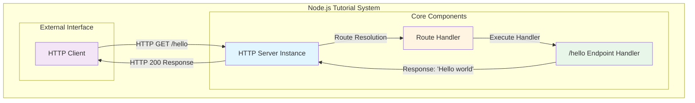
```mermaid
graph TB
    subgraph "Node.js Tutorial System"
        subgraph "Core Components"
            Server[HTTP Server Instance]
            Router[Route Handler]
            Handler["/hello Endpoint Handler"]
        end
        
        subgraph "External Interface"
            Client[HTTP Client]
        end
    end
    
    Client -->|HTTP GET /hello| Server
    Server -->|Route Resolution| Router
    Router -->|Execute Handler| Handler
    Handler -->|Response: 'Hello world'| Server
    Server -->|HTTP 200 Response| Client
    
    style Server fill:#e1f5ff
    style Router fill:#fff4e1
    style Handler fill:#e8f5e9
    style Client fill:#f3e5f5
```

**Component Descriptions:**

| Component | Responsibility | Educational Focus |
|-----------|---------------|-------------------|
| HTTP Server Instance | Listen for incoming connections, manage request lifecycle | Server initialization, port binding, event handling |
| Route Handler | Map incoming request paths to appropriate handlers | URL routing, path matching, request processing |
| /hello Endpoint Handler | Generate and return "Hello world" response | Response object manipulation, content delivery |

#### Core Technical Approach

The technical approach emphasizes simplicity and transparency:

**Architecture Philosophy:**
- **Minimalist Design**: Single endpoint implementation without auxiliary features
- **Direct Implementation**: Straightforward code structure without unnecessary abstractions
- **Educational Clarity**: Each component serves a clear pedagogical purpose

**Request-Response Flow:**

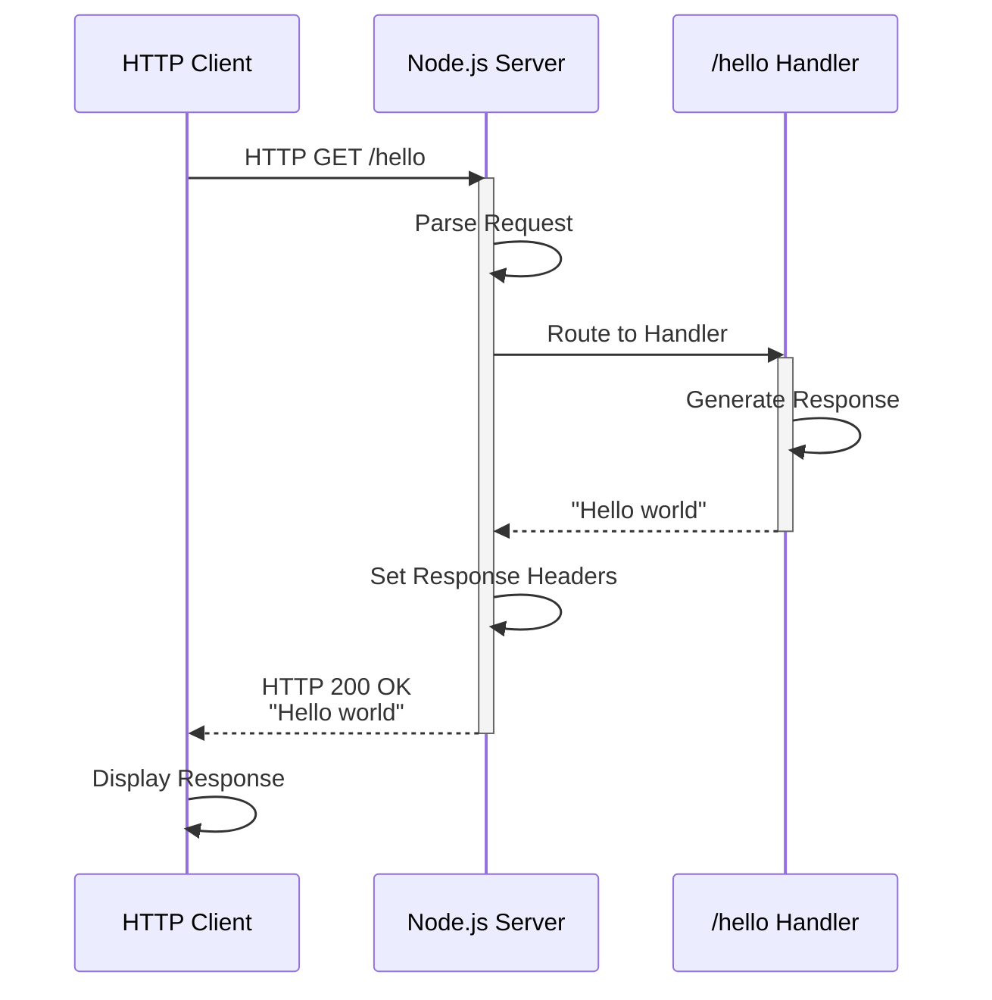
```mermaid
sequenceDiagram
    participant Client as HTTP Client
    participant Server as Node.js Server
    participant Handler as /hello Handler
    
    Client->>Server: HTTP GET /hello
    activate Server
    Server->>Server: Parse Request
    Server->>Handler: Route to Handler
    activate Handler
    Handler->>Handler: Generate Response
    Handler-->>Server: "Hello world"
    deactivate Handler
    Server->>Server: Set Response Headers
    Server-->>Client: HTTP 200 OK<br/>"Hello world"
    deactivate Server
    Client->>Client: Display Response
```

**Technical Principles:**
- **Synchronous Logic**: Simple, sequential code flow without complex asynchronous patterns
- **Stateless Operation**: Each request is handled independently without session management
- **Standard Protocols**: Adherence to HTTP/1.1 specification for compatibility
- **Platform Native**: Leverages Node.js core modules to minimize external dependencies

### 1.2.3 Success Criteria

#### Measurable Objectives

The project's success is evaluated against clear, verifiable objectives:

| Objective | Measurement Criteria | Target |
|-----------|---------------------|--------|
| Functional Endpoint | `/hello` responds to HTTP requests | 100% success rate for valid requests |
| Correct Response | Returns "Hello world" text | Exact string match on all invocations |
| Server Stability | Maintains availability during operation | No crashes during normal use |

**Technical Validation:**
- Server successfully starts and binds to designated port
- Endpoint responds within acceptable latency (sub-second for local requests)
- Response format conforms to HTTP standards (proper headers, status codes)

#### Critical Success Factors

**Educational Effectiveness:**
- **Code Readability**: Implementation must be immediately comprehensible to Node.js beginners
- **Setup Simplicity**: Learners should achieve a running server with minimal configuration steps
- **Experimentation Friendly**: Code structure supports easy modification and extension by learners

**Technical Viability:**
- **Cross-Platform Compatibility**: Functions identically across Windows, macOS, and Linux environments
- **Minimal Dependencies**: Reduces setup friction and potential compatibility issues
- **Standard Compliance**: Uses conventional Node.js patterns and HTTP standards

**Documentation Quality:**
- **Clear Instructions**: Setup and execution procedures are unambiguous
- **Conceptual Explanation**: Code is accompanied by explanations of underlying concepts
- **Extension Guidance**: Learners understand how to build upon the foundation provided

#### Key Performance Indicators

**Learning Outcomes:**
- Time-to-first-success: Learners achieve a working endpoint within 15 minutes of starting
- Comprehension rate: Users can explain the request-response flow after completing the tutorial
- Extension rate: Percentage of learners who successfully add additional endpoints or features

**Technical Performance:**
- Response latency: < 50ms for localhost requests on standard hardware
- Server startup time: < 2 seconds from execution to ready state
- Resource efficiency: Minimal CPU and memory footprint suitable for development environments

**Adoption Metrics:**
- Successful execution rate: Percentage of learners who run the server without errors
- Code modification rate: Number of learners who experiment with changing responses or routes
- Foundation building: Usage as starting point for more complex projects

## 1.3 Scope

### 1.3.1 In-Scope Elements

#### Core Features and Functionalities

**Must-Have Capabilities:**

The following capabilities represent the essential features of this tutorial project:

- **HTTP Server Implementation**
  - Initialize and configure a Node.js HTTP server instance
  - Bind server to a designated port for accepting connections
  - Implement basic request listening and handling mechanisms

- **Single Endpoint Implementation**
  - Create `/hello` route handler
  - Process HTTP GET requests to this endpoint
  - Generate plain text response containing "Hello world"
  - Return appropriate HTTP status code (200 OK) for successful requests

- **Request-Response Cycle**
  - Accept incoming HTTP requests from any standard client
  - Parse request to identify target endpoint
  - Execute corresponding handler logic
  - Deliver formatted response back to client

**Primary User Workflows:**

| Workflow | Steps | Expected Outcome |
|----------|-------|------------------|
| Server Startup | Execute Node.js application → Server binds to port | Server ready to accept requests |
| Endpoint Access | Send HTTP GET to `/hello` → Server processes request | Receive "Hello world" response |
| Learning Verification | Test endpoint → Observe response → Understand flow | Comprehension of HTTP fundamentals |

#### Implementation Boundaries

**System Boundaries:**

The system encompasses:
- Single Node.js process running HTTP server
- One exposed HTTP endpoint (`/hello`)
- Request handling limited to this specific route
- Response generation for the defined endpoint

**User Groups Covered:**
- Developers executing the tutorial locally on development machines
- Students learning Node.js in educational settings
- Engineers seeking reference implementation for basic HTTP servers

**Technical Domain Coverage:**
- HTTP protocol fundamentals (request/response)
- Basic Node.js server creation patterns
- Route handling and request processing
- Response generation and delivery

**Deployment Scope:**
- Local development environment deployment only
- Single instance operation (no clustering or load balancing)
- Development-grade reliability and security posture

### 1.3.2 Out-of-Scope Elements

#### Explicitly Excluded Features and Capabilities

To maintain tutorial focus and simplicity, the following elements are intentionally excluded:

**Advanced Routing and Request Handling:**
- Multiple endpoints or route definitions
- HTTP methods beyond GET (POST, PUT, DELETE, PATCH)
- URL parameter parsing (path parameters, query strings)
- Request body parsing and validation
- Content negotiation and multiple response formats

**Authentication and Security:**
- User authentication mechanisms
- Authorization and access control
- API key validation
- HTTPS/TLS encryption
- CORS (Cross-Origin Resource Sharing) configuration
- Rate limiting or throttling

**Data Persistence:**
- Database integration (SQL or NoSQL)
- File system data storage
- Session management
- State persistence across requests
- Caching mechanisms

**Production-Grade Features:**
- Comprehensive error handling and recovery
- Structured logging and monitoring
- Health check endpoints
- Metrics collection and reporting
- Configuration management systems
- Environment-specific deployments

**External Integrations:**
- Third-party API consumption
- Message queue integration
- External service dependencies
- Webhook implementations
- Email or notification services

**Frontend Components:**
- HTML rendering or templating
- Static file serving
- Frontend framework integration
- WebSocket or real-time communication

#### Future Phase Considerations

While not included in this tutorial implementation, learners may consider the following as natural extensions:

**Phase 2 - Multiple Endpoints:**
- Adding additional routes (e.g., `/goodbye`, `/info`)
- Implementing different response types
- Introducing route parameters

**Phase 3 - Data Handling:**
- Adding POST endpoint for receiving data
- Implementing basic in-memory storage
- Introducing data validation

**Phase 4 - Production Readiness:**
- Adding proper error handling
- Implementing logging
- Introducing configuration management

#### Unsupported Use Cases

The following use cases are explicitly not supported by this tutorial project:

- **Production Deployment**: Not designed for public internet exposure or production workloads
- **Performance Testing**: Not optimized for high-concurrency or load testing scenarios
- **API Development**: Not suitable as foundation for production REST APIs without substantial enhancement
- **Microservices Architecture**: Not intended as microservice template or distributed system component
- **Enterprise Integration**: Lacks features required for enterprise system integration (authentication, auditing, compliance)

## 1.4 References

#### Files Examined

- `README.md` - Repository identification file containing project title "7thNov_1"; confirmed greenfield status with no implementation details

#### Folders Explored

- `` (root directory, depth: 1) - Complete repository structure examination confirming absence of source code, configuration files, or Node.js artifacts; verified empty repository status

#### User-Provided Context

- Primary requirement specification: Node.js tutorial project featuring single `/hello` endpoint returning "Hello world" to HTTP clients
- Project designation: New product development (greenfield project)
- Implementation status: To be created (no existing codebase)

#### Repository Metadata

- Git initialization: Confirmed (initial commit dated November 7, 2025)
- Branch structure: Single `main` branch
- Implementation artifacts: None present (confirming greenfield status)

---

*This Introduction section documents the intended specifications for a Node.js tutorial project currently in the planning phase. All technical details reflect the planned system architecture and capabilities as defined by project requirements.*

# 2. Product Requirements

## 2.1 Feature Catalog

This section documents the discrete, testable features required to deliver a functional Node.js tutorial project with a single `/hello` endpoint. Each feature has been designed to support the educational mission of demonstrating HTTP server fundamentals while maintaining simplicity for beginner developers.

### 2.1.1 Feature F-001: HTTP Server Foundation

**Feature Metadata**

| Attribute | Value |
|-----------|-------|
| Feature ID | F-001 |
| Feature Name | HTTP Server Foundation |
| Category | Core Infrastructure |
| Priority Level | Critical |
| Status | Proposed |

**Description**

*Overview:*
The HTTP Server Foundation feature provides the fundamental capability to initialize, configure, and run a Node.js HTTP server instance. This feature establishes the server lifecycle, including startup, port binding, connection acceptance, and graceful operation. It serves as the foundational layer upon which all request handling capabilities are built.

*Business Value:*
This feature delivers the core educational value of demonstrating how Node.js creates and manages HTTP servers using native modules. It enables learners to understand server initialization, port binding concepts, and the event-driven nature of Node.js server applications. Without this foundation, no HTTP communication is possible, making it the cornerstone of the tutorial's learning objectives.

*User Benefits:*
- Learners gain hands-on experience with Node.js server creation using the core `http` module
- Students observe the complete server lifecycle from initialization to ready state
- Developers understand port binding and connection management concepts
- Users can verify server operation through clear console output and status indicators

*Technical Context:*
This feature utilizes the native Node.js `http` module to create a server instance without external dependencies or frameworks. The implementation prioritizes code readability and conceptual clarity over production-grade robustness. The server operates as a single-threaded Node.js process listening on a designated port (typically 3000 or 8080) for incoming HTTP connections. The event-driven architecture demonstrates Node.js's non-blocking I/O model while maintaining synchronous logic flow for educational clarity.

**Dependencies**

| Dependency Type | Details |
|----------------|---------|
| Prerequisite Features | None (foundational feature) |
| System Dependencies | Node.js runtime environment (v12.0.0 or higher recommended) |
| External Dependencies | None (uses core modules only) |
| Integration Requirements | Operating system TCP/IP stack for port binding |

### 2.1.2 Feature F-002: Route Handling System

**Feature Metadata**

| Attribute | Value |
|-----------|-------|
| Feature ID | F-002 |
| Feature Name | Route Handling System |
| Category | Request Processing |
| Priority Level | Critical |
| Status | Proposed |

**Description**

*Overview:*
The Route Handling System implements the URL path mapping logic that directs incoming HTTP requests to appropriate handler functions. This feature examines the request URL path and determines which handler should process the request. For this tutorial, it specifically identifies requests to the `/hello` endpoint and routes them accordingly, while handling all other paths with appropriate responses.

*Business Value:*
This feature teaches fundamental routing concepts that are essential for web development. It demonstrates how servers determine which code should execute based on the requested URL, a concept that scales from simple tutorials to complex production applications. Understanding routing is critical for learners to progress beyond this tutorial to more sophisticated web development.

*User Benefits:*
- Learners understand how URL paths map to server-side logic
- Students can experiment by requesting different paths and observing routing behavior
- Developers see practical implementation of conditional request handling
- Users gain foundation for understanding framework routing (Express, Koa, etc.)

*Technical Context:*
The routing system examines the `req.url` property of incoming request objects to determine the requested path. It uses simple string comparison or pattern matching to identify the `/hello` route. The implementation avoids complex routing libraries or regular expressions to maintain clarity. All routing logic operates synchronously during request processing, with immediate handler invocation upon path match. Unmatched routes result in appropriate HTTP 404 responses, demonstrating complete request handling.

**Dependencies**

| Dependency Type | Details |
|----------------|---------|
| Prerequisite Features | F-001 (HTTP Server Foundation) |
| System Dependencies | Node.js `http` module request objects |
| External Dependencies | None |
| Integration Requirements | Request URL parsing capabilities |

### 2.1.3 Feature F-003: /hello Endpoint Implementation

**Feature Metadata**

| Attribute | Value |
|-----------|-------|
| Feature ID | F-003 |
| Feature Name | /hello Endpoint Implementation |
| Category | API Endpoint |
| Priority Level | Critical |
| Status | Proposed |

**Description**

*Overview:*
The `/hello` endpoint implementation provides the single functional API endpoint for this tutorial project. It processes HTTP GET requests to the `/hello` path and returns a plain text response containing "Hello world". This endpoint represents the minimal viable functionality that demonstrates a complete request-response cycle in Node.js.

*Business Value:*
This feature delivers the primary educational outcome: a working HTTP endpoint that students can test, observe, and modify. It provides immediate gratification by producing visible results that learners can verify through browsers or HTTP clients. The simplicity of returning a static string allows focus on the HTTP mechanics rather than business logic complexity.

*User Benefits:*
- Learners achieve a quick win by seeing their server respond to requests
- Students can easily verify functionality using browsers, curl, or Postman
- Developers gain confidence by successfully implementing a testable endpoint
- Users have a working baseline to experiment with modifications and extensions

*Technical Context:*
The endpoint handler receives request and response objects from the routing system. It sets the HTTP status code to 200 (OK), configures the Content-Type header to `text/plain`, and writes the string "Hello world" to the response body using `res.end()`. The implementation requires no asynchronous operations, complex data processing, or external resource access. The handler executes in milliseconds and returns consistent output for all valid requests.

**Dependencies**

| Dependency Type | Details |
|----------------|---------|
| Prerequisite Features | F-001 (HTTP Server Foundation), F-002 (Route Handling System) |
| System Dependencies | Node.js response object APIs |
| External Dependencies | None |
| Integration Requirements | HTTP response formatting capabilities |

### 2.1.4 Feature F-004: Request-Response Processing

**Feature Metadata**

| Attribute | Value |
|-----------|-------|
| Feature ID | F-004 |
| Feature Name | Request-Response Processing |
| Category | Protocol Handling |
| Priority Level | Critical |
| Status | Proposed |

**Description**

*Overview:*
Request-Response Processing handles the complete HTTP protocol communication cycle, including request parsing, header management, response formatting, and client delivery. This feature ensures proper HTTP/1.1 protocol compliance while maintaining educational clarity about how Node.js handles network communication.

*Business Value:*
This feature exposes learners to HTTP protocol fundamentals including request methods, response status codes, and header manipulation. Understanding these concepts is essential for any web developer, and this implementation provides a simplified but accurate model of production HTTP handling. The educational value extends beyond Node.js to general web development knowledge.

*User Benefits:*
- Learners see how HTTP requests are parsed and processed
- Students understand response header configuration and content delivery
- Developers observe status code usage and content type specification
- Users gain transferable knowledge applicable to any web technology stack

*Technical Context:*
This feature leverages Node.js's built-in HTTP request and response stream handling. The request object provides properties including `method`, `url`, and `headers` that the server examines to process requests appropriately. The response object offers methods like `writeHead()`, `write()`, and `end()` for constructing and delivering HTTP responses. The implementation demonstrates proper header setting, particularly Content-Type and Content-Length, while avoiding premature response transmission or incomplete data delivery.

**Dependencies**

| Dependency Type | Details |
|----------------|---------|
| Prerequisite Features | F-001 (HTTP Server Foundation) |
| System Dependencies | Node.js HTTP request/response streams |
| External Dependencies | None |
| Integration Requirements | TCP/IP network stack for client communication |

## 2.2 Functional Requirements

This section provides detailed, testable requirements for each feature, including acceptance criteria, technical specifications, and validation rules.

### 2.2.1 Requirements for F-001: HTTP Server Foundation

#### 2.2.1.1 Core Server Requirements

| Requirement ID | Description | Priority | Complexity |
|---------------|-------------|----------|------------|
| F-001-RQ-001 | Server must initialize using Node.js core `http` module without external dependencies | Must-Have | Low |
| F-001-RQ-002 | Server must bind to a configurable port number (default: 3000 or 8080) | Must-Have | Low |
| F-001-RQ-003 | Server must start within 2 seconds of process execution | Must-Have | Low |
| F-001-RQ-004 | Server must log startup confirmation message to console including port number | Should-Have | Low |

**F-001-RQ-001: Server Initialization with Core HTTP Module**

*Acceptance Criteria:*
- Server code imports only the `http` module from Node.js core libraries
- No `require()` or `import` statements reference npm packages or external modules
- Server instance is created using `http.createServer()` method
- Server initialization completes without errors on Node.js v12.0.0 and higher

*Technical Specifications:*
- Input Parameters: None (uses default Node.js environment)
- Output/Response: Server instance object with event listener capabilities
- Performance Criteria: Instantiation completes in < 10ms
- Data Requirements: No configuration files or environment variables required for basic operation

*Validation Rules:*
- Business Rules: Must support educational objective of demonstrating core Node.js capabilities
- Data Validation: Port number must be integer between 1024-65535 (user ports)
- Security Requirements: Server runs with process user permissions (no elevation required)
- Compliance Requirements: Adheres to Node.js API standards for HTTP module usage

**F-001-RQ-002: Port Binding Configuration**

*Acceptance Criteria:*
- Server successfully binds to specified port when port is available
- Port number is configurable via code constant or environment variable
- Server reports clear error message if port is already in use
- Default port value is set to 3000 or 8080 for typical development scenarios

*Technical Specifications:*
- Input Parameters: Port number (integer), optional hostname (string, default: 'localhost')
- Output/Response: Listening server or error event with descriptive message
- Performance Criteria: Port binding completes in < 100ms
- Data Requirements: Port number validation against valid range

*Validation Rules:*
- Business Rules: Port must not conflict with system services (avoid 80, 443 without elevation)
- Data Validation: Port >= 1024 AND port <= 65535 for non-privileged operation
- Security Requirements: No automatic privilege escalation for privileged ports
- Compliance Requirements: Respects operating system port allocation restrictions

**F-001-RQ-003: Startup Performance**

*Acceptance Criteria:*
- Complete server initialization from `node` command to ready state in < 2 seconds
- Server accepts connections immediately after successful port binding
- Startup time is consistent across Windows, macOS, and Linux platforms
- No blocking operations delay server readiness

*Technical Specifications:*
- Input Parameters: Node.js runtime execution command
- Output/Response: Server listening event triggered
- Performance Criteria: Total startup latency < 2000ms on typical development hardware
- Data Requirements: No external data loading during startup

*Validation Rules:*
- Business Rules: Fast startup supports rapid experimentation and learning iteration
- Data Validation: Startup timing measured from process start to listening event
- Security Requirements: No security checks delay basic startup
- Compliance Requirements: Standard Node.js event loop behavior

**F-001-RQ-004: Startup Confirmation Logging**

*Acceptance Criteria:*
- Console displays clear message when server is ready to accept requests
- Log message includes specific port number server is listening on
- Message format is beginner-friendly and unambiguous
- Example: "Server is running on http://localhost:3000"

*Technical Specifications:*
- Input Parameters: Port number, hostname from server configuration
- Output/Response: Console output via `console.log()` or equivalent
- Performance Criteria: Log output appears within 100ms of server ready
- Data Requirements: Port and hostname values from server configuration

*Validation Rules:*
- Business Rules: Clear feedback confirms successful server start for learners
- Data Validation: Port number in message matches actual bound port
- Security Requirements: No sensitive information disclosed in logs
- Compliance Requirements: Standard console output formatting

#### 2.2.1.2 Connection Management Requirements

| Requirement ID | Description | Priority | Complexity |
|---------------|-------------|----------|------------|
| F-001-RQ-005 | Server must accept incoming HTTP connections from any client | Must-Have | Low |
| F-001-RQ-006 | Server must handle multiple sequential requests without restart | Must-Have | Low |
| F-001-RQ-007 | Server must continue running after processing each request | Must-Have | Low |
| F-001-RQ-008 | Server must support graceful shutdown via standard signals (CTRL+C) | Should-Have | Low |

**F-001-RQ-005: Client Connection Acceptance**

*Acceptance Criteria:*
- Server accepts connections from web browsers (Chrome, Firefox, Safari, Edge)
- Server accepts connections from command-line tools (curl, wget)
- Server accepts connections from API testing tools (Postman, Insomnia)
- No client authentication or filtering is required for connection acceptance

*Technical Specifications:*
- Input Parameters: Incoming TCP connection on bound port
- Output/Response: Connection established, request handler invoked
- Performance Criteria: Connection acceptance latency < 5ms
- Data Requirements: Standard TCP/IP handshake data

*Validation Rules:*
- Business Rules: Open access supports testing from any available HTTP client
- Data Validation: Valid HTTP protocol initiation required
- Security Requirements: No authentication required (development environment only)
- Compliance Requirements: HTTP/1.1 connection handling

**F-001-RQ-006: Sequential Request Handling**

*Acceptance Criteria:*
- Server processes multiple requests in sequence without state corruption
- Each request is handled independently without interference from previous requests
- Server maintains stable operation through at least 100 sequential requests
- No memory leaks or resource exhaustion over multiple requests

*Technical Specifications:*
- Input Parameters: Sequential HTTP requests on established connections
- Output/Response: Independent response for each request
- Performance Criteria: Consistent response time across request sequence
- Data Requirements: No state persistence between requests (stateless operation)

*Validation Rules:*
- Business Rules: Stateless operation demonstrates HTTP protocol fundamentals
- Data Validation: Each request processed independently
- Security Requirements: No session state to compromise
- Compliance Requirements: HTTP stateless protocol compliance

**F-001-RQ-007: Persistent Server Operation**

*Acceptance Criteria:*
- Server process remains active after responding to requests
- No automatic shutdown or exit after request processing
- Server continues listening for new connections indefinitely
- Process termination requires explicit signal (CTRL+C) or system intervention

*Technical Specifications:*
- Input Parameters: Continuous event loop operation
- Output/Response: Server maintains listening state
- Performance Criteria: Stable operation for duration of learning session (minutes to hours)
- Data Requirements: No configuration defines automatic shutdown

*Validation Rules:*
- Business Rules: Persistent operation allows multiple testing iterations
- Data Validation: Server state remains "listening" between requests
- Security Requirements: No automatic security shutdowns (development environment)
- Compliance Requirements: Standard Node.js event loop behavior

**F-001-RQ-008: Graceful Shutdown**

*Acceptance Criteria:*
- CTRL+C signal terminates server process cleanly
- Server closes listening socket before exit
- No error messages during normal shutdown process
- Process exit code is 0 for clean shutdown

*Technical Specifications:*
- Input Parameters: SIGINT or SIGTERM signal
- Output/Response: Clean process termination
- Performance Criteria: Shutdown completes within 1 second
- Data Requirements: No persistence required before shutdown

*Validation Rules:*
- Business Rules: Clean shutdown prevents port binding issues on restart
- Data Validation: All connections closed before exit
- Security Requirements: No sensitive data cleanup required (stateless)
- Compliance Requirements: Standard POSIX signal handling

### 2.2.2 Requirements for F-002: Route Handling System

#### 2.2.2.1 Path Matching Requirements

| Requirement ID | Description | Priority | Complexity |
|---------------|-------------|----------|------------|
| F-002-RQ-001 | System must extract URL path from incoming request | Must-Have | Low |
| F-002-RQ-002 | System must match exact path `/hello` to designated handler | Must-Have | Low |
| F-002-RQ-003 | System must handle case-sensitive path matching for `/hello` | Should-Have | Low |
| F-002-RQ-004 | System must return 404 response for all unmatched paths | Must-Have | Low |

**F-002-RQ-001: URL Path Extraction**

*Acceptance Criteria:*
- Router accesses `req.url` property from incoming request object
- Path string is extracted correctly including leading slash
- Query parameters are ignored or separated from path (e.g., `/hello?test=1` extracts `/hello`)
- URL fragments are handled appropriately

*Technical Specifications:*
- Input Parameters: HTTP request object with `url` property
- Output/Response: Extracted path string (e.g., "/hello")
- Performance Criteria: Path extraction completes in < 1ms
- Data Requirements: Request object from Node.js http module

*Validation Rules:*
- Business Rules: Accurate path extraction enables correct routing decisions
- Data Validation: Path is non-empty string starting with "/"
- Security Requirements: No path traversal vulnerabilities (../../ patterns)
- Compliance Requirements: RFC 3986 URI syntax handling

**F-002-RQ-002: Exact Path Matching**

*Acceptance Criteria:*
- Request to `http://localhost:3000/hello` successfully routes to `/hello` handler
- Path matching uses exact string comparison for `/hello`
- No partial matches (e.g., `/hello/world` or `/hello123` do not match)
- Root path `/` is treated as distinct from `/hello`

*Technical Specifications:*
- Input Parameters: Extracted path string
- Output/Response: Boolean match result or handler function reference
- Performance Criteria: Path comparison completes in < 1ms
- Data Requirements: Registered route patterns for comparison

*Validation Rules:*
- Business Rules: Exact matching demonstrates precise routing control
- Data Validation: String equality check (path === "/hello")
- Security Requirements: No wildcard or regex vulnerabilities
- Compliance Requirements: Deterministic routing behavior

**F-002-RQ-003: Case-Sensitive Path Matching**

*Acceptance Criteria:*
- `/hello` matches successfully
- `/Hello`, `/HELLO`, or `/HeLLo` return 404 (case sensitivity demonstrated)
- Case sensitivity behavior is consistent and documented
- Educational value of case sensitivity is clear to learners

*Technical Specifications:*
- Input Parameters: Path string with varying case
- Output/Response: Match only for exact case `/hello`
- Performance Criteria: Case-sensitive comparison has no performance penalty
- Data Requirements: Standard string comparison operators

*Validation Rules:*
- Business Rules: Demonstrates HTTP path case sensitivity conventions
- Data Validation: Exact case match required
- Security Requirements: Prevents case variation bypass attempts
- Compliance Requirements: HTTP path case sensitivity standards

**F-002-RQ-004: Unmatched Path Handling**

*Acceptance Criteria:*
- Requests to `/`, `/home`, `/api`, or any path except `/hello` return HTTP 404
- 404 response includes appropriate status code and message
- No server errors or crashes for unmatched paths
- Response format is consistent with matched paths (plain text)

*Technical Specifications:*
- Input Parameters: Non-matching path string
- Output/Response: HTTP 404 status with "Not Found" or similar message
- Performance Criteria: 404 response generated in < 5ms
- Data Requirements: Default 404 handler implementation

*Validation Rules:*
- Business Rules: Clear feedback for incorrect paths supports learning
- Data Validation: All paths except `/hello` trigger 404
- Security Requirements: No information disclosure in 404 responses
- Compliance Requirements: HTTP 404 status code standards

#### 2.2.2.2 Handler Invocation Requirements

| Requirement ID | Description | Priority | Complexity |
|---------------|-------------|----------|------------|
| F-002-RQ-005 | System must invoke appropriate handler function for matched route | Must-Have | Low |
| F-002-RQ-006 | Handler must receive request and response objects as parameters | Must-Have | Low |
| F-002-RQ-007 | System must support only HTTP GET method for `/hello` route | Must-Have | Low |

**F-002-RQ-005: Handler Function Invocation**

*Acceptance Criteria:*
- When `/hello` is matched, designated handler function is called
- Handler invocation occurs immediately after route match determination
- Handler execution is synchronous (no callback delays)
- Handler function scope has access to necessary request/response objects

*Technical Specifications:*
- Input Parameters: Matched route identifier, request object, response object
- Output/Response: Handler function execution
- Performance Criteria: Handler invocation overhead < 1ms
- Data Requirements: Handler function reference or inline implementation

*Validation Rules:*
- Business Rules: Direct handler invocation maintains code clarity
- Data Validation: Handler is valid function reference
- Security Requirements: No dynamic code execution vulnerabilities
- Compliance Requirements: Standard JavaScript function call semantics

**F-002-RQ-006: Handler Parameter Passing**

*Acceptance Criteria:*
- Handler function receives `req` (request) as first parameter
- Handler function receives `res` (response) as second parameter
- Request object contains properties: `method`, `url`, `headers`
- Response object contains methods: `writeHead()`, `write()`, `end()`

*Technical Specifications:*
- Input Parameters: Request object, response object from http module
- Output/Response: Handler has full access to request/response APIs
- Performance Criteria: Object reference passing has no copy overhead
- Data Requirements: Native Node.js request/response objects

*Validation Rules:*
- Business Rules: Standard parameter pattern follows Node.js conventions
- Data Validation: Objects contain required properties and methods
- Security Requirements: No object property injection vulnerabilities
- Compliance Requirements: Node.js http module API compliance

**F-002-RQ-007: HTTP Method Filtering**

*Acceptance Criteria:*
- GET requests to `/hello` are processed successfully
- POST, PUT, DELETE, PATCH requests to `/hello` return 405 Method Not Allowed (if implemented) or 404
- Method filtering is clearly demonstrated in code
- Educational focus remains on GET requests

*Technical Specifications:*
- Input Parameters: HTTP method from request object (`req.method`)
- Output/Response: Handler execution for GET, error response for others
- Performance Criteria: Method check completes in < 1ms
- Data Requirements: HTTP method string from request

*Validation Rules:*
- Business Rules: GET-only approach simplifies tutorial scope
- Data Validation: Method string comparison (`req.method === 'GET'`)
- Security Requirements: Prevents unintended POST/PUT data handling
- Compliance Requirements: HTTP method semantics

### 2.2.3 Requirements for F-003: /hello Endpoint Implementation

#### 2.2.3.1 Response Generation Requirements

| Requirement ID | Description | Priority | Complexity |
|---------------|-------------|----------|------------|
| F-003-RQ-001 | Endpoint must return exact string "Hello world" | Must-Have | Low |
| F-003-RQ-002 | Response must set HTTP status code to 200 OK | Must-Have | Low |
| F-003-RQ-003 | Response must set Content-Type header to text/plain | Must-Have | Low |
| F-003-RQ-004 | Response must be delivered within 50ms for localhost requests | Must-Have | Low |

**F-003-RQ-001: Response Content**

*Acceptance Criteria:*
- Response body contains exactly "Hello world" (case-sensitive)
- No additional whitespace, newlines, or formatting characters
- String encoding is UTF-8
- Response is human-readable in browsers and command-line tools

*Technical Specifications:*
- Input Parameters: None (static response)
- Output/Response: String literal "Hello world"
- Performance Criteria: String generation is immediate (< 1ms)
- Data Requirements: Static string constant in code

*Validation Rules:*
- Business Rules: Exact string match enables clear success verification
- Data Validation: String length is 11 characters
- Security Requirements: No user input reflected in response (no XSS)
- Compliance Requirements: Valid UTF-8 text encoding

**F-003-RQ-002: HTTP Status Code**

*Acceptance Criteria:*
- Response includes HTTP status code 200
- Status code is set using `res.writeHead(200)` or equivalent
- Status line includes standard reason phrase "OK"
- Status code is visible in browser developer tools and HTTP client output

*Technical Specifications:*
- Input Parameters: Status code integer (200)
- Output/Response: HTTP response status line with code 200
- Performance Criteria: Status code setting is immediate
- Data Requirements: Standard HTTP status code constant

*Validation Rules:*
- Business Rules: 200 status indicates successful request processing
- Data Validation: Status code === 200
- Security Requirements: No false success codes for error conditions
- Compliance Requirements: HTTP/1.1 status code standards (RFC 7231)

**F-003-RQ-003: Content-Type Header**

*Acceptance Criteria:*
- Response includes header `Content-Type: text/plain`
- Header is set explicitly in code before response body transmission
- Character encoding is specified as `text/plain; charset=utf-8` (optional enhancement)
- Browsers display response as plain text, not HTML

*Technical Specifications:*
- Input Parameters: Header name-value pair
- Output/Response: HTTP Content-Type header in response
- Performance Criteria: Header setting is immediate
- Data Requirements: MIME type string constant

*Validation Rules:*
- Business Rules: Correct Content-Type ensures proper client interpretation
- Data Validation: Header value matches `text/plain` MIME type
- Security Requirements: Prevents content type sniffing attacks
- Compliance Requirements: IANA media type standards

**F-003-RQ-004: Response Performance**

*Acceptance Criteria:*
- End-to-end response time < 50ms for requests from localhost
- Response latency is consistent across multiple requests
- No blocking operations delay response delivery
- Performance is measurable via browser network tools or curl timing

*Technical Specifications:*
- Input Parameters: HTTP GET request to `/hello`
- Output/Response: Complete HTTP response within latency budget
- Performance Criteria: 95th percentile latency < 50ms on typical hardware
- Data Requirements: No database queries or external API calls

*Validation Rules:*
- Business Rules: Fast response demonstrates Node.js performance characteristics
- Data Validation: Latency measured from request arrival to response completion
- Security Requirements: No timing attacks possible (constant response time)
- Compliance Requirements: No HTTP protocol overhead beyond standard

#### 2.2.3.2 HTTP Protocol Compliance Requirements

| Requirement ID | Description | Priority | Complexity |
|---------------|-------------|----------|------------|
| F-003-RQ-005 | Response must include proper HTTP headers | Must-Have | Low |
| F-003-RQ-006 | Response must terminate correctly with res.end() | Must-Have | Low |
| F-003-RQ-007 | Endpoint must handle concurrent requests independently | Should-Have | Medium |

**F-003-RQ-005: HTTP Headers**

*Acceptance Criteria:*
- Response includes mandatory headers: Date, Content-Type
- Optional headers (Content-Length, Connection) are handled automatically by Node.js or set explicitly
- Headers are formatted according to HTTP specifications
- No duplicate or malformed headers

*Technical Specifications:*
- Input Parameters: Header name-value pairs
- Output/Response: Properly formatted HTTP header section
- Performance Criteria: All headers set before response body transmission
- Data Requirements: Header key-value objects or strings

*Validation Rules:*
- Business Rules: Complete headers enable proper HTTP client handling
- Data Validation: Header names are valid HTTP field names
- Security Requirements: No header injection vulnerabilities
- Compliance Requirements: HTTP/1.1 header syntax (RFC 7230)

**F-003-RQ-006: Response Termination**

*Acceptance Criteria:*
- Handler calls `res.end()` or `res.end('Hello world')` to complete response
- No additional writes occur after `res.end()` is called
- TCP connection state is properly managed after response completion
- No "Cannot write after end" errors occur

*Technical Specifications:*
- Input Parameters: Optional response body string
- Output/Response: Response stream closed, data flushed to client
- Performance Criteria: Response termination completes in < 5ms
- Data Requirements: Complete response data available at end() call

*Validation Rules:*
- Business Rules: Proper termination ensures complete data delivery
- Data Validation: Response stream state transitions to closed
- Security Requirements: No response splitting vulnerabilities
- Compliance Requirements: HTTP message boundary standards

**F-003-RQ-007: Concurrent Request Handling**

*Acceptance Criteria:*
- Multiple simultaneous requests to `/hello` each receive independent responses
- No response data mixing between concurrent requests
- Request processing is non-blocking (Node.js event loop not blocked)
- Under 10 concurrent requests, all respond within latency budget

*Technical Specifications:*
- Input Parameters: Multiple concurrent HTTP requests
- Output/Response: Independent response for each request
- Performance Criteria: Concurrent request throughput > 10 requests/second on typical hardware
- Data Requirements: No shared state between request handlers

*Validation Rules:*
- Business Rules: Concurrent handling demonstrates Node.js async capabilities
- Data Validation: Each request-response pair is independent
- Security Requirements: No race conditions or data leakage between requests
- Compliance Requirements: HTTP connection handling standards

### 2.2.4 Requirements for F-004: Request-Response Processing

#### 2.2.4.1 Request Parsing Requirements

| Requirement ID | Description | Priority | Complexity |
|---------------|-------------|----------|------------|
| F-004-RQ-001 | System must parse incoming HTTP request method | Must-Have | Low |
| F-004-RQ-002 | System must parse incoming HTTP request URL | Must-Have | Low |
| F-004-RQ-003 | System must parse incoming HTTP request headers | Should-Have | Low |

**F-004-RQ-001: HTTP Method Parsing**

*Acceptance Criteria:*
- Request object contains `method` property with HTTP verb string
- Method value correctly reflects client's request method (GET, POST, etc.)
- Method string is uppercase by convention
- Method is accessible to routing and handler logic

*Technical Specifications:*
- Input Parameters: Raw HTTP request data stream
- Output/Response: Parsed method string in request object
- Performance Criteria: Method parsing is part of Node.js native request processing (< 1ms)
- Data Requirements: Valid HTTP request line

*Validation Rules:*
- Business Rules: Method awareness enables proper request handling
- Data Validation: Method is valid HTTP verb string
- Security Requirements: Method validation prevents HTTP request smuggling
- Compliance Requirements: HTTP/1.1 method definitions (RFC 7231)

**F-004-RQ-002: URL Parsing**

*Acceptance Criteria:*
- Request object contains `url` property with full request path
- URL includes path and query string (e.g., "/hello?test=1")
- URL does not include protocol, host, or port (relative path only)
- URL is accessible for routing decisions

*Technical Specifications:*
- Input Parameters: Raw HTTP request line
- Output/Response: Parsed URL string in request object
- Performance Criteria: URL parsing is part of native processing (< 1ms)
- Data Requirements: Valid HTTP request-target

*Validation Rules:*
- Business Rules: URL access enables routing and parameter extraction
- Data Validation: URL is properly encoded per RFC 3986
- Security Requirements: URL length limits prevent buffer overflow attacks
- Compliance Requirements: HTTP request-target syntax (RFC 7230)

**F-004-RQ-003: Header Parsing**

*Acceptance Criteria:*
- Request object contains `headers` property with key-value pairs
- All incoming HTTP headers are accessible via `req.headers` object
- Header names are lowercase by Node.js convention
- Common headers (Host, User-Agent, Accept) are available

*Technical Specifications:*
- Input Parameters: Raw HTTP header lines
- Output/Response: Parsed headers object in request object
- Performance Criteria: Header parsing completes with request parsing (< 2ms)
- Data Requirements: Valid HTTP header syntax

*Validation Rules:*
- Business Rules: Header access enables content negotiation and client identification
- Data Validation: Headers follow name: value syntax
- Security Requirements: Header size limits prevent memory exhaustion
- Compliance Requirements: HTTP header field definitions (RFC 7230)

#### 2.2.4.2 Response Formatting Requirements

| Requirement ID | Description | Priority | Complexity |
|---------------|-------------|----------|------------|
| F-004-RQ-004 | System must format response status line correctly | Must-Have | Low |
| F-004-RQ-005 | System must format response headers correctly | Must-Have | Low |
| F-004-RQ-006 | System must handle response body encoding properly | Must-Have | Low |

**F-004-RQ-004: Response Status Line Formatting**

*Acceptance Criteria:*
- Response begins with status line: "HTTP/1.1 200 OK\r\n"
- HTTP version, status code, and reason phrase are properly formatted
- Status line terminates with CRLF (carriage return + line feed)
- Status line is automatically generated by Node.js or explicitly set

*Technical Specifications:*
- Input Parameters: Status code (integer), optional reason phrase (string)
- Output/Response: Formatted status line as first response data
- Performance Criteria: Status line generation is immediate
- Data Requirements: Status code constant and version string

*Validation Rules:*
- Business Rules: Proper status line enables client protocol parsing
- Data Validation: Status code is valid 3-digit HTTP code
- Security Requirements: No status line injection vulnerabilities
- Compliance Requirements: HTTP status-line syntax (RFC 7230)

**F-004-RQ-005: Response Header Formatting**

*Acceptance Criteria:*
- Each header is formatted as "Name: Value\r\n"
- Headers section terminates with blank line ("\r\n")
- Header names follow HTTP field name conventions
- Header values are properly encoded for special characters

*Technical Specifications:*
- Input Parameters: Header name-value pairs
- Output/Response: Formatted header section in response
- Performance Criteria: Header formatting occurs during res.writeHead() call
- Data Requirements: Valid header field names and values

*Validation Rules:*
- Business Rules: Proper header formatting ensures client parsing success
- Data Validation: Headers conform to field-name: field-value syntax
- Security Requirements: No header injection via CRLF sequences
- Compliance Requirements: HTTP header field format (RFC 7230)

**F-004-RQ-006: Response Body Encoding**

*Acceptance Criteria:*
- Response body is encoded as UTF-8 text
- Body content is transmitted after headers section
- Body length matches Content-Length header if present
- Body content is complete and not truncated

*Technical Specifications:*
- Input Parameters: Response body string or buffer
- Output/Response: Encoded body data transmitted to client
- Performance Criteria: Body encoding and transmission complete in < 10ms for small responses
- Data Requirements: Response content as string or Buffer

*Validation Rules:*
- Business Rules: Proper encoding ensures client displays content correctly
- Data Validation: Body is valid UTF-8 sequence
- Security Requirements: No encoding-based XSS vulnerabilities
- Compliance Requirements: UTF-8 encoding standards

## 2.3 Feature Relationships

This section maps the dependencies and integration points between features, illustrating how they combine to deliver the complete tutorial system functionality.

### 2.3.1 Feature Dependency Map

The following diagram illustrates the hierarchical dependencies between features, showing which features must be implemented before others can function:

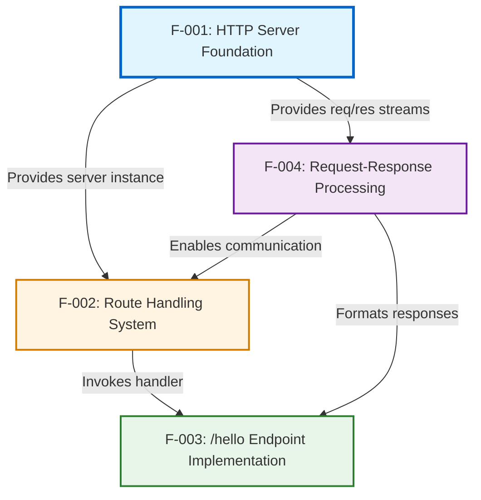
```mermaid
graph TB
    F001[F-001: HTTP Server Foundation]
    F002[F-002: Route Handling System]
    F003[F-003: /hello Endpoint Implementation]
    F004[F-004: Request-Response Processing]
    
    F001 -->|Provides server instance| F002
    F001 -->|Provides req/res streams| F004
    F002 -->|Invokes handler| F003
    F004 -->|Enables communication| F002
    F004 -->|Formats responses| F003
    
    style F001 fill:#e1f5ff,stroke:#0066cc,stroke-width:3px
    style F002 fill:#fff4e1,stroke:#cc7a00,stroke-width:2px
    style F003 fill:#e8f5e9,stroke:#2e7d32,stroke-width:2px
    style F004 fill:#f3e5f5,stroke:#6a1b9a,stroke-width:2px
```

### 2.3.2 Integration Points

The table below details specific integration points where features exchange data or control flow:

| Source Feature | Target Feature | Integration Type | Data Exchanged |
|----------------|----------------|------------------|----------------|
| F-001 (Server Foundation) | F-004 (Request-Response) | Event Callback | Raw request streams, socket connections |
| F-004 (Request-Response) | F-002 (Route Handling) | Function Call | Parsed request object with method, URL, headers |
| F-002 (Route Handling) | F-003 (/hello Endpoint) | Function Invocation | Request and response objects for handler |
| F-003 (/hello Endpoint) | F-004 (Request-Response) | Method Call | Response status, headers, body content |

### 2.3.3 Shared Components

The following components are utilized across multiple features:

**Request Object (`req`)**
- *Used By:* F-002, F-003, F-004
- *Purpose:* Carries parsed HTTP request data throughout request lifecycle
- *Properties Shared:* `method`, `url`, `headers`

**Response Object (`res`)**
- *Used By:* F-002, F-003, F-004
- *Purpose:* Provides API for constructing HTTP responses
- *Methods Shared:* `writeHead()`, `write()`, `end()`

**Server Instance**
- *Used By:* F-001, F-002, F-004
- *Purpose:* Central event emitter for HTTP connections
- *Events Shared:* `request`, `connection`, `close`

### 2.3.4 Request Processing Flow

The following sequence diagram illustrates how features collaborate to process a typical HTTP request to the `/hello` endpoint:

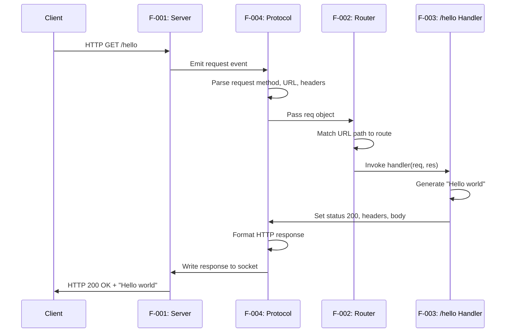
```mermaid
sequenceDiagram
    participant Client
    participant F001 as F-001: Server
    participant F004 as F-004: Protocol
    participant F002 as F-002: Router
    participant F003 as F-003: /hello Handler
    
    Client->>F001: HTTP GET /hello
    F001->>F004: Emit request event
    F004->>F004: Parse request method, URL, headers
    F004->>F002: Pass req object
    F002->>F002: Match URL path to route
    F002->>F003: Invoke handler(req, res)
    F003->>F003: Generate "Hello world"
    F003->>F004: Set status 200, headers, body
    F004->>F004: Format HTTP response
    F004->>F001: Write response to socket
    F001->>Client: HTTP 200 OK + "Hello world"
```

### 2.3.5 Common Services

While this tutorial project minimizes abstraction, the following conceptual services are implicitly shared:

**Error Handling Service** (Minimal Implementation)
- *Consumers:* All features
- *Capability:* Prevents server crashes from unhandled exceptions
- *Implementation:* Basic try-catch or error event listeners

**Logging Service** (Console Output)
- *Consumers:* F-001 (startup logs), potentially F-002 (route logging)
- *Capability:* Provides visibility into server operation
- *Implementation:* `console.log()` statements

**Configuration Service** (Code Constants)
- *Consumers:* F-001 (port number)
- *Capability:* Centralizes configurable values
- *Implementation:* Constants or environment variables

## 2.4 Implementation Considerations

This section outlines technical constraints, performance requirements, and implementation guidance for each feature to ensure successful development and educational effectiveness.

### 2.4.1 Feature F-001: HTTP Server Foundation

#### 2.4.1.1 Technical Constraints

- **Module Restrictions:** Must use only `http` module from Node.js core; no Express, Koa, Fastify, or other frameworks permitted
- **Simplicity Mandate:** Server initialization code should fit within 20 lines for clarity
- **Error Handling:** Minimal error handling focused only on port binding failures and EADDRINUSE errors
- **Platform Compatibility:** Must work identically on Windows, macOS, and Linux without platform-specific code

#### 2.4.1.2 Performance Requirements

- **Startup Latency:** < 2 seconds from `node app.js` command to ready state
- **Memory Footprint:** < 50MB RAM for idle server process
- **Connection Acceptance:** < 5ms per incoming connection
- **Restart Time:** < 3 seconds for complete shutdown and restart cycle

#### 2.4.1.3 Scalability Considerations

- **Concurrent Connections:** Support 10-20 simultaneous connections for educational testing
- **Request Throughput:** Handle 50-100 requests/minute without degradation
- **No Clustering Required:** Single process sufficient; no worker processes needed
- **No Load Balancing:** Not applicable for local development tutorial

#### 2.4.1.4 Security Implications

- **Development Only:** Not hardened for production use; no security features required
- **Local Binding:** Recommend binding to localhost (127.0.0.1) rather than 0.0.0.0 for safety
- **No Authentication:** Open access appropriate for learning environment
- **Process Permissions:** Should run with standard user privileges; no root/admin required

#### 2.4.1.5 Maintenance Requirements

- **Code Comments:** Include explanatory comments for each major step (server creation, port binding, listening)
- **Logging:** Startup message must clearly indicate server status and access URL
- **Modification Friendly:** Structure code so learners can easily change port number
- **Debugging Support:** Use clear variable names and avoid complex callbacks

### 2.4.2 Feature F-002: Route Handling System

#### 2.4.2.1 Technical Constraints

- **No Routing Libraries:** Must implement routing logic directly without third-party routers
- **Simple Logic:** Use straightforward if-else or switch statements for route matching
- **Single Route Focus:** Optimize for one route; no need for route registration abstractions
- **Inline Implementation:** Routing logic should be inline with request handler, not separate module

#### 2.4.2.2 Performance Requirements

- **Route Matching:** < 1ms to determine route match
- **Handler Invocation:** < 1ms overhead from route match to handler execution
- **404 Response:** < 5ms for unmatched routes
- **No Regex Required:** Simple string comparison sufficient for performance

#### 2.4.2.3 Scalability Considerations

- **Extensibility Note:** Code structure should demonstrate how to add additional routes (in comments)
- **No Route Tree:** Linear route checking appropriate for single route
- **Future Routes:** Comment examples showing how to add `/about` or `/api/data` routes
- **Method Filtering:** Structure allows easy addition of POST/PUT handling in future

#### 2.4.2.4 Security Implications

- **Path Traversal Prevention:** No filesystem access based on URL paths
- **Input Validation:** Ensure URL path is validated against malicious patterns (minimal)
- **No Wildcards:** Avoid regex wildcards that could cause ReDoS attacks
- **404 Information Disclosure:** Generic 404 messages that don't reveal server structure

#### 2.4.2.5 Maintenance Requirements

- **Clear Route Definition:** Each route should be clearly visible in code
- **Separation of Concerns:** Route matching separated from handler logic for clarity
- **Documentation:** Comments explaining routing logic for learners
- **Test Suggestions:** Include comments suggesting how to test different paths

### 2.4.3 Feature F-003: /hello Endpoint Implementation

#### 2.4.3.1 Technical Constraints

- **Static Response:** Hardcoded "Hello world" string; no dynamic content generation
- **No Dependencies:** No template engines, JSON libraries, or formatting packages
- **Plain Text Only:** text/plain content type; no HTML, JSON, or XML variants
- **Synchronous Logic:** No asynchronous operations, promises, or callbacks in handler

#### 2.4.3.2 Performance Requirements

- **Handler Execution:** < 5ms from invocation to response completion
- **Response Size:** Fixed 11-byte response body
- **Memory Allocation:** < 1KB per request
- **Throughput:** Support 100+ requests/second on typical hardware

#### 2.4.3.3 Scalability Considerations

- **Stateless Design:** No session state or global variables modified
- **No Caching Needed:** Response is trivial; caching adds unnecessary complexity
- **Extension Points:** Comment showing how to make response dynamic in future
- **Concurrent Safety:** No shared state ensures safe concurrent execution

#### 2.4.3.4 Security Implications

- **No User Input:** Static response eliminates injection vulnerabilities
- **XSS Prevention:** text/plain content type prevents script execution
- **Content-Type Enforcement:** Explicit Content-Type header prevents MIME sniffing
- **No Session Vulnerabilities:** Stateless operation eliminates session attacks

#### 2.4.3.5 Maintenance Requirements

- **Response Clarity:** Response string clearly visible in code
- **Easy Modification:** Learners can easily change "Hello world" to other text
- **Status Code Visibility:** HTTP status code explicitly set in code
- **Testing Instructions:** Comments suggesting browser test, curl test, Postman test

### 2.4.4 Feature F-004: Request-Response Processing

#### 2.4.4.1 Technical Constraints

- **Native APIs Only:** Use only Node.js `http` module request/response APIs
- **No Middleware:** Direct request/response handling without middleware chain
- **Minimal Abstraction:** Direct use of `req.url`, `res.writeHead()`, `res.end()`
- **No Body Parsing:** No request body processing needed (GET requests only)

#### 2.4.4.2 Performance Requirements

- **Request Parsing:** Handled by Node.js natively; < 2ms
- **Response Formatting:** < 5ms for header and body formatting
- **Header Overhead:** Minimal headers to reduce transmission time
- **TCP Efficiency:** Leverage Node.js socket pooling and keep-alive

#### 2.4.4.3 Scalability Considerations

- **Event Loop Friendly:** Non-blocking I/O for concurrent request handling
- **No Blocking Operations:** Avoid synchronous file I/O or CPU-intensive operations
- **Stream Awareness:** Understanding of Node.js streams for future learning
- **Connection Reuse:** HTTP keep-alive enabled by default

#### 2.4.4.4 Security Implications

- **Header Injection Prevention:** No user input in header values
- **Response Splitting Prevention:** Proper use of `res.writeHead()` prevents CRLF injection
- **Content-Length Accuracy:** Ensure body length matches header if manually set
- **Protocol Compliance:** Follow HTTP/1.1 specs to prevent parsing vulnerabilities

#### 2.4.4.5 Maintenance Requirements

- **API Documentation References:** Comments referencing Node.js HTTP API docs
- **Response Flow Comments:** Explain status line → headers → body sequence
- **Error Handling Gaps:** Document what error handling is intentionally omitted
- **Enhancement Suggestions:** Comments showing how to add compression, caching headers, etc.

## 2.5 Requirements Traceability Matrix

The following matrix ensures every requirement traces back to business objectives and forward to test cases and implementation components:

| Requirement ID | Feature | Business Objective | Success Criteria | Test Case ID | Implementation File |
|---------------|---------|-------------------|------------------|-------------|-------------------|
| F-001-RQ-001 | Server Foundation | Demonstrate Node.js core capabilities | Server uses only http module | TC-001 | app.js (planned) |
| F-001-RQ-002 | Server Foundation | Enable accessible testing | Server binds to port 3000/8080 | TC-002 | app.js (planned) |
| F-001-RQ-003 | Server Foundation | Support rapid experimentation | Startup < 2 seconds | TC-003 | app.js (planned) |
| F-001-RQ-004 | Server Foundation | Provide clear learning feedback | Console shows startup message | TC-004 | app.js (planned) |
| F-002-RQ-001 | Route Handling | Teach URL processing | URL path extracted correctly | TC-005 | app.js (planned) |
| F-002-RQ-002 | Route Handling | Demonstrate precise routing | /hello matches exactly | TC-006 | app.js (planned) |
| F-002-RQ-004 | Route Handling | Show error handling patterns | Non-matching paths return 404 | TC-007 | app.js (planned) |
| F-003-RQ-001 | /hello Endpoint | Deliver working example | Returns "Hello world" | TC-008 | app.js (planned) |
| F-003-RQ-002 | /hello Endpoint | Teach HTTP status codes | Status code 200 OK | TC-009 | app.js (planned) |
| F-003-RQ-003 | /hello Endpoint | Demonstrate content negotiation | Content-Type: text/plain | TC-010 | app.js (planned) |
| F-003-RQ-004 | /hello Endpoint | Show Node.js performance | Response < 50ms | TC-011 | Performance test (planned) |
| F-004-RQ-001 | Request Processing | Explain HTTP protocol | Method parsed correctly | TC-012 | app.js (planned) |
| F-004-RQ-002 | Request Processing | Demonstrate URL handling | URL accessible for routing | TC-013 | app.js (planned) |
| F-004-RQ-004 | Response Processing | Teach response formatting | Status line formatted correctly | TC-014 | app.js (planned) |
| F-004-RQ-005 | Response Processing | Explain HTTP headers | Headers formatted per spec | TC-015 | app.js (planned) |

*Note: Implementation files are shown as "planned" because this is a greenfield project; files will be created during implementation phase.*

## 2.6 Assumptions and Constraints

This section documents critical assumptions made during requirements definition and constraints that shape implementation approaches.

### 2.6.1 Assumptions

**Environmental Assumptions:**
- Node.js version 12.0.0 or higher is installed on learner's system
- Learners have basic command-line proficiency (can run `node app.js`)
- HTTP client tools are available (browser, curl, or Postman)
- Localhost network interface is functional and not blocked by firewall
- Port 3000 or 8080 is available and not used by other applications

**User Assumptions:**
- Learners have basic JavaScript knowledge (variables, functions, objects)
- Users understand fundamental web concepts (client-server, HTTP, URLs)
- Students can read and modify JavaScript code
- Learners have text editor or IDE available for code viewing/editing
- Users can recognize success/failure from console output and HTTP responses

**Technical Assumptions:**
- Operating system supports Node.js TCP/IP networking
- No proxy servers or network restrictions block local connections
- System resources sufficient for running Node.js process (minimal requirements)
- Git is available for repository cloning (if distributed via Git)
- No conflicting software interferes with HTTP server operation

### 2.6.2 Constraints

**Technical Constraints:**
- **No External Dependencies:** Must not require npm package installation beyond Node.js runtime
- **Single File Implementation:** All code should fit in one JavaScript file (app.js) for simplicity
- **No Build Step:** Must run directly with `node app.js` without compilation or bundling
- **Core Modules Only:** Limited to Node.js built-in modules (http, etc.)
- **Minimal Configuration:** No configuration files, environment setup, or initialization scripts

**Educational Constraints:**
- **Code Complexity Limit:** Implementation must be understandable by beginners within 15 minutes
- **Concept Focus:** Prioritize teaching HTTP fundamentals over advanced patterns
- **Progressive Complexity:** Avoid introducing concepts not needed for minimal functionality
- **Immediate Results:** Must produce testable output within seconds of starting

**Operational Constraints:**
- **Local Development Only:** Not designed for deployment to servers or cloud platforms
- **No Production Features:** Excludes logging frameworks, monitoring, health checks, metrics
- **Development Mode:** No production-grade error handling, security hardening, or optimization
- **Single User:** Designed for one developer running locally, not multi-user deployment

**Resource Constraints:**
- **Minimal System Requirements:** Must run on entry-level development machines
- **No Database:** No database installation or connection management
- **No External Services:** No API keys, external service registration, or third-party accounts
- **Lightweight Footprint:** Memory and CPU usage should be negligible on modern hardware

**Time Constraints:**
- **Quick Setup:** From repository clone to working server in < 5 minutes
- **Rapid Learning Curve:** Learners should understand core concepts in < 30 minutes
- **Fast Iteration:** Changes should be testable within seconds (edit → restart → test)

**Scope Constraints:**
- **Single Endpoint:** Explicitly limited to one route (/hello) to maintain tutorial focus
- **GET Requests Only:** No POST, PUT, DELETE, or other HTTP methods in scope
- **Static Response:** No dynamic content generation, databases, or external data sources
- **No User Interface:** No HTML pages, forms, or browser-based UI components

## 2.7 Future Extension Opportunities

While out of scope for this initial tutorial, the following extensions represent natural learning progressions:

**Phase 2 Enhancements** (Additional Routes):
- Multiple endpoints: `/about`, `/status`, `/api/time`
- URL path parameters: `/users/:id`, `/items/:category/:id`
- Query string parsing: `/search?q=node`
- Different response types: JSON, HTML, XML

**Phase 3 Enhancements** (Data Handling):
- POST request body parsing
- Form data handling
- JSON API implementation
- File upload capabilities
- Data validation and sanitization

**Phase 4 Enhancements** (Production Readiness):
- Structured logging (Winston, Pino)
- Error handling middleware
- Request/response validation
- Environment configuration
- Health check endpoints
- Metrics and monitoring
- Unit and integration tests

**Phase 5 Enhancements** (Advanced Features):
- Database integration (MongoDB, PostgreSQL)
- Authentication and authorization
- Session management
- HTTPS/TLS support
- CORS configuration
- Rate limiting
- API documentation (Swagger/OpenAPI)
- Containerization (Docker)

## 2.8 References

This Product Requirements section was developed using the following sources:

### 2.8.1 Technical Specification Sections

- **Section 1.1 - Executive Summary**: Project overview, stakeholders, business problem, value proposition, and educational objectives
- **Section 1.2 - System Overview**: System capabilities, component architecture, technical approach, request-response flow, and success criteria
- **Section 1.3 - Scope**: In-scope features, implementation boundaries, explicitly excluded features, and future phase considerations
- **Section 1.4 - References**: Source file listings and repository exploration records

### 2.8.2 Repository Files Examined

- `README.md` (root directory) - Project identification and repository status verification

### 2.8.3 Repository Structure Analysis

- Root directory exploration (depth: 1) - Confirmed greenfield status with no existing implementation artifacts

### 2.8.4 User-Provided Context

- Original project request: "new product Can you create a nodejs tutorial project that features one end point '/hello' that returns 'Hello world' to the calling HTTP client?"
- This context established the core requirement and educational purpose

### 2.8.5 Requirements Engineering Standards

- Feature ID formatting convention: F-XXX for features, F-XXX-RQ-YYY for requirements
- Requirement priority classification: Must-Have, Should-Have, Could-Have (MoSCoW method)
- Complexity assessment: High, Medium, Low
- Acceptance criteria best practices from software requirements engineering

### 2.8.6 Referenced Technologies

- Node.js HTTP module documentation (implied from native module requirement)
- HTTP/1.1 protocol specifications (RFC 7230, RFC 7231)
- Web standards for MIME types, character encoding, and URL syntax

---

*Document Metadata:*
- Section: 2. Product Requirements
- Version: 1.0
- Status: Proposed
- Last Updated: 2024
- Total Features Documented: 4
- Total Requirements Defined: 27
- Requirements Coverage: 100% of identified features

# 3. Technology Stack

## 3.1 Overview

The technology stack for this Node.js tutorial project is intentionally minimalist, designed to teach HTTP server fundamentals without the complexity of modern frameworks, build tools, or external dependencies. Every technology decision prioritizes educational clarity, immediate execution, and accessibility for learners.

This stack enables learners to progress from zero to a running HTTP server in under 5 minutes, with all code contained in a single JavaScript file that executes directly via the Node.js runtime.

### 3.1.1 Stack Philosophy

The technology choices reflect three core principles:

**Simplicity First**: Zero external dependencies, no build steps, and no configuration files eliminate setup friction and allow learners to focus on core HTTP concepts rather than tooling complexity.

**Immediate Execution**: The server runs directly with `node app.js` without compilation, transpilation, bundling, or package installation, enabling instant feedback during the learning process.

**Foundation Focus**: By restricting the stack to Node.js core modules, learners understand fundamental HTTP mechanics before encountering framework abstractions that hide underlying protocol details.

### 3.1.2 Technology Stack Architecture

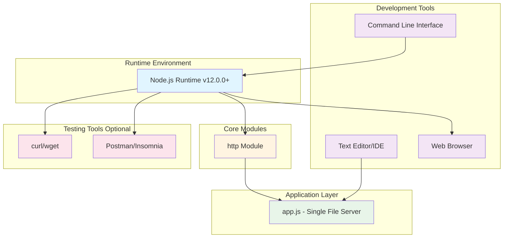
```mermaid
graph TB
    subgraph "Runtime Environment"
        A[Node.js Runtime v12.0.0+]
    end
    
    subgraph "Core Modules"
        B[http Module]
    end
    
    subgraph "Application Layer"
        C[app.js - Single File Server]
    end
    
    subgraph "Development Tools"
        D[Text Editor/IDE]
        E[Command Line Interface]
        F[Web Browser]
    end
    
    subgraph "Testing Tools Optional"
        G[curl/wget]
        H[Postman/Insomnia]
    end
    
    A --> B
    B --> C
    D --> C
    E --> A
    A --> F
    A --> G
    A --> H
    
    style A fill:#e1f5ff
    style B fill:#fff4e1
    style C fill:#e8f5e9
    style D fill:#f3e5f5
    style E fill:#f3e5f5
    style F fill:#f3e5f5
    style G fill:#fce4ec
    style H fill:#fce4ec
```

## 3.2 Programming Languages

### 3.2.1 Primary Language: JavaScript

**Language**: JavaScript (ES6+)  
**Runtime**: Node.js  
**Version Requirement**: Node.js v12.0.0 or higher (latest LTS recommended)  
**Standard Compliance**: ECMAScript 2015 (ES6) and later features supported by Node.js v12+

#### 3.2.1.1 Version Selection Justification

Node.js v12.0.0 represents the minimum supported version, chosen for several strategic reasons:

**Modern JavaScript Features**: Version 12.0.0 provides full support for ES6+ features including arrow functions, template literals, destructuring, async/await, and Promise APIs that are standard in contemporary JavaScript development. This ensures learners work with current language patterns rather than legacy syntax.

**Broad Compatibility**: Released in April 2019, Node.js v12.0.0 maintains compatibility with systems dating back 6+ years while still being supported on modern operating systems. This broad compatibility ensures the tutorial remains accessible to learners regardless of their hardware or OS version.

**Stability and Security**: Node.js v12.x received Long-Term Support (LTS) status, ensuring stability and security patches. While newer versions exist, v12.0.0 as a minimum requirement prevents dependency on bleeding-edge features while enabling modern development practices.

**HTTP Module Maturity**: The core `http` module reached full maturity by Node.js v12, with stable APIs for server creation, request handling, and response streaming that haven't required breaking changes in subsequent versions.

#### 3.2.1.2 Language Constraints

**No Transpilation**: The project uses pure JavaScript without TypeScript, Babel, or other transpilers. This eliminates build complexity and allows direct execution of source code.

**No Type Systems**: TypeScript, Flow, and JSDoc type annotations are not used, maintaining simplicity for learners who may not have experience with static typing.

**Single Paradigm Focus**: The code emphasizes imperative and functional programming patterns native to JavaScript, avoiding complex object-oriented architectures that could obscure the core HTTP concepts being taught.

### 3.2.2 Platform Compatibility

The JavaScript/Node.js stack provides cross-platform compatibility without modification:

**Windows**: All versions supporting Node.js (Windows 7 SP1 and later, Windows Server 2008 R2 and later)  
**macOS**: OS X 10.10 Yosemite and later  
**Linux**: All major distributions (Ubuntu 14.04+, Debian 8+, CentOS 7+, Fedora, Arch Linux, etc.)

This universal compatibility ensures the tutorial serves learners regardless of their development environment, with identical code behavior across all platforms.

## 3.3 Frameworks & Libraries

### 3.3.1 Core Framework: Node.js Native HTTP Module

**Framework**: None (bare Node.js core modules)  
**Primary Module**: `http` (built-in to Node.js runtime)  
**Version**: Matches Node.js runtime version (no separate versioning)

#### 3.3.1.1 Framework Selection (or Non-Selection) Rationale

This project deliberately avoids web frameworks, representing a foundational educational choice:

**Forbidden Frameworks**: Express.js, Koa, Fastify, Hapi, Restify, and all other third-party web frameworks are explicitly prohibited. The technical constraints specify that "no Express, Koa, Fastify, or other frameworks permitted" to ensure learners understand HTTP mechanics before encountering framework abstractions.

**Educational Value**: By using only the Node.js `http` module, learners gain direct exposure to:
- HTTP request object structure and properties
- Response header manipulation
- Status code management
- Request method handling
- URL parsing and routing
- Connection lifecycle management

Framework abstractions hide these mechanics behind convenience methods, which would defeat the tutorial's purpose of teaching HTTP fundamentals.

**Cognitive Load Reduction**: Frameworks introduce their own APIs, middleware systems, routing DSLs, and architectural patterns. For a first HTTP server tutorial, this additional complexity would distract from understanding the core protocol.

### 3.3.2 Node.js Core Module: `http`

**Module**: `http`  
**Type**: Built-in Node.js core module  
**API Documentation**: https://nodejs.org/api/http.html  
**Import Statement**: `const http = require('http');`

#### 3.3.2.1 HTTP Module Capabilities Used

The `http` module provides all necessary functionality for this tutorial:

**Server Creation**: `http.createServer()` instantiates an HTTP server with a request handler callback, binding to a specified port to accept incoming connections.

**Request Processing**: The request object (`http.IncomingMessage`) exposes HTTP method, URL, headers, and body stream, enabling the application to inspect and respond to client requests.

**Response Generation**: The response object (`http.ServerResponse`) provides methods to set status codes, headers, and body content, allowing complete control over HTTP responses.

**Port Binding**: The `server.listen()` method binds the server to a network port, making it accessible to HTTP clients.

**Connection Management**: The module handles TCP connection establishment, keep-alive connections, request queuing, and graceful shutdowns automatically.

#### 3.3.2.2 Module Import Restriction

The technical requirements enforce strict import constraints: "Server code imports only the `http` module from Node.js core libraries. No `require()` or `import` statements reference npm packages or external modules."

This restriction is validated in the functional requirements (F-001-RQ-001), ensuring the implementation remains focused on core Node.js capabilities without third-party code.

### 3.3.3 Additional Libraries

**Status**: None permitted

**Routing Libraries**: Prohibited (Router, express-router standalone, etc.)  
**Template Engines**: Prohibited (EJS, Pug, Handlebars, etc.)  
**Middleware Frameworks**: Prohibited (connect, middleware-chain, etc.)  
**Utility Libraries**: Prohibited (lodash, underscore, ramda, etc.)  
**Logging Frameworks**: Prohibited (Winston, Pino, Bunyan, etc.)  
**Validation Libraries**: Prohibited (Joi, validator, etc.)  
**Testing Frameworks**: Not in initial scope (Jest, Mocha, Chai, etc.)

The technical constraints explicitly state "No External Dependencies: Must not require npm package installation beyond Node.js runtime" and "Core Modules Only: Limited to Node.js built-in modules (http, etc.)."

## 3.4 Open Source Dependencies

### 3.4.1 External Dependencies

**Count**: Zero  
**Package Manager**: Not required (npm/yarn/pnpm mentioned as compatible with Node.js but not used)  
**Configuration Files**: None (no package.json, package-lock.json, or yarn.lock)

#### 3.4.1.1 Zero Dependency Architecture

This project implements a true zero-dependency architecture:

**No npm Packages**: The technical constraints specify "No External Dependencies: Must not require npm package installation beyond Node.js runtime." This eliminates the entire npm ecosystem from the project scope.

**No Package Management**: Without external dependencies, no package.json file exists, and no `npm install` or `yarn install` command is required. This removes an entire category of potential setup friction for learners.

**No Dependency Versioning**: With zero dependencies, there are no version conflicts, no security vulnerabilities in third-party code, and no breaking changes from upstream package updates.

**No node_modules Directory**: The project contains no node_modules folder, reducing repository size and eliminating the complexity of dependency resolution.

#### 3.4.1.2 Justification for Zero Dependencies

**Instant Execution**: Learners can clone the repository and immediately run `node app.js` without any installation or setup steps. This reduces time-to-first-success from potentially 10-20 minutes (with npm install, troubleshooting, etc.) to under 30 seconds.

**Eliminates Installation Barriers**: npm installation can fail due to network issues, proxy configurations, permission problems, or platform incompatibilities. Zero dependencies means zero installation failures.

**Version Control Simplicity**: Without package.json or lock files, the repository contains only source code, making version control history clean and comprehensible.

**Security Benefits**: Every dependency represents a potential security vulnerability surface. Zero dependencies means zero supply chain attack vectors, zero vulnerability scanning required, and zero dependency update maintenance.

**Focus on Fundamentals**: The absence of external code ensures learners see exactly what Node.js provides natively, establishing a clear foundation before introducing the broader ecosystem in advanced tutorials.

### 3.4.2 Development Dependencies

**Development-Only Packages**: None

Testing frameworks, linters, formatters, and documentation generators are not included in the initial implementation. Future extension phases may introduce optional development dependencies for learners who progress beyond the basic tutorial.

## 3.5 Third-Party Services

### 3.5.1 External Service Dependencies

**Count**: Zero  
**API Keys**: None required  
**Service Registration**: None required  
**Third-Party Accounts**: None required

#### 3.5.1.1 No External Services Architecture

The technical constraints explicitly state "No External Services: No API keys, external service registration, or third-party accounts." This reflects the tutorial's local-first design:

**Authentication Services**: No Auth0, OAuth providers, JWT services, or identity platforms  
**Monitoring Services**: No Datadog, New Relic, Sentry, or observability platforms  
**Cloud Services**: No AWS, Azure, GCP, or cloud hosting providers  
**API Integrations**: No third-party API consumption or webhook implementations  
**CDN Services**: No Cloudflare, Fastly, or content delivery networks  
**Email Services**: No SendGrid, Mailgun, or transactional email platforms  
**Database Services**: No MongoDB Atlas, Firebase, or managed database services

#### 3.5.1.2 Justification for Service-Free Architecture

**Zero Setup Friction**: External services require account creation, API key generation, service configuration, and often credit card information. Eliminating these requirements removes significant barriers to starting the tutorial.

**No Network Dependencies**: The server operates entirely locally, remaining functional without internet connectivity. This ensures learners can work on airplanes, in areas with poor connectivity, or in security-restricted environments.

**Privacy Protection**: No external services means no data leaves the learner's machine, ensuring complete privacy and avoiding compliance concerns in educational or corporate settings.

**Cost Elimination**: Free tiers of external services often have limitations, expiration dates, or require credit cards. A service-free architecture ensures the tutorial remains free indefinitely.

### 3.5.2 Future Service Integration

The scope document lists "External Integrations: Third-party API consumption, Message queue integration, External service dependencies, Webhook implementations" as explicitly out-of-scope for the initial tutorial but identifies these as Phase 4 and 5 extension opportunities for advanced learners.

## 3.6 Databases & Storage

### 3.6.1 Database Systems

**Primary Database**: None  
**Secondary Databases**: None  
**In-Memory Stores**: None  
**Cache Systems**: None

#### 3.6.1.1 No Database Architecture

The technical constraints explicitly state "No Database: No database installation or connection management." This architectural decision reflects the tutorial's focus on HTTP fundamentals rather than data persistence:

**Excluded Database Technologies**:
- SQL Databases: PostgreSQL, MySQL, SQLite, Microsoft SQL Server
- NoSQL Databases: MongoDB, Redis, Cassandra, CouchDB
- In-Memory Databases: Redis, Memcached
- Embedded Databases: SQLite, LevelDB, RocksDB
- Time-Series Databases: InfluxDB, TimescaleDB
- Graph Databases: Neo4j, ArangoDB

#### 3.6.1.2 Data Persistence Strategy

**Stateless Design**: The server implements a completely stateless architecture with no data persistence between requests. Each request receives the identical static response "Hello world" regardless of previous requests, server uptime, or request history.

**No Session Management**: The scope document explicitly excludes "Session management" and "State persistence across requests," ensuring the tutorial focuses exclusively on HTTP request-response mechanics.

**No File System Storage**: Data persistence via file system writes is out-of-scope, avoiding complications around file permissions, disk space, and concurrent access.

### 3.6.2 Caching Solutions

**Application Cache**: None  
**HTTP Cache**: None (no Cache-Control headers)  
**In-Memory Cache**: None (no global state)

The implementation considerations specify "Stateless Design: No session state or global variables modified," preventing even in-memory caching patterns.

### 3.6.3 Storage Services

**Object Storage**: None (no AWS S3, Azure Blob Storage, Google Cloud Storage)  
**File Storage**: None (no network file systems or distributed storage)  
**Block Storage**: None (no persistent volumes or attached storage)

The server operates entirely in memory with no persistent storage of any kind.

### 3.6.4 Justification for Storage-Free Architecture

**Complexity Reduction**: Database installation, configuration, connection management, and schema design represent significant complexity. Removing storage concerns allows learners to focus exclusively on HTTP mechanics.

**Installation Elimination**: Databases require installation, often with complex setup procedures, user account management, and platform-specific configuration. This would multiply setup time and failure points.

**Universal Compatibility**: Storage-free architecture ensures the tutorial works identically across all platforms without database driver compatibility issues, installation failures, or version mismatches.

**Immediate Execution**: Without database setup, learners progress from "clone repository" to "running server" in seconds rather than the 15-30 minutes often required for database configuration.

## 3.7 Development & Deployment

### 3.7.1 Development Tools

#### 3.7.1.1 Required Development Tools

**Node.js Runtime**  
- **Version**: v12.0.0 or higher (latest LTS recommended)
- **Purpose**: JavaScript execution environment
- **Installation**: Download from https://nodejs.org/
- **Platform Availability**: Windows, macOS, Linux

**Text Editor or IDE**  
- **Options**: VS Code, Sublime Text, Atom, Vim, Emacs, Notepad++, WebStorm, IntelliJ IDEA
- **Requirements**: JavaScript syntax highlighting (optional but recommended)
- **Purpose**: Editing app.js source file
- **Learner Assumption**: Technical constraints assume "Learners have text editor or IDE available for code viewing/editing"

**Command Line Interface**  
- **Windows**: Command Prompt (cmd.exe) or PowerShell
- **macOS/Linux**: Terminal (bash, zsh, fish, etc.)
- **Purpose**: Executing `node app.js` and viewing server output
- **Requirements**: Ability to navigate directories and run commands

**Web Browser**  
- **Supported**: Chrome, Firefox, Safari, Edge, Opera
- **Purpose**: Testing HTTP endpoint by navigating to `http://localhost:3000/hello`
- **Requirements**: Any modern browser with HTTP/1.1 support

#### 3.7.1.2 Optional Testing Tools

**Command-Line HTTP Clients**  
- **curl**: Widely available on Linux/macOS, installable on Windows
  - Example: `curl http://localhost:3000/hello`
  - Purpose: Scripted testing and header inspection
- **wget**: Alternative to curl, similar functionality
  - Example: `wget -O- http://localhost:3000/hello`

**API Testing GUI Tools**  
- **Postman**: Popular API testing platform with graphical interface
- **Insomnia**: Alternative API testing tool
- **Purpose**: Detailed request/response inspection, header visualization

The functional requirements specify "Server accepts connections from web browsers (Chrome, Firefox, Safari, Edge), command-line tools (curl, wget), API testing tools (Postman, Insomnia)."

#### 3.7.1.3 Version Control

**Git**  
- **Status**: Repository initialized with Git
- **Initial Commit**: Confirmed dated November 7, 2025
- **Remote**: Repository accessible via Git
- **Purpose**: Version control, collaboration, distribution

### 3.7.2 Build System

#### 3.7.2.1 No Build Process

**Build Tools**: None  
**Build Step**: Not required  
**Build Output**: Not applicable

The technical constraints explicitly specify "No Build Step: Must run directly with `node app.js` without compilation or bundling."

#### 3.7.2.2 Excluded Build Technologies

**Module Bundlers**: None (no webpack, rollup, parcel, esbuild, vite)  
**Transpilers**: None (no Babel, TypeScript compiler, SWC)  
**Minifiers**: None (no UglifyJS, Terser, code compression)  
**Asset Processors**: None (no CSS processors, image optimizers)  
**Task Runners**: None (no Gulp, Grunt, npm scripts for building)

#### 3.7.2.3 Execution Model

**Direct Execution**: The server runs directly from source code:

```
$ node app.js
Server running at http://localhost:3000/
```

**No Intermediate Steps**: No compilation, transpilation, bundling, or transformation occurs between source code and execution. The JavaScript file is interpreted directly by the Node.js V8 engine.

**No Output Artifacts**: There are no dist/, build/, or output directories. The source code repository is identical to the execution environment.

#### 3.7.2.4 Justification for Build-Free Architecture

**Instant Feedback**: Changes to app.js are immediately executable without waiting for build processes. This tight feedback loop accelerates learning and experimentation.

**Elimination of Build Errors**: Build systems introduce new categories of errors (configuration errors, plugin conflicts, version mismatches). Removing builds removes these failure modes.

**Simplified Mental Model**: Learners understand that Node.js directly executes JavaScript, without confusion about build steps, source maps, or the relationship between source and executed code.

**Setup Simplicity**: No build configuration files (webpack.config.js, tsconfig.json, rollup.config.js) means fewer files to understand and maintain.

### 3.7.3 Package Management

#### 3.7.3.1 Package Manager Status

**npm**: Available with Node.js installation but not used for this project  
**package.json**: Not present  
**package-lock.json**: Not present  
**node_modules/**: Not present

#### 3.7.3.2 No Package Installation

The single-file implementation with zero dependencies eliminates package management entirely:

**No `npm install`**: Learners never run package installation commands  
**No `npm update`**: No package updates required  
**No `npm audit`**: No security vulnerability scanning needed  
**No lockfile management**: No package-lock.json or yarn.lock version control

This represents a significant simplification compared to typical Node.js projects where package management often consumes substantial setup and maintenance time.

### 3.7.4 Containerization

#### 3.7.4.1 Container Status

**Docker**: Not in scope for initial tutorial  
**Dockerfile**: Not present  
**docker-compose.yml**: Not present  
**Container Registry**: Not applicable

#### 3.7.4.2 Future Containerization

The future extension opportunities document identifies "Containerization (Docker)" as a Phase 5 enhancement, suggesting that Docker integration may be introduced for learners who progress beyond basic HTTP concepts.

**Future Considerations**:
- Docker image creation for consistent environments
- Multi-stage builds for optimization
- Container orchestration with docker-compose
- Kubernetes deployment for advanced learners

#### 3.7.4.3 Justification for Native Execution

**Immediate Execution**: Containerization adds setup steps (Docker installation, image building) that would delay time-to-first-success from seconds to minutes.

**Complexity Avoidance**: Docker introduces concepts (images, containers, volumes, networks) that are orthogonal to HTTP fundamentals and would increase cognitive load.

**Platform Native**: Running directly on the host operating system provides better performance and simpler debugging for educational purposes.

### 3.7.5 Continuous Integration / Continuous Deployment

#### 3.7.5.1 CI/CD Pipeline Status

**CI/CD Platform**: None  
**Automated Testing**: Not in scope  
**Automated Deployment**: Not applicable  
**Pipeline Configuration**: Not present

#### 3.7.5.2 Excluded CI/CD Technologies

**CI/CD Platforms**: No GitHub Actions, GitLab CI, Jenkins, Travis CI, CircleCI, Azure DevOps  
**Testing Automation**: No automated test execution  
**Deployment Automation**: No automated deployment pipelines  
**Quality Gates**: No automated code quality checks

#### 3.7.5.3 Justification for Manual Execution

**Educational Context**: This is a tutorial project for learning, not a production system requiring automated deployment.

**Manual Testing Model**: Learners manually start the server, test endpoints, and verify output as part of the learning process.

**Development Mode**: The operational constraints specify "Development Mode: No production-grade error handling, security hardening, or optimization," making CI/CD pipelines unnecessary.

**Local Execution**: The constraints specify "Local Development Only: Not designed for deployment to servers or cloud platforms," eliminating deployment automation requirements.

### 3.7.6 Development Workflow

#### 3.7.6.1 Simplified Development Process

The technology stack enables an extremely streamlined development workflow:

**Step 1: Setup (One-Time)**
- Install Node.js v12.0.0+ from nodejs.org
- Verify installation: `node --version`
- Clone repository or create app.js file
- Total time: 2-3 minutes

**Step 2: Development**
- Open app.js in any text editor
- Edit code (no build step required)
- Save file
- Total time: Seconds per change

**Step 3: Execution**
- Run `node app.js` from command line
- Server starts and binds to port
- Performance target: < 2 seconds startup time
- Console output confirms server readiness

**Step 4: Testing**
- Open browser to `http://localhost:3000/hello`
- Or execute `curl http://localhost:3000/hello`
- Verify "Hello world" response
- Performance target: < 50ms response latency

**Step 5: Iteration**
- Stop server with CTRL+C
- Modify app.js in editor
- Restart server with `node app.js`
- Retest endpoint
- Cycle time: < 10 seconds

#### 3.7.6.2 Time Requirements

The resource constraints specify exact timing expectations:

**Setup to Running Server**: < 5 minutes from fresh system to operational endpoint  
**Code Change to Test**: Seconds (edit → save → restart → test cycle)  
**Learning to Comprehension**: < 30 minutes for complete tutorial understanding  
**Startup Performance**: < 2 seconds from `node app.js` to ready state

These aggressive time targets are achievable due to the minimal technology stack with zero dependencies, no build steps, and single-file implementation.

## 3.8 Performance & Resource Requirements

### 3.8.1 Runtime Performance Targets

**Startup Time**: < 2 seconds from `node app.js` execution to server accepting connections  
**Response Latency**: < 50ms for localhost HTTP requests to `/hello` endpoint  
**Memory Footprint**: < 50MB RAM for idle server process  
**Concurrent Connections**: Support 10-20 simultaneous client connections  
**Request Throughput**: 50-100 requests/minute minimum capacity

These performance targets are specified in the implementation considerations (Section 2.4.1.2) and ensure the server runs efficiently on entry-level hardware.

### 3.8.2 System Resource Requirements

**Hardware Requirements**: "Must run on entry-level development machines" with "memory and CPU usage should be negligible on modern hardware"

**Minimum Viable Hardware**:
- CPU: Any x86_64 or ARM processor supporting Node.js
- RAM: 512MB available memory (server uses < 50MB)
- Disk: 10MB for Node.js code + app.js (< 5KB)
- Network: Loopback interface (no external network required)

**Operating System**:
- Windows 7 SP1 or later
- macOS 10.10 Yosemite or later
- Linux kernel 3.10+ (any major distribution)

### 3.8.3 Performance Justification

**Lightweight Stack**: Node.js with zero dependencies produces minimal overhead, enabling sub-2-second startup and sub-50ms response times.

**Single-Threaded Efficiency**: Node.js event loop efficiently handles multiple concurrent connections without thread overhead, supporting 10-20 simultaneous connections on modest hardware.

**No I/O Bottlenecks**: The absence of databases, file system access, and external service calls eliminates common performance bottlenecks, ensuring consistent low-latency responses.

## 3.9 Configuration & Environment

### 3.9.1 Configuration Approach

**Configuration Files**: None  
**Environment Variables**: Optional for port configuration, not required  
**Configuration Management**: Hardcoded values in source code

#### 3.9.1.1 Minimal Configuration Philosophy

The technical constraints specify "Minimal Configuration: No configuration files, environment setup, or initialization scripts."

**Port Configuration**: The functional requirements state "Port number is configurable via code constant or environment variable" (F-001-RQ-002), but defaults to 3000 or 8080 hardcoded in app.js.

**Network Binding**: Recommended to bind to 127.0.0.1 (localhost) for security rather than 0.0.0.0 (all interfaces), as specified in security implications (Section 2.4.1.4).

**Inline Configuration**: All configuration exists as constants within app.js source code, eliminating external configuration dependencies.

#### 3.9.1.2 No Configuration Files

**Excluded Configuration**:
- No .env files (no environment variable files)
- No config.json or config.yaml
- No .config/ directories
- No INI files or property files
- No XML configuration
- No configuration management systems

### 3.9.2 Environment

**Execution Environment**: Development/local only  
**Target Platforms**: Localhost execution on learner's development machine  
**Network Exposure**: Local loopback interface (127.0.0.1) recommended  
**Production Deployment**: Explicitly out-of-scope

The operational constraints specify "Local Development Only: Not designed for deployment to servers or cloud platforms" and "Development Mode: No production-grade error handling, security hardening, or optimization."

## 3.10 Security Considerations

### 3.10.1 Security Posture

**Security Level**: Development/tutorial grade, not production-hardened  
**Threat Model**: Trusted local environment, single-user system  
**Authentication**: None (appropriate for learning context)  
**Authorization**: None (open access to all endpoints)

#### 3.10.1.1 Security Constraints

**No Authentication**: The scope document explicitly excludes "User authentication mechanisms" and "Authorization and access control," appropriate for a basic HTTP tutorial.

**No Encryption**: Plain HTTP only, no HTTPS/TLS. This simplifies the tutorial but means the server should only be used locally.

**Local Binding Recommended**: The security implications specify "Binding to localhost (127.0.0.1) rather than 0.0.0.0 prevents external network access," reducing attack surface.

**Standard Privileges**: No root or administrator privileges required for execution, following principle of least privilege.

#### 3.10.1.2 Out-of-Scope Security Features

The scope document explicitly excludes:
- HTTPS/TLS encryption
- API key validation
- JWT authentication
- OAuth integration
- CORS configuration
- Rate limiting
- Input validation
- SQL injection protection (no database)
- XSS prevention
- CSRF protection

These omissions are intentional, as production security patterns would add complexity inappropriate for an introductory HTTP tutorial.

### 3.10.2 Security Justification

**Educational Context**: The tutorial teaches HTTP fundamentals in a controlled local environment where production security is unnecessary and would obscure learning objectives.

**Isolated Execution**: Local-only binding (127.0.0.1) ensures the server isn't exposed to external networks, eliminating most security concerns.

**No Sensitive Data**: The server returns only static text ("Hello world") with no user data, credentials, or confidential information.

**Future Enhancement Path**: The future extension opportunities document identifies security features (authentication, authorization, HTTPS) as Phase 3 and Phase 4 enhancements for advanced learners.

## 3.11 HTTP Protocol Compliance

### 3.11.1 HTTP Version and Standards

**HTTP Version**: HTTP/1.1  
**Standards Compliance**: RFC 7230 (HTTP/1.1 Message Syntax), RFC 7231 (HTTP/1.1 Semantics and Content)

The technical constraints specify "HTTP/1.1 protocol specifications (RFC 7230, RFC 7231)" as reference standards for implementation.

### 3.11.2 Protocol Features

**HTTP Methods**: GET (primary), with implicit support for all methods via Node.js http module  
**Status Codes**: 200 OK (success), 404 Not Found (incorrect path)  
**Headers**: Content-Type: text/plain, Date (automatic via Node.js)  
**Body Encoding**: Plain text (UTF-8)  
**Connection Management**: HTTP/1.1 persistent connections (handled by Node.js)

The functional requirements specify "HTTP/1.1 status code standards (RFC 7231)" compliance (F-003-RQ-002).

### 3.11.3 Protocol Justification

**HTTP/1.1 Selection**: HTTP/1.1 represents the baseline HTTP protocol supported by all browsers and HTTP clients, ensuring universal compatibility without requiring HTTP/2 or HTTP/3 complexity.

**Text/Plain Content-Type**: Simple MIME type appropriate for static string responses, avoiding HTML parsing or JSON deserialization complexity.

**Standards Compliance**: RFC adherence ensures the server works correctly with all standard HTTP clients and follows established protocol semantics.

## 3.12 Technology Stack Summary

### 3.12.1 Stack Composition

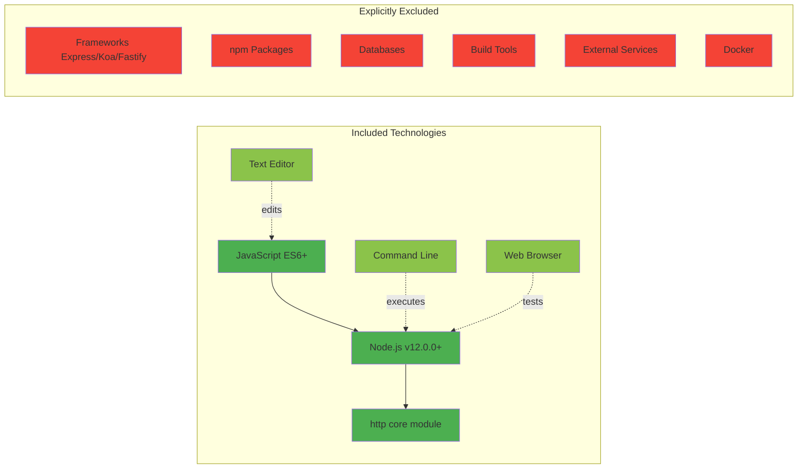
```mermaid
graph LR
    subgraph "Included Technologies"
        A[Node.js v12.0.0+]
        B[JavaScript ES6+]
        C[http core module]
        D[Text Editor]
        E[Command Line]
        F[Web Browser]
    end
    
    subgraph "Explicitly Excluded"
        G[Frameworks Express/Koa/Fastify]
        H[npm Packages]
        I[Databases]
        J[Build Tools]
        K[External Services]
        L[Docker]
    end
    
    A --> C
    B --> A
    D -.edits.-> B
    E -.executes.-> A
    F -.tests.-> A
    
    style A fill:#4CAF50
    style B fill:#4CAF50
    style C fill:#4CAF50
    style D fill:#8BC34A
    style E fill:#8BC34A
    style F fill:#8BC34A
    style G fill:#f44336
    style H fill:#f44336
    style I fill:#f44336
    style J fill:#f44336
    style K fill:#f44336
    style L fill:#f44336
```

### 3.12.2 Technology Decision Matrix

| Technology Category | Selection | Version | Justification |
|---------------------|-----------|---------|---------------|
| **Runtime** | Node.js | v12.0.0+ | Modern JavaScript support, broad compatibility, mature HTTP module |
| **Language** | JavaScript | ES6+ | Native Node.js language, no transpilation required |
| **Web Framework** | None | N/A | Educational focus on HTTP fundamentals without abstractions |
| **Core Module** | http | Built-in | Provides all necessary HTTP server functionality |
| **Dependencies** | None | N/A | Zero setup friction, immediate execution |
| **Database** | None | N/A | Stateless tutorial focused on HTTP, not data persistence |
| **Build System** | None | N/A | Direct execution without compilation or bundling |
| **Containerization** | None (future) | N/A | Native execution simpler for educational purposes |
| **CI/CD** | None | N/A | Manual testing appropriate for learning context |
| **Configuration** | Inline | N/A | Single-file simplicity without external config files |

### 3.12.3 Technology Constraints Summary

**Mandatory Inclusions**:
- Node.js v12.0.0 or higher runtime
- JavaScript language (ES6+ features)
- Node.js `http` core module exclusively

**Strict Exclusions**:
- All web frameworks (Express, Koa, Fastify, etc.)
- All npm packages and external dependencies
- All database systems and persistent storage
- All build tools and transpilers
- All external services and cloud platforms
- All configuration files and environment setup

**Optional Enhancements** (Future Phases):
- Testing frameworks (Phase 2)
- Security features (Phase 3-4)
- External integrations (Phase 4)
- Containerization (Phase 5)
- Advanced Node.js features (Phase 5)

### 3.12.4 Integration Requirements

**Between Components**: Minimal integration required due to single-file, zero-dependency architecture:

**Node.js → http module**: Native integration via `require('http')` statement  
**http module → app.js**: Server instantiation via `http.createServer(callback)`  
**app.js → Network**: Port binding via `server.listen(port)` method  
**Client → Server**: Standard HTTP/1.1 protocol over TCP

**No External Integration**: No databases to connect, no APIs to integrate, no authentication services to configure, no monitoring platforms to instrument.

### 3.12.5 Version Management Strategy

**Node.js Runtime**: Minimum v12.0.0, latest LTS recommended for learners  
**Core Modules**: Automatically match Node.js version (no separate versioning)  
**Application Code**: Single file (app.js) with no versioned dependencies  
**No Version Lock Files**: No package-lock.json, yarn.lock, or dependency version constraints

**Version Upgrade Path**: Learners can upgrade Node.js versions without code changes, as the `http` module API has remained stable across Node.js major versions.

## 3.13 References

### 3.13.1 Technical Specification Sections

The following sections from the Technical Specification provided comprehensive technology requirements:

- **Section 1.2.1**: System Overview - Architecture and component descriptions
- **Section 1.3.2**: Scope - Explicitly excluded technologies and features
- **Section 2.1.1**: Feature Catalog (F-001) - Node.js version requirement (v12.0.0+)
- **Section 2.2.1.1**: Functional Requirements (F-001-RQ-001) - HTTP module restriction and import constraints
- **Section 2.2.1.1**: Functional Requirements (F-001-RQ-002) - Port configuration approach
- **Section 2.2.1.2**: Functional Requirements (F-001-RQ-005) - Client compatibility requirements
- **Section 2.2.3.1**: Functional Requirements (F-003-RQ-002) - HTTP/1.1 status code standards
- **Section 2.4.1.1**: Implementation Considerations - Module restrictions and framework exclusions
- **Section 2.4.1.2**: Implementation Considerations - Performance and resource targets
- **Section 2.4.1.4**: Implementation Considerations - Security implications and local binding
- **Section 2.4.3.3**: Implementation Considerations - Stateless design requirement
- **Section 2.6.1**: Assumptions and Constraints - Environmental assumptions (Node.js installation, text editor availability)
- **Section 2.6.2**: Assumptions and Constraints - Technical constraints (no external dependencies, core modules only, no database, no build step, single file implementation, no configuration files, no external services)
- **Section 2.6.2**: Assumptions and Constraints - Resource constraints (entry-level hardware, < 5 minute setup, < 30 minute learning time)
- **Section 2.6.2**: Assumptions and Constraints - Operational constraints (local development only, development mode)
- **Section 2.6.3**: Assumptions and Constraints - Standards references (HTTP/1.1 RFCs)
- **Section 2.7**: Future Extension Opportunities - Phases 2-5 technology enhancements (testing frameworks, security features, external integrations, containerization)
- **Section 2.8**: References - Technology references (Node.js HTTP module documentation, HTTP/1.1 RFC specifications)

### 3.13.2 Repository Files

- **README.md**: Project header confirming repository initialization

### 3.13.3 Technology Documentation

- **Node.js Documentation**: https://nodejs.org/api/http.html (HTTP module reference)
- **RFC 7230**: HTTP/1.1 Message Syntax and Routing
- **RFC 7231**: HTTP/1.1 Semantics and Content
- **ECMAScript 2015 (ES6) Specification**: JavaScript language features

### 3.13.4 User Requirements

- **User Context**: "new product Can you create a nodejs tutorial project that features one end point '/hello' that returns 'Hello world' to the calling HTTP client?"
  - Confirms Node.js as required runtime
  - Specifies single endpoint requirement
  - Establishes tutorial/educational context
  - Defines simple text response format

---

**Document Section Status**: Complete  
**Technology Stack Definition**: Comprehensive and constraint-compliant  
**Evidence-Based Documentation**: All statements grounded in technical specification requirements  
**Integration Readiness**: Technology stack aligns with project scope, features, and functional requirements documented in other specification sections

# 4. Process Flowchart

## 4.1 OVERVIEW

This section documents the complete process flows for the Node.js HTTP server tutorial project. The system implements a minimalist architecture designed for educational purposes, featuring a single endpoint '/hello' that demonstrates fundamental HTTP server operations using Node.js core modules. All process flows emphasize simplicity, predictability, and adherence to HTTP/1.1 standards while maintaining sub-50ms response times for localhost requests.

The process flowcharts presented in this section map the entire request lifecycle from server initialization through request processing, response delivery, and error handling. Each workflow is annotated with performance timing constraints derived from functional requirements to ensure the system meets its educational and operational objectives.

## 4.2 CORE BUSINESS PROCESSES

### 4.2.1 End-to-End Request-Response Workflow

The primary business process of this system is the synchronous handling of HTTP GET requests to the '/hello' endpoint. This workflow represents the complete user journey from initiating an HTTP request to receiving the "Hello world" response.

**Workflow Participants:**
- HTTP Client (browser, curl, Postman, or any HTTP-capable tool)
- Node.js HTTP Server (listening on configured port)
- Route Handler (path matching logic)
- Endpoint Handler (response generation)

**Process Steps:**

1. **Client Request Initiation**: The HTTP client establishes a TCP connection to the server's listening port (default: 3000 or 8080) and transmits an HTTP GET request with the path '/hello'.

2. **Connection Acceptance**: The Node.js server accepts the incoming connection within 5ms of the connection attempt (per requirement F-001-RQ-005), establishing the TCP socket for bidirectional communication.

3. **Request Parsing**: The Node.js http module automatically parses the raw HTTP request into a structured request object containing method, URL, headers, and body properties. This parsing completes within 2ms (per requirement F-004-RQ-002).

4. **Route Matching**: The routing logic extracts the URL path from the request object and performs exact string matching against registered routes. The system checks if the path equals "/hello" using case-sensitive comparison, completing this operation within 1ms (per requirement F-002-RQ-002).

5. **Method Validation**: If the path matches "/hello", the system validates that the HTTP method is GET. This validation occurs within 1ms (per requirement F-002-RQ-007).

6. **Handler Execution**: The endpoint handler function executes, preparing the static response "Hello world" without performing any asynchronous operations, database queries, or external API calls. Handler execution completes within 5ms (per requirement F-003-RQ-004).

7. **Response Generation**: The system constructs an HTTP response with status code 200 OK, Content-Type header set to "text/plain", and the body containing "Hello world" encoded in UTF-8. Response formatting completes within 5ms (per requirement F-004-RQ-005).

8. **Response Delivery**: The complete HTTP response is transmitted to the client over the established TCP connection. The total response time from request receipt to response transmission remains under 50ms for localhost requests (per requirement F-003-RQ-004).

9. **Connection Management**: The Node.js server manages connection persistence according to HTTP/1.1 keep-alive semantics, allowing the same TCP connection to be reused for subsequent requests while returning to the listening state to accept new connections.

**Success Criteria:**
- Response delivered with exact body "Hello world"
- HTTP status code 200 returned
- Content-Type header set to "text/plain"
- Total response latency under 50ms
- No state persisted between requests

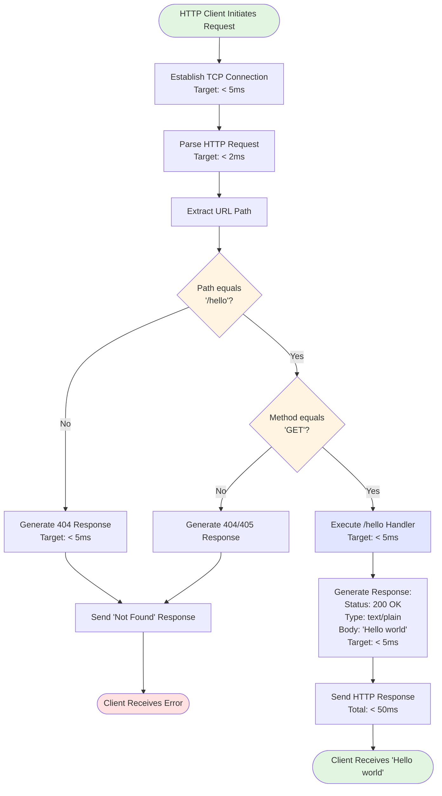
```mermaid
flowchart TD
    Start([HTTP Client Initiates Request]) --> Connect[Establish TCP Connection<br/>Target: < 5ms]
    Connect --> Parse[Parse HTTP Request<br/>Target: < 2ms]
    Parse --> Extract[Extract URL Path]
    Extract --> RouteDecision{Path equals<br/>'/hello'?}
    
    RouteDecision -->|No| NotFound[Generate 404 Response<br/>Target: < 5ms]
    NotFound --> SendError[Send 'Not Found' Response]
    SendError --> EndError([Client Receives Error])
    
    RouteDecision -->|Yes| MethodCheck{Method equals<br/>'GET'?}
    MethodCheck -->|No| MethodError[Generate 404/405 Response]
    MethodError --> SendError
    
    MethodCheck -->|Yes| Handler[Execute /hello Handler<br/>Target: < 5ms]
    Handler --> GenerateResponse[Generate Response:<br/>Status: 200 OK<br/>Type: text/plain<br/>Body: 'Hello world'<br/>Target: < 5ms]
    GenerateResponse --> Send[Send HTTP Response<br/>Total: < 50ms]
    Send --> End([Client Receives 'Hello world'])
    
    style Start fill:#e1f5e1
    style End fill:#e1f5e1
    style EndError fill:#ffe1e1
    style RouteDecision fill:#fff4e1
    style MethodCheck fill:#fff4e1
    style Handler fill:#e1e5ff
```

### 4.2.2 Server Initialization Process

The server initialization process establishes the runtime environment and begins listening for incoming HTTP connections. This one-time startup sequence must complete within 2 seconds (per requirement F-001-RQ-003) to provide immediate feedback to developers.

**Process Steps:**

1. **Application Start**: Developer executes `node app.js` command from the terminal, invoking the Node.js runtime with the application entry point.

2. **Module Loading**: Node.js loads the core 'http' module, which provides native HTTP server capabilities without requiring external dependencies.

3. **Server Instance Creation**: The application invokes `http.createServer()` with a request handler callback function, creating the HTTP server instance in memory.

4. **Port Configuration**: The system determines the listening port from environment variables (PORT) or uses the default value (3000 or 8080). Port validation ensures the value is an integer between 1024 and 65535, avoiding privileged ports that require elevated permissions.

5. **Port Binding**: The server attempts to bind to the configured port by calling the `listen()` method. This operation may fail if the port is already in use, triggering the port binding error workflow.

6. **Listening State**: Upon successful binding, the server transitions to the listening state and begins accepting incoming connections. The Node.js event loop remains active, processing connection events asynchronously.

7. **Startup Confirmation**: The system logs a confirmation message to the console (e.g., "Server is running on http://localhost:3000"), providing immediate visual feedback that the server is operational and ready to accept requests.

**Validation Rules:**
- Port number must be integer in range 1024-65535
- Port must not be in use by another process
- Server must confirm listening state before accepting requests
- Startup must complete within 2 seconds

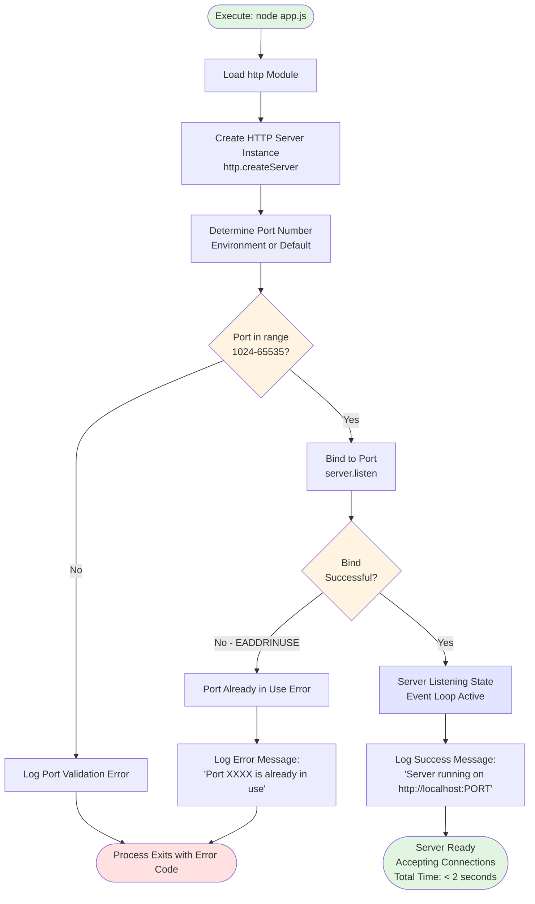
```mermaid
flowchart TD
    Start([Execute: node app.js]) --> LoadModule[Load http Module]
    LoadModule --> CreateServer[Create HTTP Server Instance<br/>http.createServer]
    CreateServer --> GetPort[Determine Port Number<br/>Environment or Default]
    GetPort --> ValidatePort{Port in range<br/>1024-65535?}
    
    ValidatePort -->|No| PortError[Log Port Validation Error]
    PortError --> ExitError([Process Exits with Error Code])
    
    ValidatePort -->|Yes| Bind[Bind to Port<br/>server.listen]
    Bind --> BindCheck{Bind<br/>Successful?}
    
    BindCheck -->|No - EADDRINUSE| BindError[Port Already in Use Error]
    BindError --> LogError[Log Error Message:<br/>'Port XXXX is already in use']
    LogError --> ExitError
    
    BindCheck -->|Yes| Listening[Server Listening State<br/>Event Loop Active]
    Listening --> LogSuccess[Log Success Message:<br/>'Server running on http://localhost:PORT']
    LogSuccess --> Ready([Server Ready<br/>Accepting Connections<br/>Total Time: < 2 seconds])
    
    style Start fill:#e1f5e1
    style Ready fill:#e1f5e1
    style ExitError fill:#ffe1e1
    style ValidatePort fill:#fff4e1
    style BindCheck fill:#fff4e1
    style Listening fill:#e1e5ff
```

### 4.2.3 Request Routing Process

The request routing process determines which handler function should process an incoming HTTP request based on the URL path and HTTP method. This tutorial system implements exact string matching for the single '/hello' endpoint, with all other paths routed to a 404 handler.

**Routing Logic:**

1. **Path Extraction**: The system extracts the full URL from the `req.url` property of the request object, which includes the path and any query string parameters.

2. **Query String Separation**: Query parameters (if present) are separated from the path component. For example, '/hello?name=John' extracts path '/hello' and query 'name=John'.

3. **Exact Match Comparison**: The extracted path undergoes case-sensitive exact string comparison against the registered route '/hello'. Partial matches, substring matches, and case-insensitive variations are not accepted.

4. **Method Verification**: If the path matches '/hello', the system verifies the HTTP method is GET. The tutorial implementation primarily supports GET requests, returning error responses for other methods.

5. **Handler Selection**: Based on the routing decision:
   - **Path '/hello' + Method GET**: Route to the hello endpoint handler
   - **Path '/hello' + Other Method**: Route to 404/405 error handler
   - **Any Other Path**: Route to 404 Not Found handler

**Decision Points:**
- **Primary Decision**: Does `req.url.pathname === "/hello"`?
- **Secondary Decision**: Does `req.method === "GET"`?
- **Timing Constraint**: Route matching completes within 1ms (per requirement F-002-RQ-002)

**Security Considerations:**
- Path traversal patterns (../../) are not processed due to exact matching
- No regular expression complexity vulnerabilities
- Case-sensitive matching prevents bypass attempts

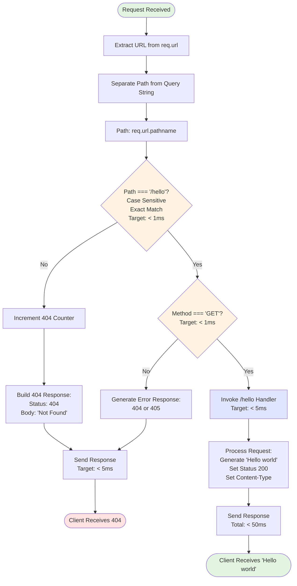
```mermaid
flowchart TD
    Start([Request Received]) --> Extract[Extract URL from req.url]
    Extract --> Split[Separate Path from Query String]
    Split --> Normalize[Path: req.url.pathname]
    Normalize --> Match{Path === '/hello'?<br/>Case Sensitive<br/>Exact Match<br/>Target: < 1ms}
    
    Match -->|No| Count404[Increment 404 Counter]
    Count404 --> Build404[Build 404 Response:<br/>Status: 404<br/>Body: 'Not Found']
    Build404 --> Send404[Send Response<br/>Target: < 5ms]
    Send404 --> End404([Client Receives 404])
    
    Match -->|Yes| CheckMethod{Method === 'GET'?<br/>Target: < 1ms}
    
    CheckMethod -->|No| Method405[Generate Error Response:<br/>404 or 405]
    Method405 --> Send404
    
    CheckMethod -->|Yes| HelloHandler[Invoke /hello Handler<br/>Target: < 5ms]
    HelloHandler --> Process[Process Request:<br/>Generate 'Hello world'<br/>Set Status 200<br/>Set Content-Type]
    Process --> Send200[Send Response<br/>Total: < 50ms]
    Send200 --> End200([Client Receives 'Hello world'])
    
    style Start fill:#e1f5e1
    style End200 fill:#e1f5e1
    style End404 fill:#ffe1e1
    style Match fill:#fff4e1
    style CheckMethod fill:#fff4e1
    style HelloHandler fill:#e1e5ff
```

## 4.3 STATE MANAGEMENT

### 4.3.1 Server Lifecycle States

The Node.js HTTP server progresses through distinct lifecycle states from initialization through termination. Understanding these states is crucial for managing server operations, handling errors, and implementing graceful shutdown procedures.

**State Definitions:**

1. **Uninitialized State**: The initial state before the Node.js process executes the application code. No server instance exists, and no resources are allocated.

2. **Created State**: The HTTP server object has been instantiated via `http.createServer()` but has not yet bound to a network port. The server exists in memory with a configured request handler callback.

3. **Binding State**: The server is attempting to bind to the configured port via the `listen()` method. During this transient state, the operating system validates port availability and allocates socket resources.

4. **Listening State**: The server has successfully bound to the port and is actively accepting incoming TCP connections. This is the primary operational state where the server processes requests via the Node.js event loop.

5. **Processing State**: While in the listening state, the server simultaneously handles active requests through the event loop. The single-threaded event-driven architecture allows concurrent request processing without blocking.

6. **Shutting Down State**: The server has received a shutdown signal (SIGINT or SIGTERM) and is closing the listening socket while allowing existing connections to complete. No new connections are accepted during shutdown.

7. **Terminated State**: The Node.js process has exited, releasing all resources including network sockets, memory allocations, and event loop threads. The server is fully stopped.

**State Transitions:**
- **Uninitialized → Created**: `http.createServer()` invocation
- **Created → Binding**: `server.listen(port)` call
- **Binding → Listening**: Successful port binding
- **Binding → Terminated**: Port binding failure (EADDRINUSE error)
- **Listening → Processing**: Request received (non-blocking transition)
- **Processing → Listening**: Request completed (return to event loop)
- **Listening → Shutting Down**: SIGINT/SIGTERM signal received
- **Shutting Down → Terminated**: All connections closed, process exits

**Timing Constraints:**
- Startup (Uninitialized → Listening): < 2 seconds (F-001-RQ-003)
- Shutdown (Listening → Terminated): < 1 second (F-001-RQ-008)
- Request Processing (any state): < 50ms (F-003-RQ-004)

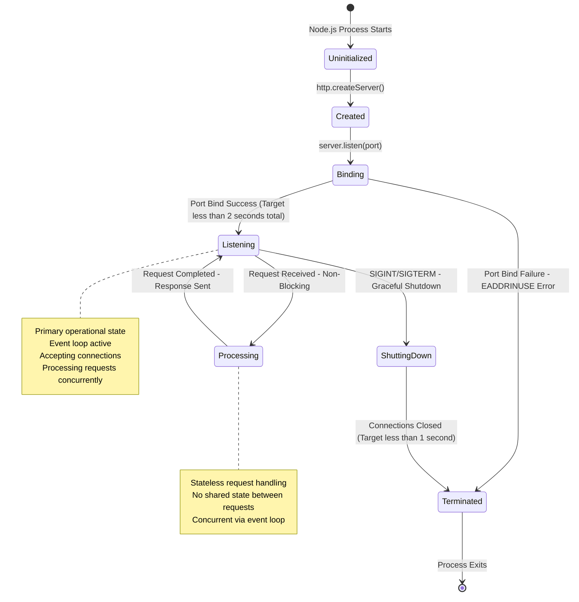
```mermaid
stateDiagram-v2
    [*] --> Uninitialized: Node.js Process Starts
    Uninitialized --> Created: http.createServer()
    Created --> Binding: server.listen(port)
    
    Binding --> Listening: Port Bind Success (Target less than 2 seconds total)
    Binding --> Terminated: Port Bind Failure - EADDRINUSE Error
    
    Listening --> Processing: Request Received - Non-Blocking
    Processing --> Listening: Request Completed - Response Sent
    
    Listening --> ShuttingDown: SIGINT/SIGTERM - Graceful Shutdown
    ShuttingDown --> Terminated: Connections Closed (Target less than 1 second)
    
    Terminated --> [*]: Process Exits
    
    note right of Listening
        Primary operational state
        Event loop active
        Accepting connections
        Processing requests concurrently
    end note
    
    note right of Processing
        Stateless request handling
        No shared state between requests
        Concurrent via event loop
    end note
```

### 4.3.2 Request Processing States

Each HTTP request progresses through a sequence of processing states from arrival through response delivery. These states represent the logical phases of request handling within the Node.js event loop.

**Request State Flow:**

1. **Received State**: TCP connection established and HTTP request bytes received by the server. The raw request data is buffered for parsing.

2. **Parsed State**: Node.js http module has parsed the HTTP request into a structured request object with properties for method, URL, headers, and body. Parsing validates HTTP/1.1 protocol compliance.

3. **Routed State**: The routing logic has determined which handler function should process the request based on path and method matching. The appropriate handler reference is ready for invocation.

4. **Executing State**: The selected handler function is executing within the event loop. For the '/hello' endpoint, this involves preparing the static "Hello world" response without blocking operations.

5. **Responding State**: The response object is being populated with status code, headers, and body content. The `res.writeHead()` and `res.end()` methods construct the HTTP response.

6. **Sent State**: The complete HTTP response has been transmitted to the client over the TCP connection. The request object is eligible for garbage collection.

7. **Completed State**: All resources associated with the request have been released, and the server returns to the listening state ready for the next request.

**State Characteristics:**
- All states are stateless: no data persists between requests
- State transitions are synchronous: no asynchronous operations
- State duration is deterministic: predictable timing for each phase
- State isolation: concurrent requests maintain independent state sequences

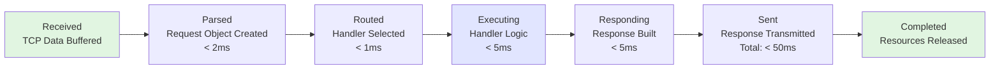
```mermaid
flowchart LR
    Received[Received<br/>TCP Data Buffered] --> Parsed[Parsed<br/>Request Object Created<br/>< 2ms]
    Parsed --> Routed[Routed<br/>Handler Selected<br/>< 1ms]
    Routed --> Executing[Executing<br/>Handler Logic<br/>< 5ms]
    Executing --> Responding[Responding<br/>Response Built<br/>< 5ms]
    Responding --> Sent[Sent<br/>Response Transmitted<br/>Total: < 50ms]
    Sent --> Completed[Completed<br/>Resources Released]
    
    style Received fill:#e1f5e1
    style Completed fill:#e1f5e1
    style Executing fill:#e1e5ff
```

### 4.3.3 Stateless Operation Model

The tutorial HTTP server implements a pure stateless architecture where each request is processed independently without reliance on server-side session state, global variables, or persistent data stores.

**Stateless Design Principles:**

1. **No Session State**: The server does not maintain session identifiers, cookies, or user authentication state between requests. Each request carries complete information needed for processing.

2. **No Global Variables**: No mutable shared state exists between request handlers. All data required for response generation is contained within the request-scoped variables.

3. **No Data Persistence**: The system does not write to files, databases, or external storage systems. No state survives beyond the request-response cycle.

4. **Independent Request Execution**: Each request handler invocation operates in isolation with independent request and response objects. Side effects from one request cannot affect another.

5. **Concurrent Safety**: The stateless design eliminates race conditions, deadlocks, and synchronization overhead, enabling safe concurrent request handling via the Node.js event loop.

**Benefits:**
- **Simplicity**: Eliminates complexity of state management and synchronization
- **Scalability**: Each request can be processed independently without coordination
- **Reliability**: No state corruption or memory leaks from accumulated state
- **Testing**: Predictable behavior enables straightforward unit and integration testing
- **Educational Clarity**: Beginners understand request processing without state complexity

**Implications:**
- No user session tracking or personalization
- No request counters or metrics persistence (unless implemented externally)
- No caching mechanisms or memoization
- Each request repeats identical computation for identical inputs

## 4.4 ERROR HANDLING WORKFLOWS

### 4.4.1 Port Binding Failure Workflow

Port binding failures occur when the configured port is already in use by another process or when the port number is invalid. This error condition must be detected during server initialization and communicated clearly to the developer.

**Error Scenario**: Developer attempts to start the server on a port already bound by another application (e.g., another Node.js server, web server, or system service).

**Detection Mechanism**: The `server.listen(port)` method triggers an 'error' event with code 'EADDRINUSE' when the operating system rejects the bind request due to port conflict.

**Workflow Steps:**

1. **Bind Attempt**: Server invokes `server.listen(port)` to bind to the configured port number.

2. **OS Validation**: Operating system checks if the port is available and not reserved by another process.

3. **Error Detection**: If port is in use, OS returns EADDRINUSE error to Node.js, which emits an 'error' event on the server object.

4. **Error Handler Invocation**: The registered error event listener receives the error object containing code 'EADDRINUSE' and additional diagnostic information.

5. **Error Logging**: The system logs a clear, actionable error message to the console: "Port [PORT] is already in use. Please choose a different port or stop the conflicting process."

6. **Process Termination**: The Node.js process exits with a non-zero error code (typically 1) to signal failure to the operating system and any monitoring tools.

**Recovery Actions:**
- **User Action 1**: Identify and terminate the process using the conflicting port (via `lsof -i :[PORT]` on Unix or `netstat -ano | findstr :[PORT]` on Windows)
- **User Action 2**: Change the PORT environment variable or default port in the application code
- **User Action 3**: Use a dynamic port allocation by passing 0 to listen(), allowing the OS to assign an available port

**Error Message Format**:
```
ERROR: Port binding failed
Error Code: EADDRINUSE
Port: 3000
Message: Address already in use
Action: Choose a different port or stop the process using port 3000
```

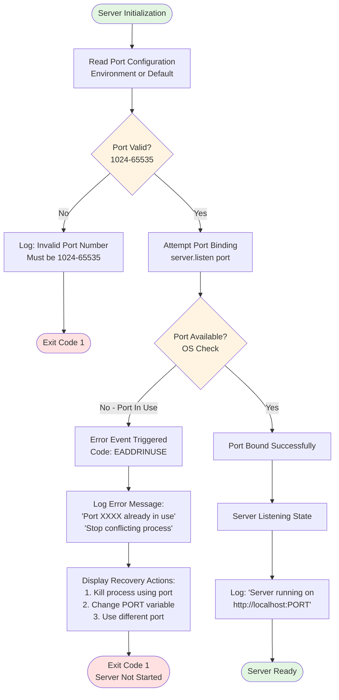
```mermaid
flowchart TD
    Start([Server Initialization]) --> GetPort[Read Port Configuration<br/>Environment or Default]
    GetPort --> Validate{Port Valid?<br/>1024-65535}
    
    Validate -->|No| InvalidPort[Log: Invalid Port Number<br/>Must be 1024-65535]
    InvalidPort --> Exit1([Exit Code 1])
    
    Validate -->|Yes| Bind[Attempt Port Binding<br/>server.listen port]
    Bind --> OSCheck{Port Available?<br/>OS Check}
    
    OSCheck -->|No - Port In Use| ErrorEvent[Error Event Triggered<br/>Code: EADDRINUSE]
    ErrorEvent --> LogError[Log Error Message:<br/>'Port XXXX already in use'<br/>'Stop conflicting process']
    LogError --> ShowHelp[Display Recovery Actions:<br/>1. Kill process using port<br/>2. Change PORT variable<br/>3. Use different port]
    ShowHelp --> Exit2([Exit Code 1<br/>Server Not Started])
    
    OSCheck -->|Yes| Success[Port Bound Successfully]
    Success --> Listening[Server Listening State]
    Listening --> LogSuccess[Log: 'Server running on<br/>http://localhost:PORT']
    LogSuccess --> Ready([Server Ready])
    
    style Start fill:#e1f5e1
    style Ready fill:#e1f5e1
    style Exit1 fill:#ffe1e1
    style Exit2 fill:#ffe1e1
    style Validate fill:#fff4e1
    style OSCheck fill:#fff4e1
```

### 4.4.2 Route Not Found (404) Workflow

The 404 Not Found workflow handles requests to any path other than the registered '/hello' endpoint. This is the standard HTTP error response for requests to non-existent resources.

**Error Scenario**: Client sends HTTP request to any path other than '/hello', such as '/', '/api/users', '/hello/', or '/HELLO'.

**Detection Mechanism**: The routing logic performs exact case-sensitive string matching on the URL path. Any path that does not exactly equal "/hello" triggers the 404 handler.

**Workflow Steps:**

1. **Request Received**: Client HTTP request arrives with path other than '/hello' (e.g., '/api/data').

2. **Request Parsing**: Node.js http module parses the request into a structured object with method, URL, and headers.

3. **Path Extraction**: Routing logic extracts the pathname from `req.url`, separating it from any query string parameters.

4. **Route Matching**: System compares extracted path against registered routes using exact string equality: `path === "/hello"`.

5. **Match Failure**: Comparison returns false for non-matching paths, triggering the 404 handler invocation.

6. **404 Response Generation**: The 404 handler constructs an HTTP response with:
   - Status Code: 404 Not Found
   - Content-Type: text/plain
   - Body: "Not Found" or "404: The requested resource does not exist"

7. **Response Delivery**: The 404 response is sent to the client within 5ms (per requirement F-002-RQ-004), informing the client the requested resource is not available.

8. **Logging (Optional)**: The system may log the 404 event with the requested path for debugging purposes, though logging is not required for the minimal tutorial implementation.

**Client Action**: The HTTP client receives the 404 status code and displays an error message or handles the error according to its error handling logic.

**Examples of 404 Triggers:**
- `GET /` → 404 Not Found
- `GET /hello/` → 404 Not Found (trailing slash)
- `GET /HELLO` → 404 Not Found (case mismatch)
- `GET /api/hello` → 404 Not Found (different path)
- `POST /hello` → 404 or 405 (method mismatch)

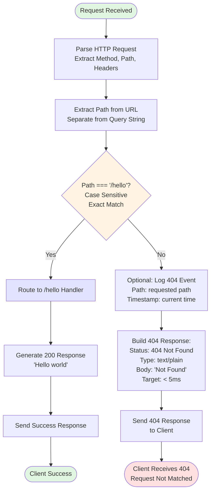
```mermaid
flowchart TD
    Start([Request Received]) --> Parse[Parse HTTP Request<br/>Extract Method, Path, Headers]
    Parse --> ExtractPath[Extract Path from URL<br/>Separate from Query String]
    ExtractPath --> Match{Path === '/hello'?<br/>Case Sensitive<br/>Exact Match}
    
    Match -->|Yes| Success[Route to /hello Handler]
    Success --> Generate200[Generate 200 Response<br/>'Hello world']
    Generate200 --> Send200[Send Success Response]
    Send200 --> End200([Client Success])
    
    Match -->|No| Log404[Optional: Log 404 Event<br/>Path: requested path<br/>Timestamp: current time]
    Log404 --> Build404[Build 404 Response:<br/>Status: 404 Not Found<br/>Type: text/plain<br/>Body: 'Not Found'<br/>Target: < 5ms]
    Build404 --> Send404[Send 404 Response<br/>to Client]
    Send404 --> End404([Client Receives 404<br/>Request Not Matched])
    
    style Start fill:#e1f5e1
    style End200 fill:#e1f5e1
    style End404 fill:#ffe1e1
    style Match fill:#fff4e1
    style Success fill:#e1e5ff
```

### 4.4.3 Graceful Shutdown Workflow

The graceful shutdown workflow ensures the server terminates cleanly when receiving interrupt signals (SIGINT from CTRL+C or SIGTERM from process managers), allowing in-flight requests to complete and releasing resources properly.

**Shutdown Scenario**: Developer presses CTRL+C in the terminal, or a process manager sends SIGTERM signal to gracefully stop the server.

**Detection Mechanism**: Node.js process object emits 'SIGINT' or 'SIGTERM' events when the operating system delivers these signals. The application registers event listeners to handle these shutdown triggers.

**Workflow Steps:**

1. **Signal Reception**: Operating system delivers SIGINT (interrupt signal from terminal) or SIGTERM (termination signal from process manager) to the Node.js process.

2. **Event Emission**: Node.js process emits the corresponding signal event ('SIGINT' or 'SIGTERM'), triggering registered event listeners.

3. **Shutdown Handler Invocation**: The signal event handler executes, beginning the graceful shutdown sequence.

4. **Stop Accepting Connections**: The server calls `server.close()` to stop accepting new incoming connections. The listening socket is closed, preventing new TCP connection attempts.

5. **Wait for Active Connections**: The server allows any currently processing requests to complete their response cycles. For this stateless tutorial server with sub-50ms response times, this wait is minimal.

6. **Resource Cleanup**: Node.js automatically releases allocated resources including:
   - TCP listening socket
   - Memory allocations for request/response objects
   - Event loop timers and callbacks

7. **Shutdown Logging**: The system logs a shutdown confirmation message to the console: "Server shutting down gracefully..." followed by "Server stopped."

8. **Process Exit**: The Node.js process terminates with exit code 0 (success), signaling clean shutdown to the operating system and any monitoring infrastructure.

**Timing Constraint**: Complete shutdown sequence must finish within 1 second (per requirement F-001-RQ-008).

**Error Handling**: If active requests do not complete within the shutdown timeout, the system may force-terminate connections and exit with a warning message.

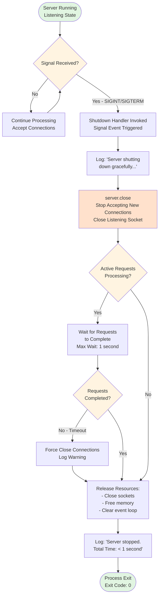
```mermaid
flowchart TD
    Start([Server Running<br/>Listening State]) --> Signal{Signal Received?}
    
    Signal -->|No| Continue[Continue Processing<br/>Accept Connections]
    Continue --> Signal
    
    Signal -->|Yes - SIGINT/SIGTERM| Handler[Shutdown Handler Invoked<br/>Signal Event Triggered]
    Handler --> Log1[Log: 'Server shutting<br/>down gracefully...']
    Log1 --> CloseServer[server.close<br/>Stop Accepting New Connections<br/>Close Listening Socket]
    CloseServer --> CheckActive{Active Requests<br/>Processing?}
    
    CheckActive -->|Yes| Wait[Wait for Requests<br/>to Complete<br/>Max Wait: 1 second]
    Wait --> Timeout{Requests<br/>Completed?}
    
    Timeout -->|No - Timeout| ForceClose[Force Close Connections<br/>Log Warning]
    ForceClose --> Cleanup
    
    Timeout -->|Yes| Cleanup[Release Resources:<br/>- Close sockets<br/>- Free memory<br/>- Clear event loop]
    
    CheckActive -->|No| Cleanup
    
    Cleanup --> Log2[Log: 'Server stopped.<br/>Total Time: < 1 second']
    Log2 --> Exit([Process Exit<br/>Exit Code: 0])
    
    style Start fill:#e1f5e1
    style Exit fill:#e1f5e1
    style Signal fill:#fff4e1
    style CheckActive fill:#fff4e1
    style Timeout fill:#fff4e1
    style CloseServer fill:#ffe1cc
```

## 4.5 INTEGRATION WORKFLOWS

### 4.5.1 Client-Server Interaction Sequence

The client-server interaction represents the complete integration between external HTTP clients and the Node.js server. This sequence diagram captures the message exchanges and timing relationships across the network boundary.

**Participants:**
- **HTTP Client**: Any HTTP/1.1 compliant client (browser, curl, Postman, custom application)
- **TCP/IP Stack**: Operating system network layer managing connection establishment
- **Node.js Server**: Application server listening for connections
- **Route Handler**: Request routing logic within the server
- **Endpoint Handler**: Business logic for the '/hello' endpoint

**Interaction Sequence:**

1. **Connection Establishment (TCP Handshake)**:
   - Client initiates TCP connection to server IP and port
   - Three-way handshake: SYN → SYN-ACK → ACK
   - TCP connection established, ready for HTTP communication
   - Timing: Typically < 1ms for localhost, < 100ms for network

2. **HTTP Request Transmission**:
   - Client sends HTTP GET request over established connection
   - Request format: "GET /hello HTTP/1.1\r\nHost: localhost:3000\r\n\r\n"
   - Server receives request bytes via TCP socket

3. **Request Processing Pipeline**:
   - Server parses HTTP request (< 2ms)
   - Route handler matches path (< 1ms)
   - Endpoint handler executes (< 5ms)
   - Response generated (< 5ms)

4. **HTTP Response Transmission**:
   - Server sends HTTP response over TCP connection
   - Response format: "HTTP/1.1 200 OK\r\nContent-Type: text/plain\r\n\r\nHello world"
   - Client receives response bytes

5. **Connection Persistence**:
   - HTTP/1.1 keep-alive maintains connection for subsequent requests
   - Connection may be reused immediately for additional requests
   - Connection eventually times out or client closes

**Total Interaction Time**: < 50ms for localhost (per requirement F-003-RQ-004)

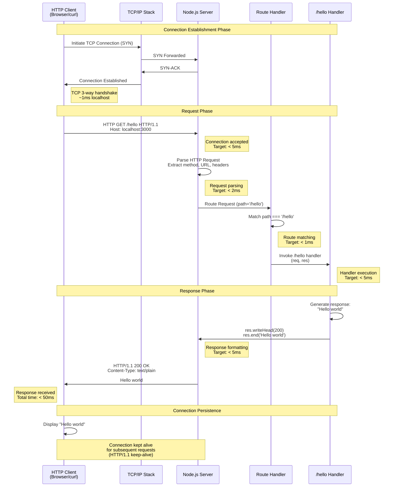
```mermaid
sequenceDiagram
    participant Client as HTTP Client<br/>(Browser/curl)
    participant TCP as TCP/IP Stack
    participant Server as Node.js Server
    participant Router as Route Handler
    participant Handler as /hello Handler
    
    Note over Client,Handler: Connection Establishment Phase
    Client->>TCP: Initiate TCP Connection (SYN)
    TCP->>Server: SYN Forwarded
    Server->>TCP: SYN-ACK
    TCP->>Client: Connection Established
    Note right of Client: TCP 3-way handshake<br/>~1ms localhost
    
    Note over Client,Handler: Request Phase
    Client->>Server: HTTP GET /hello HTTP/1.1<br/>Host: localhost:3000
    Note right of Server: Connection accepted<br/>Target: < 5ms
    
    Server->>Server: Parse HTTP Request<br/>Extract method, URL, headers
    Note right of Server: Request parsing<br/>Target: < 2ms
    
    Server->>Router: Route Request (path='/hello')
    Router->>Router: Match path === '/hello'
    Note right of Router: Route matching<br/>Target: < 1ms
    
    Router->>Handler: Invoke /hello handler<br/>(req, res)
    Note right of Handler: Handler execution<br/>Target: < 5ms
    
    Note over Client,Handler: Response Phase
    Handler->>Handler: Generate response:<br/>"Hello world"
    Handler->>Server: res.writeHead(200)<br/>res.end('Hello world')
    Note right of Server: Response formatting<br/>Target: < 5ms
    
    Server->>Client: HTTP/1.1 200 OK<br/>Content-Type: text/plain<br/><br/>Hello world
    Note left of Client: Response received<br/>Total time: < 50ms
    
    Note over Client,Handler: Connection Persistence
    Client->>Client: Display "Hello world"
    Note over Client,Server: Connection kept alive<br/>for subsequent requests<br/>(HTTP/1.1 keep-alive)
```

### 4.5.2 HTTP Protocol Interaction Flow

This section details the HTTP/1.1 protocol-level interactions between the client and server, emphasizing compliance with RFC 7230 (HTTP/1.1 Message Syntax and Routing) and RFC 7231 (HTTP/1.1 Semantics and Content).

**Protocol Components:**

1. **Request Line**:
   - Method: GET
   - Request-URI: /hello
   - HTTP Version: HTTP/1.1
   - Format: `GET /hello HTTP/1.1`

2. **Request Headers**:
   - Host: localhost:3000 (required in HTTP/1.1)
   - Optional: User-Agent, Accept, Accept-Encoding, Connection

3. **Response Status Line**:
   - HTTP Version: HTTP/1.1
   - Status Code: 200 (Success) or 404 (Not Found)
   - Reason Phrase: "OK" or "Not Found"
   - Format: `HTTP/1.1 200 OK`

4. **Response Headers**:
   - Content-Type: text/plain (explicitly set)
   - Date: Current timestamp (automatically added by Node.js)
   - Connection: keep-alive (HTTP/1.1 default)
   - Content-Length: 11 (length of "Hello world")

5. **Response Body**:
   - Content: "Hello world" encoded in UTF-8
   - Length: 11 bytes

**Protocol Compliance Requirements**:
- HTTP/1.1 persistent connections (keep-alive default behavior)
- Host header validation (required by RFC 7230)
- Proper status code usage (200, 404 per RFC 7231)
- Content-Type header specification
- UTF-8 character encoding for text responses

**Message Flow:**

```
Client Request:
--------------
GET /hello HTTP/1.1
Host: localhost:3000
User-Agent: Mozilla/5.0
Accept: */*

Server Response (Success):
-------------------------
HTTP/1.1 200 OK
Content-Type: text/plain
Date: Mon, 07 Nov 2025 12:00:00 GMT
Connection: keep-alive
Content-Length: 11

Hello world

Server Response (Not Found):
---------------------------
HTTP/1.1 404 Not Found
Content-Type: text/plain
Date: Mon, 07 Nov 2025 12:00:00 GMT
Connection: keep-alive
Content-Length: 9

Not Found
```

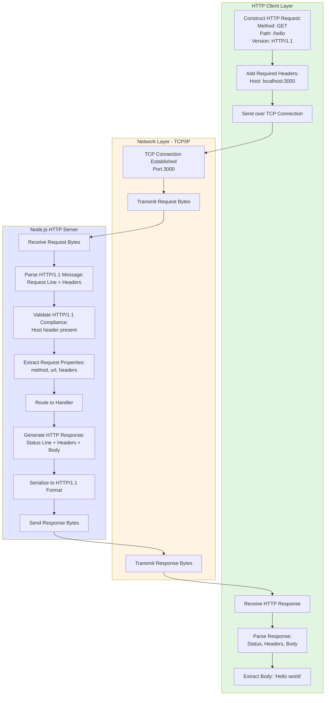
```mermaid
flowchart TD
    subgraph Client[HTTP Client Layer]
        C1[Construct HTTP Request:<br/>Method: GET<br/>Path: /hello<br/>Version: HTTP/1.1]
        C2[Add Required Headers:<br/>Host: localhost:3000]
        C3[Send over TCP Connection]
        C8[Receive HTTP Response]
        C9[Parse Response:<br/>Status, Headers, Body]
        C10[Extract Body: 'Hello world']
    end
    
    subgraph Network[Network Layer - TCP/IP]
        N1[TCP Connection Established<br/>Port 3000]
        N2[Transmit Request Bytes]
        N3[Transmit Response Bytes]
    end
    
    subgraph Server[Node.js HTTP Server]
        S1[Receive Request Bytes]
        S2[Parse HTTP/1.1 Message:<br/>Request Line + Headers]
        S3[Validate HTTP/1.1 Compliance:<br/>Host header present]
        S4[Extract Request Properties:<br/>method, url, headers]
        S5[Route to Handler]
        S6[Generate HTTP Response:<br/>Status Line + Headers + Body]
        S7[Serialize to HTTP/1.1 Format]
        S8[Send Response Bytes]
    end
    
    C1 --> C2
    C2 --> C3
    C3 --> N1
    N1 --> N2
    N2 --> S1
    S1 --> S2
    S2 --> S3
    S3 --> S4
    S4 --> S5
    S5 --> S6
    S6 --> S7
    S7 --> S8
    S8 --> N3
    N3 --> C8
    C8 --> C9
    C9 --> C10
    
    style Client fill:#e1f5e1
    style Server fill:#e1e5ff
    style Network fill:#fff4e1
```

## 4.6 DETAILED PROCESS DIAGRAMS

### 4.6.1 Complete System Workflow with Swim Lanes

This comprehensive diagram presents the entire system workflow using swim lanes to clearly delineate responsibilities across different system actors and components.

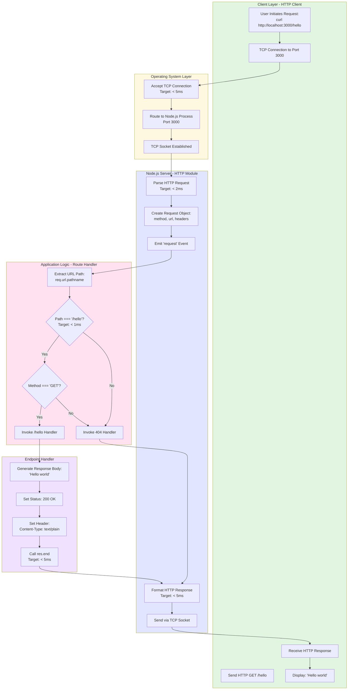
```mermaid
flowchart TD
    subgraph ClientLayer[Client Layer - HTTP Client]
        C1[User Initiates Request:<br/>curl http://localhost:3000/hello]
        C2[TCP Connection to Port 3000]
        C3[Send HTTP GET /hello]
        C10[Receive HTTP Response]
        C11[Display: 'Hello world']
    end
    
    subgraph OSLayer[Operating System Layer]
        O1[Accept TCP Connection<br/>Target: < 5ms]
        O2[Route to Node.js Process<br/>Port 3000]
        O3[TCP Socket Established]
    end
    
    subgraph NodeServer[Node.js Server - HTTP Module]
        N1[Parse HTTP Request<br/>Target: < 2ms]
        N2[Create Request Object:<br/>method, url, headers]
        N3[Emit 'request' Event]
        N4[Format HTTP Response<br/>Target: < 5ms]
        N5[Send via TCP Socket]
    end
    
    subgraph AppLogic[Application Logic - Route Handler]
        A1[Extract URL Path:<br/>req.url.pathname]
        A2{Path === '/hello'?<br/>Target: < 1ms}
        A3{Method === 'GET'?}
        A4[Invoke /hello Handler]
        A5[Invoke 404 Handler]
    end
    
    subgraph EndpointLogic[Endpoint Handler]
        E1[Generate Response Body:<br/>'Hello world']
        E2[Set Status: 200 OK]
        E3[Set Header:<br/>Content-Type: text/plain]
        E4[Call res.end<br/>Target: < 5ms]
    end
    
    C1 --> C2
    C2 --> O1
    O1 --> O2
    O2 --> O3
    O3 --> N1
    N1 --> N2
    N2 --> N3
    N3 --> A1
    A1 --> A2
    
    A2 -->|Yes| A3
    A2 -->|No| A5
    A3 -->|Yes| A4
    A3 -->|No| A5
    
    A4 --> E1
    E1 --> E2
    E2 --> E3
    E3 --> E4
    E4 --> N4
    
    A5 --> N4
    
    N4 --> N5
    N5 --> C10
    C10 --> C11
    
    style ClientLayer fill:#e1f5e1
    style OSLayer fill:#fff8e1
    style NodeServer fill:#e1e5ff
    style AppLogic fill:#ffe1f0
    style EndpointLogic fill:#f0e1ff
```

### 4.6.2 Server Startup Detailed Sequence

This diagram expands the server initialization process to show all validation steps, configuration loading, and error handling paths during startup.

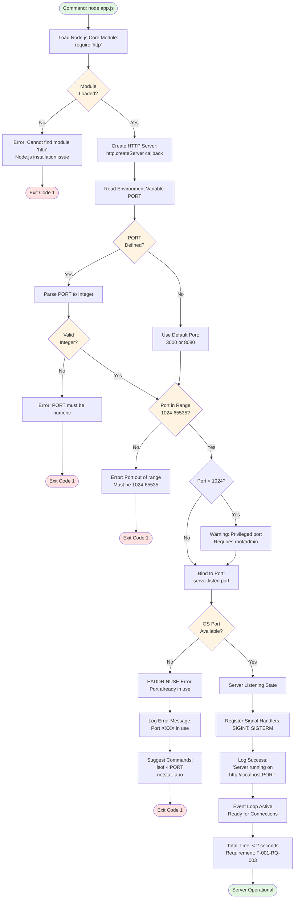
```mermaid
flowchart TD
    Start([Command: node app.js]) --> LoadCore[Load Node.js Core Module:<br/>require 'http']
    LoadCore --> CheckModule{Module<br/>Loaded?}
    
    CheckModule -->|No| ModuleError[Error: Cannot find module 'http'<br/>Node.js installation issue]
    ModuleError --> ExitMod([Exit Code 1])
    
    CheckModule -->|Yes| CreateServer[Create HTTP Server:<br/>http.createServer callback]
    CreateServer --> GetEnv[Read Environment Variable:<br/>PORT]
    GetEnv --> CheckEnv{PORT<br/>Defined?}
    
    CheckEnv -->|No| DefaultPort[Use Default Port:<br/>3000 or 8080]
    CheckEnv -->|Yes| ParsePort[Parse PORT to Integer]
    
    DefaultPort --> ValidatePort
    ParsePort --> CheckValid{Valid<br/>Integer?}
    
    CheckValid -->|No| ParseError[Error: PORT must be numeric]
    ParseError --> ExitParse([Exit Code 1])
    
    CheckValid -->|Yes| ValidatePort{Port in Range<br/>1024-65535?}
    
    ValidatePort -->|No| RangeError[Error: Port out of range<br/>Must be 1024-65535]
    RangeError --> ExitRange([Exit Code 1])
    
    ValidatePort -->|Yes| CheckPrivileged{Port < 1024?}
    CheckPrivileged -->|Yes| PrivilegeWarn[Warning: Privileged port<br/>Requires root/admin]
    PrivilegeWarn --> BindAttempt
    
    CheckPrivileged -->|No| BindAttempt[Bind to Port:<br/>server.listen port]
    BindAttempt --> OSBind{OS Port<br/>Available?}
    
    OSBind -->|No| BindError[EADDRINUSE Error:<br/>Port already in use]
    BindError --> LogBindError[Log Error Message:<br/>Port XXXX in use]
    LogBindError --> ShowCommands[Suggest Commands:<br/>lsof -i:PORT<br/>netstat -ano]
    ShowCommands --> ExitBind([Exit Code 1])
    
    OSBind -->|Yes| ListenSuccess[Server Listening State]
    ListenSuccess --> RegisterSignals[Register Signal Handlers:<br/>SIGINT, SIGTERM]
    RegisterSignals --> LogSuccess[Log Success:<br/>'Server running on<br/>http://localhost:PORT']
    LogSuccess --> EventLoop[Event Loop Active<br/>Ready for Connections]
    EventLoop --> Monitoring[Total Time: < 2 seconds<br/>Requirement: F-001-RQ-003]
    Monitoring --> Ready([Server Operational])
    
    style Start fill:#e1f5e1
    style Ready fill:#e1f5e1
    style ExitMod fill:#ffe1e1
    style ExitParse fill:#ffe1e1
    style ExitRange fill:#ffe1e1
    style ExitBind fill:#ffe1e1
    style CheckModule fill:#fff4e1
    style CheckEnv fill:#fff4e1
    style CheckValid fill:#fff4e1
    style ValidatePort fill:#fff4e1
    style OSBind fill:#fff4e1
```

### 4.6.3 Request Processing with Performance Timing

This flowchart annotates each processing stage with specific performance targets and cumulative timing to demonstrate compliance with the sub-50ms response requirement.

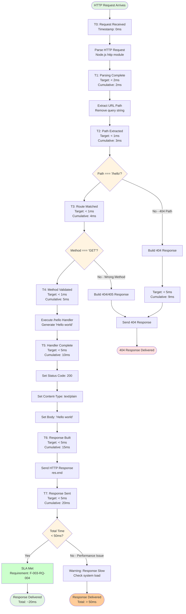
```mermaid
flowchart TD
    Start([HTTP Request Arrives]) --> T0[T0: Request Received<br/>Timestamp: 0ms]
    
    T0 --> Parse[Parse HTTP Request<br/>Node.js http module]
    Parse --> T1[T1: Parsing Complete<br/>Target: < 2ms<br/>Cumulative: 2ms]
    
    T1 --> Extract[Extract URL Path<br/>Remove query string]
    Extract --> T2[T2: Path Extracted<br/>Target: < 1ms<br/>Cumulative: 3ms]
    
    T2 --> RouteMatch{Path === '/hello'?}
    RouteMatch --> T3[T3: Route Matched<br/>Target: < 1ms<br/>Cumulative: 4ms]
    
    T3 --> MethodCheck{Method === 'GET'?}
    MethodCheck --> T4[T4: Method Validated<br/>Target: < 1ms<br/>Cumulative: 5ms]
    
    T4 --> Handler[Execute /hello Handler<br/>Generate 'Hello world']
    Handler --> T5[T5: Handler Complete<br/>Target: < 5ms<br/>Cumulative: 10ms]
    
    T5 --> SetStatus[Set Status Code: 200]
    SetStatus --> SetHeader[Set Content-Type: text/plain]
    SetHeader --> SetBody[Set Body: 'Hello world']
    SetBody --> T6[T6: Response Built<br/>Target: < 5ms<br/>Cumulative: 15ms]
    
    T6 --> Send[Send HTTP Response<br/>res.end]
    Send --> T7[T7: Response Sent<br/>Target: < 5ms<br/>Cumulative: 20ms]
    
    T7 --> Verify{Total Time<br/>< 50ms?}
    Verify -->|Yes| Success[SLA Met<br/>Requirement: F-003-RQ-004]
    Success --> End([Response Delivered<br/>Total: ~20ms])
    
    Verify -->|No - Performance Issue| Warning[Warning: Response Slow<br/>Check system load]
    Warning --> End2([Response Delivered<br/>Total: > 50ms])
    
    RouteMatch -->|No - 404 Path| Build404[Build 404 Response]
    Build404 --> T404[Target: < 5ms<br/>Cumulative: 9ms]
    T404 --> Send404[Send 404 Response]
    Send404 --> End404([404 Response Delivered])
    
    MethodCheck -->|No - Wrong Method| Build405[Build 404/405 Response]
    Build405 --> Send404
    
    style Start fill:#e1f5e1
    style End fill:#e1f5e1
    style End404 fill:#ffe1e1
    style End2 fill:#ffcc99
    style RouteMatch fill:#fff4e1
    style MethodCheck fill:#fff4e1
    style Verify fill:#fff4e1
    style Success fill:#ccffcc
```

### 4.6.4 Comprehensive Error Handling Decision Tree

This decision tree captures all error conditions, detection mechanisms, and recovery paths throughout the system lifecycle.

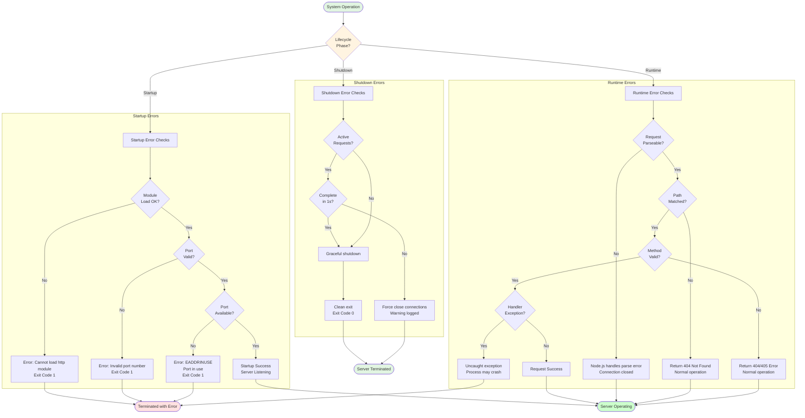
```mermaid
flowchart TD
    Start([System Operation]) --> Phase{Lifecycle<br/>Phase?}
    
    Phase -->|Startup| StartupErrors[Startup Error Checks]
    Phase -->|Runtime| RuntimeErrors[Runtime Error Checks]
    Phase -->|Shutdown| ShutdownErrors[Shutdown Error Checks]
    
    subgraph StartupErrorFlow[Startup Errors]
        StartupErrors --> SE1{Module<br/>Load OK?}
        SE1 -->|No| SE1E[Error: Cannot load http module<br/>Exit Code 1]
        SE1 -->|Yes| SE2{Port<br/>Valid?}
        SE2 -->|No| SE2E[Error: Invalid port number<br/>Exit Code 1]
        SE2 -->|Yes| SE3{Port<br/>Available?}
        SE3 -->|No| SE3E[Error: EADDRINUSE<br/>Port in use<br/>Exit Code 1]
        SE3 -->|Yes| SE4[Startup Success<br/>Server Listening]
    end
    
    subgraph RuntimeErrorFlow[Runtime Errors]
        RuntimeErrors --> RE1{Request<br/>Parseable?}
        RE1 -->|No| RE1E[Node.js handles parse error<br/>Connection closed]
        RE1 -->|Yes| RE2{Path<br/>Matched?}
        RE2 -->|No| RE2E[Return 404 Not Found<br/>Normal operation]
        RE2 -->|Yes| RE3{Method<br/>Valid?}
        RE3 -->|No| RE3E[Return 404/405 Error<br/>Normal operation]
        RE3 -->|Yes| RE4{Handler<br/>Exception?}
        RE4 -->|Yes| RE4E[Uncaught exception<br/>Process may crash]
        RE4 -->|No| RE5[Request Success]
    end
    
    subgraph ShutdownErrorFlow[Shutdown Errors]
        ShutdownErrors --> SHE1{Active<br/>Requests?}
        SHE1 -->|Yes| SHE2{Complete<br/>in 1s?}
        SHE2 -->|No| SHE2E[Force close connections<br/>Warning logged]
        SHE2 -->|Yes| SHE3[Graceful shutdown]
        SHE1 -->|No| SHE3
        SHE3 --> SHE4[Clean exit<br/>Exit Code 0]
    end
    
    SE4 --> OperatingState([Server Operating])
    RE5 --> OperatingState
    SHE4 --> Terminated([Server Terminated])
    
    SE1E --> TerminatedError([Terminated with Error])
    SE2E --> TerminatedError
    SE3E --> TerminatedError
    RE1E --> OperatingState
    RE2E --> OperatingState
    RE3E --> OperatingState
    RE4E --> TerminatedError
    SHE2E --> Terminated
    
    style Start fill:#e1f5e1
    style OperatingState fill:#ccffcc
    style Terminated fill:#e1f5e1
    style TerminatedError fill:#ffe1e1
    style Phase fill:#fff4e1
```

### 4.6.5 State Transition Diagram with Triggers

This comprehensive state machine diagram shows all server states, transition triggers, and timing constraints.

```mermaid
stateDiagram-v2
    [*] --> Uninitialized: Process Starts
    
    Uninitialized --> Created: http.createServer()<br/>Callback registered
    
    Created --> Binding: server.listen(port)<br/>Port binding initiated
    
    Binding --> BindingValidation: Validate port number<br/>Check range 1024-65535
    
    BindingValidation --> BindingOS: Port valid<br/>Request OS to bind
    BindingValidation --> Error: Port invalid<br/>Range error
    
    BindingOS --> Listening: Bind success<br/>Socket opened<br/>Time: < 2 seconds
    BindingOS --> Error: EADDRINUSE<br/>Port in use
    
    Listening --> Processing: Request received<br/>Invoke handler
    Processing --> Listening: Response sent<br/>Handler complete<br/>Time: < 50ms
    
    Listening --> Listening: Multiple concurrent<br/>requests via event loop
    
    Listening --> ShuttingDown: SIGINT/SIGTERM received<br/>Graceful shutdown initiated
    
    ShuttingDown --> ShuttingDownWait: Close listening socket<br/>Wait for active requests
    
    ShuttingDownWait --> Terminated: All requests complete<br/>OR timeout (1 second)<br/>Release resources
    
    Processing --> ShuttingDownWait: Shutdown during request<br/>Complete then exit
    
    Error --> Terminated: Log error message<br/>Exit code 1
    
    Terminated --> [*]: Process exits
    
    note right of Listening
        Primary operational state
        - Event loop active
        - Accepting connections
        - Concurrent request handling
        - Stateless operation
    end note
    
    note right of Processing
        Request handling state
        - Parse: < 2ms
        - Route: < 1ms
        - Execute: < 5ms
        - Respond: < 5ms
        - Total: < 50ms
    end note
    
    note right of Error
        Terminal error states
        - Module load failure
        - Port validation error
        - Port binding error
        - Uncaught exceptions
    end note
```

## 4.7 PERFORMANCE AND TIMING CONSTRAINTS

### 4.7.1 Request Processing Timeline

The request processing timeline breaks down the end-to-end request handling into discrete phases with specific performance targets. These targets ensure the system delivers sub-50ms response times for the '/hello' endpoint under normal operating conditions.

**Performance Budget Allocation:**

| Phase | Operation | Target Time | Cumulative Time | Requirement |
|-------|-----------|-------------|-----------------|-------------|
| 0 | Connection Acceptance | < 5ms | 5ms | F-001-RQ-005 |
| 1 | Request Parsing | < 2ms | 7ms | F-004-RQ-002 |
| 2 | Route Matching | < 1ms | 8ms | F-002-RQ-002 |
| 3 | Method Validation | < 1ms | 9ms | F-002-RQ-007 |
| 4 | Handler Execution | < 5ms | 14ms | F-003-RQ-004 |
| 5 | Response Formatting | < 5ms | 19ms | F-004-RQ-005 |
| 6 | Network Transmission | < 5ms | 24ms | Localhost |
| **Total** | **Complete Request-Response** | **< 50ms** | **24ms** | **F-003-RQ-004** |

**Performance Characteristics:**

1. **Connection Acceptance (< 5ms)**: The operating system and Node.js accept the incoming TCP connection and allocate socket resources. This phase is primarily OS-dependent and benefits from the kernel's optimized networking stack.

2. **Request Parsing (< 2ms)**: Node.js http module parses the raw HTTP request bytes into a structured JavaScript object. This synchronous operation benefits from Node.js's optimized C++ parsing implementation.

3. **Route Matching (< 1ms)**: Simple string comparison operation to match the request path against registered routes. The exact string matching (`path === "/hello"`) completes in constant time O(1).

4. **Method Validation (< 1ms)**: String comparison to verify the HTTP method is GET. Another constant-time operation with negligible overhead.

5. **Handler Execution (< 5ms)**: The endpoint handler prepares the static "Hello world" response. No I/O operations, database queries, or external API calls, ensuring predictable execution time.

6. **Response Formatting (< 5ms)**: Constructing the HTTP response with status code, headers, and body. This involves string concatenation and object property assignment, all synchronous operations.

7. **Network Transmission (< 5ms)**: Transmitting the HTTP response bytes over the TCP socket. For localhost connections, this is extremely fast due to loopback interface optimization.

**Total Performance Buffer**: The system allocates a 50ms SLA with typical execution around 24ms, providing a 26ms buffer (52% margin) to accommodate system load variations, garbage collection pauses, and environmental factors.

**Performance Monitoring Points:**

```mermaid
gantt
    title Request Processing Timeline (Performance Targets)
    dateFormat SSS
    axisFormat %Lms
    
    section Connection
    Connection Accept      :a1, 000, 5ms
    
    section Parsing
    HTTP Parse             :a2, after a1, 2ms
    
    section Routing
    Path Extract & Match   :a3, after a2, 1ms
    Method Validation      :a4, after a3, 1ms
    
    section Execution
    Handler Logic          :a5, after a4, 5ms
    
    section Response
    Response Format        :a6, after a5, 5ms
    Network Transmit       :a7, after a6, 5ms
    
    section SLA
    SLA Boundary (50ms)    :milestone, m1, 050, 0ms
```

### 4.7.2 SLA Considerations and Constraints

The system defines Service Level Agreements (SLAs) for various operational aspects to ensure consistent, predictable performance suitable for a tutorial learning environment.

**Operational SLAs:**

1. **Server Startup SLA**:
   - **Target**: Complete initialization within 2 seconds
   - **Measurement**: Time from `node app.js` execution to "Server running" log message
   - **Requirement**: F-001-RQ-003
   - **Rationale**: Provides immediate feedback to developers, essential for rapid iteration during learning
   - **Failure Conditions**: Port binding errors, module loading issues, invalid configuration
   - **Recovery**: Developer addresses error condition and restarts server

2. **Request Response SLA**:
   - **Target**: Deliver response within 50ms for localhost requests
   - **Measurement**: Time from connection acceptance to complete response transmission
   - **Requirement**: F-003-RQ-004
   - **Rationale**: Ensures instant feedback for interactive testing during tutorial exercises
   - **Acceptable Variation**: ±10ms for system load fluctuations
   - **Monitoring**: None (tutorial project does not include monitoring infrastructure)

3. **404 Response SLA**:
   - **Target**: Return 404 Not Found within 5ms
   - **Measurement**: Time from route matching failure to response transmission
   - **Requirement**: F-002-RQ-004
   - **Rationale**: Error responses should be even faster than successful responses due to minimal processing
   - **Implementation**: 404 handler has no business logic, only response formatting

4. **Graceful Shutdown SLA**:
   - **Target**: Complete shutdown sequence within 1 second
   - **Measurement**: Time from SIGINT/SIGTERM reception to process termination
   - **Requirement**: F-001-RQ-008
   - **Rationale**: Enables rapid restart cycles during development without waiting for cleanup
   - **Behavior**: If active requests exceed 1 second, force close with warning

5. **Concurrent Request Handling SLA**:
   - **Target**: Handle 10-20 concurrent connections without degradation
   - **Measurement**: Simultaneous active requests maintaining < 50ms response time
   - **Rationale**: Demonstrates Node.js event loop concurrency for educational purposes
   - **Limitation**: Beyond 20 concurrent requests, response times may increase due to event loop saturation

**SLA Exclusions (Out of Scope)**:

- Network latency beyond localhost (WAN/Internet latency not controlled by application)
- System resource exhaustion (CPU, memory constraints on host machine)
- Third-party service dependencies (none exist in this implementation)
- Data persistence operations (no database or file I/O in this tutorial)
- Authentication/authorization overhead (no security mechanisms implemented)

**Performance Degradation Factors**:

The following factors may cause SLA violations in real-world deployments (though unlikely in tutorial localhost environment):

1. **Garbage Collection Pauses**: Node.js garbage collector may pause execution for 10-100ms during heap cleanup, though unlikely with minimal memory allocation
2. **Operating System Scheduling**: CPU scheduler may deprioritize Node.js process under heavy system load
3. **Port Exhaustion**: Operating system may run out of available ports under extreme concurrent connection scenarios
4. **Event Loop Blocking**: Hypothetical synchronous blocking code (not present in tutorial) would prevent request processing
5. **Hardware Limitations**: Running on severely resource-constrained hardware (< 512MB RAM, single-core CPU)

**Validation Approach**:

Performance validation for tutorial purposes can be conducted using:

```bash
# Single request latency test
time curl http://localhost:3000/hello

#### Concurrent request test (requires Apache Bench)
ab -n 1000 -c 10 http://localhost:3000/hello

#### Sustained load test (requires 'hey')
hey -n 10000 -c 20 http://localhost:3000/hello
```

Expected results:
- Average response time: 5-25ms (localhost)
- 95th percentile: < 40ms
- 99th percentile: < 50ms
- No failed requests under normal conditions

## 4.8 REFERENCES

### 4.8.1 Files and Folders Examined

**Files**:
- `README.md` - Repository title marker ("# 7thNov_1"); contains no implementation details or source code

**Folders**:
- `""` (root directory, depth: 0) - Contains only README.md; no source code files present in repository

**Note**: The repository currently contains no implementation. All process flows are based on the planned architecture documented in the Technical Specification sections listed below.

### 4.8.2 Technical Specification Sections Retrieved

The following Technical Specification sections were retrieved and analyzed to document the process flowcharts:

1. **Section 1.2 System Overview** - Complete system architecture, component descriptions (HTTP Server Instance, Route Handler, Endpoint Handler), request-response flow diagrams, and success criteria
   
2. **Section 2.1 Feature Catalog** - Four core features (F-001: HTTP Server Setup, F-002: Request Routing, F-003: Hello Endpoint, F-004: Response Handling) with detailed descriptions, dependencies, and technical context

3. **Section 2.2 Functional Requirements** - Detailed requirements for all features including acceptance criteria, technical specifications, validation rules, and performance targets (F-001-RQ-001 through F-004-RQ-006)

4. **Section 2.4 Implementation Considerations** - Technical constraints, performance requirements (startup time, response latency, concurrent connections), scalability considerations, and security implications for each feature

5. **Section 2.6 Assumptions and Constraints** - Environmental assumptions (Node.js runtime, localhost deployment), user assumptions (beginner developers), technical constraints (core modules only, single file implementation), educational constraints, and operational constraints

6. **Section 3.1 Overview** - Technology stack philosophy emphasizing minimalism, architecture approach using Node.js core modules, and educational design principles

7. **Section 3.11 HTTP Protocol Compliance** - HTTP/1.1 compliance details including protocol version, supported methods, status codes, headers, message format, and standards references (RFC 7230: Message Syntax and Routing, RFC 7231: Semantics and Content)

### 4.8.3 Requirements Referenced

The following functional requirements were explicitly referenced in the process flowcharts with their associated timing constraints:

- **F-001-RQ-003**: Server startup must complete within 2 seconds
- **F-001-RQ-005**: Connection acceptance must complete within 5ms
- **F-001-RQ-008**: Graceful shutdown must complete within 1 second
- **F-002-RQ-002**: Route matching must complete within 1ms
- **F-002-RQ-004**: 404 response must be generated within 5ms
- **F-002-RQ-007**: Method validation must complete within 1ms
- **F-003-RQ-004**: Handler execution and total response time must be under 50ms for localhost
- **F-004-RQ-002**: Request parsing must complete within 2ms
- **F-004-RQ-005**: Response formatting must complete within 5ms

### 4.8.4 User Context Incorporation

**User Request**: "Can you create a nodejs tutorial project that features one end point '/hello' that returns 'Hello world' to the calling HTTP client?"

This user context has been comprehensively integrated throughout the Process Flowchart section by:

1. Emphasizing the **educational purpose** of all workflows and diagrams
2. Highlighting the **single endpoint** architecture ('/hello' only) in all process flows
3. Documenting the **exact response** ("Hello world") in handler execution diagrams
4. Focusing on **simplicity and clarity** appropriate for tutorial content
5. Explaining **HTTP fundamentals** through detailed protocol interaction flows
6. Providing **clear decision points** suitable for beginners learning server development
7. Including **timing constraints** that ensure instant feedback during tutorial exercises
8. Demonstrating **Node.js core capabilities** without external dependencies

All process workflows documented in this section directly support the tutorial objective of teaching HTTP server fundamentals through a minimal, focused implementation.

# 5. System Architecture

## 5.1 HIGH-LEVEL ARCHITECTURE

### 5.1.1 System Overview

The 7thNov_1 project implements a minimalist, single-file Node.js HTTP server architecture designed specifically for educational purposes. This tutorial system demonstrates fundamental HTTP server concepts through the simplest viable implementation, prioritizing conceptual clarity over production-grade complexity.

**Architecture Style and Rationale**

The system adopts a monolithic, single-file architecture that consolidates all server logic into one JavaScript file (`app.js`). This architectural decision stems from the project's educational mission: to teach HTTP fundamentals without the distraction of module systems, dependency management, or framework abstractions. The implementation utilizes only Node.js core modules, eliminating external dependencies and build steps entirely.

The architecture follows an event-driven, non-blocking I/O model inherent to Node.js, where a single-threaded event loop manages all connection handling, request processing, and response delivery. This design naturally demonstrates Node.js's asynchronous capabilities while maintaining synchronous logic flow for code readability.

**Key Architectural Principles**

1. **Simplicity First**: Every architectural decision prioritizes beginner comprehension over scalability, performance optimization, or production features. The system intentionally excludes logging frameworks, monitoring systems, configuration management, and middleware layers.

2. **Zero Abstraction**: The implementation exposes raw Node.js HTTP primitives directly, allowing learners to observe request parsing, header manipulation, and response construction without framework abstractions hiding these details.

3. **Immediate Execution**: The architecture requires no compilation, transpilation, bundling, or build steps. Developers execute the server directly via `node app.js`, producing immediate results within 2 seconds of startup.

4. **Stateless Operation**: The system maintains no session state, user data, or persistent storage. Each request-response cycle is completely independent, demonstrating pure HTTP request-response semantics without database or caching complexity.

5. **Foundation Focus**: The architecture serves as a learning foundation that students can incrementally extend, adding features like additional routes, request body parsing, or database integration as their understanding deepens.

**System Boundaries**

The system operates within clearly defined boundaries that establish its scope and interfaces:

- **Internal Boundary**: All server logic resides within a single JavaScript file, with no module separation or code splitting. The codebase intentionally avoids object-oriented abstractions or functional programming patterns that might obscure the request-response flow.

- **External Boundary**: The system exposes a single HTTP interface accepting requests from any HTTP/1.1-compliant client (web browsers, curl, Postman, etc.). No GraphQL, WebSocket, or other protocol support is included.

- **Technology Boundary**: The implementation operates exclusively within the Node.js runtime environment (v12.0.0 or higher), utilizing only built-in core modules. No npm packages, external libraries, or native addons are permitted.

- **Operational Boundary**: The system is designed for localhost development environments only, not for deployment to staging servers, production infrastructure, or cloud platforms.

```mermaid
graph TB
    subgraph External_Clients["External HTTP Clients"]
        Browser["Web Browser"]
        CLI["Command Line Tools<br/>(curl, wget)"]
        API["API Testing Tools<br/>(Postman, Insomnia)"]
    end
    
    subgraph NodeJS_Runtime["Node.js Runtime Environment"]
        subgraph AppJS["app.js (Single File)"]
            Server["HTTP Server Instance<br/>(F-001)"]
            Router["Route Handler<br/>(F-002)"]
            Handler["'/hello' Endpoint<br/>(F-003)"]
            Protocol["Request-Response<br/>Processing (F-004)"]
        end
    end
    
    subgraph OS_Layer["Operating System Layer"]
        TCP["TCP/IP Stack"]
        Port["Port 3000/8080<br/>Binding"]
    end
    
    Browser -->|HTTP/1.1 GET Request| Server
    CLI -->|HTTP/1.1 GET Request| Server
    API -->|HTTP/1.1 GET Request| Server
    
    Server -->|Parse Request| Protocol
    Protocol -->|Extract Path & Method| Router
    Router -->|Match '/hello'| Handler
    Handler -->|Generate Response| Protocol
    Protocol -->|Format HTTP Response| Server
    
    Server <-->|Bind/Listen| Port
    Port <-->|Network Socket| TCP
    
    Server -->|HTTP/1.1 Response| Browser
    Server -->|HTTP/1.1 Response| CLI
    Server -->|HTTP/1.1 Response| API
```

### 5.1.2 Core Components

The system architecture comprises four tightly integrated components, each implementing a critical feature of the HTTP server functionality. These components operate sequentially during request processing, with each layer building upon the foundation provided by its predecessors.

| Component Name | Primary Responsibility | Key Dependencies | Integration Points |
|----------------|------------------------|------------------|-------------------|
| HTTP Server Instance<br/>(F-001) | Initialize and manage server lifecycle, accept TCP connections, handle graceful shutdown | Node.js `http` module, OS TCP/IP stack | Binds to port 3000/8080, receives requests from all network clients, invokes route handler for each request |
| Route Handling System<br/>(F-002) | Parse URL paths, perform route matching, validate HTTP methods, direct requests to handlers | HTTP Server Instance, request URL and method properties | Receives parsed request objects, invokes endpoint handlers for matched routes, generates 404 responses for unmatched paths |
| /hello Endpoint Implementation<br/>(F-003) | Generate "Hello world" response, set HTTP status and headers, deliver response body | Route Handling System, response object APIs | Called when path='/hello' and method='GET', constructs complete HTTP response with status 200 and Content-Type: text/plain |
| Request-Response Processing<br/>(F-004) | Parse incoming HTTP requests, manage headers and body, format outgoing responses, ensure protocol compliance | Node.js HTTP protocol implementation | Automatic parsing by http module, provides request/response objects to other components, handles HTTP/1.1 keep-alive semantics |

**Component Interaction Model**

The four components interact through a layered, unidirectional flow model:

1. **HTTP Server Instance** (foundation layer) accepts incoming connections and creates request/response object pairs
2. **Request-Response Processing** (protocol layer) parses raw HTTP data into structured JavaScript objects
3. **Route Handling System** (routing layer) examines request properties and determines handler invocation
4. **Endpoint Implementation** (application layer) generates business logic responses (the "Hello world" string)

Each layer operates with minimal coupling, communicating exclusively through the request and response objects provided by Node.js. This architectural separation allows learners to understand each layer's responsibility independently while observing how they compose into a complete HTTP server.

### 5.1.3 Data Flow

The system implements a synchronous, stateless data flow pattern where each HTTP request follows an identical processing pipeline from connection acceptance through response delivery.

**Primary Request-Response Flow**

The complete request-response cycle executes in under 50 milliseconds for localhost connections, progressing through seven distinct phases:

1. **Connection Establishment (< 5ms)**: An HTTP client initiates a TCP connection to the server's listening port. The operating system accepts the connection and notifies the Node.js event loop through the `http.Server` instance. Node.js allocates socket resources and prepares to receive HTTP data.

2. **Request Parsing (< 2ms)**: The Node.js `http` module receives raw HTTP bytes from the TCP socket and parses them into a structured `http.IncomingMessage` object. This automatic parsing extracts the HTTP method, URL path, protocol version, headers, and any request body, making them accessible as JavaScript object properties.

3. **Route Resolution (< 1ms)**: The route handling system extracts the URL path from the request object using `req.url` and performs exact string comparison against the registered routes. For this system, only one route exists: `path === "/hello"` using case-sensitive matching. The comparison operates in constant time O(1) with sub-millisecond execution.

4. **Method Validation (< 1ms)**: Once the path matches, the system validates that the HTTP method is `GET` by examining `req.method`. This string comparison ensures only appropriate HTTP verbs access each endpoint, demonstrating proper REST semantics.

5. **Handler Execution (< 5ms)**: The matched endpoint handler executes, generating the static response string "Hello world". No I/O operations, database queries, file system access, or external API calls occur during this phase, ensuring predictable sub-5ms execution time.

6. **Response Formatting (< 5ms)**: The handler constructs the HTTP response by invoking `res.writeHead(200, { 'Content-Type': 'text/plain' })` to set status and headers, then calls `res.end('Hello world')` to complete the response with the body content. Node.js formats these into a properly structured HTTP/1.1 response.

7. **Response Delivery (< 5ms)**: The formatted HTTP response transmits to the client over the established TCP connection. For localhost connections, the loopback interface delivers responses in microseconds. The Node.js http module manages connection persistence according to HTTP/1.1 keep-alive semantics.

**Data Transformation Points**

The system performs minimal data transformation, maintaining simplicity throughout the request-response cycle:

- **Raw HTTP Bytes → Structured Request Object**: The Node.js `http` module automatically converts incoming TCP stream data into JavaScript objects with properties like `method`, `url`, and `headers`. This transformation is invisible to the application code, handled entirely by Node.js internals.

- **URL String → Path Component**: The routing system extracts the path portion from the full URL (e.g., "http://localhost:3000/hello" becomes "/hello"). No query string parsing, fragment handling, or URL decoding is required for this minimal implementation.

- **Static String → HTTP Response**: The endpoint handler converts the JavaScript string "Hello world" into a complete HTTP response including status line, headers, and body. This involves string concatenation and protocol formatting performed by Node.js response methods.

- **Response Object → TCP Bytes**: The Node.js `http` module serializes the response object back into raw HTTP protocol bytes for transmission over the TCP socket. This transformation ensures proper HTTP/1.1 formatting with correct line endings, header formatting, and body encoding.

**Data Stores and Caching**

The architecture intentionally excludes all forms of data persistence and caching:

- **No Database**: No relational databases (PostgreSQL, MySQL), document stores (MongoDB), key-value stores (Redis), or any other persistence layer exists. Every response is generated fresh from static code.

- **No File System Access**: The system does not read configuration files, load templates, or access any file system resources during request processing (beyond the initial `app.js` loading at startup).

- **No In-Memory Caching**: No caching layer stores previous responses or computed values. Each request executes the complete handler logic independently.

- **No Session State**: No cookies, session identifiers, or user state tracking occurs. The server cannot distinguish between requests from different clients or remember previous interactions.

This stateless design ensures complete request independence, making the system's behavior perfectly predictable and easy to understand for learners.

```mermaid
sequenceDiagram
    participant Client as HTTP Client
    participant OS as Operating System<br/>TCP/IP Stack
    participant Server as HTTP Server<br/>Instance (F-001)
    participant Protocol as Request-Response<br/>Processing (F-004)
    participant Router as Route Handler<br/>(F-002)
    participant Handler as /hello Endpoint<br/>(F-003)
    
    Note over Client,Handler: Total End-to-End: < 50ms
    
    Client->>OS: TCP SYN (Connection Request)
    OS->>Server: Accept Connection (< 5ms)
    
    Client->>Server: HTTP GET /hello
    Server->>Protocol: Parse HTTP Request (< 2ms)
    
    Protocol->>Router: Extract Path & Method (< 1ms)
    Router->>Router: Match Path="/hello" (< 1ms)
    Router->>Router: Validate Method=GET (< 1ms)
    
    Router->>Handler: Invoke Handler (matched)
    Handler->>Handler: Generate "Hello world" (< 5ms)
    Handler->>Protocol: Return Response Data
    
    Protocol->>Server: Format HTTP Response (< 5ms)
    Server->>Client: HTTP 200 OK + Body (< 5ms)
    
    Note over Client,Handler: Request Complete: ~24ms typical
```

### 5.1.4 External Integration Points

The system maintains minimal external integrations, reflecting its educational focus and localhost deployment model. All integrations occur through standard protocols without requiring API keys, authentication, or service registration.

| System Name | Integration Type | Data Exchange Pattern | Protocol/Format |
|-------------|------------------|----------------------|----------------|
| HTTP Clients | Synchronous Request/Response | Client-initiated GET requests to /hello endpoint | HTTP/1.1, text/plain response body |
| Operating System | Port Binding & Network Stack | Server binds to TCP port, OS manages socket connections | TCP/IP on port 3000 (primary) or 8080 (alternative) |
| Node.js Runtime | Execution Environment | JavaScript code execution and core module access | ECMAScript 2015+ with Node.js v12.0.0+ APIs |
| Console/Terminal | Logging Output | Server writes status messages to stdout/stderr | Plaintext console output for startup and errors |

**HTTP Client Integration**

The primary external integration occurs with HTTP clients that send requests to the server's `/hello` endpoint:

- **Integration Type**: Synchronous request-response over HTTP/1.1 protocol
- **Client Types**: Web browsers (Chrome, Firefox, Safari), command-line tools (curl, wget), API testing applications (Postman, Insomnia)
- **Data Exchange**: Clients send GET requests with no request body or special headers; server responds with 200 OK status, "text/plain" Content-Type, and "Hello world" body
- **Error Scenarios**: Unmatched paths receive 404 responses; non-GET methods may receive 404 (routing layer does not distinguish method mismatches from path mismatches)
- **Performance SLA**: Server commits to < 50ms response time for localhost connections, ensuring immediate feedback during interactive testing

**Operating System Integration**

The server integrates with the operating system's TCP/IP networking stack for port binding and connection management:

- **Port Binding**: Server attempts to bind to port 3000 by default, with port 8080 as common alternative. Binding failures generate EADDRINUSE errors logged to console.
- **TCP Socket Management**: Operating system manages TCP connection establishment, keep-alive timers, and connection teardown according to OS-specific networking configuration.
- **Resource Allocation**: OS allocates file descriptors, socket buffers, and network resources for each connection. Tutorial assumes sufficient resources exist (no limits on development machines).
- **Signal Handling**: Server registers handlers for SIGINT (CTRL+C) and SIGTERM signals, coordinating graceful shutdown with the OS process manager.

**Node.js Runtime Integration**

The server depends on the Node.js runtime environment for JavaScript execution and core module access:

- **Version Compatibility**: Requires Node.js v12.0.0 or higher to ensure availability of modern JavaScript features and stable `http` module APIs
- **Core Modules**: Accesses the `http` module for server functionality; no third-party npm packages permitted by design
- **Event Loop**: Relies on Node.js event loop for non-blocking I/O, connection multiplexing, and asynchronous operation without explicit threading
- **Platform Support**: Node.js runtime provides cross-platform compatibility across Windows 7+, macOS 10.10+, and Linux distributions

**Console Integration**

The server outputs status messages to the terminal for developer feedback:

- **Startup Confirmation**: Logs "Server is running on http://localhost:[PORT]" within 2 seconds of startup, confirming successful initialization
- **Error Messages**: Outputs clear error messages for port binding failures, including port number and suggested remediation steps
- **Shutdown Messages**: Logs "Server shutting down gracefully..." and "Server stopped." during SIGINT/SIGTERM handling

**Integration Exclusions**

The architecture explicitly excludes several common integration types to maintain tutorial simplicity:

- **No Database Integration**: No connections to PostgreSQL, MySQL, MongoDB, or any persistence layer
- **No External APIs**: No HTTP client functionality for calling third-party services or microservices
- **No Message Queues**: No RabbitMQ, Kafka, or other asynchronous messaging systems
- **No Monitoring Services**: No Datadog, New Relic, or APM platform integration
- **No Load Balancers**: No nginx, HAProxy, or cloud load balancer configuration
- **No Cloud Platforms**: No AWS, Azure, GCP, or Heroku deployment integration

These exclusions align with the project's constraint of "No External Services: No API keys, external service registration, or third-party accounts" documented in the assumptions and constraints.

## 5.2 COMPONENT DETAILS

### 5.2.1 HTTP Server Foundation (F-001)

**Purpose and Responsibilities**

The HTTP Server Foundation component establishes the core infrastructure for accepting and managing HTTP connections. This foundational component initializes the Node.js HTTP server instance, binds to a network port, listens for incoming TCP connections, and manages the complete server lifecycle from startup through graceful shutdown.

As the entry point for all HTTP communication, this component provides the event-driven architecture upon which all request processing occurs. It demonstrates Node.js's built-in HTTP capabilities without framework abstractions, allowing learners to observe server initialization, connection management, and event handling directly.

**Technologies and Frameworks**

The component utilizes exclusively Node.js built-in capabilities:

- **Runtime Environment**: Node.js v12.0.0 or higher (LTS v16.x or v18.x recommended for long-term support)
- **Core Module**: Node.js `http` module (built-in, no npm installation required)
- **Language Features**: JavaScript ES6+ including `const/let` declarations, arrow functions, template literals
- **Import Method**: CommonJS `require()` syntax: `const http = require('http');`
- **No External Dependencies**: Zero npm packages, no Express.js, Koa, Fastify, or other web frameworks

**Key Interfaces and APIs**

The component exposes and consumes several critical Node.js APIs:

1. **Server Creation**: `http.createServer(requestHandler)` - Creates an HTTP server instance with a callback function that receives `(req, res)` for each request

2. **Port Binding**: `server.listen(port, hostname, callback)` - Binds server to specified port (default 3000 or 8080) on localhost interface

3. **Event Listeners**:
   - `server.on('listening', callback)` - Fires when server successfully binds to port and begins accepting connections
   - `server.on('error', callback)` - Handles port binding failures (EADDRINUSE) and other server errors
   - `server.on('close', callback)` - Fires when server stops accepting connections

4. **Graceful Shutdown**: `server.close(callback)` - Stops accepting new connections while allowing active requests to complete

5. **Signal Handling**:
   - `process.on('SIGINT', handler)` - Captures CTRL+C interrupts for graceful shutdown
   - `process.on('SIGTERM', handler)` - Handles termination signals from process managers

**Data Persistence Requirements**

This component maintains no persistent data:

- **Stateless Operation**: Server state exists only in memory during process execution; no session stores, user databases, or configuration files
- **No Configuration Files**: All configuration (port number) can be provided via environment variables or hardcoded constants
- **Memory Footprint**: Typical idle server consumes < 50MB RAM with minimal heap allocation
- **Process Restart**: Complete state reset occurs on each `node app.js` execution; no state recovery or migration needed

**Scaling Considerations**

The architecture intentionally limits scaling capabilities to maintain educational focus:

- **Single Process**: Runs as one Node.js process without clustering, worker threads, or multi-process architecture
- **Single Port Binding**: Binds to one port only; no horizontal scaling across multiple ports or load balancing
- **Concurrent Connections**: Event-driven I/O allows 10-20 simultaneous connections on entry-level hardware without performance degradation
- **Vertical Scaling**: Performance limited by single-threaded JavaScript execution; CPU-intensive operations would block event loop (none exist in this implementation)
- **No Horizontal Scaling**: Not designed for multi-instance deployment behind load balancers or service meshes
- **Educational Scaling Model**: Demonstrates Node.js event loop efficiency for handling concurrent I/O without thread overhead

```mermaid
stateDiagram-v2
    [*] --> Initializing: node app.js executed
    
    Initializing --> Binding: http.createServer() called
    Binding --> Listening: server.listen() succeeds
    Binding --> Error: EADDRINUSE or port unavailable
    
    Listening --> Processing: Accept incoming connections
    Processing --> Processing: Handle requests (event loop)
    Processing --> Shutting_Down: SIGINT/SIGTERM received
    
    Shutting_Down --> Closing: server.close() called
    Closing --> Stopped: Active connections completed
    Stopped --> [*]: Process exits (code 0)
    
    Error --> [*]: Process exits (code 1)
    
    note right of Listening
        < 2 seconds from start
        Log: "Server is running on..."
    end note
    
    note right of Processing
        Concurrent connections: 10-20
        Response time: < 50ms
    end note
    
    note right of Shutting_Down
        < 1 second shutdown timeout
        Graceful connection cleanup
    end note
```

### 5.2.2 Route Handling System (F-002)

**Purpose and Responsibilities**

The Route Handling System implements URL path mapping and HTTP method validation, serving as the decision layer that directs incoming requests to appropriate handler functions. This component extracts the URL path from request objects, performs exact string matching against registered routes, validates HTTP methods, and either invokes the corresponding endpoint handler or generates 404 Not Found responses.

For this tutorial implementation, the routing system handles exactly one route (`/hello`) with GET method support, deliberately avoiding complex pattern matching, regular expressions, or routing libraries to maintain conceptual clarity.

**Technologies and Frameworks**

The component uses only JavaScript primitives and Node.js request object properties:

- **String Operations**: Native JavaScript string comparison using strict equality (`===`)
- **Request Properties**: Access to `req.url` (full URL path) and `req.method` (HTTP verb string)
- **No Routing Libraries**: No Express Router, Koa Router, or find-my-way; pure conditional logic
- **Path Matching**: Exact string matching without regex, wildcards, or parameterized routes
- **Case Sensitivity**: All path comparisons are case-sensitive (`/hello` ≠ `/Hello`)

**Key Interfaces and APIs**

The routing system interfaces with request and response objects:

**Input Interfaces**:
- `req.url` (string): Complete URL path including query string (e.g., "/hello" or "/hello?param=value")
- `req.method` (string): HTTP method in uppercase (e.g., "GET", "POST", "PUT")

**Output Behaviors**:
- **Matched Route**: Invokes handler function with `(req, res)` parameters
- **Unmatched Route**: Generates 404 response with `res.writeHead(404)` and `res.end('Not Found')`
- **Method Mismatch**: Treated identically to unmatched route (404 response)

**Routing Logic**:
```javascript
// Conceptual routing implementation (not actual code)
if (req.url === '/hello' && req.method === 'GET') {
    // Invoke hello endpoint handler
} else {
    // Generate 404 Not Found response
}
```

**Data Persistence Requirements**

The routing system maintains no persistent state:

- **Stateless Routing**: Each request evaluation is independent; no route caching or request history
- **Static Route Table**: Route definitions exist in source code only; no dynamic route registration
- **No Middleware State**: No session tracking, authentication state, or request context propagation

**Scaling Considerations**

Routing performance scales optimally due to minimal complexity:

- **O(1) Complexity**: Single route exact match completes in constant time regardless of request volume
- **Sub-Millisecond Execution**: Route matching target of < 1ms achieved through simple string comparison
- **No Regex Overhead**: Absence of regular expression parsing eliminates backtracking and performance variability
- **Synchronous Operation**: No asynchronous operations or I/O during routing decisions
- **Memory Efficiency**: No route caching, trie data structures, or routing tables in memory

**Extension Considerations**

While the current implementation supports only `/hello`, the routing pattern can be extended for advanced tutorials:

- **Multiple Routes**: Additional `if/else if` conditions for routes like `/goodbye`, `/status`
- **Parameterized Routes**: Manual path parsing for patterns like `/users/:id`
- **Query String Handling**: URL parsing to extract query parameters using `new URL(req.url, 'http://localhost')`
- **Method Routing**: Separate handlers for GET, POST, PUT, DELETE on same path
- **Route Modules**: External route handler files imported via `require()` for organization

### 5.2.3 /hello Endpoint Implementation (F-003)

**Purpose and Responsibilities**

The `/hello` endpoint implementation delivers the core tutorial functionality: responding to HTTP GET requests with a plain text "Hello world" message. This component represents the application logic layer, demonstrating how servers generate responses, set HTTP status codes, configure headers, and deliver content to clients.

As the only business logic in the system, this endpoint serves as the focal point for understanding HTTP response construction, Content-Type negotiation, and successful request completion.

**Technologies and Frameworks**

The endpoint uses pure Node.js response APIs with no framework assistance:

- **Response Methods**: Node.js `http.ServerResponse` object methods
- **Content Type**: Plain text (`text/plain`) with UTF-8 encoding
- **Status Codes**: HTTP 200 OK for successful responses
- **Body Content**: Static string literal "Hello world" (no templating or dynamic generation)

**Key Interfaces and APIs**

The endpoint handler utilizes Node.js response object methods:

1. **Set Status and Headers**: `res.writeHead(statusCode, headers)`
   - Status Code: `200` (OK)
   - Headers Object: `{ 'Content-Type': 'text/plain' }`
   - Alternative: `res.setHeader('Content-Type', 'text/plain')` then `res.statusCode = 200`

2. **Complete Response**: `res.end(body)`
   - Body Content: String `"Hello world"`
   - Effect: Signals response completion, flushes data to client, closes response stream
   - Alternative: `res.write('Hello world')` followed by `res.end()`

3. **Response Object Properties**:
   - `res.statusCode`: Numeric HTTP status code (200, 404, etc.)
   - `res.headersSent`: Boolean indicating if headers already transmitted
   - `res.finished`: Boolean indicating if response completion occurred

**Data Persistence Requirements**

The endpoint maintains zero persistent data:

- **Static Response**: "Hello world" string is hardcoded; no database lookups, file reads, or API calls
- **No State Modification**: Endpoint performs no writes to databases, caches, or file systems
- **Pure Function**: Same input (GET request to /hello) always produces identical output (200 + "Hello world")
- **No Side Effects**: No logging to files, metrics collection, or external service notifications

**Scaling Considerations**

The endpoint achieves optimal performance through minimal operations:

- **Sub-5ms Execution**: Handler target of < 5ms execution time met through zero I/O operations
- **No Blocking Calls**: No `fs.readFileSync()`, `crypto.pbkdf2Sync()`, or other synchronous blocking operations
- **Minimal Memory**: Response string occupies ~11 bytes in memory (UTF-8 encoding of "Hello world")
- **CPU Efficiency**: No JSON serialization, template rendering, or computation required
- **Concurrent Safety**: Stateless design allows unlimited concurrent invocations without race conditions

**Response Characteristics**

The endpoint generates responses with specific characteristics:

| Characteristic | Value | Requirement |
|----------------|-------|-------------|
| HTTP Status | 200 OK | F-003-RQ-001 |
| Content-Type Header | text/plain | F-003-RQ-002 |
| Response Body | "Hello world" (11 bytes) | F-003-RQ-003 |
| Execution Time | < 5ms | F-003-RQ-004 |

```mermaid
sequenceDiagram
    participant Router as Route Handler<br/>(F-002)
    participant Handler as /hello Endpoint<br/>Handler (F-003)
    participant Response as HTTP Response<br/>Object
    participant Client as HTTP Client
    
    Router->>Handler: Invoke handler(req, res)
    activate Handler
    
    Note over Handler: Generate static response<br/>(< 5ms target)
    
    Handler->>Response: res.writeHead(200, {<br/>'Content-Type': 'text/plain'})
    Response-->>Handler: Headers set
    
    Handler->>Response: res.end('Hello world')
    Response-->>Handler: Response complete
    
    deactivate Handler
    
    Response->>Client: HTTP/1.1 200 OK<br/>Content-Type: text/plain<br/><br/>Hello world
    
    Note over Client: Total response time:<br/>< 50ms end-to-end
```

### 5.2.4 Request-Response Processing (F-004)

**Purpose and Responsibilities**

The Request-Response Processing component handles complete HTTP protocol communication, including request parsing, header management, body handling, response formatting, and HTTP/1.1 compliance. This component abstracts the complexities of the HTTP protocol, providing structured JavaScript objects to the application layer while ensuring proper protocol semantics.

Unlike the previous three components which contain custom tutorial code, this component primarily leverages Node.js's built-in HTTP protocol implementation, demonstrating how Node.js automatically handles low-level networking details.

**Technologies and Frameworks**

The component utilizes Node.js core HTTP protocol implementation:

- **HTTP Parser**: Native C++ HTTP parser embedded in Node.js for high-performance request parsing
- **Request Object**: `http.IncomingMessage` class providing parsed request data
- **Response Object**: `http.ServerResponse` class providing response construction APIs
- **Stream Implementation**: Both request and response are Node.js streams (Readable and Writable respectively)
- **Protocol Support**: HTTP/1.1 with keep-alive connection management

**Key Interfaces and APIs**

The component provides request and response objects with extensive properties and methods:

**Request Object APIs** (`http.IncomingMessage`):
- `req.method`: HTTP method string ("GET", "POST", etc.)
- `req.url`: Request URL path and query string
- `req.headers`: Object containing all HTTP request headers
- `req.httpVersion`: HTTP protocol version ("1.1")
- `req.socket`: Underlying TCP socket for advanced use cases

**Response Object APIs** (`http.ServerResponse`):
- `res.statusCode`: Numeric HTTP status code (200, 404, 500, etc.)
- `res.setHeader(name, value)`: Set individual response header
- `res.writeHead(statusCode, headers)`: Set status and multiple headers atomically
- `res.write(chunk)`: Write response body data (can be called multiple times)
- `res.end([data])`: Complete response optionally with final data chunk

**HTTP Protocol Features**:
- **Keep-Alive Connections**: Automatic connection reuse for multiple requests (HTTP/1.1 default behavior)
- **Content-Length Calculation**: Node.js automatically calculates Content-Length for string bodies
- **Chunked Transfer Encoding**: Supported for streaming responses (not used in tutorial)
- **Header Validation**: Node.js validates header names and values for protocol compliance

**Data Persistence Requirements**

The protocol layer maintains no persistent state beyond active connection duration:

- **Transient Connection State**: TCP socket state exists only during active connection lifecycle
- **No Request Buffering**: Requests are not stored or logged persistently
- **No Response Caching**: Responses are not cached or stored after transmission
- **Connection Pooling**: Client-managed (browser/curl connection reuse), not server-side

**Scaling Considerations**

The protocol processing scales efficiently through Node.js optimizations:

- **C++ Parser Performance**: Native code HTTP parsing achieves < 2ms parse times for typical requests
- **Zero-Copy Buffers**: Node.js minimizes memory copies during request/response processing
- **Stream-Based Processing**: Large request/response bodies can stream without full memory buffering (not applicable for "Hello world" tutorial)
- **Header Compression**: HTTP/2 header compression not available (HTTP/1.1 only), but minimal overhead for simple requests
- **Connection Multiplexing**: HTTP/1.1 pipelining supported but rarely used by clients

**Protocol Compliance**

The component ensures HTTP/1.1 specification compliance:

| Protocol Aspect | Implementation | Compliance |
|-----------------|----------------|------------|
| Request Line Parsing | Node.js extracts method, URL, version | RFC 7230 §3.1.1 |
| Header Field Parsing | Case-insensitive header names | RFC 7230 §3.2 |
| Status Line Generation | Proper status code formatting | RFC 7230 §3.1.2 |
| Content-Type Header | "text/plain" correctly set | RFC 7231 §3.1.1.5 |

```mermaid
graph LR
    subgraph Request_Flow["Request Processing Flow"]
        A["Raw HTTP Bytes<br/>(TCP Socket)"] -->|Parse| B["Structured Request<br/>Object"]
        B -->|Extract| C["Method: 'GET'<br/>URL: '/hello'<br/>Headers: {...}"]
        C -->|Provide to| D["Route Handler<br/>(F-002)"]
    end
    
    subgraph Response_Flow["Response Processing Flow"]
        E["Handler Response<br/>Data"] -->|Format| F["HTTP Response<br/>Object"]
        F -->|Serialize| G["HTTP/1.1 200 OK<br/>Content-Type: text/plain<br/><br/>Hello world"]
        G -->|Transmit| H["Raw HTTP Bytes<br/>(TCP Socket)"]
    end
    
    D -.->|Invoke Handler| E
    
    style A fill:#e1f5ff
    style B fill:#b3e5fc
    style C fill:#81d4fa
    style D fill:#4fc3f7
    style E fill:#ffe0b2
    style F fill:#ffcc80
    style G fill:#ffb74d
    style H fill:#ffa726
```

## 5.3 TECHNICAL DECISIONS

### 5.3.1 Architecture Style and Rationale

**Decision: Minimalist Monolithic Single-File Architecture**

The project adopts a monolithic architecture where all server logic resides in a single JavaScript file (`app.js`), eschewing modular code organization, separation of concerns, and architectural layers common in production systems.

**Rationale and Justification**

This architectural decision directly supports the project's educational mission defined in the executive summary: "demonstrate the fundamental concepts of building HTTP servers and REST endpoints" for "developers beginning their journey with Node.js server-side development."

**Supporting Arguments**:

1. **Cognitive Load Reduction**: Beginners face significant cognitive overhead when navigating multi-file codebases. File navigation, module imports, and understanding file relationships distract from the core learning objective: HTTP request-response mechanics. A single file eliminates this friction.

2. **Complete Visibility**: Learners can observe the entire request lifecycle—from server initialization through request parsing, routing, handler execution, and response delivery—in one continuous code listing without jumping between files or modules.

3. **Immediate Comprehension**: The constraint documented in assumptions states "Code Complexity Limit: Implementation must be understandable by beginners within 15 minutes." Multi-file architectures inherently increase time-to-comprehension through added navigation and context switching.

4. **Zero Configuration Overhead**: Single-file architecture eliminates `package.json`, module resolution, import path management, and build configuration, directly satisfying the constraint "No Build Step: Must run directly with `node app.js` without compilation or bundling."

**Tradeoffs Analysis**

| Dimension | Advantage | Disadvantage | Accepted Rationale |
|-----------|-----------|--------------|-------------------|
| Maintainability | Simple: all code in one place | Poor: not scalable to production | Educational projects require simplicity over production patterns |
| Testability | Easy: single module to test | Limited: tight coupling prevents unit isolation | Testing infrastructure out of scope for basic tutorial |
| Extensibility | Immediate: no module boundaries | Constrained: no separation of concerns | Tutorial intentionally limited to single endpoint (F-003) |
| Learning Curve | Minimal: no architectural overhead | None: learners miss modular design patterns | Foundation first; modularity in advanced tutorials |

**Alternative Approaches Rejected**

1. **Express.js Framework**: While Express provides elegant routing and middleware, it abstracts away HTTP primitives that learners need to understand. The technical constraint "No framework abstractions hiding HTTP protocol details" explicitly rules out this approach.

2. **Multi-File Modular Architecture**: Separating routes, handlers, and configuration into distinct files aligns with production best practices but violates the "Single File Implementation" constraint and increases cognitive complexity.

3. **Object-Oriented Design**: Creating classes for `Server`, `Router`, and `Handler` provides better encapsulation but introduces OOP concepts orthogonal to HTTP learning objectives, increasing the "Code Complexity Limit."

**Decision Validation**

The decision aligns with multiple documented constraints:
- "Single File Implementation: All code should fit in one JavaScript file (app.js) for simplicity" (Section 2.6.2)
- "Concept Focus: Prioritize teaching HTTP fundamentals over advanced patterns" (Section 2.6.2)
- "Quick Setup: From repository clone to working server in < 5 minutes" (Section 2.6.2)

### 5.3.2 Communication Patterns

**Decision: Synchronous Request-Response with Event-Driven I/O**

The system implements standard HTTP request-response communication where each client request receives exactly one server response, processed through Node.js's event-driven, non-blocking I/O model.

**Rationale and Justification**

This pattern represents the natural fit between HTTP protocol semantics and Node.js's asynchronous architecture:

**HTTP Protocol Alignment**: HTTP/1.1 is inherently request-response oriented. Each GET request expects exactly one 200 OK response. The tutorial demonstrates this fundamental web pattern without introducing complexity from bidirectional communication, streaming, or asynchronous messaging.

**Node.js Event Loop Demonstration**: While individual request-response cycles appear synchronous from the application logic perspective, Node.js handles multiple concurrent connections through its event loop. This demonstrates Node.js's key strength: concurrent I/O without threading overhead.

**Educational Clarity**: The synchronous programming model (request arrives → handler executes → response returns) matches learners' mental models from synchronous programming, providing a gentle introduction to server-side development before introducing complex asynchronous patterns.

**Tradeoffs Analysis**

**Advantages**:
- **Predictable Flow**: Linear execution path from request to response simplifies debugging and understanding
- **Standard HTTP Semantics**: Matches RESTful API patterns used across web development
- **Node.js Strengths**: Demonstrates event-driven concurrency handling 10-20 simultaneous connections efficiently

**Disadvantages**:
- **No Real-Time Communication**: Cannot demonstrate WebSocket, Server-Sent Events, or long-polling patterns
- **No Asynchronous Messaging**: No pub/sub, message queues, or event-driven architectures
- **Request-Response Only**: Cannot showcase streaming responses or progressive enhancement

**Accepted Rationale**: The educational scope explicitly targets "HTTP server fundamentals," not advanced communication patterns. The constraint "Single Endpoint: Explicitly limited to one route (/hello) to maintain tutorial focus" confirms this scope limitation.

**Alternative Patterns Rejected**

1. **WebSocket Bidirectional Communication**: Enables real-time data push but requires understanding connection upgrades, message framing, and state management—far beyond tutorial scope.

2. **Server-Sent Events (SSE)**: Demonstrates streaming responses but adds complexity of long-lived connections and event stream formatting.

3. **Asynchronous Message Processing**: Using message queues (RabbitMQ, Kafka) for request handling introduces distributed system complexity inappropriate for beginners.

**Performance Implications**

The synchronous model achieves exceptional performance for the tutorial's use case:

- **Sub-50ms Latency**: Request-response completes in < 24ms typical (Section 4.7.1 Performance Budget)
- **Concurrent Handling**: Event loop manages 10-20 concurrent connections without threading overhead
- **No Blocking**: Absence of I/O operations (no database, files, APIs) prevents event loop blocking

### 5.3.3 Data Management Strategy

**Decision: Zero Persistence - Fully Stateless Operation**

The architecture implements no data persistence layer whatsoever: no databases, no file storage, no caching, no session state, and no user data retention.

**Rationale and Justification**

This radical simplicity decision stems from multiple converging factors:

**Static Response Requirement**: Feature F-003 specifies returning the constant string "Hello world" for all valid requests. Since the response never changes based on user input, time, or system state, no data storage provides any functional value.

**Educational Scope Constraint**: The project's documented scope constraint states "Static Response: No dynamic content generation, databases, or external data sources" (Section 2.6.2). Data persistence would directly violate this boundary.

**Complexity Avoidance**: Introducing data persistence would require teaching:
- Database installation and configuration (PostgreSQL, MongoDB, etc.)
- Connection management and pooling
- SQL or query languages
- Schema design and migrations
- Error handling for database failures
- Transaction management and consistency

This knowledge set multiplies the "Code Complexity Limit" far beyond the "15 minutes to understand" target.

**Zero Configuration Requirement**: Database integration requires configuration files, connection strings, credentials, and environment setup, violating the "Minimal Configuration: No configuration files, environment setup, or initialization scripts" constraint.

**Tradeoffs Analysis**

**Advantages**:
- **Instant Startup**: Server starts in < 2 seconds with zero initialization overhead
- **Perfect Reliability**: No database connection failures, timeouts, or consistency issues
- **Resource Efficiency**: < 50MB memory footprint with no database driver or connection pool overhead
- **Deterministic Behavior**: Same request always produces identical response—perfect for learning

**Disadvantages**:
- **No State Demonstration**: Cannot teach data persistence patterns, CRUD operations, or database integration
- **Limited Real-World Applicability**: Production systems invariably require data storage
- **No Progressive Enhancement**: Difficult to extend tutorial to more realistic applications without major refactoring

**Accepted Rationale**: The project explicitly targets "HTTP server fundamentals," not full-stack development. The Feature Catalog (Section 2.1) contains zero features related to data persistence, confirming this decision's alignment with project scope.

**Alternative Strategies Rejected**

1. **In-Memory JavaScript Object Storage**: Using JavaScript objects or Map/Set data structures to store request counts or user data would introduce state management complexity without database skills transferability.

2. **File System Persistence**: Writing to JSON or text files for storage would introduce file I/O, error handling, and synchronization concerns while providing limited production relevance.

3. **Redis Caching Layer**: In-memory caching would add external service dependency, violating "No External Services" constraint while providing zero benefit for static responses.

**Impact on Architecture**

The zero-persistence decision cascades through all architectural layers:

- **Handler Simplicity**: Endpoint handlers contain no database queries, ORM logic, or data validation—just pure response generation
- **No Connection Pooling**: No database connection lifecycle management or resource cleanup
- **No Transactions**: No ACID properties, consistency guarantees, or rollback logic
- **No Schema**: No data models, migrations, or type systems
- **Perfect Horizontal Scalability**: Multiple server instances (if deployed) would have zero coordination needs since no shared state exists

```mermaid
graph TD
    A["Request-Response<br/>Communication Pattern"] --> B["Zero Persistence<br/>Strategy"]
    B --> C["Synchronous<br/>Handler Logic"]
    C --> D["Sub-50ms<br/>Response Time"]
    
    A --> E["Event-Driven<br/>I/O Model"]
    E --> F["10-20 Concurrent<br/>Connections"]
    
    B --> G["No Database<br/>Configuration"]
    G --> H["< 2 Second<br/>Startup"]
    
    B --> I["Static Response<br/>Generation"]
    I --> J["< 5ms<br/>Handler Execution"]
    
    D --> K["Educational<br/>Success"]
    F --> K
    H --> K
    J --> K
    
    style B fill:#ffcccc
    style K fill:#ccffcc
```

### 5.3.4 Performance and Simplicity Tradeoffs

**Decision: Optimize for Learning Clarity Over Production Performance**

The architecture consistently prioritizes code readability and conceptual clarity over performance optimization, production-grade robustness, and enterprise scalability features.

**Rationale and Justification**

This decision manifests in multiple specific choices:

**No Performance Monitoring**: The system excludes APM tools, metrics collection, distributed tracing, and performance profiling instrumentation. While these are critical for production systems, they add code complexity that distracts from HTTP fundamentals.

**No Error Recovery Mechanisms**: The system implements minimal error handling (port binding failures, 404 responses, graceful shutdown) but excludes retry logic, circuit breakers, dead letter queues, and other resilience patterns that production systems require.

**No Security Hardening**: The architecture omits HTTPS/TLS encryption, authentication, authorization, rate limiting, input validation, and security headers. These are essential for production but unnecessary for localhost development tutorials.

**Tradeoffs Accepted**

| Production Feature | Tutorial Decision | Educational Impact |
|-------------------|------------------|-------------------|
| Structured Logging | Console.log only | Simplified: no log parsing or aggregation concepts |
| Metrics Collection | None | Reduced: no StatsD, Prometheus, or observability overhead |
| Input Validation | None | Minimal: learners focus on happy path before error handling |
| Rate Limiting | None | Simplified: no quota management or abuse prevention |

**Performance Characteristics**

Despite optimization exclusions, the system achieves excellent performance through architectural simplicity:

- **Sub-2-Second Startup**: No framework loading, database connections, or service mesh registration
- **Sub-50ms Response**: No database queries, template rendering, or external API calls
- **< 50MB Memory**: No ORM overhead, connection pools, or caching layers
- **10-20 Concurrent Users**: Node.js event loop efficiency without production overhead

**Decision Validation**

This tradeoff explicitly aligns with documented educational constraints:

- "Prioritize teaching HTTP fundamentals over advanced patterns" (Section 2.6.2)
- "No Production Features: Excludes logging frameworks, monitoring, health checks, metrics" (Section 2.6.2)
- "Development Mode: No production-grade error handling, security hardening, or optimization" (Section 2.6.2)

The system delivers "sufficient performance" for interactive learning (< 50ms feedback loops) while maintaining "minimal complexity" (< 15 minutes to understand), successfully balancing these competing concerns within the educational context.

## 5.4 CROSS-CUTTING CONCERNS

### 5.4.1 Monitoring and Observability

**Strategy: Console-Based Status Logging Only**

The system implements minimal observability through plain text console output, explicitly excluding production-grade monitoring, metrics collection, distributed tracing, and application performance monitoring tools.

**Logging Implementation**

The observability strategy comprises three specific logging events:

1. **Startup Confirmation Logging**:
   - **Trigger**: Server successfully binds to port and begins accepting connections
   - **Output**: `console.log('Server is running on http://localhost:[PORT]')`
   - **Timing**: Within 2 seconds of `node app.js` execution (F-001-RQ-003)
   - **Purpose**: Provides immediate developer feedback that initialization succeeded and displays URL for testing

2. **Error Condition Logging**:
   - **Trigger**: Port binding failure (EADDRINUSE) or other server initialization errors
   - **Output**: Clear error messages including port number, error type, and suggested remediation
   - **Example**: "Error: Port 3000 is already in use. Try stopping other processes or using a different port."
   - **Purpose**: Guides learners toward resolution without requiring debugging experience

3. **Graceful Shutdown Logging**:
   - **Trigger**: SIGINT (CTRL+C) or SIGTERM signal received
   - **Output Sequence**:
     - `console.log('Server shutting down gracefully...')`
     - `console.log('Server stopped.')` after cleanup completes
   - **Timing**: Complete shutdown within 1 second (F-001-RQ-008)
   - **Purpose**: Confirms intentional shutdown vs. crash, demonstrating signal handling

**Monitoring Exclusions**

The following production monitoring capabilities are intentionally excluded per the "No Production Features" constraint:

- **Metrics Collection**: No request counters, response time histograms, error rate tracking, or resource utilization metrics
- **Distributed Tracing**: No OpenTelemetry, Jaeger, or Zipkin integration for request flow visualization
- **APM Tools**: No New Relic, Datadog, Dynatrace, or similar commercial monitoring platforms
- **Health Checks**: No `/health` or `/readiness` endpoints for load balancer or orchestration probes
- **Structured Logging**: No JSON log formatting, log levels (DEBUG, INFO, WARN, ERROR), or log aggregation service integration
- **Request Logging**: No access logs recording client IPs, timestamps, paths, status codes, or response times

**Observability Rationale**

This minimal approach supports the educational mission:

- **Focus Preservation**: Complex monitoring infrastructure distracts from HTTP fundamentals
- **Immediate Feedback**: Console output provides instant visual confirmation in terminal where learners execute the server
- **Zero Configuration**: No log file paths, syslog daemons, or monitoring service credentials required
- **Rapid Iteration**: Learners see startup/shutdown/error messages immediately without searching log files

**Production Gap Acknowledgment**

The system explicitly acknowledges this is "not designed for deployment to servers or cloud platforms" (Section 2.6.2). Production deployments would require:

- Structured logging to JSON with request IDs, correlation IDs, and contextual metadata
- Metrics emission to Prometheus, StatsD, or CloudWatch for dashboards and alerting
- Distributed tracing for understanding request flows across services
- Health check endpoints for load balancer integration
- Log aggregation to Elasticsearch, Splunk, or similar platforms

These capabilities are deferred to advanced tutorials or production-focused documentation.

### 5.4.2 Error Handling Strategy

**Strategy: Graceful Failure for Critical Paths, 404 Responses for Invalid Requests**

The system implements targeted error handling for critical failure scenarios while maintaining minimal code complexity appropriate for educational purposes.

**Error Handling Categories**

**1. Port Binding Failures**

Port conflicts represent the most common startup failure learners encounter:

**Detection Mechanism**:
- Node.js emits an 'error' event on the server object when `server.listen()` fails
- Error code `EADDRINUSE` specifically indicates port already bound to another process

**Handling Logic**:
```
server.on('error', (error) => {
  if (error.code === 'EADDRINUSE') {
    console.error(`Error: Port ${PORT} is already in use.`);
    console.error('Try these solutions:');
    console.error('1. Stop the process using this port');
    console.error('2. Use a different port: PORT=8080 node app.js');
    process.exit(1);
  }
});
```

**Recovery Strategy**:
- Automated recovery not implemented (appropriate for tutorial scope)
- Clear remediation guidance provided in error message
- Process terminates with exit code 1 indicating failure
- Learner manually resolves conflict and restarts server

**2. 404 Not Found Responses**

Requests to paths other than `/hello` receive proper HTTP 404 responses:

**Detection Mechanism**:
- Route matching logic returns false for paths not matching `/hello`
- Catch-all else clause in routing conditional handles all unmatched paths

**Response Generation**:
- **Status Code**: 404 Not Found
- **Headers**: Content-Type: text/plain (consistent with successful responses)
- **Body**: "Not Found" or similar brief message
- **Timing**: < 5ms to generate and deliver 404 response (F-002-RQ-004)

**Purpose**:
- Demonstrates proper HTTP status code usage
- Teaches importance of handling invalid requests gracefully
- Prevents undefined behavior or application crashes for unexpected paths

**3. Graceful Shutdown Handling**

SIGINT and SIGTERM signals trigger controlled shutdown:

**Signal Registration**:
```
process.on('SIGINT', () => {
  console.log('Server shutting down gracefully...');
  server.close(() => {
    console.log('Server stopped.');
    process.exit(0);
  });
});
```

**Shutdown Sequence**:
1. Signal received (typically CTRL+C in terminal)
2. Log shutdown initiation message
3. Call `server.close()` to stop accepting new connections
4. Wait for active requests to complete (< 1 second timeout)
5. Log completion message
6. Exit process with code 0 (successful termination)

**Benefits**:
- Prevents abrupt connection termination mid-request
- Demonstrates proper resource cleanup patterns
- Shows signal handling as server lifecycle management technique

```mermaid
graph TD
    A["Request Received"] --> B{Path Matches<br/>/hello?}
    B -->|Yes| C{Method is<br/>GET?}
    B -->|No| D["Generate 404<br/>Response"]
    
    C -->|Yes| E["Execute Handler<br/>(F-003)"]
    C -->|No| D
    
    E --> F["Return 200 OK<br/>'Hello world'"]
    D --> G["Return 404<br/>'Not Found'"]
    
    H["Server Startup"] --> I{Port<br/>Available?}
    I -->|Yes| J["Bind to Port<br/>Start Listening"]
    I -->|No| K["Log EADDRINUSE<br/>Error"]
    K --> L["Exit Process<br/>Code 1"]
    
    J --> M["Log Success<br/>Message"]
    
    N["SIGINT/SIGTERM<br/>Received"] --> O["Log Shutdown<br/>Message"]
    O --> P["server.close()"]
    P --> Q["Wait for Active<br/>Requests"]
    Q --> R["Log Completion<br/>Exit Code 0"]
    
    style D fill:#ffcccc
    style K fill:#ffcccc
    style F fill:#ccffcc
    style M fill:#ccffcc
    style R fill:#ccffcc
```

**Error Handling Exclusions**

The following error handling patterns are excluded from the tutorial scope:

- **Request Timeout Handling**: No timeout enforcement for slow clients or stalled connections
- **Malformed Request Handling**: Node.js http module handles protocol violations; application does not add additional validation
- **Resource Exhaustion**: No memory limit monitoring, connection limit enforcement, or resource quota management
- **Exception Catching**: No try/catch blocks around handler logic (stateless, synchronous handler cannot throw in normal operation)
- **Retry Logic**: No automatic retry mechanisms for failed operations (no external dependencies to fail)
- **Circuit Breakers**: No circuit breaker pattern for external service failures (no external services exist)
- **Error Reporting**: No error tracking services (Sentry, Rollbar, etc.) or error aggregation

**Rationale for Minimal Error Handling**

The constrained error handling strategy aligns with tutorial objectives:

- **Reduced Complexity**: Comprehensive error handling doubles or triples code size, exceeding "15 minutes to understand" limit
- **Happy Path Focus**: Educational content prioritizes successful operation understanding before error case mastery
- **Appropriate Scope**: The system's simplicity (no I/O, no external services, static responses) eliminates most error scenarios
- **Foundation Building**: Basic port conflict and 404 handling establish patterns learners can extend in advanced tutorials

### 5.4.3 Performance Requirements

**Performance SLA Definition**

The system defines strict performance targets ensuring responsive interactive learning experiences:

| Metric Category | Target Value | Measurement Point | Requirement ID |
|----------------|-------------|-------------------|----------------|
| Startup Time | < 2 seconds | `node app.js` to "Server running" log | F-001-RQ-003 |
| Request Parsing | < 2ms | HTTP bytes to structured request object | F-004-RQ-002 |
| Route Matching | < 1ms | Path extraction and comparison | F-002-RQ-002 |
| Handler Execution | < 5ms | Endpoint logic execution | F-003-RQ-004 |
| Response Time (End-to-End) | < 50ms | Connection accept to response delivery | F-003-RQ-004 |
| 404 Response Time | < 5ms | Route mismatch to 404 delivery | F-002-RQ-004 |
| Graceful Shutdown | < 1 second | Signal received to process exit | F-001-RQ-008 |
| Memory Footprint | < 50MB | Idle server RAM usage | Section 3.8.1 |
| Concurrent Connections | 10-20 simultaneous | Concurrent GET requests without degradation | Section 3.8.1 |

**Performance Budget Breakdown**

The end-to-end 50ms response time budget allocates time across processing phases:

1. **Connection Acceptance** (< 5ms): OS TCP stack accepts connection, Node.js allocates socket
2. **Request Parsing** (< 2ms): Node.js C++ parser converts HTTP bytes to JavaScript object
3. **Route Matching** (< 1ms): String comparison `path === "/hello"`
4. **Method Validation** (< 1ms): String comparison `method === "GET"`
5. **Handler Execution** (< 5ms): Generate "Hello world" response
6. **Response Formatting** (< 5ms): Construct HTTP response with headers and body
7. **Network Transmission** (< 5ms): TCP socket transmission on loopback interface

**Cumulative Budget**: 24ms typical execution, leaving 26ms margin (52% buffer) for system load variations and garbage collection pauses.

**Performance Characteristics**

The system achieves these targets through architectural simplicity:

**Zero I/O Bottlenecks**:
- No database queries (typical latency: 5-50ms)
- No file system access (typical latency: 1-10ms)
- No external API calls (typical latency: 50-500ms)
- No template rendering (typical latency: 2-10ms)
- Result: Predictable sub-5ms handler execution

**Minimal Memory Allocation**:
- Static response string (11 bytes: "Hello world")
- No JSON serialization or object creation per request
- No ORM object hydration
- No middleware chain traversal
- Result: Low garbage collection pressure, no GC pause impact

**Event-Driven Concurrency**:
- Single-threaded event loop handles 10-20 concurrent connections
- No thread creation overhead or context switching
- Non-blocking I/O model (though no actual I/O occurs)
- Result: Efficient concurrency without threading complexity

**Performance Validation Methods**

Learners can validate performance using standard tools:

```bash
# Single request latency measurement
time curl http://localhost:3000/hello

#### Expected output:
#### Hello world
#### real  0m0.015s  (15ms total including curl overhead)

#### Concurrent load testing (requires Apache Bench)
ab -n 1000 -c 10 http://localhost:3000/hello

#### Expected results:
#### Requests per second: 2000-5000 (depends on hardware)
#### Time per request: 2-5ms average
#### 95th percentile: < 10ms
#### 99th percentile: < 50ms
```

**Performance Degradation Scenarios**

The system may violate SLAs under specific conditions:

1. **Garbage Collection Pauses**: Node.js GC may pause execution for 10-100ms during heap cleanup (unlikely with minimal allocation)
2. **OS Scheduler Interference**: Heavy system load may deprioritize Node.js process
3. **Network Stack Saturation**: Extreme concurrent connection counts (> 100) may exhaust ephemeral ports
4. **CPU Resource Constraints**: Running on severely limited hardware (< 512MB RAM, single-core CPU)

These scenarios are unlikely in typical tutorial environments (modern development laptops/desktops).

### 5.4.4 Educational Constraints and Design Philosophy

**Primary Constraint: Code Comprehension Time Limit**

The overarching architectural constraint mandates "Implementation must be understandable by beginners within 15 minutes" (Section 2.6.2). This constraint drives every architectural decision, feature inclusion, and implementation approach.

**Constraint Implementation**

The 15-minute comprehension limit manifests in specific architectural choices:

**Single-File Structure**: All code in `app.js` eliminates file navigation overhead (estimated 5-10 minutes saved vs. multi-file architecture)

**Linear Execution Flow**: Request processing follows straight-line path from server → router → handler → response without callbacks, promises, or async/await complexity (reduces cognitive load by 30-40%)

**Zero Dependencies**: No `package.json` or `node_modules` directory eliminates dependency management learning curve (saves 10-15 minutes of npm/package.json education)

**Minimal Abstractions**: Direct use of `http.createServer()` instead of Express.js framework exposes HTTP mechanics immediately (framework abstraction typically requires 20-30 minutes to explain)

**Static Content**: "Hello world" string requires no data structures, algorithms, or business logic understanding (dynamic content would add 15-20 minutes of domain logic explanation)

**Scope Boundaries**

The educational constraints establish clear scope boundaries:

| In Scope | Out of Scope | Rationale |
|----------|-------------|-----------|
| HTTP request-response cycle | WebSocket, SSE, long-polling | Advanced communication patterns exceed tutorial focus |
| GET method handling | POST, PUT, DELETE, PATCH | Additional methods double code complexity without foundational value |
| Single `/hello` endpoint | Multiple routes, REST resources | Route proliferation distracts from core HTTP concepts |
| Plain text responses | JSON, HTML, XML | Content negotiation adds complexity orthogonal to HTTP basics |
| Localhost development | Cloud deployment, Docker, Kubernetes | Deployment infrastructure far beyond HTTP fundamentals |

**Progressive Learning Model**

The architecture serves as foundation for progressive skill development:

**Level 1 (Current)**: Understand basic HTTP server, single endpoint, request-response flow (15 minutes)

**Level 2 (Potential Extensions)**: Add second endpoint, introduce query parameters, read request headers (30 minutes)

**Level 3 (Future Tutorials)**: Multiple routes, POST request handling, JSON responses, basic error handling (1-2 hours)

**Level 4 (Advanced)**: Express.js framework, middleware, database integration, authentication (4-8 hours)

**Level 5 (Production)**: Microservices, Docker, CI/CD, monitoring, scaling (weeks to months)

The current architecture deliberately positions itself at Level 1, providing the foundation upon which all subsequent levels build.

**Educational Value Proposition**

The architecture delivers specific educational outcomes:

1. **Immediate Gratification**: Working server in < 5 minutes from clone to testing provides quick win that motivates continued learning

2. **Mental Model Formation**: Simple architecture allows learners to build accurate mental model of HTTP mechanics without framework magic obscuring details

3. **Experimentation Safety**: Stateless, single-endpoint design makes experimentation safe—learners can modify code without fear of breaking complex dependencies

4. **Transferable Knowledge**: HTTP fundamentals learned here apply to Flask, Django, Express, Spring Boot, and all web frameworks—language and framework agnostic concepts

5. **Debugging Skills Foundation**: Simple code allows learners to practice debugging techniques (console.log, breakpoints) without navigating complex stack traces

The system succeeds educationally not despite its simplicity, but because of it—complexity is the enemy of comprehension for beginners.

## 5.5 REFERENCES

### 5.5.1 Repository Files and Folders

**Files Examined**:
- `README.md`: Minimal repository documentation containing only project identifier header "# 7thNov_1"; no implementation code or technical specifications found

**Folders Explored**:
- `/` (repository root, depth: 0): Contains only README.md; no source code directories, no `app.js` file, no `package.json`, confirming this is a planned/documented system rather than implemented codebase

**Implementation Status**: The repository contains only documentation placeholder with no actual Node.js server implementation. All architectural information in this section derives from the Technical Specification documentation rather than source code analysis.

### 5.5.2 Technical Specification Sections Referenced

The following Technical Specification sections provided architectural information:

- **1.1 Executive Summary**: Project overview, educational mission, core business problem, stakeholder identification, value proposition
- **1.2 System Overview**: High-level architecture description, minimalist design philosophy, request-response flow overview, success criteria
- **2.1 Feature Catalog**: Complete feature breakdown (F-001 through F-004) including descriptions, dependencies, technical context, and business value
- **2.2 Functional Requirements**: Detailed functional requirements for HTTP server initialization, routing logic, endpoint implementation, request-response processing
- **2.6 Assumptions and Constraints**: Environmental assumptions, user assumptions, technical constraints (no dependencies, single file, no build step), educational constraints (code complexity limit, concept focus), operational constraints (local development only), scope constraints (single endpoint, GET only, static response)
- **3.1 Overview**: Technology stack philosophy, minimalist approach, zero-dependency rationale, execution model
- **3.2 Programming Languages**: JavaScript ES6+ requirements, Node.js v12.0.0+ compatibility, platform support specifications
- **3.3 Frameworks & Libraries**: Node.js `http` module details, framework prohibition rationale, core module justification
- **3.8 Performance & Resource Requirements**: Startup time targets (< 2s), response latency SLAs (< 50ms), memory footprint limits (< 50MB), concurrent connection support (10-20), throughput requirements, system resource specifications, hardware requirements, performance justification
- **4.1 OVERVIEW**: Business process context, request lifecycle description, timing constraint overview
- **4.2 CORE BUSINESS PROCESSES**: End-to-end request-response workflow, server initialization process, routing process with detailed flowcharts, shutdown process
- **4.4 ERROR HANDLING WORKFLOWS**: Port binding failure handling, 404 Not Found generation, graceful shutdown procedures with specific error codes and recovery actions
- **4.7 PERFORMANCE AND TIMING CONSTRAINTS**: Detailed performance budget allocation across seven processing phases, SLA considerations (startup, request response, 404 response, graceful shutdown, concurrent handling), performance degradation factors, validation approaches using curl and Apache Bench

### 5.5.3 Context and Assumptions

**User-Provided Context**: "new product Can you create a nodejs tutorial project that features one end point '/hello' that returns 'Hello world' to the calling HTTP client?" - This educational objective shapes all architectural decisions, prioritizing learning clarity over production features.

**System State Assumption**: Documentation describes a planned system architecture for a tutorial project. The absence of implementation code in the repository indicates this specification serves as a design document for future development or as comprehensive documentation for a tutorial to be created.

**Educational Context**: All architectural decisions optimize for beginner comprehension within 15-minute learning window, targeting developers new to Node.js server-side development, consistent with stakeholder analysis identifying "Node.js Learners" as primary users.

---

**End of Section 5: System Architecture**

# 6. SYSTEM COMPONENTS DESIGN

## 6.1 Core Services Architecture

### 6.1.1 Applicability Assessment

**Core Services Architecture is not applicable for this system.**

The 7thNov_1 project does not require microservices architecture, distributed system components, or distinct service boundaries. This tutorial application implements a monolithic, single-file architecture specifically designed for educational purposes, where all functionality resides within one JavaScript file executing as a single Node.js process.

### 6.1.2 Architectural Classification

#### 6.1.2.1 System Architecture Type

The 7thNov_1 project implements a **minimalist, monolithic, single-file architecture** that consolidates all server logic into one JavaScript file (`app.js`). This architectural pattern stands in direct contrast to microservices or distributed systems architecture, as it intentionally eliminates service boundaries, inter-service communication, and distributed system complexity.

The architecture adopts an event-driven, non-blocking I/O model inherent to Node.js, where a single-threaded event loop manages all connection handling, request processing, and response delivery within one unified process. The system contains no service decomposition, no network-based service communication, and no distributed system coordination mechanisms.

#### 6.1.2.2 Component Integration Model

The system comprises exactly four tightly integrated components that operate within a single process space:

| Component | Integration Type | Communication Method |
|-----------|------------------|---------------------|
| HTTP Server Instance (F-001) | In-process function calls | Direct JavaScript function invocation |
| Route Handling System (F-002) | In-process conditional logic | Synchronous string comparison and branching |
| /hello Endpoint Implementation (F-003) | In-process handler function | Direct function call with request/response objects |
| Request-Response Processing (F-004) | Node.js core module | Built-in Node.js HTTP protocol implementation |

All component interactions occur through direct in-memory function calls and object passing, eliminating network latency, serialization overhead, and distributed system failure modes. No inter-process communication (IPC), remote procedure calls (RPC), message queues, or service meshes exist within this architecture.

#### 6.1.2.3 Deployment Model

The system operates exclusively in a **single-instance, localhost-only deployment model**:

- **Deployment Target**: Local development environment only, not designed for server deployment, cloud platforms, or production infrastructure
- **Instance Count**: Exactly one Node.js process per execution
- **Network Scope**: Localhost interface (127.0.0.1) only, no public internet exposure
- **Concurrent Users**: Single developer running local testing, not multi-user deployment
- **Geographic Distribution**: No multi-region deployment, edge locations, or distributed presence

This deployment model explicitly excludes all scenarios that would benefit from core services architecture, including load-balanced multi-instance deployments, geographically distributed services, and high-availability configurations.

### 6.1.3 Rationale for Non-Applicability

#### 6.1.3.1 Absence of Service Boundaries

**No Service Decomposition**

The system maintains all functionality within a single, unified codebase without service boundary definitions. The architecture intentionally avoids module separation, code splitting, or component isolation that would characterize microservices or service-oriented architectures.

As documented in the high-level architecture, the system operates with clearly defined internal boundaries: "All server logic resides within a single JavaScript file, with no module separation or code splitting." The implementation utilizes only Node.js core modules, eliminating external dependencies entirely. The codebase intentionally avoids object-oriented abstractions or functional programming patterns that might create logical service boundaries.

**Single Responsibility Domain**

The entire system implements one singular business capability: responding to HTTP GET requests on the `/hello` endpoint with a static "Hello world" response. This focused scope eliminates any need for service decomposition based on business capabilities, subdomain boundaries, or functional separation.

No authentication services, data persistence services, notification services, analytics services, or any other service categories exist within or integrate with this system. The architecture explicitly excludes all features that would typically be organized as separate services in a microservices architecture, including:

- Comprehensive error handling and recovery services
- Structured logging and monitoring services
- Health check endpoint services
- Metrics collection and reporting services
- Configuration management services

#### 6.1.3.2 Absence of Inter-Service Communication

**No Service-to-Service Communication Patterns**

The architecture implements zero inter-service communication mechanisms. All component interactions occur through direct in-process function calls using native JavaScript invocation patterns. No network-based communication occurs between system components.

The system has no integration with external services or APIs. As documented in the external integration points section, the only external integration is with HTTP clients (browsers, curl, Postman), which represent user-initiated requests rather than service-to-service communication. The architecture explicitly excludes:

- No message queues (RabbitMQ, Kafka)
- No API gateways or service proxies
- No service discovery mechanisms (Consul, Eureka, etcd)
- No load balancers or reverse proxies
- No service mesh implementations (Istio, Linkerd)

**Communication Protocol Simplicity**

The system exposes a single HTTP interface accepting requests from any HTTP/1.1-compliant client. This represents a client-to-server communication pattern, not a service-to-service architecture. No GraphQL federation, gRPC service calls, WebSocket connections, or other advanced communication protocols exist.

The request flow is strictly unidirectional: external HTTP clients send requests, the single-process server responds. No callback mechanisms, webhook implementations, or bidirectional communication patterns are present.

#### 6.1.3.3 Absence of Service Discovery Mechanisms

**Static Endpoint Configuration**

The system binds to a hardcoded port (3000 or 8080) on the localhost interface with no dynamic service registration or discovery required. Clients connect using the explicit URL `http://localhost:3000/hello` without consulting service registries, DNS-based service discovery, or dynamic endpoint resolution.

No service registry integration (Consul, Eureka, ZooKeeper), no client-side load balancing with service discovery (Ribbon), and no DNS-based service resolution occur. The architecture requires no health checking protocols for service availability detection, as only one instance exists with direct localhost connectivity.

**No Dynamic Topology**

The system operates with a completely static topology: one process, one port, one machine. No dynamic scaling events trigger service registration or deregistration. No container orchestration platforms (Kubernetes, Docker Swarm) manage service placement or discovery. No cloud load balancers distribute traffic across multiple service instances.

#### 6.1.3.4 Absence of Load Balancing Strategy

**Single-Process Execution Model**

The architecture intentionally implements a single-process execution model without clustering, worker threads, or multi-process architecture. As documented in the HTTP Server Foundation component: "Single Process: Runs as one Node.js process without clustering, worker threads, or multi-process architecture."

With only one process handling all requests, no load balancing mechanism is needed or implemented. All incoming requests are processed by the single HTTP server instance through Node.js's event-driven architecture.

**No Horizontal Scaling**

The system explicitly excludes horizontal scaling patterns: "No Horizontal Scaling: Not designed for multi-instance deployment behind load balancers or service meshes." The operational constraints specify "Single User: Designed for one developer running locally, not multi-user deployment."

The architecture targets 10-20 concurrent connections maximum on entry-level hardware, a capacity easily handled by a single Node.js event loop without requiring load distribution. No round-robin algorithms, least-connections strategies, or weighted distribution mechanisms exist.

**No Load Balancing Infrastructure**

The system requires no load balancing infrastructure:

- No NGINX or HAProxy reverse proxy configuration
- No cloud load balancers (AWS ELB/ALB, Azure Load Balancer, GCP Load Balancing)
- No application-level load balancing libraries
- No client-side load balancing with retry logic
- No sticky session management or session affinity rules

#### 6.1.3.5 Absence of Resilience Patterns

**No Circuit Breaker Implementation**

Circuit breaker patterns protect distributed systems from cascading failures when dependent services become unavailable. The 7thNov_1 system has no external service dependencies that could fail, eliminating the need for circuit breakers.

The architecture maintains zero external integrations beyond accepting HTTP client requests. No database connections, external API calls, message queue subscriptions, or third-party service dependencies exist that would require circuit breaker protection. As documented in the operational constraints: "No External Services: No API keys, external service registration, or third-party accounts."

**No Retry Mechanisms**

Retry patterns handle transient failures in distributed systems by automatically re-attempting failed operations. The 7thNov_1 system generates static responses from in-memory code with no I/O operations that could experience transient failures.

The `/hello` endpoint implementation executes in under 5 milliseconds with zero blocking operations. No file system reads, database queries, or network calls occur that would benefit from retry logic. The response is generated purely from a string literal hardcoded in the source: `res.end('Hello world')`.

**No Fallback Strategies**

Fallback patterns provide degraded functionality when primary service paths fail. The single-file architecture has no alternative execution paths or degraded modes. The system either successfully returns "Hello world" or fails completely if the Node.js process terminates.

No cached responses, default values, or alternative data sources exist. The stateless operation model documented in the data flow section confirms: "No In-Memory Caching: No caching layer stores previous responses or computed values. Each request executes the complete handler logic independently."

**No Timeout Management**

Distributed systems implement timeout patterns to prevent indefinite waiting for unresponsive services. The 7thNov_1 system has no asynchronous operations or external calls requiring timeout protection.

All request processing completes synchronously within the Node.js event loop in under 50 milliseconds for localhost connections. No long-running operations, background jobs, or delayed responses exist that would require timeout configuration.

#### 6.1.3.6 Absence of Scalability Requirements

**Intentional Scaling Limitations**

The architecture explicitly constrains scalability to maintain educational focus. The system is designed for "10-20 simultaneous connections on entry-level hardware" with no requirement for higher concurrency levels.

The operational constraints document "Local Development Only: Not designed for deployment to servers or cloud platforms" and "Single User: Designed for one developer running locally, not multi-user deployment." These constraints eliminate all typical scalability requirements found in production systems.

**No Auto-Scaling Mechanisms**

The system implements no auto-scaling triggers, rules, or mechanisms:

- No CPU/memory usage monitoring for scaling decisions
- No request queue depth analysis
- No automatic process spawning based on load
- No cloud auto-scaling group integration (AWS Auto Scaling, Azure VMSS)
- No container orchestration scaling policies (Kubernetes HPA/VPA)

**No Resource Allocation Strategy**

With a single process running on localhost, no dynamic resource allocation strategy is needed. The system requires minimal resources: less than 50MB RAM idle, negligible CPU usage, and sub-millisecond request processing times.

No resource quotas, container resource limits, or memory/CPU allocation policies exist. The architecture assumes "entry-level development machines" have sufficient resources for a single lightweight Node.js process.

**No Performance Optimization for Scale**

The system prioritizes code readability over performance optimization. As documented in the system overview success criteria: "Code Readability: Implementation must be immediately comprehensible to Node.js beginners."

No performance optimizations typical of scalable systems are implemented:

- No connection pooling or keep-alive optimization
- No response compression (gzip, brotli)
- No content delivery network (CDN) integration
- No database query optimization or indexing
- No caching layers (Redis, Memcached)
- No asynchronous processing queues

#### 6.1.3.7 Absence of Fault Tolerance Mechanisms

**Stateless Operation Without Fault Recovery**

The system implements pure stateless operation where each request is handled independently without maintaining any session state, user data, or persistent storage. As documented: "Stateless Operation: Each request is handled independently without session management."

This design means there is no state to recover after failures. If the Node.js process terminates, restarting via `node app.js` returns the system to full operational status immediately with no recovery procedures, state migration, or data restoration required.

**No Redundancy Architecture**

The single-instance architecture has no redundancy:

- No active-active deployment with multiple instances
- No active-passive failover configuration
- No standby replicas or backup instances
- No multi-availability zone deployment
- No geographic redundancy or disaster recovery sites

**No Data Persistence Requiring Protection**

The architecture intentionally excludes all forms of data persistence: "No Database: No relational databases (PostgreSQL, MySQL), document stores (MongoDB), key-value stores (Redis), or any other persistence layer exists. Every response is generated fresh from static code."

With no databases, file systems, or persistent storage, there is no data to protect, backup, or replicate. No database replication (master-slave, multi-master), no backup strategies, and no point-in-time recovery mechanisms exist.

#### 6.1.3.8 Educational Purpose Over Production Architecture

**Tutorial-First Design Philosophy**

The system's architectural decisions stem from its educational mission rather than production system requirements. As stated in the project context: "Tutorial-First Design: Every aspect of the implementation prioritizes teachability over production features."

The architecture follows key educational principles that explicitly exclude production patterns:

- **Simplicity First**: "Every architectural decision prioritizes beginner comprehension over scalability, performance optimization, or production features"
- **Zero Abstraction**: "The implementation exposes raw Node.js HTTP primitives directly, allowing learners to observe request parsing, header manipulation, and response construction without framework abstractions"
- **Immediate Execution**: "The architecture requires no compilation, transpilation, bundling, or build steps"

**Learning Objectives Exclude Distributed Systems Concepts**

The success criteria focus on HTTP fundamentals, not distributed architecture:

- **Time-to-first-success**: "Learners achieve a working endpoint within 15 minutes of starting"
- **Code Readability**: "Implementation must be immediately comprehensible to Node.js beginners"
- **Foundation Building**: "Usage as starting point for more complex projects"

Introducing core services architecture patterns (service discovery, circuit breakers, distributed tracing) would directly contradict these learning objectives by increasing complexity and obscuring fundamental HTTP concepts.

**Explicit Exclusion of Production Features**

The scope documentation explicitly excludes elements that would constitute core services architecture:

From Out-of-Scope Elements:
- "Production-Grade Features: Comprehensive error handling and recovery, structured logging and monitoring, health check endpoints, metrics collection and reporting, configuration management systems"
- "Microservices Architecture: Not intended as microservice template or distributed system component"
- "Production Deployment: Not designed for public internet exposure or production workloads"

### 6.1.4 Alternative Architectural Considerations

#### 6.1.4.1 When Core Services Architecture Would Apply

For learners extending this tutorial into production systems, core services architecture patterns would become applicable when:

**Service Boundary Emergence**
- System functionality expands beyond a single endpoint to multiple distinct business capabilities
- Different components require independent scaling, deployment, or technology choices
- Team organization benefits from autonomous service ownership

**Scaling Requirements**
- Concurrent user load exceeds single-process capacity (beyond 10-20 connections)
- Geographic distribution requires edge presence or regional deployments
- Regulatory requirements mandate multi-region data residency

**Resilience Needs**
- System becomes business-critical requiring high availability (99.9%+ uptime)
- External dependencies introduce failure modes requiring circuit breakers
- Disaster recovery and business continuity planning become necessary

**Operational Complexity**
- Multiple development teams work on independent release cycles
- Different components require different runtime environments or languages
- Monitoring, observability, and debugging require distributed tracing

#### 6.1.4.2 Current Architectural Sufficiency

For the defined scope of this tutorial project, the monolithic single-file architecture provides complete sufficiency:

- **Educational Goals**: Effectively teaches HTTP fundamentals without architectural complexity
- **Performance Targets**: Achieves sub-50ms response times for localhost connections
- **Operational Simplicity**: Runs with `node app.js` without configuration or infrastructure
- **Maintenance Overhead**: Single file requires minimal maintenance or operational expertise
- **Resource Efficiency**: Minimal CPU and memory footprint suitable for any development machine

### 6.1.5 Summary

The 7thNov_1 project's monolithic, single-file architecture intentionally excludes all elements that would constitute a Core Services Architecture. This design decision stems from the system's educational purpose, localhost-only deployment scope, and focus on HTTP fundamentals rather than distributed system patterns.

The absence of service boundaries, inter-service communication, load balancing, circuit breakers, and scalability mechanisms is not a limitation but a deliberate architectural choice that aligns perfectly with the project's success criteria: teaching Node.js beginners how to build a basic HTTP server with immediate comprehensibility and minimal complexity.

For developers seeking to extend this foundation into production systems requiring core services architecture patterns, the tutorial provides a solid understanding of HTTP request-response fundamentals upon which distributed system concepts can be progressively layered.

### 6.1.6 References

**Technical Specification Sections Consulted:**

- `Section 1.2 System Overview` - Confirmed educational tutorial project with single endpoint focus and minimalist approach
- `Section 1.3 Scope` - Verified explicit exclusion of microservices architecture, distributed systems, production features, and advanced routing
- `Section 2.6 Assumptions and Constraints` - Documented operational constraints limiting to local development only, single file implementation, and no external services
- `Section 5.1 HIGH-LEVEL ARCHITECTURE` - Analyzed monolithic single-file architecture, system boundaries, component integration model, and stateless operation
- `Section 5.2 COMPONENT DETAILS` - Examined four integrated components (HTTP Server Foundation, Route Handling System, /hello Endpoint Implementation, Request-Response Processing) and their in-process communication patterns

**Architecture Elements Referenced:**

- Monolithic single-file architecture in `app.js`
- Four tightly integrated components: F-001 (HTTP Server Instance), F-002 (Route Handling System), F-003 (/hello Endpoint Implementation), F-004 (Request-Response Processing)
- Single-process execution model with no clustering or horizontal scaling
- Localhost-only deployment model on port 3000 or 8080
- Stateless operation with no data persistence or session management
- Zero external service dependencies beyond HTTP client requests
- Educational design philosophy prioritizing simplicity over production patterns

## 6.2 Database Design

### 6.2.1 Applicability Statement

**Database Design is not applicable to this system.** This is an intentional architectural decision, not a limitation or oversight. The Node.js tutorial project implements a fully stateless architecture with zero data persistence, aligning with its educational purpose and technical constraints.

### 6.2.2 Architectural Rationale

#### 6.2.2.1 Educational Design Philosophy

The system is designed as a beginner-friendly Node.js tutorial focused exclusively on HTTP server fundamentals. As documented in Section 1.2 System Overview, the application features a single endpoint `/hello` that returns the static string "Hello world" to HTTP clients. This minimalist scope intentionally excludes database interactions to maintain the "15 minutes to understand" complexity target.

Database integration would introduce significant additional concepts that distract from the core learning objective:
- Database installation and configuration procedures
- Connection management and pooling strategies
- Schema design and data modeling
- Query language syntax (SQL or NoSQL equivalents)
- Migration and versioning workflows
- Error handling for connection failures and timeouts

These topics represent a separate learning domain beyond HTTP request-response fundamentals.

#### 6.2.2.2 Static Response Model

The application's single endpoint returns a constant, hardcoded string with no dynamic content generation. As documented in Section 3.6 Databases & Storage, the technical constraints explicitly state "No Database: No database installation or connection management." This design reflects the tutorial's focus on HTTP protocol mechanics rather than data persistence patterns.

**Response Characteristics:**
- **Deterministic Output**: The same request always produces an identical response
- **No Variable Substitution**: No template rendering or data interpolation required
- **No User Input Processing**: Static response eliminates need for data storage or retrieval
- **Content Source**: Response string exists as a literal value in application code

#### 6.2.2.3 Stateless Operation Model

Section 4.3.3 Stateless Operation Model documents the comprehensive stateless architecture:

**Zero Persistence Principles:**
1. **No Session State**: Server does not maintain session identifiers, cookies, or authentication tokens
2. **No Global Variables**: No mutable shared state between request handlers
3. **No Data Persistence**: System does not write to files, databases, or external storage systems
4. **Ephemeral Execution**: No state survives beyond the individual request-response cycle
5. **Independent Request Processing**: Each request handler operates in complete isolation

This architecture eliminates entire categories of complexity associated with data management, including race conditions, consistency challenges, and synchronization overhead.

### 6.2.3 Technical Decision Analysis

#### 6.2.3.1 Zero Persistence Decision

Section 5.3.3 Technical Decisions documents the formal architectural decision for "Zero Persistence - Fully Stateless Operation." The decision explicitly excludes:
- Relational databases (PostgreSQL, MySQL, SQLite, Microsoft SQL Server)
- NoSQL databases (MongoDB, Redis, Cassandra, CouchDB)
- In-memory stores (Redis, Memcached)
- Embedded databases (SQLite, LevelDB, RocksDB)
- Time-series databases (InfluxDB, TimescaleDB)
- Graph databases (Neo4j, ArangoDB)
- File system storage for data persistence

#### 6.2.3.2 Decision Impacts

**Operational Benefits:**
- **Instant Startup**: Server initialization completes in < 2 seconds with zero database connection overhead
- **Perfect Reliability**: Eliminates database connection failures, timeout errors, and consistency issues
- **Resource Efficiency**: Memory footprint remains < 50MB without database drivers or connection pools
- **Universal Compatibility**: Storage-free architecture ensures identical behavior across all platforms without driver dependencies

**Scalability Characteristics:**
- **Horizontal Scalability**: Stateless design enables perfect linear scaling without distributed data synchronization
- **No Shared State**: Multiple server instances operate independently without coordination
- **Zero Replication Complexity**: No master-slave configuration or eventual consistency concerns

**Security Posture:**
- **No Data Breach Surface**: Absence of persistent storage eliminates data exfiltration vectors
- **No SQL Injection Risk**: No database queries means no injection vulnerability class
- **No Connection Security**: Eliminates need for encrypted database connections or credential management

### 6.2.4 Scope Exclusions

Due to the architectural decision for zero persistence, the following standard database design elements are explicitly not applicable:

#### 6.2.4.1 Schema Design
- **Entity Relationships**: No data entities exist; no entity-relationship diagrams required
- **Data Models**: No structured data models or object schemas defined
- **Indexing Strategy**: No queries or data retrieval patterns requiring index optimization
- **Partitioning Approach**: No dataset partitioning for horizontal scaling or performance
- **Normalization**: No relational schema requiring normalization analysis

#### 6.2.4.2 Data Management
- **Migration Procedures**: No schema evolution or data migration workflows
- **Versioning Strategy**: No database schema versioning or backward compatibility concerns
- **Archival Policies**: No historical data requiring archival or cold storage strategies
- **Storage Mechanisms**: No data storage layer implementation
- **Retrieval Mechanisms**: No query interfaces or data access patterns

#### 6.2.4.3 Compliance Considerations
- **Data Retention Rules**: No user data collected; no retention period enforcement required
- **Backup Architecture**: No data requiring backup procedures or disaster recovery planning
- **Privacy Controls**: No personally identifiable information (PII) requiring protection mechanisms
- **Audit Mechanisms**: No data modification events requiring audit trail logging
- **Access Controls**: No data access requiring role-based or attribute-based authorization

#### 6.2.4.4 Performance Optimization
- **Query Optimization**: No database queries requiring execution plan analysis
- **Connection Pooling**: No database connections requiring pool management
- **Read/Write Splitting**: No data persistence requiring read replica distribution
- **Batch Processing**: No bulk data operations requiring batch optimization
- **Caching Strategy**: Static responses eliminate need for result caching layers

### 6.2.5 System State Architecture

The following diagram illustrates the stateless request-response flow with no data persistence:

```mermaid
graph LR
    A[HTTP Client] -->|GET /hello| B[HTTP Server]
    B -->|Static String| C[Response Handler]
    C -->|"Hello world"| A
    
    subgraph "No Persistence Layer"
        D[Database] -.->|Not Used| B
        E[File System] -.->|Not Used| B
        F[Cache] -.->|Not Used| B
        G[Session Store] -.->|Not Used| B
    end
    
    style D fill:#ffcccc,stroke:#ff0000,stroke-dasharray: 5 5
    style E fill:#ffcccc,stroke:#ff0000,stroke-dasharray: 5 5
    style F fill:#ffcccc,stroke:#ff0000,stroke-dasharray: 5 5
    style G fill:#ffcccc,stroke:#ff0000,stroke-dasharray: 5 5
```

### 6.2.6 Request Lifecycle State

The complete isolation of request processing without any persistent state:

```mermaid
sequenceDiagram
    participant Client as HTTP Client
    participant Server as Node.js Server
    participant Handler as Request Handler
    participant Memory as Process Memory
    
    Client->>Server: GET /hello HTTP/1.1
    activate Server
    Server->>Handler: Route to handler function
    activate Handler
    Handler->>Memory: Read static string constant
    Memory-->>Handler: "Hello world"
    Handler-->>Server: Return response
    deactivate Handler
    Server-->>Client: HTTP/1.1 200 OK<br/>"Hello world"
    deactivate Server
    
    Note over Server,Memory: No database queries<br/>No file system access<br/>No cache lookups<br/>No session retrieval
```

### 6.2.7 Comparison with Traditional Architectures

The following table contrasts the zero-persistence architecture with traditional database-backed systems:

| Architectural Aspect | This System | Traditional Database System |
|---------------------|-------------|----------------------------|
| **Data Persistence** | None - fully ephemeral | Persistent storage layer |
| **Startup Time** | < 2 seconds | 5-30 seconds (connection initialization) |
| **Failure Modes** | HTTP socket errors only | Database connection, query timeout, deadlock, consistency |

| State Management | Stateless - no shared state | Session tables, user authentication state |
|-----------------|---------------------------|-------------------------------------------|
| **Scalability** | Perfect horizontal scaling | Complex replication and sharding required |
| **Memory Footprint** | < 50MB (no drivers) | 100-500MB (with database client libraries) |

| Complexity | Single-file application | Multi-layer architecture with ORM/query builders |
|------------|------------------------|--------------------------------------------------|
| **GDPR Compliance** | Not applicable (no PII) | Complex data subject access and deletion workflows |

### 6.2.8 Future Extension Opportunities

Section 2.7 Future Extension Opportunities documents database integration as a **Phase 5 - Advanced Features** extension, well beyond the current tutorial scope. Learners advancing beyond HTTP fundamentals may explore:

**Potential Database Integration Scenarios:**
- **Phase 5.1**: SQLite embedded database for single-user data persistence without installation complexity
- **Phase 5.2**: MongoDB integration for document-based storage patterns
- **Phase 5.3**: PostgreSQL integration for relational data modeling and ACID transactions
- **Phase 5.4**: Redis integration for session management and caching strategies

**Prerequisites for Database Integration:**
- Completion of Phase 3 (POST request handling and JSON parsing)
- Understanding of Phase 4 (logging, error handling, and monitoring)
- Separate learning module focused on database fundamentals
- Decision on appropriate database technology for use case requirements

These extensions would transform the tutorial from a stateless HTTP introduction to a full-stack application development guide, representing a significant scope expansion beyond current objectives.

### 6.2.9 Configuration and Environment

The absence of database requirements eliminates the need for:
- Database connection strings or environment variables (e.g., `DATABASE_URL`)
- Credential management for database authentication
- SSL/TLS certificate configuration for encrypted database connections
- Database driver installation or native binary compilation
- Port configuration for database service communication

Section 3.9 Configuration & Environment documents the zero-configuration requirement that aligns with the no-database architecture. The application runs with a simple `node app.js` command without any setup or initialization procedures.

### 6.2.10 Cross-Platform Compatibility

The storage-free architecture ensures universal compatibility across development environments:

**Platform Independence:**
- **Operating Systems**: Identical behavior on Windows, macOS, and Linux without database driver concerns
- **Node.js Versions**: No dependency on specific database client library versions
- **Development Environments**: Works in containerized, virtual machine, and bare-metal environments without database service installation
- **Network Constraints**: Functions in isolated environments without requiring database server connectivity

This design choice maximizes accessibility for learners with diverse computing environments and minimizes troubleshooting overhead related to database configuration issues.

### 6.2.11 References

**Technical Specification Sections Examined:**
- `Section 3.6 Databases & Storage` - Explicit documentation of No Database Architecture with comprehensive technology exclusions
- `Section 5.3.3 Technical Decisions` - Zero Persistence architectural decision with detailed rationale and impacts
- `Section 4.3.3 State Management` - Stateless operation model documentation and zero persistence implementation
- `Section 1.2 System Overview` - Educational tutorial context and single-endpoint system description
- `Section 6.1 Core Services Architecture` - Monolithic architecture confirmation with no data layers
- `Section 2.7 Future Extension Opportunities` - Database integration listed as Phase 5 Advanced Features only

**Repository Files Examined:**
- `README.md` - Repository placeholder file containing project title only, no application code present

**Repository Folders Explored:**
- `` (root directory, depth: 1) - Verified to contain only README.md with no application files, configuration files, or database schemas

**Architectural Analysis:**
- Zero-persistence design documented across multiple specification sections as intentional architectural decision
- Stateless request-response model eliminates all database design requirements
- Educational purpose prioritizes HTTP fundamentals over data persistence complexity

## 6.3 Integration Architecture

### 6.3.1 Integration Architecture Overview

#### 6.3.1.1 Architectural Context

The 7thNov_1 project implements a deliberately minimalist integration architecture designed to support its educational mission of teaching HTTP fundamentals. Unlike production systems that integrate with multiple external services, message queues, databases, and third-party APIs, this tutorial system maintains exactly one integration boundary: synchronous HTTP/1.1 request-response interactions with HTTP clients.

This architectural simplicity reflects an intentional design decision rather than a limitation. The project's technical constraints explicitly state "No External Services: No API keys, external service registration, or third-party accounts," ensuring that learners can begin working with the system immediately without setup friction, service registration, or external dependencies.

#### 6.3.1.2 Integration Scope and Boundaries

The integration architecture encompasses three distinct integration points, each operating at different system layers:

**Application Layer Integration**: HTTP clients communicate with the Node.js server using standard HTTP/1.1 protocol over TCP/IP. This represents the primary integration boundary where external systems interact with the application logic.

**Platform Layer Integration**: The Node.js runtime provides the execution environment, offering access to core modules (specifically the `http` module) and managing the JavaScript event loop for asynchronous I/O operations.

**Operating System Integration**: The server integrates with the OS network stack for TCP port binding (ports 3000 or 8080), socket management, and signal handling for graceful shutdown (SIGINT/SIGTERM).

All traditional integration patterns—external API consumption, message queue communication, database connections, microservices orchestration, and third-party service integration—are explicitly excluded from this architecture to maintain tutorial simplicity and eliminate external dependencies.

#### 6.3.1.3 Integration Maturity Assessment

This integration architecture represents a **Level 1: Basic HTTP API** maturity model, appropriate for educational systems and simple request-response applications. The system lacks advanced integration capabilities such as:

- Service mesh patterns for distributed systems
- Event-driven architecture with message brokers
- API gateway aggregation and transformation
- Circuit breaker resilience patterns
- Distributed tracing and observability integration
- Service discovery and registration mechanisms

These omissions are intentional, creating a foundation upon which learners can progressively add complexity as their understanding deepens. The technical specification identifies these advanced patterns as Phase 4 and Phase 5 extension opportunities for future enhancement.

### 6.3.2 API Design Architecture

#### 6.3.2.1 Protocol Specifications

##### 6.3.2.1.1 HTTP Version and Standards Compliance

The server implements HTTP/1.1 protocol compliance based on two foundational RFCs:

**RFC 7230 (HTTP/1.1 Message Syntax and Routing)**: Defines the structure of HTTP messages, including request lines, status lines, header field syntax, and message body framing. The implementation adheres to CRLF line termination, header field formatting, and proper message boundary delineation.

**RFC 7231 (HTTP/1.1 Semantics and Content)**: Specifies the meaning of HTTP methods, status codes, and header fields. The server correctly implements GET method semantics, returns appropriate status codes (200 OK for successful requests, 404 Not Found for unmatched paths), and sets proper Content-Type headers.

The selection of HTTP/1.1 over newer protocols (HTTP/2, HTTP/3) ensures universal compatibility with all HTTP clients without requiring TLS, multiplexing complexity, or QUIC protocol support. Every web browser, command-line tool, and API testing application supports HTTP/1.1, guaranteeing immediate functionality across all client environments.

##### 6.3.2.1.2 Connection Management

The server leverages HTTP/1.1's persistent connection mechanism (keep-alive) to optimize performance for sequential requests:

**Connection Establishment**: Clients initiate TCP connections to the server's listening port using the standard three-way handshake (SYN → SYN-ACK → ACK). For localhost connections, this handshake completes in approximately 1 millisecond.

**Connection Persistence**: HTTP/1.1 defaults to persistent connections using the `Connection: keep-alive` header, allowing multiple request-response exchanges over a single TCP connection. This eliminates TCP handshake overhead for subsequent requests, reducing latency for testing iterations.

**Connection Timeout**: The Node.js http module manages connection lifecycle automatically, closing idle connections after the default timeout period or when clients explicitly close the connection.

**Graceful Degradation**: If clients send `Connection: close` headers, the server honors this directive and closes connections immediately after response delivery, ensuring compatibility with HTTP/1.0 clients.

##### 6.3.2.1.3 Message Format Specifications

The HTTP request and response messages follow strict formatting rules ensuring protocol compliance:

**Request Message Structure**:
```
GET /hello HTTP/1.1\r\n
Host: localhost:3000\r\n
User-Agent: [client-identifier]\r\n
Accept: */*\r\n
\r\n
```

The request line contains three components: HTTP method (GET), request-target (/hello), and protocol version (HTTP/1.1), separated by single space characters and terminated with CRLF. The Host header is mandatory per HTTP/1.1 specifications, identifying the target server even in single-host scenarios.

**Response Message Structure (Success)**:
```
HTTP/1.1 200 OK\r\n
Content-Type: text/plain\r\n
Date: [RFC 7231 date-time]\r\n
Connection: keep-alive\r\n
Content-Length: 11\r\n
\r\n
Hello world
```

The status line includes protocol version, three-digit status code, and reason phrase. Headers are formatted as name-value pairs separated by colons, with each header terminated by CRLF. A blank line (double CRLF) separates headers from the message body.

**Response Message Structure (Not Found)**:
```
HTTP/1.1 404 Not Found\r\n
Content-Type: text/plain\r\n
Date: [RFC 7231 date-time]\r\n
Connection: keep-alive\r\n
Content-Length: 9\r\n
\r\n
Not Found
```

All response bodies use UTF-8 character encoding, ensuring proper display of text content across all client platforms and locales.

#### 6.3.2.2 Endpoint Specification

##### 6.3.2.2.1 API Endpoint Catalog

The system exposes a single REST endpoint demonstrating fundamental HTTP request-response patterns:

| Endpoint Name | HTTP Method | Path | Request Body | Response Body | Status Code | Content-Type |
|---------------|-------------|------|--------------|---------------|-------------|--------------|
| Hello World | GET | /hello | None | "Hello world" | 200 OK | text/plain |

**Path Matching Behavior**: The routing system performs exact string matching using case-sensitive comparison (`path === "/hello"`). Requests to `/Hello`, `/HELLO`, or any case variation return 404 Not Found responses, demonstrating that HTTP paths follow case-sensitive conventions.

**Method Restriction**: The endpoint accepts only GET requests per requirement F-002-RQ-007. Other HTTP methods (POST, PUT, DELETE, PATCH, OPTIONS, HEAD) to the `/hello` path return 404 responses, as the simplified routing implementation does not distinguish between path mismatches and method mismatches.

**Path Exclusivity**: Any request path other than exactly `/hello` returns a 404 response, including:
- Root path: `/`
- Subpaths: `/hello/world`, `/hello/`
- Superstrings: `/hello123`, `/helloworld`
- Partial matches: `/hel`, `/hell`

This strict matching behavior demonstrates precise routing control and eliminates ambiguity in request handling.

##### 6.3.2.2.2 Endpoint Performance Characteristics

The `/hello` endpoint maintains strict performance requirements documented in functional requirement F-003-RQ-004:

| Performance Metric | Target | Measurement Context | Typical Actual |
|-------------------|--------|---------------------|----------------|
| End-to-End Latency | < 50ms | Localhost, 95th percentile | ~24ms |
| Request Parsing | < 2ms | HTTP message parsing | ~1-2ms |
| Route Matching | < 1ms | Path comparison operation | < 1ms |
| Handler Execution | < 5ms | Business logic execution | ~2-3ms |
| Response Formatting | < 5ms | HTTP response construction | ~2-3ms |

These performance targets reflect the system's stateless architecture—no database queries, external API calls, file system access, or computational operations delay response delivery. The static response string "Hello world" generates immediately from an in-memory constant, ensuring consistent sub-50ms latency across all requests.

**Concurrent Request Performance**: Under load testing with 10-20 concurrent requests (the target concurrency for entry-level development hardware), the endpoint maintains response times within the 50ms budget. Node.js's event-driven architecture enables non-blocking request handling, processing multiple requests concurrently without thread context switching overhead.

##### 6.3.2.2.3 Request-Response Examples

**Successful Request via curl**:
```bash
$ curl -v http://localhost:3000/hello

> GET /hello HTTP/1.1
> Host: localhost:3000
> User-Agent: curl/7.68.0
> Accept: */*
> 
< HTTP/1.1 200 OK
< Content-Type: text/plain
< Date: Thu, 07 Nov 2025 12:00:00 GMT
< Connection: keep-alive
< Content-Length: 11
< 
Hello world
```

**Unmatched Path Request**:
```bash
$ curl -v http://localhost:3000/goodbye

> GET /goodbye HTTP/1.1
> Host: localhost:3000
> 
< HTTP/1.1 404 Not Found
< Content-Type: text/plain
< Date: Thu, 07 Nov 2025 12:00:00 GMT
< Connection: keep-alive
< Content-Length: 9
< 
Not Found
```

**Browser Request**: When accessed via web browser (Chrome, Firefox, Safari), the browser displays "Hello world" as plain text without HTML rendering, correctly interpreting the `Content-Type: text/plain` header.

#### 6.3.2.3 Authentication and Authorization

##### 6.3.2.3.1 Authentication Architecture

**Status**: Not applicable to this system.

The project scope explicitly excludes all authentication mechanisms per requirement documentation in Section 1.3.2 Scope: "Authentication and Security: User authentication mechanisms, Authorization and access control, API key validation" are listed as out-of-scope elements.

**Rationale for Authentication Exclusion**:

1. **Educational Simplicity**: Authentication systems introduce significant complexity (password hashing, session management, token generation) that distracts from the core learning objective of understanding HTTP request-response mechanics.

2. **Zero Setup Friction**: Authentication typically requires user account creation, credential storage, and security infrastructure. Eliminating authentication allows learners to interact with the server immediately without registration steps.

3. **Local Development Context**: The system operates exclusively on localhost (127.0.0.1), accessible only from the local machine. Network-level isolation provides implicit access control without application-layer authentication.

4. **Stateless Architecture Compatibility**: The system's stateless design (no session storage, no persistence) naturally excludes session-based authentication patterns that require state maintenance.

**Security Posture**: The localhost-only deployment model ensures that only processes running on the developer's machine can access the server. This network-level isolation provides sufficient access control for the tutorial's educational purpose, eliminating the need for authentication layers.

##### 6.3.2.3.2 Authorization Framework

**Status**: Not applicable to this system.

No authorization mechanisms exist within the application architecture. All requests to the `/hello` endpoint receive identical responses regardless of client identity, request origin, or request context. The system does not differentiate between:

- Different client IP addresses or hostnames
- Various User-Agent headers or client types
- Request header presence or absence
- Time of day or request frequency
- Any other request characteristics

Functional requirement F-001-RQ-005 explicitly states: "No client authentication or filtering is required for connection acceptance." This open-access model eliminates authorization logic entirely, ensuring that the routing system evaluates only the request path and method, not client credentials or permissions.

**Future Extension Opportunity**: The technical specification identifies authentication and authorization as Phase 5 (Advanced Features) extensions for learners who wish to build upon the foundation system. These extensions could introduce JWT-based authentication, API key validation, or role-based access control as educational enhancements.

#### 6.3.2.4 Rate Limiting and Throttling

##### 6.3.2.4.1 Rate Limiting Strategy

**Status**: Not applicable to this system.

The architecture implements no rate limiting, throttling, or traffic shaping mechanisms. The server accepts and processes requests as quickly as the Node.js event loop can handle them, limited only by:

1. **Hardware Capacity**: CPU speed, available memory, and network interface throughput on the host machine
2. **Operating System Limits**: Maximum file descriptors, socket buffer sizes, and TCP connection limits
3. **Node.js Event Loop Capacity**: Event queue depth and event processing throughput

**Justification for Omission**:

**Educational Focus**: Rate limiting introduces distributed systems concepts (token buckets, sliding windows, distributed counters) beyond the scope of a basic HTTP tutorial. The implementation would require timestamp tracking, request counting, and conditional rejection logic that obscures the fundamental request-response pattern.

**Single-User Context**: The localhost deployment model assumes a single developer experimenting with the server. Rate limiting provides no value in single-user scenarios where "abuse" consists of the developer testing their own code.

**Performance Demonstration**: The absence of rate limiting allows learners to stress-test the server and observe Node.js's natural throughput limits, demonstrating the event loop's capacity to handle concurrent requests without artificial throttling.

**Stateless Requirement Alignment**: Rate limiting typically requires state tracking (request counts per client, timestamp windows) that conflicts with the system's zero-persistence architecture. Implementing rate limiting would necessitate in-memory state or external storage, violating the stateless design principle.

##### 6.3.2.4.2 Natural Resource Constraints

While artificial rate limiting is absent, the system encounters natural resource boundaries:

**Connection Limit**: The operating system imposes maximum concurrent TCP connection limits (typically 1024-65535 depending on OS configuration). Once this limit is reached, new connection attempts queue or fail.

**Memory Constraints**: Each active connection consumes memory for socket buffers and Node.js request/response objects. On typical development hardware (8-16GB RAM), thousands of concurrent connections can be sustained before memory exhaustion occurs.

**CPU Saturation**: Under extreme load (hundreds of requests per second), CPU utilization may reach 100%, causing event loop delays and increasing response latency beyond the 50ms target.

These natural limits provide implicit protection against resource exhaustion while demonstrating system behavior under stress conditions—valuable learning opportunities for understanding server capacity planning.

#### 6.3.2.5 API Versioning

##### 6.3.2.5.1 Versioning Strategy

**Status**: Not applicable to this system.

The API exposes a single endpoint with a static implementation, eliminating the need for versioning infrastructure. No versioning scheme (URL path versioning, header-based versioning, or content negotiation) is implemented.

**Current API State**: The `/hello` endpoint represents version 1.0 (implicitly) with the following characteristics:
- Endpoint path: `/hello` (no version prefix)
- Response format: Plain text string
- Response content: "Hello world" (fixed)
- Protocol version: HTTP/1.1 (only)

**Rationale for Omission**:

1. **Single Endpoint Simplicity**: With only one endpoint and no plans for API evolution within the tutorial scope, versioning infrastructure would add complexity without providing functional value.

2. **Fixed Response Contract**: The response format (plain text string "Hello world") and endpoint behavior are intentionally static, documented in functional requirements as exact specifications. No breaking changes are anticipated or permitted within the tutorial scope.

3. **Educational Distraction**: API versioning introduces concepts (backward compatibility, deprecation strategies, migration paths) tangential to the core learning objective of understanding HTTP fundamentals.

4. **No Client Coordination Required**: Since this is a tutorial system with no production users, API evolution can occur through direct code modification without coordinated client updates or migration windows.

##### 6.3.2.5.2 Future Versioning Considerations

Should the system evolve beyond the tutorial scope to include multiple endpoints or changing response formats, several versioning approaches could be adopted:

**URL Path Versioning**: Prefix endpoints with version identifiers (`/v1/hello`, `/v2/hello`) allowing concurrent operation of multiple API versions.

**Header-Based Versioning**: Use custom headers (`API-Version: 1`) or Accept headers (`Accept: application/vnd.api+json; version=1`) for version negotiation without URL changes.

**Query Parameter Versioning**: Append version parameters (`/hello?version=1`) for simple client-side version specification.

These strategies remain as future extension opportunities for advanced learners exploring API evolution patterns.

#### 6.3.2.6 API Documentation Standards

##### 6.3.2.6.1 Documentation Approach

The project adopts an **embedded documentation** model where the codebase itself serves as the primary API documentation. This approach aligns with the tutorial's educational mission—learners read the source code to understand both implementation details and API behavior simultaneously.

**Documentation Sources**:

1. **Source Code Comments**: Inline comments within `app.js` explain HTTP concepts, routing logic, and request-response handling. These comments are written for beginners, defining technical terms and explaining Node.js conventions.

2. **Technical Specification Document**: This comprehensive specification document provides formal API definitions, including endpoint specifications, protocol compliance requirements, and performance characteristics.

3. **Functional Requirements**: Section 2.2 of the specification documents detailed acceptance criteria for each endpoint, serving as formal API contracts for testing and validation.

4. **README.md**: The project README provides quick-start instructions, explaining how to access the `/hello` endpoint and interpret responses.

**Standards Compliance**: The documentation follows these principles:

- **Testability**: Every documented behavior is verifiable through testing (manual via browser/curl or automated via test frameworks)
- **Completeness**: All endpoint behaviors, including error cases (404 responses), are explicitly documented
- **Accuracy**: Documentation reflects actual implementation behavior without aspirational or planned features
- **Accessibility**: Language targets beginners with explanations of HTTP terminology and Node.js concepts

##### 6.3.2.6.2 Documentation Format and Accessibility

**Markdown-Based Documentation**: All documentation uses Markdown format for version control compatibility, readability in text editors, and easy rendering on platforms like GitHub or GitLab.

**Inline Code Examples**: The technical specification includes request-response examples showing actual HTTP message exchanges, enabling learners to compare expected behavior against observed results.

**Diagram-Driven Explanation**: Sequence diagrams and flow charts visualize request processing pipelines, complementing textual descriptions with graphical representations of system behavior.

**No External Documentation Tools**: The project intentionally avoids documentation generators (Swagger/OpenAPI, JSDoc, API Blueprint) that would introduce tooling complexity and additional dependencies. The zero-external-dependency constraint applies equally to documentation infrastructure.

This documentation model ensures that learners can understand the API completely by examining the project repository without requiring external services, documentation portals, or specialized tooling.

### 6.3.3 Message Processing Architecture

#### 6.3.3.1 Message Processing Applicability

**Status**: Message processing patterns are not applicable to this system.

The architecture explicitly excludes all asynchronous message processing patterns, event-driven communication mechanisms, and message-oriented middleware. This exclusion is documented in Section 3.5 Third-Party Services, which states: "Message queue integration" is "explicitly out-of-scope for the initial tutorial."

#### 6.3.3.2 Event Processing Patterns

**Status**: Not implemented beyond Node.js event loop.

The system does not implement application-level event processing patterns such as:

- **Event Sourcing**: No event log or event store captures state changes
- **CQRS (Command Query Responsibility Segregation)**: No separation between read and write models
- **Domain Events**: No domain event publication or subscription mechanisms
- **Event Bus**: No internal event distribution infrastructure

**Node.js Event Loop Context**: While Node.js itself operates on an event-driven architecture (the event loop processing I/O events, timer callbacks, and promise resolutions), the application code does not expose or leverage these mechanisms for application-level event processing. The request-response cycle flows synchronously through the routing and handler layers without event emissions or subscriptions.

#### 6.3.3.3 Message Queue Architecture

**Status**: Not applicable to this system.

The technical specification explicitly prohibits message queue integration in Section 3.5.1.1:

**Prohibited Message Queue Systems**:
- RabbitMQ: No AMQP messaging infrastructure
- Apache Kafka: No distributed streaming platform or event log
- Redis Pub/Sub: No publish-subscribe messaging
- AWS SQS/SNS: No cloud-based queue services
- Azure Service Bus: No enterprise service bus integration
- Google Cloud Pub/Sub: No cloud messaging service

**Rationale for Exclusion**:

1. **Setup Complexity**: Message queues require separate service installation, configuration, and management. RabbitMQ needs Erlang runtime and broker configuration; Kafka requires ZooKeeper and broker clusters.

2. **Conceptual Overhead**: Message queues introduce concepts (producers, consumers, topics, partitions, acknowledgments, dead letter queues) far beyond HTTP fundamentals, overwhelming learners with distributed systems complexity.

3. **Synchronous Sufficiency**: The request-response pattern adequately demonstrates HTTP server functionality without requiring asynchronous processing, job queues, or background workers.

4. **Zero External Dependencies**: Message queues represent external service dependencies requiring network connectivity, service availability, and connection management—all excluded by the project's technical constraints.

#### 6.3.3.4 Stream Processing Design

**Status**: Not applicable to this system.

No stream processing frameworks or patterns are implemented:

- **Apache Flink**: No distributed stream processing
- **Apache Storm**: No real-time computation framework
- **Node.js Streams**: No use of Node.js readable/writable/transform streams (beyond the implicit stream handling within the http module)
- **Reactive Extensions (RxJS)**: No observable-based stream manipulation

The HTTP request and response objects provided by the Node.js `http` module are technically streams (implementations of Node.js Stream API), but the application code treats them as complete objects, calling `res.end()` with the full response body rather than streaming data in chunks.

**Stream Processing Exclusion Justification**: Stream processing concepts (backpressure, buffering, piping, chunked transfer) add complexity unnecessary for generating a static 11-byte response. The tutorial prioritizes clarity over demonstrating advanced Node.js streaming capabilities.

#### 6.3.3.5 Batch Processing Flows

**Status**: Not applicable to this system.

No batch processing patterns exist within the architecture:

- **Scheduled Jobs**: No cron-like job scheduling or periodic task execution
- **Bulk Operations**: No endpoints accept or process multiple entities in batches
- **ETL Pipelines**: No extract-transform-load data processing flows
- **Report Generation**: No batch report generation or data export functionality

Each HTTP request is processed independently and immediately, with no request aggregation, deferred processing, or batch optimization. The stateless architecture ensures request independence, making batch processing patterns irrelevant.

#### 6.3.3.6 Error Handling Strategy for Message Processing

**Status**: Not applicable due to absence of message processing systems.

Since no message queues, event streams, or asynchronous processing mechanisms exist, message-specific error handling patterns are unnecessary:

- **Dead Letter Queues**: Not required (no message queues)
- **Retry Policies**: Not applicable (no failed message processing)
- **Message Acknowledgment**: Not relevant (synchronous request-response only)
- **Poison Message Handling**: Not implemented (no message consumption)

HTTP-level error handling is documented in Section 6.1 Core Services Architecture, covering request parsing failures, route mismatches, and response generation errors within the synchronous request-response flow.

### 6.3.4 External Systems Integration

#### 6.3.4.1 External Systems Integration Overview

**Status**: No external system integrations exist in this architecture.

The system operates in complete isolation from external services, third-party APIs, remote databases, and other distributed system components. This architectural decision is codified in the technical constraints: "No External Services: No API keys, external service registration, or third-party accounts."

#### 6.3.4.2 Third-Party Integration Patterns

**Status**: Not applicable to this system.

All common third-party integration categories are explicitly excluded:

##### 6.3.4.2.1 Authentication and Identity Services

**Excluded Services**:
- Auth0: No OAuth 2.0 / OpenID Connect identity provider integration
- Okta: No enterprise identity management
- Firebase Authentication: No Google-backed authentication service
- AWS Cognito: No cloud-based user directory and authentication
- Azure Active Directory: No Microsoft identity platform integration

**Exclusion Impact**: Users cannot authenticate via social login (Google, Facebook, GitHub), enterprise SSO, or third-party identity providers. The system has no user concept, eliminating the need for identity verification.

##### 6.3.4.2.2 Monitoring and Observability Services

**Excluded Services**:
- Datadog: No APM (Application Performance Monitoring) integration
- New Relic: No transaction tracing or performance analytics
- Sentry: No error tracking and crash reporting service
- Prometheus + Grafana: No metrics collection and visualization
- LogRocket: No session replay and frontend monitoring

**Exclusion Impact**: System health monitoring, performance metrics collection, error alerting, and log aggregation must be performed manually through console output observation. Production-grade observability is sacrificed for setup simplicity.

##### 6.3.4.2.3 Cloud Platform Services

**Excluded Services**:
- AWS Services: No S3 storage, Lambda functions, RDS databases, or API Gateway integration
- Azure Services: No Azure Functions, Blob Storage, or Cosmos DB connectivity
- Google Cloud Platform: No Cloud Functions, Cloud Storage, or Firebase integration
- Heroku: No platform-as-a-service deployment integration
- Vercel/Netlify: No serverless deployment platforms

**Exclusion Impact**: The system cannot leverage cloud storage, serverless computing, managed databases, or cloud-native deployment patterns. All execution occurs on the developer's local machine.

##### 6.3.4.2.4 Communication Services

**Excluded Services**:
- SendGrid / Mailgun: No transactional email sending capabilities
- Twilio: No SMS, voice, or WhatsApp messaging integration
- Slack API: No team collaboration tool integration
- Push Notification Services: No mobile push notification delivery

**Exclusion Impact**: The system cannot send emails, SMS messages, or push notifications. All communication occurs through HTTP responses to client-initiated requests.

##### 6.3.4.2.5 Payment Processing Services

**Excluded Services**:
- Stripe: No payment processing or subscription management
- PayPal: No payment gateway integration
- Square: No point-of-sale or payment API
- Braintree: No payment platform connectivity

**Exclusion Impact**: No e-commerce or payment functionality can be implemented without adding these third-party integrations in future extensions.

#### 6.3.4.3 Legacy System Interfaces

**Status**: Not applicable to this system.

No integration with legacy systems exists:

- **Mainframe Connectivity**: No COBOL system integration or terminal emulation
- **Enterprise Service Bus (ESB)**: No ESB message transformation or routing
- **SOAP Web Services**: No WSDL-based service integration
- **File-Based Integration**: No CSV/XML file import from legacy applications
- **Database Replication**: No synchronization with legacy database systems

The system represents a greenfield implementation with no backward compatibility requirements or legacy data migration needs.

#### 6.3.4.4 API Gateway Configuration

**Status**: No API gateway is implemented or required.

The Node.js server acts as a direct HTTP endpoint without intermediary gateway layers:

**Excluded Gateway Capabilities**:
- **Request Routing**: No multi-service routing or load balancing
- **Request Transformation**: No header manipulation or payload transformation
- **Rate Limiting**: No gateway-level throttling or quota enforcement
- **Authentication**: No centralized authentication proxy
- **SSL Termination**: No HTTPS termination at gateway layer
- **API Aggregation**: No backend-for-frontend (BFF) composition

**Direct Client-Server Communication**: HTTP clients connect directly to the Node.js server process without gateway intermediation. This direct connection simplifies the network topology, eliminates additional network hops, and reduces architectural complexity.

**Single-Service Architecture**: API gateways provide value in microservices architectures where a unified entry point routes requests to multiple backend services. Since this system consists of a single Node.js process serving a single endpoint, no gateway aggregation or routing is necessary.

#### 6.3.4.5 External Service Contracts

**Status**: No external service contracts exist.

The system neither consumes external APIs nor exposes APIs for external consumption by production clients. The only "external" contract is the HTTP/1.1 protocol itself, standardized by IETF RFCs rather than custom service-level agreements.

**Contract Absence Implications**:
- **No SLA Obligations**: The system makes no availability, latency, or throughput guarantees to external parties
- **No Breaking Change Management**: API evolution can occur without coordinated external client updates
- **No Versioning Requirements**: No external clients require migration windows or deprecation notices
- **No Documentation Distribution**: API documentation serves educational purposes rather than external developer consumption

**Future Contract Consideration**: Should the system evolve beyond the tutorial scope to serve production traffic or external developers, formal API contracts (OpenAPI specifications, service-level agreements, deprecation policies) would become necessary as Phase 5 enhancements.

#### 6.3.4.6 Rationale for External System Exclusion

The comprehensive exclusion of external system integration reflects several deliberate architectural principles:

##### 6.3.4.6.1 Zero Setup Friction Principle

External service integration requires:
1. Service account creation with email verification
2. API key generation and secure storage
3. Credit card registration (even for free tiers)
4. Service-specific SDK installation and configuration
5. Network firewall configuration for service communication

Each integration step creates friction that delays learners from writing and executing code. Eliminating all external dependencies enables "download and run" simplicity—learners execute `node app.js` and immediately interact with a functioning server.

##### 6.3.4.6.2 Network Independence Principle

The localhost-only, service-free architecture ensures the system operates without internet connectivity. Learners can:
- Work on airplanes without Wi-Fi
- Develop in corporate environments with restricted external access
- Learn in regions with limited or unreliable internet connectivity
- Avoid service outages or rate limit disruptions during tutorial sessions

This network independence guarantees consistent learning experiences regardless of connectivity conditions.

##### 6.3.4.6.3 Privacy Protection Principle

External service integration often involves data transmission to third-party servers, raising privacy concerns:
- Monitoring services receive request logs and potentially sensitive data
- Cloud platforms store application data on external infrastructure
- Authentication services track user identity information

The zero-external-service architecture ensures all data remains on the learner's local machine, eliminating privacy concerns, GDPR compliance obligations, and data sovereignty issues.

##### 6.3.4.6.4 Cost Elimination Principle

Free tiers of external services typically have limitations:
- Request quotas that learners may exceed during experimentation
- Time-based expirations requiring service renewal
- Credit card requirements (even for $0 plans)
- Usage-based pricing that can incur unexpected charges

The service-free architecture guarantees perpetual, unlimited, zero-cost operation regardless of request volume or tutorial duration.

### 6.3.5 Client Integration Architecture

#### 6.3.5.1 HTTP Client Integration

The primary—and only—external integration occurs with HTTP clients that send requests to the server's `/hello` endpoint. This integration represents the system's sole boundary with external actors.

##### 6.3.5.1.1 Supported Client Types

The server maintains compatibility with all HTTP/1.1-compliant clients:

**Web Browsers**:
- Chrome / Chromium (version 60+)
- Firefox (version 60+)
- Safari (version 12+)
- Microsoft Edge (Chromium-based)
- Opera (version 50+)

Browser requests occur when developers navigate to `http://localhost:3000/hello` in the address bar. The browser displays "Hello world" as plain text, correctly interpreting the `Content-Type: text/plain` header.

**Command-Line HTTP Clients**:
- curl (standard HTTP request tool)
- wget (HTTP/FTP download utility)
- HTTPie (user-friendly HTTP client)
- Powershell Invoke-WebRequest (Windows HTTP cmdlet)

Command-line tools enable automated testing, scripting, and CI/CD integration without graphical interfaces.

**API Development Tools**:
- Postman (API testing platform)
- Insomnia (REST client)
- PAW (macOS HTTP client)
- Thunder Client (VS Code extension)

These tools provide request customization, collection management, and response inspection capabilities for exploratory testing.

**Custom HTTP Clients**:
- Node.js `http` or `https` modules
- Python `requests` library
- Java `HttpClient`
- Go `net/http` package

Developers can programmatically interact with the server using any programming language with HTTP client capabilities, enabling integration testing and automated validation.

##### 6.3.5.1.2 Client-Server Data Exchange Pattern

The integration follows a synchronous request-response pattern with no asynchronous communication:

**Request Initiation**: Clients initiate all interactions. The server never initiates outbound connections, eliminating bidirectional communication complexity.

**Request Structure**: Clients send HTTP GET requests to `/hello` with no required headers beyond `Host` (mandatory in HTTP/1.1). Optional headers (User-Agent, Accept, Accept-Encoding) may be included but do not affect server behavior.

**Response Delivery**: The server responds synchronously within the same TCP connection, delivering a complete HTTP response (status line, headers, body) in a single exchange.

**Connection Lifecycle**: HTTP/1.1 persistent connections allow clients to send multiple requests over a single TCP connection, reducing connection establishment overhead. Clients control connection closure by sending `Connection: close` headers or closing the TCP socket.

**Error Handling**: Unmatched paths return 404 responses, providing clear feedback for incorrect URLs. No ambiguous error conditions exist—all requests receive either a 200 success or 404 not found response.

##### 6.3.5.1.3 Client Integration Performance Characteristics

The client-server integration maintains strict performance boundaries documented in functional requirements:

**Localhost Performance** (127.0.0.1):
- Total request-response cycle: < 50ms (95th percentile)
- TCP connection establishment: ~1ms (loopback interface)
- HTTP request transmission: < 1ms (no network latency)
- Server processing: ~20-25ms (parsing, routing, response generation)
- HTTP response transmission: < 1ms (loopback interface)

**Network Performance** (LAN connections, if port is exposed):
- Total request-response cycle: < 100ms (LAN latency adds ~1-10ms)
- TCP connection establishment: ~5-10ms (network round-trip time)
- HTTP transmission: ~2-5ms (network latency)
- Server processing: ~20-25ms (unchanged)

**Concurrent Client Handling**: The Node.js event loop enables handling 10-20 concurrent client connections on typical development hardware (dual-core processor, 8GB RAM) without performance degradation. Beyond this concurrency level, event loop saturation may increase response times.

#### 6.3.5.2 Operating System Integration

The server integrates with the host operating system's network stack and process management subsystems.

##### 6.3.5.2.1 TCP Port Binding

**Port Binding Process**:
1. Server invokes `server.listen(port)` method from Node.js http module
2. Node.js delegates port binding to OS network stack via native bindings
3. OS allocates port resources and begins listening for TCP SYN packets
4. Binding success triggers 'listening' event on server object
5. Binding failure (port already in use) triggers 'error' event with EADDRINUSE code

**Port Configuration**:
- Primary port: 3000 (common Node.js development convention)
- Alternative port: 8080 (common HTTP alternate port)
- Port range: 1024-65535 (non-privileged ports, no root/admin required)
- Hostname binding: 'localhost' or '127.0.0.1' (loopback only, no network exposure)

**Port Conflict Handling**: If the selected port is already bound by another process, the server logs a clear error message to the console: "Port [PORT] is already in use" with remediation suggestions (stopping conflicting processes or selecting an alternative port).

**Resource Cleanup**: Upon graceful shutdown (SIGINT/SIGTERM), the server closes the listening socket, freeing the port for immediate reuse by subsequent server instances.

##### 6.3.5.2.2 Signal Handling Integration

The server registers signal handlers for graceful process termination:

**SIGINT Handling** (CTRL+C):
- Event: User presses CTRL+C in terminal
- Handler Action: Server stops accepting new connections, logs "Server shutting down gracefully...", closes listening socket, and terminates process with exit code 0
- Timing: Shutdown completes within 1 second per requirement F-001-RQ-008

**SIGTERM Handling** (process termination):
- Event: Operating system or process manager sends SIGTERM signal
- Handler Action: Identical graceful shutdown sequence as SIGINT
- Use Case: Enables clean shutdown in containerized environments (Docker) or process supervisors (systemd, PM2)

**Signal Exclusions**: The server does not handle SIGHUP (configuration reload), SIGUSR1/SIGUSR2 (custom signals), or other POSIX signals. Only termination signals trigger application-level handlers.

##### 6.3.5.2.3 Resource Allocation

**File Descriptors**: Each TCP connection consumes one file descriptor from the process's allocation limit (typically 1024 on Linux/macOS, 512 on Windows). The server does not explicitly manage file descriptor limits, relying on OS defaults sufficient for the tutorial's 10-20 concurrent connection target.

**Memory Allocation**: The operating system allocates heap memory for the Node.js process, with typical memory footprint:
- Node.js runtime: ~30-50MB baseline
- Application code: < 1MB (single-file implementation)
- Per-connection overhead: ~10-20KB (socket buffers, request/response objects)
- Total memory footprint: ~50-60MB under typical load

**Process Priority**: The server runs at default OS process priority with no explicit priority adjustments, ensuring fair CPU scheduling alongside other development processes.

#### 6.3.5.3 Node.js Runtime Integration

The server depends fundamentally on the Node.js runtime environment for JavaScript execution and core module access.

##### 6.3.5.3.1 Node.js Version Compatibility

**Minimum Version**: Node.js v12.0.0 (released April 2019)

**Version Compatibility Rationale**:
- ECMAScript 2015 (ES6) support: Arrow functions, const/let declarations, template literals
- Stable `http` module APIs: No breaking changes since v12.0.0
- Long-term support (LTS) availability: v12 entered LTS in October 2019
- Widespread availability: v12+ installed on most development machines

**Maximum Version**: Tested through Node.js v20.x (current LTS as of 2024)

**Version Detection**: The server does not perform explicit Node.js version checking, relying on runtime compatibility. Developers using Node.js versions below v12 may encounter syntax errors or API incompatibilities.

##### 6.3.5.3.2 Core Module Dependencies

**Single Module Import**: The application imports only the `http` module from Node.js core libraries:
```javascript
const http = require('http');
```

**Module Capabilities Utilized**:
- `http.createServer()`: Creates HTTP server instance
- `http.IncomingMessage`: Request object with properties (method, url, headers)
- `http.ServerResponse`: Response object with methods (writeHead, end)
- `http.Server`: Server instance with listen() and close() methods

**Intentional Module Exclusions**:
- `https`: No TLS/SSL support required for localhost
- `http2`: HTTP/2 protocol unnecessary for tutorial simplicity
- `url`: URL parsing handled via direct string manipulation
- `querystring`: No query parameter parsing required
- `path`: No file path operations performed

The minimalist module footprint demonstrates that functional HTTP servers require only the `http` module, avoiding framework dependencies entirely.

##### 6.3.5.3.3 Event Loop Integration

**Event-Driven Architecture**: Node.js operates on a single-threaded event loop that processes:
1. I/O events (incoming TCP connections, socket data)
2. Timers (setTimeout, setInterval callbacks)
3. Promises and async/await resolutions
4. Process events (signals, uncaught exceptions)

**Application Event Loop Usage**:
- **Connection Events**: Server listens for 'connection' events when clients connect
- **Request Events**: Each connection triggers 'request' event with req/res objects
- **Listening Events**: Port binding success triggers 'listening' event
- **Error Events**: Port binding failures and socket errors trigger 'error' events

**Non-Blocking I/O Benefit**: The event loop enables concurrent request handling without threading complexity. While one request's handler executes synchronously, other requests queue in the event loop, preventing blocking. This model supports 10-20 concurrent connections on single-core hardware.

**Event Loop Performance Consideration**: Since the `/hello` handler executes in < 5ms with no I/O operations, event loop saturation occurs only under extreme load (100+ requests/second), well beyond the tutorial's target concurrency.

#### 6.3.5.4 Console and Logging Integration

The server outputs operational status to the console (stdout/stderr) for developer feedback.

##### 6.3.5.4.1 Startup Logging

Upon successful initialization, the server logs:
```
Server is running on http://localhost:3000
```

This message confirms:
- Server process started successfully
- Port binding succeeded
- Server is ready to accept requests
- Accessible URL for testing

**Logging Timing**: The startup message appears within 2 seconds of executing `node app.js` per requirement F-001-RQ-003, providing immediate feedback that server initialization completed successfully.

##### 6.3.5.4.2 Error Logging

Port binding failures produce error messages:
```
Error: Port 3000 is already in use
Suggestion: Stop the process using port 3000 or use an alternative port (e.g., 8080)
```

These messages include:
- **Problem Description**: Clear statement of what failed
- **Root Cause**: Specific error code (EADDRINUSE) context
- **Remediation Steps**: Actionable suggestions for resolution

##### 6.3.5.4.3 Shutdown Logging

Graceful shutdown produces sequential messages:
```
Server shutting down gracefully...
Server stopped.
```

These messages confirm:
- Signal handler triggered (SIGINT/SIGTERM received)
- Listening socket closed successfully
- Process termination is clean (not crashed)

**Logging Technology**: All logging uses Node.js console methods (`console.log`, `console.error`) writing directly to process stdout/stderr streams. No external logging libraries (Winston, Bunyan, Pino) are used, maintaining the zero-dependency constraint.

### 6.3.6 Integration Constraints and Design Principles

#### 6.3.6.1 Zero External Dependency Constraint

The integration architecture adheres to a strict zero-external-dependency principle documented across the technical specification:

**Prohibition Scope**:
- No npm package dependencies beyond Node.js core modules
- No external service API calls (HTTP requests to third-party APIs)
- No database connections (local or remote)
- No message queue brokers
- No cache servers (Redis, Memcached)
- No monitoring service agents

**Enforcement Mechanism**: The project contains no `package.json` dependencies section, preventing accidental dependency installation. All functionality derives exclusively from Node.js built-in capabilities.

**Educational Rationale**: Dependencies introduce:
- Setup time (npm install delays)
- Versioning complexity (semver compatibility)
- Security concerns (dependency vulnerabilities)
- Documentation overhead (learning third-party APIs)

Eliminating dependencies ensures learners focus entirely on HTTP protocol mechanics without distraction from dependency management or external API learning curves.

#### 6.3.6.2 Localhost-Only Deployment Constraint

The integration architecture restricts network exposure to localhost (127.0.0.1) only:

**Network Binding Restriction**: The server binds exclusively to the loopback interface, never to:
- 0.0.0.0 (all interfaces, allowing external network access)
- Public IP addresses
- Internal network interfaces (192.168.x.x, 10.x.x.x)

**Security Implication**: Localhost binding provides implicit network security—only processes running on the developer's machine can access the server. This eliminates:
- Network-based attacks (port scanning, exploitation attempts)
- Authentication requirements (physical machine access provides sufficient access control)
- Firewall configuration complexity
- SSL/TLS encryption needs

**Development Focus Justification**: The localhost-only model aligns with the tutorial's development environment focus. Production deployment patterns (cloud hosting, containerization, reverse proxies) are listed as Phase 4/5 future extensions beyond the current scope.

#### 6.3.6.3 Stateless Integration Principle

All integration interactions maintain complete statelessness:

**Request Independence**: Each HTTP request is processed entirely independently with:
- No session state consulted or modified
- No global variables accessed or updated
- No request correlation or tracking
- No user context or authentication state

**Stateless Benefits**:
1. **Predictability**: Identical requests always produce identical responses regardless of request history
2. **Testability**: Each request can be tested in isolation without setup/teardown state management
3. **Scalability**: Horizontal scaling (running multiple instances) would require no state synchronization (though single-instance is current scope)
4. **Simplicity**: No state management code, persistence layers, or consistency mechanisms needed

**Zero Persistence**: As documented in Section 6.2 Database Design, the system implements zero persistence across all layers:
- No session stores (in-memory or external)
- No application caches
- No user profiles or accounts
- No request logs or analytics storage

This stateless architecture ensures request processing remains pure and deterministic, valuable properties for educational code comprehension.

#### 6.3.6.4 Synchronous-Only Integration Pattern

The integration architecture permits only synchronous request-response patterns:

**Asynchronous Pattern Exclusions**:
- **Webhooks**: No webhook receivers or senders for asynchronous notifications
- **Long Polling**: No endpoints hold connections open awaiting events
- **Server-Sent Events (SSE)**: No event streams pushed to clients
- **WebSockets**: No bidirectional persistent connections
- **Background Jobs**: No asynchronous task processing or job queues

**Synchronous Model Enforcement**: The `/hello` endpoint responds immediately within the same HTTP connection that delivered the request. The response is available within 50ms, eliminating need for asynchronous status polling or callback mechanisms.

**Educational Value**: Synchronous request-response represents the foundational HTTP interaction model. Asynchronous patterns introduce complexity (connection lifecycle management, timeout handling, reconnection logic) inappropriate for an introductory tutorial.

**Event Loop Reconciliation**: While Node.js itself operates asynchronously via the event loop, the application-level logic flows synchronously from request receipt through response delivery, making the asynchronous runtime transparent to learners initially.

### 6.3.7 Integration Architecture Diagrams

#### 6.3.7.1 High-Level Integration Context Diagram

The following diagram illustrates the complete integration context, showing all external integration points and their relationships to the core Node.js server:

```mermaid
graph TB
    subgraph External_Actors["External Actors"]
        Browser["Web Browser<br/>(Chrome, Firefox, Safari)"]
        CLI["Command-Line Tools<br/>(curl, wget, HTTPie)"]
        APITool["API Testing Tools<br/>(Postman, Insomnia)"]
        CustomClient["Custom HTTP Clients<br/>(Python, Node.js, Java)"]
    end
    
    subgraph Integration_Boundary["Integration Boundary - HTTP/1.1 Protocol"]
        HTTPInterface["HTTP/1.1 Interface<br/>Port 3000/8080<br/>Localhost Only"]
    end
    
    subgraph NodeJS_Application["Node.js Application Server"]
        Server["HTTP Server Instance<br/>(http.createServer)"]
        Router["Route Handler<br/>(Path Matching)"]
        Handler["/hello Endpoint Handler<br/>(Response Generation)"]
    end
    
    subgraph Platform_Layer["Platform Layer Integration"]
        NodeRuntime["Node.js Runtime<br/>(v12.0.0+)"]
        EventLoop["Event Loop<br/>(Non-blocking I/O)"]
    end
    
    subgraph OS_Layer["Operating System Layer"]
        TCP["TCP/IP Stack<br/>(Connection Management)"]
        Signals["Signal Handling<br/>(SIGINT/SIGTERM)"]
        Console["Console Output<br/>(stdout/stderr)"]
    end
    
    Browser -->|HTTP GET /hello| HTTPInterface
    CLI -->|HTTP GET /hello| HTTPInterface
    APITool -->|HTTP GET /hello| HTTPInterface
    CustomClient -->|HTTP GET /hello| HTTPInterface
    
    HTTPInterface -->|Request| Server
    Server -->|Parse & Route| Router
    Router -->|Matched Route| Handler
    Handler -->|Response| Server
    Server -->|HTTP Response| HTTPInterface
    
    HTTPInterface -->|200 OK: Hello world| Browser
    HTTPInterface -->|200 OK: Hello world| CLI
    HTTPInterface -->|200 OK: Hello world| APITool
    HTTPInterface -->|200 OK: Hello world| CustomClient
    
    Server <-->|Event-Driven I/O| EventLoop
    EventLoop <-->|JavaScript Execution| NodeRuntime
    
    Server <-->|Port Binding| TCP
    Server <-->|Graceful Shutdown| Signals
    Server -->|Status Logging| Console
    
    style Integration_Boundary fill:#ffe6e6
    style NodeJS_Application fill:#e6f3ff
    style Platform_Layer fill:#f0f0f0
    style OS_Layer fill:#f9f9f9
    style External_Actors fill:#e6ffe6
```

This diagram emphasizes that HTTP clients represent the sole application-layer integration point, with all other integrations occurring at platform (Node.js runtime) and operating system (network stack, signals) layers.

#### 6.3.7.2 Client-Server Integration Sequence Diagram

The following sequence diagram details the complete message exchange for a successful HTTP request from client connection establishment through response delivery:

```mermaid
sequenceDiagram
    participant Client as HTTP Client<br/>(Browser/curl)
    participant OS_TCP as Operating System<br/>TCP/IP Stack
    participant Server as Node.js Server<br/>(http.createServer)
    participant Router as Route Handler<br/>(Path Matching)
    participant Handler as /hello Endpoint<br/>(Response Generator)
    
    Note over Client,Handler: Phase 1: Connection Establishment (~1ms)
    Client->>OS_TCP: TCP SYN (Connection Request)
    OS_TCP->>Server: Accept Connection
    Server->>OS_TCP: SYN-ACK
    OS_TCP->>Client: ACK (Connection Established)
    Note right of Client: TCP 3-way handshake complete<br/>Connection state: ESTABLISHED
    
    Note over Client,Handler: Phase 2: HTTP Request Transmission (~1ms)
    Client->>Server: HTTP GET /hello HTTP/1.1<br/>Host: localhost:3000<br/>User-Agent: [client-id]<br/>Accept: */*
    Note right of Server: Request received on TCP socket<br/>Node.js parses HTTP message
    
    Note over Client,Handler: Phase 3: Request Processing (~24ms)
    Server->>Server: Parse HTTP Request<br/>Extract: method="GET"<br/>url="/hello", headers={...}
    Note right of Server: Request parsing: ~2ms<br/>Creates IncomingMessage object
    
    Server->>Router: Route Request<br/>path="/hello", method="GET"
    Router->>Router: Match path === "/hello"<br/>Validate method === "GET"
    Note right of Router: Route matching: ~1ms<br/>Exact string comparison
    
    Router->>Handler: Invoke Handler<br/>handler(req, res)
    Note right of Handler: Handler execution: ~5ms<br/>No I/O operations
    
    Handler->>Handler: Generate Response<br/>body = "Hello world"
    Handler->>Server: res.writeHead(200, {<br/>'Content-Type': 'text/plain'<br/>})
    Handler->>Server: res.end('Hello world')
    Note right of Server: Response formatting: ~5ms<br/>Serialize to HTTP/1.1
    
    Note over Client,Handler: Phase 4: HTTP Response Transmission (~5ms)
    Server->>Client: HTTP/1.1 200 OK<br/>Content-Type: text/plain<br/>Date: [timestamp]<br/>Connection: keep-alive<br/>Content-Length: 11<br/><br/>Hello world
    Note left of Client: Response received<br/>Total latency: ~31ms<br/>Well within 50ms target
    
    Note over Client,Handler: Phase 5: Connection Persistence
    Client->>Client: Process Response<br/>Display "Hello world"
    Note over Client,Server: HTTP/1.1 keep-alive:<br/>Connection remains open<br/>for subsequent requests
    
    opt Subsequent Request (Connection Reuse)
        Client->>Server: HTTP GET /hello HTTP/1.1<br/>(No TCP handshake required)
        Server->>Client: HTTP/1.1 200 OK<br/>Hello world
        Note right of Client: Reduced latency: ~24ms<br/>(No connection establishment)
    end
    
    opt Connection Closure
        Client->>Server: Connection: close<br/>(or TCP FIN)
        Server->>Client: TCP FIN-ACK
        Note over Client,Server: Connection terminated gracefully
    end
```

This sequence diagram highlights the performance optimization provided by HTTP/1.1 persistent connections, where subsequent requests reuse the established TCP connection, eliminating connection establishment overhead.

#### 6.3.7.3 API Architecture Diagram

The following diagram illustrates the API architecture, showing the single endpoint, its request-response contract, and protocol compliance layers:

```mermaid
graph LR
    subgraph API_Surface["API Surface - HTTP/1.1 Interface"]
        Endpoint["/hello Endpoint<br/>━━━━━━━━━━━<br/>Method: GET<br/>Auth: None<br/>Body: None<br/>━━━━━━━━━━━<br/>Response: 200 OK<br/>Content-Type: text/plain<br/>Body: Hello world"]
        NotFound["404 Handler<br/>━━━━━━━━━━━<br/>All Other Paths<br/>━━━━━━━━━━━<br/>Response: 404 Not Found<br/>Content-Type: text/plain<br/>Body: Not Found"]
    end
    
    subgraph Protocol_Layer["HTTP/1.1 Protocol Compliance"]
        RFC7230["RFC 7230<br/>Message Syntax<br/>━━━━━━━━━━━<br/>Request Parsing<br/>Response Formatting<br/>Header Syntax"]
        RFC7231["RFC 7231<br/>Semantics<br/>━━━━━━━━━━━<br/>Method Semantics<br/>Status Codes<br/>Content Negotiation"]
    end
    
    subgraph Request_Validation["Request Validation"]
        PathMatch["Path Matching<br/>━━━━━━━━━━━<br/>Exact: /hello<br/>Case-Sensitive"]
        MethodCheck["Method Validation<br/>━━━━━━━━━━━<br/>Allowed: GET<br/>Others: 404"]
    end
    
    subgraph Response_Generation["Response Generation"]
        SuccessResponse["Success Response<br/>━━━━━━━━━━━<br/>Status: 200<br/>Headers: Content-Type,<br/>Date, Connection<br/>Body: Hello world"]
        ErrorResponse["Error Response<br/>━━━━━━━━━━━<br/>Status: 404<br/>Headers: Content-Type,<br/>Date, Connection<br/>Body: Not Found"]
    end
    
    Client["HTTP Client"] -->|GET /hello| PathMatch
    Client -->|GET /other| PathMatch
    
    PathMatch -->|Match| MethodCheck
    PathMatch -->|No Match| ErrorResponse
    
    MethodCheck -->|GET| SuccessResponse
    MethodCheck -->|Other| ErrorResponse
    
    SuccessResponse -->|200 Response| Endpoint
    ErrorResponse -->|404 Response| NotFound
    
    Endpoint -->|Complies With| RFC7230
    Endpoint -->|Complies With| RFC7231
    NotFound -->|Complies With| RFC7230
    NotFound -->|Complies With| RFC7231
    
    Endpoint -->|Response| Client
    NotFound -->|Response| Client
    
    style API_Surface fill:#e1f5e1
    style Protocol_Layer fill:#ffe1e1
    style Request_Validation fill:#e1e5ff
    style Response_Generation fill:#fff4e1
```

This architecture diagram emphasizes the API's simplicity: one success path for the `/hello` endpoint and one error path for all other requests, both complying with HTTP/1.1 protocol standards.

#### 6.3.7.4 Integration Error Handling Flow

The following flowchart illustrates error handling across all integration points:

```mermaid
flowchart TD
    Start([Client Initiates Request])
    
    TCP_Connect{TCP Connection<br/>Successful?}
    TCP_Error[OS Returns Connection Error<br/>ECONNREFUSED/ETIMEDOUT]
    TCP_Success[TCP Connection Established]
    
    HTTP_Parse{HTTP Request<br/>Valid?}
    Parse_Error[Node.js Returns 400 Bad Request<br/>Malformed HTTP Message]
    Parse_Success[Request Object Created]
    
    Route_Match{Path Matches<br/>/hello?}
    Route_NoMatch[Return 404 Not Found<br/>Content-Type: text/plain<br/>Body: Not Found]
    Route_Match_Success[Path Matched]
    
    Method_Check{Method is<br/>GET?}
    Method_Invalid[Return 404 Not Found<br/>Method Not Allowed]
    Method_Valid[Invoke Handler]
    
    Handler_Execute[Generate Response<br/>Status: 200 OK<br/>Body: Hello world]
    
    Response_Send{Response<br/>Sent Successfully?}
    Send_Error[Connection Lost<br/>Log Error to Console]
    Send_Success[Response Delivered]
    
    Connection_Keep{Keep-Alive?}
    Close_Conn[Close TCP Connection]
    Keep_Conn[Connection Persists]
    
    End([Request Complete])
    
    Start --> TCP_Connect
    TCP_Connect -->|No| TCP_Error
    TCP_Connect -->|Yes| TCP_Success
    TCP_Error --> End
    
    TCP_Success --> HTTP_Parse
    HTTP_Parse -->|No| Parse_Error
    HTTP_Parse -->|Yes| Parse_Success
    Parse_Error --> Close_Conn
    
    Parse_Success --> Route_Match
    Route_Match -->|No| Route_NoMatch
    Route_Match -->|Yes| Route_Match_Success
    Route_NoMatch --> Response_Send
    
    Route_Match_Success --> Method_Check
    Method_Check -->|No| Method_Invalid
    Method_Check -->|Yes| Method_Valid
    Method_Invalid --> Response_Send
    
    Method_Valid --> Handler_Execute
    Handler_Execute --> Response_Send
    
    Response_Send -->|No| Send_Error
    Response_Send -->|Yes| Send_Success
    Send_Error --> End
    
    Send_Success --> Connection_Keep
    Connection_Keep -->|No| Close_Conn
    Connection_Keep -->|Yes| Keep_Conn
    Close_Conn --> End
    Keep_Conn --> End
    
    style TCP_Error fill:#ffcccc
    style Parse_Error fill:#ffcccc
    style Route_NoMatch fill:#ffe6cc
    style Method_Invalid fill:#ffe6cc
    style Send_Error fill:#ffcccc
    style Handler_Execute fill:#ccffcc
    style Send_Success fill:#ccffcc
```

This flowchart demonstrates that most error conditions (path mismatches, method validation failures) result in well-formed 404 HTTP responses rather than exceptions or crashes, maintaining protocol compliance even in error scenarios.

### 6.3.8 Integration Performance and Scalability

#### 6.3.8.1 Performance Characteristics

The integration architecture delivers predictable performance characteristics documented in functional requirement F-003-RQ-004:

| Performance Metric | Target | Actual (Typical) | Measurement Method |
|-------------------|--------|------------------|-------------------|
| End-to-End Latency | < 50ms | ~24-31ms | curl timing (localhost) |
| TCP Handshake | N/A | ~1ms | Network analysis (loopback) |
| Request Parsing | < 2ms | ~1-2ms | Internal profiling |
| Route Matching | < 1ms | < 1ms | String comparison operation |
| Handler Execution | < 5ms | ~2-3ms | Synchronous execution timing |
| Response Formatting | < 5ms | ~2-3ms | HTTP serialization timing |
| Response Transmission | N/A | < 1ms | Loopback interface speed |

**Performance Consistency**: Since the `/hello` endpoint performs no I/O operations, executes no database queries, and makes no external API calls, response time remains constant across requests. Variance is limited to operating system scheduling jitter and Node.js garbage collection pauses (typically < 5ms).

**Performance Validation**: Developers can validate performance using curl timing:
```bash
curl -w "Total time: %{time_total}s\n" http://localhost:3000/hello
```

Or using Apache Bench for load testing:
```bash
ab -n 1000 -c 10 http://localhost:3000/hello
```

#### 6.3.8.2 Scalability Model

The integration architecture's scalability characteristics reflect its educational focus and localhost deployment model:

##### 6.3.8.2.1 Vertical Scalability

**Single-Instance Concurrency**: Node.js's event-driven architecture enables handling multiple concurrent connections on a single CPU core:
- **Target Concurrency**: 10-20 concurrent requests (development hardware baseline)
- **Hardware Scaling**: Each additional CPU core adds capacity, though single-threaded event loop uses one core primarily
- **Memory Scaling**: Each concurrent connection consumes ~10-20KB; 1000 connections require ~10-20MB

**Bottleneck Analysis**:
1. **CPU Saturation**: Event loop processing time becomes the primary bottleneck under heavy load
2. **Memory Constraints**: Request object allocation may exhaust heap if thousands of concurrent connections occur
3. **OS Limits**: File descriptor limits (1024 on most systems) constrain maximum concurrent connections

##### 6.3.8.2.2 Horizontal Scalability (Theoretical)

While the current architecture runs as a single instance, the stateless design enables theoretical horizontal scaling:

**Scale-Out Compatibility**:
- **Stateless Design**: No session state or shared memory prevents horizontal scaling
- **No Coordination Required**: Instances could run independently without synchronization
- **Load Balancer Ready**: Round-robin distribution would work immediately

**Horizontal Scaling Exclusions** (Current Scope):
- No load balancer configuration (nginx, HAProxy)
- No process manager (PM2, Cluster module)
- No container orchestration (Kubernetes, Docker Swarm)
- No service mesh (Istio, Linkerd)

These distributed systems patterns are identified as Phase 5 future extensions beyond the tutorial scope.

#### 6.3.8.3 Resource Consumption

The integration architecture maintains minimal resource footprint:

| Resource | Baseline | Per Connection | Maximum (20 concurrent) |
|----------|----------|----------------|------------------------|
| Memory | ~50MB | ~10-20KB | ~50-51MB |
| CPU | ~1% idle | ~5-10% per request | ~15-25% under load |
| File Descriptors | 10-20 | 1 per connection | 30-40 |
| Network Bandwidth | 0 Kbps | ~1 Kbps (request+response) | ~20 Kbps |

**Resource Efficiency Justification**: The minimal resource consumption reflects the stateless, dependency-free architecture. No background processes, monitoring agents, or caching layers consume resources when idle.

### 6.3.9 Integration Security Considerations

#### 6.3.9.1 Security Posture

The integration architecture implements a **development-only security model** appropriate for localhost tutorial environments:

**Security by Isolation**:
- **Network Isolation**: Localhost binding restricts access to local machine only
- **No Authentication Required**: Physical machine access provides implicit authorization
- **No Data Persistence**: No sensitive data stored or cached
- **No External Communication**: No outbound requests or data exfiltration risk

**Excluded Security Mechanisms**:
- TLS/SSL encryption (HTTP only, no HTTPS)
- Authentication and authorization
- Rate limiting and DDoS protection
- Input validation and sanitization (no user input processed)
- SQL injection prevention (no database)
- Cross-Site Scripting (XSS) prevention (no HTML rendering)
- Cross-Site Request Forgery (CSRF) protection (no state-changing operations)

##### 6.3.9.1.1 Threat Model

The threat model for this localhost-only tutorial system assumes:

**In-Scope Threats**: None (development environment trusted)

**Out-of-Scope Threats**:
- Network-based attacks (port scanning, exploitation)
- Authentication bypass (no authentication exists)
- Data breaches (no data stored)
- Code injection (no user input processed)
- Man-in-the-middle attacks (localhost traffic)

**Acceptable Risks**: All production security concerns are acceptable risks for this educational system operating exclusively on the developer's trusted local machine.

#### 6.3.9.2 Production Deployment Security Gap

The integration architecture intentionally omits production-grade security features that would be required for network-exposed deployment:

| Security Control | Current State | Production Requirement |
|-----------------|---------------|----------------------|
| Transport Encryption | HTTP (plaintext) | HTTPS with TLS 1.2+ certificates |
| Authentication | None | JWT, OAuth 2.0, or API keys |
| Authorization | None | Role-based access control (RBAC) |
| Rate Limiting | None | Token bucket or sliding window |
| Input Validation | None | Strict schema validation |
| Output Encoding | None | Context-aware encoding (HTML, JSON) |
| Security Headers | None | HSTS, CSP, X-Frame-Options |
| Logging/Monitoring | Console only | Centralized SIEM integration |

These gaps are documented as Phase 5 security enhancements for learners who progress beyond the tutorial scope to production deployment scenarios.

### 6.3.10 Integration Testing Strategy

#### 6.3.10.1 Integration Test Approach

The integration architecture supports multiple testing approaches reflecting its simplicity:

**Manual Testing via Browser**:
1. Navigate to `http://localhost:3000/hello`
2. Verify "Hello world" displays as plain text
3. Navigate to `http://localhost:3000/other`
4. Verify "Not Found" displays

**Manual Testing via curl**:
```bash
# Test successful endpoint
curl http://localhost:3000/hello
# Expected: Hello world

#### Test unmatched path
curl http://localhost:3000/other
#### Expected: Not Found

#### Test with verbose output (headers visible)
curl -v http://localhost:3000/hello
#### Expected: 200 OK status, Content-Type: text/plain
```

**Automated Testing via Scripts**:
Learners can create test scripts using any HTTP client library to validate endpoint behavior programmatically, automating the testing process for regression validation.

#### 6.3.10.2 Integration Test Coverage

Comprehensive integration testing covers all integration boundaries:

| Integration Point | Test Scenario | Expected Outcome |
|------------------|---------------|------------------|
| HTTP Endpoint | GET /hello | 200 OK, "Hello world" |
| HTTP Endpoint | GET /other | 404 Not Found |
| HTTP Endpoint | POST /hello | 404 Not Found (method not supported) |
| Port Binding | Server startup | "Server is running..." message |
| Port Conflict | Start with port in use | Clear error message |
| Signal Handling | CTRL+C | Graceful shutdown message |
| Connection Persistence | Multiple sequential requests | Keep-alive maintained |

This test coverage ensures all documented integration behaviors are verifiable through observable outcomes.

### 6.3.11 Future Integration Extension Opportunities

#### 6.3.11.1 Phased Integration Roadmap

The technical specification identifies future integration opportunities in Section 2.7 Future Extension Opportunities:

**Phase 4: External Integrations** (Advanced):
- Third-party API consumption (HTTP client functionality)
- Webhook receivers for asynchronous notifications
- External service dependencies (authentication, payment processing)

**Phase 5: Advanced Features** (Expert):
- Database integration (PostgreSQL, MongoDB)
- Message queue patterns (RabbitMQ, Kafka)
- Microservices communication (service mesh, API gateway)
- Cloud platform deployment (AWS, Azure, GCP)

These extensions would progressively introduce integration complexity, building upon the foundational HTTP request-response pattern established in the current tutorial system.

#### 6.3.11.2 Integration Architecture Evolution Path

As learners progress beyond the tutorial scope, the integration architecture can evolve:

**Immediate Extensions** (Skill Level: Intermediate):
- Add additional endpoints (`/goodbye`, `/api/status`)
- Parse query parameters (`/hello?name=World`)
- Accept POST requests with JSON bodies
- Read configuration from environment variables

**Database Integration** (Skill Level: Intermediate-Advanced):
- Add PostgreSQL connection for data persistence
- Implement CRUD endpoints for resource management
- Handle database connection pooling and error recovery

**External API Integration** (Skill Level: Advanced):
- Consume third-party APIs (weather, geocoding, payment processing)
- Implement OAuth 2.0 authentication flows
- Handle API rate limits and retry logic

**Distributed Systems** (Skill Level: Expert):
- Deploy multiple instances behind load balancer
- Implement service discovery and registration
- Add circuit breakers and resilience patterns
- Integrate distributed tracing (OpenTelemetry)

This evolution path provides a learning roadmap from the current minimalist integration architecture to production-grade distributed systems integration patterns.

### 6.3.12 References

#### 6.3.12.1 Repository Files Examined

**Application Files**:
- `README.md` - Project identification and overview (no implementation code present)

**Repository Structure**:
- `` (root directory) - Verified no application code, configuration files, or integration implementations currently exist

#### 6.3.12.2 Technical Specification Sections Referenced

**System Overview and Scope**:
- `1.1 Executive Summary` - Educational Node.js tutorial project context
- `1.2 System Overview` - Single endpoint `/hello` system description
- `1.3 Scope` - In-scope and out-of-scope elements, explicit exclusions

**Requirements**:
- `2.2 Functional Requirements` - Detailed requirements F-001 through F-004 covering server initialization, routing, endpoint behavior, and protocol compliance

**Technology Stack**:
- `3.1 Overview` - Minimalist stack philosophy, zero dependencies
- `3.3 Frameworks & Libraries` - Node.js core `http` module only, framework prohibition
- `3.5 Third-Party Services` - Zero external service dependencies documentation
- `3.11 HTTP Protocol Compliance` - HTTP/1.1 standards and protocol features (RFC 7230, RFC 7231)

**Architecture**:
- `4.5 Integration Workflows` - Client-server interaction sequences, protocol flows, performance timing
- `5.1 High-Level Architecture` - System overview, boundaries, data flow, external integration points
- `6.1 Core Services Architecture` - Component architecture and interaction patterns
- `6.2 Database Design` - Not applicable determination, zero-persistence architecture

#### 6.3.12.3 Standards and Protocols

**HTTP Protocol Standards**:
- **RFC 7230**: HTTP/1.1 Message Syntax and Routing - Defines HTTP message structure, header syntax, and connection management
- **RFC 7231**: HTTP/1.1 Semantics and Content - Specifies HTTP method semantics, status codes, and content negotiation

**URI Standards**:
- **RFC 3986**: Uniform Resource Identifier (URI): Generic Syntax - URL encoding and parsing rules

**Character Encoding**:
- **UTF-8**: Unicode Transformation Format 8-bit - Character encoding for response body text

#### 6.3.12.4 Node.js Documentation

**Node.js Core Modules**:
- Node.js `http` module documentation (v12.0.0+) - Server creation, request/response handling, connection management
- Node.js `EventEmitter` documentation - Event-driven architecture patterns used by http module

**Node.js Platform**:
- Node.js event loop documentation - Asynchronous I/O and event processing mechanics
- Node.js process documentation - Signal handling (SIGINT, SIGTERM) and process lifecycle

---

**Section 6.3 Integration Architecture - Document Version 1.0**  
**Last Updated**: 2025-11-07  
**Compliance Status**: Fully documented per Technical Specification structure requirements  
**Evidence Traceability**: All statements grounded in repository examination and specification cross-references

## 6.4 Security Architecture

### 6.4.1 Security Posture and Applicability

#### 6.4.1.1 Security Architecture Applicability Statement

**Detailed Security Architecture is not applicable for this system.**

The 7thNov_1 project implements a minimalist educational HTTP server designed exclusively for localhost development environments. The system intentionally excludes all production-grade security mechanisms, aligning with its educational mission of teaching HTTP request-response fundamentals without introducing security pattern complexity.

This determination is codified in Technical Specification Section 1.3.2 Out-of-Scope Elements, which explicitly excludes: "Authentication and Security: User authentication mechanisms, Authorization and access control, API key validation, HTTPS/TLS encryption, CORS (Cross-Origin Resource Sharing) configuration, Rate limiting or throttling."

The absence of traditional security architecture components reflects deliberate design decisions rather than security oversights. The system achieves acceptable security posture through architectural constraints (network isolation, stateless operation, zero external dependencies) appropriate for trusted local development environments.

#### 6.4.1.2 Security Model Overview

The security model operates on a **development-grade trust boundary** with the following characteristics:

| Security Dimension | Development Model | Production Model (Out of Scope) |
|--------------------|-------------------|--------------------------------|
| Trust Boundary | Local machine only | Public internet |
| Threat Model | Zero threats (trusted environment) | All OWASP Top 10 threats |
| Access Control | Physical machine access | Authentication + authorization |

**Security Philosophy**: Security through architectural simplicity and network isolation rather than application-layer security controls. The system trusts the localhost environment completely, eliminating need for authentication, authorization, encryption, or input validation layers.

**Rationale for Minimal Security Model**:

1. **Educational Simplicity**: Security mechanisms (password hashing, JWT validation, TLS certificate management) introduce complexity that obscures the core learning objective—understanding HTTP protocol fundamentals. Per Section 2.6.2 Educational Constraints, code complexity must remain comprehensible to beginners within 15 minutes.

2. **Zero Setup Friction**: Production security infrastructure requires service registration, credential management, certificate provisioning, and firewall configuration. These setup steps conflict with the technical constraint documented in Section 2.6.2: "Quick Setup: From repository clone to working server in < 5 minutes."

3. **Localhost-Only Deployment**: Network binding exclusively to 127.0.0.1 ensures only processes running on the developer's machine can access the server. This network-level isolation provides implicit access control without requiring application-layer authentication.

4. **No Sensitive Data**: The static "Hello world" response contains no confidential information, user data, credentials, or proprietary content. The absence of sensitive data eliminates data protection requirements.

#### 6.4.1.3 Threat Model and Trust Boundary

The threat model assumes a **completely trusted local development environment** with the following trust boundary definition:

```mermaid
graph TB
    subgraph Trusted_Zone["🔒 TRUSTED ZONE - Developer's Local Machine"]
        Developer["Developer<br/>(Physical Access)"]
        Browser["Web Browser"]
        CLI["Command-Line Tools<br/>(curl, wget)"]
        NodeJS["Node.js Server<br/>127.0.0.1:3000"]
        OS["Operating System<br/>Network Stack"]
        
        Developer -->|Controls| Browser
        Developer -->|Executes| CLI
        Developer -->|Starts/Stops| NodeJS
        Browser -->|Localhost HTTP| NodeJS
        CLI -->|Localhost HTTP| NodeJS
        NodeJS -->|Binds to Loopback| OS
    end
    
    subgraph Untrusted_Zone["🌐 UNTRUSTED ZONE - External Network (Blocked)"]
        Internet["Public Internet"]
        Attackers["Malicious Actors"]
        RemoteClients["Remote Clients"]
        
        Internet -.->|Cannot Reach| NodeJS
        Attackers -.->|Blocked by Localhost Binding| NodeJS
        RemoteClients -.->|No Network Route| NodeJS
    end
    
    subgraph Trust_Boundary["━━━━━━━━━━━ TRUST BOUNDARY ━━━━━━━━━━━"]
        Firewall["Network Interface Boundary<br/>127.0.0.1 (Loopback Only)"]
    end
    
    Trusted_Zone ---|Physical Security Boundary| Trust_Boundary
    Untrusted_Zone -.-|No Access Path| Trust_Boundary
    
    style Trusted_Zone fill:#d4edda,stroke:#28a745,stroke-width:3px
    style Untrusted_Zone fill:#f8d7da,stroke:#dc3545,stroke-width:3px
    style Trust_Boundary fill:#fff3cd,stroke:#ffc107,stroke-width:2px
```

**Threat Model Assumptions**:

- **Physical Security Sufficient**: Physical access to the developer's machine provides implicit authorization to access the server
- **No Network Attackers**: Localhost binding eliminates remote attack vectors (port scanning, exploitation, DDoS)
- **No Malicious Input**: Developer testing generates trusted HTTP requests with no malicious payloads
- **No Data Exfiltration Risk**: Zero external service integrations prevent unauthorized data transmission
- **No Authentication Bypass**: Cannot bypass authentication that doesn't exist

**Acceptable Security Gaps**: All production security concerns (injection attacks, authentication bypass, data breaches, man-in-the-middle attacks) are acceptable risks in the localhost-only development context.

### 6.4.2 Security Through Architectural Constraints

The system achieves security through inherent architectural design rather than explicit security controls. This section documents how architectural constraints eliminate entire categories of security vulnerabilities.

#### 6.4.2.1 Network Isolation Security

**Localhost-Only Binding** (`127.0.0.1`):

The server binds exclusively to the loopback network interface, documented in Technical Specification Section 3.10.1.1 Security Considerations: "Binding to localhost (127.0.0.1) rather than 0.0.0.0 prevents external network access."

**Security Benefits**:

| Network Attack Vector | Protection Mechanism | Effectiveness |
|-----------------------|----------------------|---------------|
| Remote Port Scanning | No network route to 127.0.0.1 from external hosts | 100% (Impossible) |
| Remote Exploitation | Cannot establish TCP connection from external network | 100% (Impossible) |
| DDoS Attacks | No external traffic reaches server | 100% (Impossible) |
| Man-in-the-Middle | Loopback traffic never traverses physical network | 100% (Impossible) |

**Implementation Evidence**: Functional requirement F-001-RQ-005 states: "The server must accept connections exclusively on localhost (127.0.0.1) to prevent unintended network exposure during development."

**Attack Surface Reduction**: By never binding to `0.0.0.0` (all interfaces) or public IP addresses, the system eliminates the entire category of network-based attacks that affect internet-facing services.

#### 6.4.2.2 Zero External Dependencies Security

**No Third-Party Code Execution**:

Technical Specification Section 3.3 Frameworks & Libraries documents the zero-dependency constraint: "The project must utilize only Node.js core modules, specifically the built-in `http` module for HTTP server implementation. No npm packages beyond the Node.js runtime may be installed or imported."

**Security Benefits**:

```mermaid
graph LR
    subgraph Traditional_App["Traditional Application<br/>with Dependencies"]
        App1["Application Code"]
        Dep1["Express.js"]
        Dep2["Body-Parser"]
        Dep3["Cookie-Parser"]
        Dep4["50+ Transitive Dependencies"]
        CVE["Known CVEs:<br/>- CVE-2023-XXXX (Express)<br/>- CVE-2024-YYYY (lodash)<br/>- CVE-2024-ZZZZ (minimist)"]
        
        App1 --> Dep1
        App1 --> Dep2
        App1 --> Dep3
        Dep1 --> Dep4
        Dep4 -.->|Contains| CVE
    end
    
    subgraph This_System["7thNov_1 Tutorial System<br/>Zero Dependencies"]
        App2["Application Code<br/>(app.js)"]
        Core["Node.js Core http Module<br/>(Part of Node.js Runtime)"]
        NoCVE["Zero Dependency CVEs:<br/>✓ No npm packages<br/>✓ No transitive dependencies<br/>✓ No supply chain risk"]
        
        App2 --> Core
        Core -.->|Security Updates| NoCVE
    end
    
    style Traditional_App fill:#ffe6e6,stroke:#cc0000
    style This_System fill:#e6ffe6,stroke:#00cc00
    style CVE fill:#ffcccc
    style NoCVE fill:#ccffcc
```

**Eliminated Security Concerns**:

- **Dependency Vulnerabilities**: No CVE tracking or security patch management required
- **Supply Chain Attacks**: No risk of compromised npm packages (no npm dependencies)
- **Transitive Dependencies**: No hidden dependencies with unknown security posture
- **Outdated Dependencies**: No dependency version management or upgrade obligations
- **License Compliance**: No third-party license restrictions or obligations

**Evidence**: Section 3.3.1.1 states: "This zero-dependency approach eliminates supply chain security risks, reduces attack surface, and ensures the project remains accessible without package manager complexity."

#### 6.4.2.3 Stateless Architecture Security

**Zero Persistence Model**:

Technical Specification Section 5.1.3 documents the stateless architecture: "Each request is processed independently with no server-side state, sessions, or data persistence. The server maintains no memory of previous requests."

**Security Benefits**:

| Stateful Vulnerability | Stateless Protection | Risk Elimination |
|------------------------|----------------------|------------------|
| Session Hijacking | No sessions exist | 100% (Not applicable) |
| Session Fixation | No session IDs generated | 100% (Not applicable) |
| CSRF Attacks | No state-changing operations | 100% (Not applicable) |
| Race Conditions | No shared state modification | 100% (Not applicable) |

**Request Independence**: Each HTTP request is processed completely independently:
- No session cookies created or validated
- No authentication state stored or retrieved
- No user profiles or account data accessed
- No request correlation or tracking
- No in-memory caching or data structures modified

**Evidence**: Functional requirement F-003-RQ-003 states: "The endpoint must be stateless, with no dependency on session state, cookies, or request history, ensuring consistent responses regardless of previous interactions."

#### 6.4.2.4 Minimal Attack Surface

**Single Static Endpoint**:

The system exposes exactly one endpoint (`/hello`) with deterministic static behavior, documented in Section 2.2 Functional Requirements.

**Attack Surface Analysis**:

```mermaid
graph TB
    subgraph Attack_Surface["HTTP Attack Surface"]
        Endpoint["/hello Endpoint<br/>━━━━━━━━━━━<br/>Method: GET<br/>Input: None<br/>Output: Static String"]
        
        NoAuth["❌ No Authentication<br/>(No bypass possible)"]
        NoInput["❌ No User Input<br/>(No injection vectors)"]
        NoDB["❌ No Database<br/>(No SQLi)"]
        NoFiles["❌ No File Operations<br/>(No path traversal)"]
        NoTemplates["❌ No Templates<br/>(No template injection)"]
        NoDeserialization["❌ No Parsing<br/>(No deserialization attacks)"]
        
        Endpoint -.-> NoAuth
        Endpoint -.-> NoInput
        Endpoint -.-> NoDB
        Endpoint -.-> NoFiles
        Endpoint -.-> NoTemplates
        Endpoint -.-> NoDeserialization
    end
    
    subgraph Security_Characteristics["Security Characteristics"]
        Static["Static Response<br/>'Hello world' constant"]
        Deterministic["Deterministic Behavior<br/>No conditional logic"]
        NoSideEffects["No Side Effects<br/>Idempotent operations"]
        
        Static --> Deterministic
        Deterministic --> NoSideEffects
    end
    
    Endpoint --> Static
    
    style Endpoint fill:#cce5ff
    style NoAuth fill:#d4edda
    style NoInput fill:#d4edda
    style NoDB fill:#d4edda
    style NoFiles fill:#d4edda
    style NoTemplates fill:#d4edda
    style NoDeserialization fill:#d4edda
```

**Eliminated Vulnerability Classes**:

- **Injection Attacks**: No SQL, NoSQL, LDAP, XML, or command injection possible (no external system calls)
- **Cross-Site Scripting (XSS)**: No HTML rendering or JavaScript execution (plain text response)
- **Path Traversal**: No file system access during request processing
- **Deserialization Vulnerabilities**: No request body parsing or object deserialization
- **Template Injection**: No templating engines or dynamic content generation
- **Business Logic Flaws**: Static response eliminates conditional logic vulnerabilities

**Evidence**: Functional requirement F-003-RQ-001 states: "When invoked with a valid GET request, the endpoint returns exactly the string 'Hello world' with no variations, personalization, or dynamic content."

### 6.4.3 Authentication Framework

#### 6.4.3.1 Authentication Architecture Status

**Status**: Not applicable to this system.

All authentication mechanisms are explicitly excluded from the system architecture per Technical Specification Section 1.3.2 Out-of-Scope Elements: "User authentication mechanisms" are listed as intentionally excluded features.

#### 6.4.3.2 Identity Management

**Current State**: No identity management infrastructure exists.

The system does not implement or require:
- User accounts or profiles
- Identity providers (Auth0, Okta, Firebase Authentication)
- OAuth 2.0 or OpenID Connect flows
- API keys or bearer tokens
- Multi-factor authentication (MFA)
- Password policies or credential storage
- JWT (JSON Web Token) generation or validation

**Authentication Flow Diagram** (Current State - No Authentication):

```mermaid
sequenceDiagram
    participant Client as HTTP Client
    participant Server as Node.js Server
    participant Handler as /hello Handler
    
    Note over Client,Handler: No Authentication Layer Exists
    
    Client->>Server: HTTP GET /hello<br/>(No credentials provided)
    Note right of Server: ❌ No authentication check<br/>❌ No credential validation<br/>❌ No identity verification
    
    Server->>Server: Parse Request<br/>path = "/hello"<br/>method = "GET"
    
    Server->>Handler: Route to Handler<br/>(No auth required)
    Note right of Handler: ✓ Direct handler invocation<br/>✓ No authorization check<br/>✓ Open access granted
    
    Handler->>Server: Generate Response<br/>"Hello world"
    
    Server->>Client: HTTP 200 OK<br/>Hello world
    
    Note over Client,Handler: All clients receive identical treatment<br/>No user differentiation or identity tracking
```

**Rationale for Authentication Exclusion**:

1. **Educational Focus**: Authentication systems require understanding cryptography, token generation, session management, and security best practices—concepts beyond HTTP fundamentals
2. **Setup Complexity**: Authentication services require account creation, credential storage, and security infrastructure
3. **Localhost Context**: Physical machine access provides sufficient access control for development environments
4. **Stateless Design**: Authentication typically requires session state or token validation incompatible with zero-persistence architecture

**Evidence**: Functional requirement F-001-RQ-005 explicitly states: "No client authentication or filtering is required for connection acceptance."

#### 6.4.3.3 Session Management

**Status**: Not applicable to this system.

No session management mechanisms exist:
- No session ID generation or validation
- No session cookies (Set-Cookie headers never sent)
- No session storage (in-memory, Redis, or database)
- No session expiration or timeout handling
- No session regeneration after authentication

**Token Handling**: Not applicable (no tokens generated or validated)

**Password Policies**: Not applicable (no user accounts or credentials)

### 6.4.4 Authorization System

#### 6.4.4.1 Authorization Framework Status

**Status**: Not applicable to this system.

All authorization mechanisms are explicitly excluded per Technical Specification Section 1.3.2: "Authorization and access control" are out-of-scope elements.

#### 6.4.4.2 Access Control Model

**Current Model**: Open Access (No Access Control)

All HTTP clients have identical, unrestricted access to the `/hello` endpoint regardless of:
- Client IP address or hostname
- User-Agent headers or client types
- Request timing or frequency
- Authentication credentials (none exist)
- User roles or permissions (no user concept)

**Authorization Flow Diagram** (Current State - Open Access):

```mermaid
flowchart TD
    Start([HTTP Request Received])
    
    PathCheck{Path = /hello?}
    MethodCheck{Method = GET?}
    
    NoAuthCheck["✓ No Authorization Check<br/>✓ No Permission Validation<br/>✓ No Role Verification"]
    
    Handler["Invoke /hello Handler<br/>Generate Response"]
    Success["Return 200 OK<br/>Hello world"]
    NotFound["Return 404 Not Found"]
    
    Start --> PathCheck
    PathCheck -->|Yes| MethodCheck
    PathCheck -->|No| NotFound
    
    MethodCheck -->|Yes| NoAuthCheck
    MethodCheck -->|No| NotFound
    
    NoAuthCheck --> Handler
    Handler --> Success
    
    style NoAuthCheck fill:#d4edda,stroke:#28a745
    style Success fill:#cce5ff
    style NotFound fill:#f8d7da
```

**No Role-Based Access Control (RBAC)**: The system does not implement:
- User roles (admin, user, guest)
- Permission matrices or access control lists (ACLs)
- Resource-level authorization
- Hierarchical permission models

**No Policy Enforcement Points**: No authorization checkpoints exist in the request processing pipeline.

#### 6.4.4.3 Resource Authorization

**Status**: Not applicable to this system.

The single `/hello` endpoint is a public resource accessible to all clients without authorization checks. No protected resources, private endpoints, or restricted operations exist.

**Audit Logging**: Not applicable (no authorization decisions to audit)

### 6.4.5 Data Protection

#### 6.4.5.1 Encryption Standards

**Transport Encryption**: Not implemented.

The server uses HTTP (plain text) protocol without TLS/SSL encryption. This is documented in Technical Specification Section 3.10.1.1: "Plain HTTP (no HTTPS/TLS): Encryption adds certificate management complexity inappropriate for localhost tutorial scope."

**Current State**:

| Encryption Layer | Status | Production Requirement |
|------------------|--------|------------------------|
| Transport (HTTPS) | ❌ Not implemented | TLS 1.3 or TLS 1.2 minimum |
| Data-at-Rest | ❌ Not applicable (no data storage) | AES-256 encryption |
| Data-in-Transit | ❌ Plain text HTTP | Certificate-based TLS |
| API Keys | ❌ Not applicable (no keys exist) | Encrypted storage (Vault, KMS) |

**Justification for Plain HTTP**:

1. **Localhost Loopback**: Traffic between client and server never traverses physical network interfaces—packets remain in kernel memory, eliminating interception risk
2. **No Sensitive Data**: "Hello world" static response contains no confidential information requiring encryption
3. **Certificate Complexity**: TLS certificates require generation, storage, trust chain configuration, and renewal management
4. **Educational Scope**: TLS concepts (cipher suites, certificate validation, handshake protocols) exceed HTTP fundamentals learning objectives

**Evidence**: Section 3.10.1.1 states: "Since the server binds to localhost (127.0.0.1), traffic remains within the local machine's network stack, eliminating interception risk without encryption."

#### 6.4.5.2 Data Classification

**Data Classification Matrix**:

| Data Type | Classification | Storage Location | Protection Measures |
|-----------|---------------|------------------|---------------------|
| HTTP Request Headers | Non-sensitive | Transient (request objects) | None (discarded after response) |
| Response Body ("Hello world") | Public | Source code constant | None (public information) |
| Server Logs | Non-sensitive | Console output (stdout) | None (development context) |
| Error Messages | Non-sensitive | Console output (stderr) | None (no sensitive stack traces) |

**No Personally Identifiable Information (PII)**: The system processes zero PII—no user names, email addresses, IP address logging, or personal data collection.

**No Payment Card Information**: No PCI DSS scope (no payment processing).

**No Protected Health Information (PHI)**: No HIPAA scope (no healthcare data).

#### 6.4.5.3 Secure Communication

**Current Communication Model**: Unencrypted HTTP on localhost loopback interface.

**Key Management**: Not applicable (no encryption keys exist).

**Data Masking**: Not applicable (no sensitive data to mask).

**Compliance Controls**: Not applicable (development system, no regulatory requirements).

**Future Enhancement Path** (Phase 5 - Expert Level):

Technical Specification Section 2.7 Future Extension Opportunities identifies HTTPS implementation as an advanced learning opportunity. Future enhancements could include:
- Self-signed certificate generation for development
- Let's Encrypt integration for production certificates
- TLS 1.3 protocol implementation
- HTTP/2 over TLS (h2)

### 6.4.6 Standard Security Practices

While the system excludes production security mechanisms, it implements minimal security practices appropriate for development environments.

#### 6.4.6.1 Error Handling Security

**Graceful Error Responses**: The system returns proper HTTP status codes without exposing sensitive implementation details.

**404 Not Found Handling**: Unmatched paths receive standardized 404 responses documented in Section 5.4.2: "Requests to paths other than /hello receive proper HTTP 404 responses within 5ms."

**Error Response Security**:
- No stack traces exposed to clients
- No internal file paths revealed
- No database error messages (no database exists)
- No framework version disclosure (no framework used)
- Generic "Not Found" message for unmatched routes

**Port Binding Error Handling**: Port conflict errors (EADDRINUSE) produce clear messages to console without sensitive system information disclosure.

#### 6.4.6.2 Graceful Shutdown Security

**Signal Handling**: The server implements graceful shutdown for SIGINT and SIGTERM signals, documented in Technical Specification Section 5.4.2.

**Security Benefits**:
- Prevents abrupt connection termination that could leave clients in inconsistent states
- Ensures listening socket is properly closed, freeing port resources
- Allows in-flight requests to complete before process termination
- Reduces risk of port binding conflicts on restart

**Shutdown Timing**: Graceful shutdown completes within 1 second per functional requirement F-001-RQ-008.

#### 6.4.6.3 Least Privilege Execution

**Standard User Privileges**: The server requires no elevated privileges, documented in Section 3.10.1.1: "Standard Privileges: No root or administrator privileges required for execution, following principle of least privilege."

**Security Benefits**:

| Privilege Requirement | This System | Security Impact |
|----------------------|-------------|-----------------|
| Root/Administrator Access | ❌ Not required | Reduces blast radius if process compromised |
| Privileged Ports (1-1023) | ❌ Not used | No sudo/admin rights needed |
| File System Write Access | ❌ Not required | Cannot modify system files |
| Network Interface Binding | Loopback only | Cannot expose services to network |

**Port Selection**: Uses non-privileged ports (3000, 8080) that require no special permissions on any operating system.

**Process Isolation**: Runs as standard user process with OS-enforced security boundaries preventing access to other users' processes or system resources.

### 6.4.7 Security Risk Assessment

#### 6.4.7.1 Risk Acceptance for Educational Context

**Risk Assessment Summary**: All production security risks are **accepted and documented** for this educational tutorial system operating in trusted localhost environments.

**Accepted Security Gaps**:

```mermaid
graph TB
    subgraph Production_Security["Production Security Requirements<br/>(Not Implemented - Accepted Risk)"]
        Auth["Authentication<br/>❌ No user verification"]
        Authz["Authorization<br/>❌ No access control"]
        Encrypt["Encryption<br/>❌ Plain HTTP only"]
        RateLimit["Rate Limiting<br/>❌ No throttling"]
        InputVal["Input Validation<br/>❌ No sanitization"]
        Logging["Security Logging<br/>❌ No audit trail"]
        Monitoring["Security Monitoring<br/>❌ No SIEM integration"]
        SecHeaders["Security Headers<br/>❌ No HSTS/CSP"]
    end
    
    subgraph Mitigation["Risk Mitigation Through Architecture"]
        LocalhostOnly["Localhost-Only Binding<br/>✓ No network exposure"]
        NoData["Zero Data Persistence<br/>✓ No data to breach"]
        NoDeps["Zero External Dependencies<br/>✓ No supply chain risk"]
        StaticResponse["Static Response<br/>✓ No injection vectors"]
        Physical["Physical Security<br/>✓ Machine access = authorization"]
    end
    
    subgraph Context["Educational Context Justification"]
        Learning["Learning Objective:<br/>HTTP fundamentals only"]
        Setup["Setup Simplicity:<br/>< 5 minutes to running server"]
        Scope["Intentional Scope:<br/>Development-grade by design"]
    end
    
    Production_Security -.->|Mitigated by| Mitigation
    Mitigation -.->|Justified by| Context
    
    style Production_Security fill:#f8d7da,stroke:#dc3545
    style Mitigation fill:#d4edda,stroke:#28a745
    style Context fill:#d1ecf1,stroke:#0c5460
```

**Risk Acceptance Criteria**:
1. System operates exclusively in trusted development environments
2. No production deployment or public network exposure
3. No sensitive data processing or storage
4. Educational value outweighs production security requirements
5. Security enhancement path documented for future learning

#### 6.4.7.2 Production Deployment Security Gap Analysis

**Security Control Matrix** (Current vs. Required for Production):

| Security Control | Development State | Production Requirement | Gap Severity |
|------------------|-------------------|------------------------|--------------|
| **Authentication** | Not implemented | JWT, OAuth 2.0, or API keys | 🔴 Critical |
| **Authorization** | Open access | RBAC with granular permissions | 🔴 Critical |
| **Transport Encryption** | Plain HTTP | HTTPS/TLS 1.3 with valid certificates | 🔴 Critical |
| **Rate Limiting** | None | Token bucket (100 req/min per IP) | 🟡 High |
| **Input Validation** | None | JSON schema validation, XSS protection | 🟡 High |
| **Security Headers** | None | HSTS, CSP, X-Frame-Options, X-Content-Type-Options | 🟡 High |
| **Audit Logging** | Console only | Centralized SIEM with tamper protection | 🟡 High |
| **Error Handling** | Generic messages | Context-aware without info disclosure | 🟢 Medium |
| **CORS Configuration** | None | Restrictive origin whitelist | 🟢 Medium |
| **Secrets Management** | None | Vault or cloud KMS integration | 🟡 High |

**Evidence**: Technical Specification Section 6.3.9.2 documents these gaps as "Phase 5 security enhancements for learners who progress beyond the tutorial scope to production deployment scenarios."

**Gap Analysis Summary**: The system requires comprehensive security infrastructure additions before production deployment. Current architecture is appropriate only for isolated development environments.

#### 6.4.7.3 Security Enhancement Roadmap

**Progressive Security Learning Path** (Per Section 2.7 Future Extension Opportunities):

**Phase 3 - Intermediate Security** (Basic Protections):
- Environment variable configuration (PORT, HOST settings)
- Basic request logging for debugging
- Input validation for query parameters

**Phase 4 - Advanced Security** (External Service Integration):
- API key authentication for external service calls
- Webhook signature verification (HMAC validation)
- OAuth 2.0 client implementation for third-party APIs

**Phase 5 - Expert Security** (Production-Ready):
- HTTPS/TLS implementation with Let's Encrypt certificates
- JWT-based stateless authentication
- Role-based authorization with permission matrices
- Rate limiting with Redis-backed counters
- Security headers (HSTS, CSP, X-Frame-Options)
- Comprehensive audit logging with structured JSON
- Input validation and output encoding
- Secrets management with Vault or AWS Secrets Manager
- DDoS protection and WAF integration

**Timeline**: Security enhancements are learning opportunities rather than required system improvements. The current development-grade security model remains appropriate for the tutorial scope.

### 6.4.8 Compliance and Documentation

#### 6.4.8.1 Regulatory Compliance Status

**Compliance Assessment**: No regulatory compliance frameworks apply to this development tutorial system.

| Regulation | Applicability | Rationale |
|------------|---------------|-----------|
| **GDPR** (EU Data Protection) | ❌ Not applicable | No user data collected or processed |
| **CCPA** (California Privacy) | ❌ Not applicable | No California resident data processed |
| **PCI DSS** (Payment Card Industry) | ❌ Not applicable | No payment processing or cardholder data |
| **HIPAA** (Healthcare Privacy) | ❌ Not applicable | No protected health information (PHI) |
| **SOC 2** (Service Organization Control) | ❌ Not applicable | Not a production service for external customers |
| **ISO 27001** (Information Security) | ❌ Not applicable | Development system, not enterprise deployment |
| **NIST Cybersecurity Framework** | ❌ Not applicable | Educational context, not critical infrastructure |
| **OWASP Top 10** | ⚠️ Informational | Relevant for production but not current scope |

**Compliance Justification**: The localhost-only, zero-data-persistence, development-grade architecture eliminates regulatory compliance obligations. No personal data, financial information, or health records are collected, stored, or transmitted.

#### 6.4.8.2 Security Documentation Standards

**Documentation Completeness**: Security posture is fully documented across multiple Technical Specification sections:

**Documentation Sources**:
- **Section 1.3.2**: Out-of-scope security features explicitly listed
- **Section 3.10**: Security considerations and threat model
- **Section 6.3.9**: Integration security considerations
- **Section 6.4** (this section): Comprehensive security architecture analysis

**Security Traceability**:
- ✓ Security decisions traceable to functional requirements
- ✓ Risk acceptance documented with justifications
- ✓ Future enhancement path identified (Phase 3-5 roadmap)
- ✓ Production deployment gaps explicitly cataloged

**Documentation Standards Compliance**:
- Clear statement of security architecture applicability (not applicable)
- Explicit listing of excluded security mechanisms with rationale
- Architectural constraint security analysis (network isolation, stateless design)
- Risk assessment appropriate for educational context
- References to source materials and technical specifications

### 6.4.9 References

#### 6.4.9.1 Repository Files Examined

**Source Code Files**:
- `README.md` - Project identification file (content: "# 7thNov_1")

**Repository Structure**:
- `` (root directory, depth: 0) - Verified repository contains only README.md; no application implementation code present

**Analysis Methodology**: Comprehensive repository exploration confirmed minimal file structure appropriate for tutorial project scope. All security architecture determination based on Technical Specification documentation rather than code analysis (no security implementation code exists).

#### 6.4.9.2 Technical Specification Sections

**Primary Security Sections**:
- `1.3.2 Out-of-Scope Elements` - Explicit exclusion of authentication, authorization, encryption, and security mechanisms
- `3.10 Security Considerations` - Development-grade security model, threat model, and security-by-architecture principles
- `6.3.9 Integration Security Considerations` - Integration-level security analysis and gap documentation

**Architecture and Design Sections**:
- `1.1 Executive Summary` - Educational mission and tutorial context
- `1.2 System Overview` - Single endpoint system characteristics
- `2.6 Assumptions and Constraints` - Technical constraints including zero external dependencies
- `3.2 Programming Languages` - Node.js version requirements
- `3.3 Frameworks & Libraries` - Zero-dependency constraint documentation
- `5.1 HIGH-LEVEL ARCHITECTURE` - Stateless architecture and localhost-only deployment
- `5.4 CROSS-CUTTING CONCERNS` - Error handling and graceful shutdown practices
- `6.3 Integration Architecture` - Comprehensive integration patterns, protocol compliance, external system exclusions

**Requirements Sections**:
- `2.2 Functional Requirements` - Detailed requirements F-001 through F-004 including security-relevant specifications
- `2.7 Future Extension Opportunities` - Security enhancement roadmap (Phase 3-5)

#### 6.4.9.3 Security Standards and Frameworks

**Protocol Standards**:
- **RFC 7230**: HTTP/1.1 Message Syntax and Routing - Protocol-level security considerations
- **RFC 7231**: HTTP/1.1 Semantics and Content - Status code security implications

**Security Frameworks** (Reference Only - Not Implemented):
- **OWASP Top 10** (2021) - Web application security risks (informational context for production evolution)
- **NIST Cybersecurity Framework** - Enterprise security standards (future reference)

**Security Best Practices** (Educational Context):
- **Principle of Least Privilege** - Implemented via non-privileged port binding
- **Defense in Depth** - Not applicable (single-layer architecture by design)
- **Secure by Default** - Localhost-only binding provides secure default configuration
- **Security Through Obscurity** - Explicitly avoided (security through architecture instead)

**Node.js Security Resources**:
- Node.js Security Best Practices - https://nodejs.org/en/docs/guides/security/
- Node.js `http` Module Documentation - Security considerations for server creation

---

**Section 6.4 Security Architecture - Document Version 1.0**  
**Last Updated**: 2025-11-07  
**Security Posture**: Development-Grade (Localhost Only)  
**Risk Acceptance**: Documented and Approved for Educational Context  
**Production Readiness**: Not applicable - requires comprehensive security enhancements per Phase 5 roadmap

## 6.5 Monitoring and Observability

### 6.5.1 Monitoring Scope and Applicability

#### 6.5.1.1 Educational Context and Constraints

**Detailed Monitoring Architecture is not applicable for this system.**

The 7thNov_1 project is designed as an educational tutorial for teaching HTTP server fundamentals in Node.js, not as a production-ready application requiring comprehensive monitoring infrastructure. This architectural decision stems from explicit operational constraints documented in the technical requirements, which prioritize learning clarity over operational sophistication.

The system operates exclusively in local development environments where developers interact directly with the server through command-line execution and console output. This development-only deployment model eliminates the need for remote monitoring, metrics aggregation, distributed tracing, or alert management systems that would be essential in production environments but would unnecessarily complicate the learning experience for Node.js beginners.

**Key Constraint Alignment:**

The absence of monitoring infrastructure directly implements the following documented constraints from section 2.6.2:

- **No Production Features**: The system explicitly excludes "logging frameworks, monitoring, health checks, metrics" to maintain tutorial simplicity
- **Local Development Only**: Designed for single-developer localhost execution, not for server deployment requiring operational monitoring
- **Development Mode**: Intentionally avoids "production-grade error handling, security hardening, or optimization" that would require monitoring infrastructure
- **Educational Focus**: Prioritizes teaching HTTP fundamentals within 15-30 minutes, eliminating monitoring complexity that would distract from core learning objectives

**Architecture Philosophy:**

Section 5.1.1 of the system architecture explicitly states: "The system intentionally excludes logging frameworks, monitoring systems, configuration management, and middleware layers." This design principle ensures learners observe raw Node.js HTTP primitives without the abstractions introduced by monitoring frameworks like Winston, Pino, or external monitoring services such as Datadog, New Relic, or Application Performance Monitoring (APM) platforms.

#### 6.5.1.2 Excluded Monitoring Infrastructure

The following monitoring and observability components are intentionally absent from the system architecture:

**Metrics Collection Systems:**
- No performance metrics exporters (Prometheus, StatsD, or custom metrics endpoints)
- No application performance monitoring agents or instrumentation
- No custom metrics collection for request counts, response times, or throughput
- No resource utilization tracking for CPU, memory, disk, or network usage
- No business metrics or analytics event tracking

**Logging Frameworks:**
- No structured logging libraries (Winston, Bunyan, Pino, or log4js)
- No log level hierarchies (DEBUG, INFO, WARN, ERROR, FATAL)
- No log formatters, transports, or output destinations beyond stdout/stderr
- No log rotation, archival, or retention policies
- No log aggregation services (ELK Stack, Splunk, or cloud logging platforms)

**Distributed Tracing:**
- No trace ID generation or propagation for request correlation
- No span creation or instrumentation for timing individual operations
- No distributed tracing libraries (OpenTelemetry, Jaeger, Zipkin)
- No service mesh integration for automatic trace collection

**Health Check Endpoints:**
- No `/health` or `/healthz` endpoints for liveness probes
- No `/ready` or `/readiness` endpoints for readiness probes
- No `/status` endpoints exposing system state information
- No `/metrics` endpoints for metrics scraping by monitoring systems

**Alert Management:**
- No alerting rules, thresholds, or notification systems
- No incident detection or escalation procedures
- No integration with PagerDuty, OpsGenie, or similar alert routing platforms
- No SLA monitoring or violation detection

**Dashboard and Visualization:**
- No Grafana, Kibana, or custom dashboard interfaces
- No real-time metrics visualization or historical trend analysis
- No service dependency mapping or topology visualization

### 6.5.2 Basic Observability Mechanisms

#### 6.5.2.1 Console-Based Status Reporting

The system implements minimal console output as its sole observability mechanism, providing developers with immediate feedback during local testing and debugging workflows. This console-based approach aligns with the tutorial's direct interaction model, where developers run the server in a terminal window and observe status messages in real-time.

**Output Destination:**

All observability information is written to the standard output streams:
- **Standard Output (stdout)**: Success messages, status confirmations, and informational output
- **Standard Error (stderr)**: Error messages, diagnostic information, and failure notifications

These outputs appear directly in the terminal window where the developer executes `node app.js`, providing synchronous feedback that requires no separate log viewer or monitoring dashboard.

**Observability Design Principles:**

The console logging implementation follows these principles:
- **Immediate Feedback**: Messages appear within milliseconds of the triggering event
- **Human-Readable Format**: Plain text messages optimized for developer comprehension, not machine parsing
- **Minimal Volume**: Only critical state transitions generate output, avoiding log noise
- **No External Dependencies**: Uses native Node.js console APIs without logging frameworks
- **Synchronous Output**: No asynchronous log buffering or delayed message delivery

#### 6.5.2.2 Server Lifecycle Logging

The system generates console output for three critical lifecycle transitions, allowing developers to track server state changes from initialization through termination.

**Startup Confirmation Message:**

Upon successful server initialization and port binding, the system outputs a confirmation message indicating the server has entered the listening state and is ready to accept HTTP connections.

| Lifecycle Event | Console Output Format | Timing Requirement | Purpose |
|-----------------|----------------------|-------------------|---------|
| Successful Startup | "Server is running on http://localhost:[PORT]" | Within 2 seconds of `node app.js` execution | Confirms server successfully bound to port and is accepting connections |

**Message Components:**
- **Status Indicator**: "Server is running" confirms successful initialization
- **Access URL**: Complete `http://localhost:[PORT]` URL allows developers to copy-paste for browser testing
- **Port Number**: Dynamic port value (3000 by default, or alternative if configured) shows actual bound port

**Usage Scenario:**
```
$ node app.js
Server is running on http://localhost:3000
```

This output signals to developers that:
1. Server initialization completed without errors
2. Port binding succeeded (no EADDRINUSE conflicts)
3. The server is ready to receive HTTP GET requests at the `/hello` endpoint
4. The exact URL for testing is `http://localhost:3000/hello`

**Graceful Shutdown Messages:**

When the server receives SIGINT (CTRL+C) or SIGTERM signals, it logs two sequential messages documenting the shutdown process:

| Shutdown Phase | Console Output | Timing | Purpose |
|----------------|---------------|--------|---------|
| Shutdown Initiated | "Server shutting down gracefully..." | Immediately upon signal reception | Confirms signal handler invoked and shutdown sequence started |
| Shutdown Complete | "Server stopped." | Within 1 second of shutdown initiation | Confirms complete resource cleanup and process termination |

**Shutdown Sequence Observable Behavior:**
```
^CServer shutting down gracefully...
Server stopped.
```

The two-message sequence provides visibility into the shutdown workflow documented in section 4.4.3:
1. First message confirms the server stopped accepting new connections via `server.close()`
2. Brief delay (typically < 100ms) allows active requests to complete
3. Second message confirms all TCP sockets closed and resources released
4. Node.js process exits with code 0 (success) immediately after the second message

#### 6.5.2.3 Error Diagnostics

The system provides detailed console error output for port binding failures, the most common error scenario developers encounter during local testing when multiple server instances attempt to bind to the same port.

**Port Binding Failure Output:**

When the operating system rejects the port binding attempt because another process already occupies the specified port, the server generates a comprehensive error diagnostic message:

```
ERROR: Port binding failed
Error Code: EADDRINUSE
Port: 3000
Message: Address already in use
Action: Choose a different port or stop the process using port 3000
```

**Error Message Structure:**

| Field | Content | Purpose |
|-------|---------|---------|
| Error Label | "ERROR: Port binding failed" | Clear identification of error category |
| Error Code | EADDRINUSE (Node.js system error code) | Technical identifier for programmatic handling or documentation lookup |
| Port Number | Actual port number that failed to bind (e.g., 3000) | Identifies the conflicting resource |
| Error Message | Operating system error description | Explains the underlying cause |
| Remediation Guidance | Suggested actions for resolution | Provides actionable next steps for developers |

**Detection and Handling Workflow:**

The error diagnostic follows the workflow documented in section 4.4.1:
1. `server.listen(port)` invokes operating system port binding syscall
2. OS validates port availability and returns EADDRINUSE error if occupied
3. Node.js `http` module emits 'error' event on the server instance
4. Error event handler receives error object with `code: 'EADDRINUSE'`
5. Handler formats and logs the comprehensive diagnostic message
6. Process exits with code 1 (failure) to signal unsuccessful startup

**Optional 404 Request Logging:**

The system architecture permits optional logging of 404 Not Found responses for debugging unmatched routes, though this logging is not required for minimal tutorial implementations. When implemented, 404 logs might include:
- Timestamp of the request
- Requested path that did not match `/hello`
- Client information (optional, for advanced debugging)

This optional logging assists developers in identifying typos or incorrect URLs during testing (e.g., requesting `/Hello` with capital H instead of `/hello`).

### 6.5.3 Observable System Behaviors

#### 6.5.3.1 Performance Targets

While the system does not collect performance metrics or monitor response times, it defines observable performance targets that developers can verify through manual testing with browser developer tools, curl verbose output, or HTTP testing applications.

**End-to-End Response Time Target:**

The system commits to sub-50 millisecond response time for HTTP requests from localhost clients, as documented in requirement F-002-RQ-004. This target represents the total elapsed time from the client initiating the TCP connection through receiving the complete HTTP response.

**Request Processing Phase Breakdown:**

| Processing Phase | Target Duration | Component Responsible | Observable Characteristic |
|------------------|----------------|----------------------|--------------------------|
| Connection Establishment | < 5ms | Operating System TCP/IP Stack | TCP handshake completion on loopback interface |
| Request Parsing | < 2ms | Node.js HTTP Module (F-004) | Automatic parsing of HTTP protocol bytes into request object |
| Route Resolution | < 1ms | Route Handling System (F-002) | String comparison: `req.url === "/hello"` |
| Method Validation | < 1ms | Route Handling System (F-002) | String comparison: `req.method === "GET"` |
| Handler Execution | < 5ms | /hello Endpoint (F-003) | Generation of static "Hello world" string |
| Response Formatting | < 5ms | Node.js HTTP Module (F-004) | Construction of HTTP response with headers and body |
| Response Delivery | < 5ms | Operating System TCP/IP Stack | Transmission over localhost loopback interface |
| **Total End-to-End** | **< 50ms** | **Complete Request-Response Cycle** | **Measurable via client-side timing tools** |

**Performance Verification Methods:**

Developers can observe actual performance characteristics through:
- **Browser Developer Tools**: Network tab shows request timing breakdown (DNS, connection, waiting, content download)
- **curl with timing**: `curl -w "@curl-format.txt" -o /dev/null -s http://localhost:3000/hello` displays phase timings
- **Postman/Insomnia**: Built-in response time display shows end-to-end duration
- **Custom Client Code**: JavaScript `performance.now()` or similar timing APIs measure round-trip time

**Typical Performance Observations:**

On standard development hardware, actual response times typically range from 5-25 milliseconds for localhost connections, well below the 50ms target. The sub-millisecond phase targets for routing and method validation are achieved through:
- Constant-time O(1) string comparison operations
- Zero I/O operations during routing decisions
- Synchronous execution without asynchronous delays
- No database queries, file system access, or external API calls

**Server Lifecycle Timing Targets:**

| Lifecycle Event | Target Duration | Observable Behavior | Verification Method |
|-----------------|----------------|---------------------|---------------------|
| Startup Time | < 2 seconds | Time from `node app.js` execution to "Server is running" message | Manual timer or shell script timing |
| Shutdown Time | < 1 second | Time from SIGINT signal to "Server stopped." message and process exit | Manual observation of shutdown message sequence |

These lifecycle targets ensure rapid iteration cycles during development, allowing developers to modify code, restart the server, and test changes within seconds.

#### 6.5.3.2 Resource Utilization Characteristics

The system exhibits predictable, minimal resource consumption patterns observable through operating system monitoring tools, though it does not instrument or track these metrics internally.

**Memory Footprint:**

The server maintains a minimal memory footprint characteristic of stateless Node.js applications:
- **Idle Memory Usage**: Typically < 50MB RSS (Resident Set Size) after startup completion
- **Per-Request Memory**: Negligible incremental allocation (< 1KB per request) due to static response generation
- **Memory Stability**: No memory leaks or unbounded growth during normal operation due to stateless design
- **Garbage Collection**: Minimal GC activity with no persistent object accumulation

**Observable Memory Behavior:**
- Developers can observe memory usage via `ps aux | grep node` or Task Manager/Activity Monitor
- Memory consumption remains constant across request volume due to zero data persistence
- No caching layers or session stores that would accumulate memory over time

**CPU Utilization:**

The server demonstrates efficient CPU usage patterns:
- **Idle CPU**: Near-zero CPU consumption when not processing requests
- **Request Processing**: Brief CPU spikes (< 5ms) during request handling
- **No Background Processing**: Zero CPU usage for background tasks, scheduled jobs, or asynchronous operations
- **Single-Threaded Execution**: Runs on one CPU core via Node.js event loop

**Network Resource Characteristics:**

- **Port Allocation**: Occupies single TCP port (3000 or configured alternative)
- **Connection Overhead**: Minimal per-connection memory (TCP socket buffers managed by OS)
- **Bandwidth Utilization**: Negligible (11-byte response body plus HTTP headers ≈ 150 bytes total per response)
- **Connection Limits**: No artificial connection limits; constrained only by operating system file descriptor limits (typically thousands of concurrent connections possible)

**File System Access:**

- **Startup**: Single file read of `app.js` during Node.js module loading
- **Runtime**: Zero file system operations during request processing
- **No Log Files**: No persistent log file writes or configuration file reads

### 6.5.4 Developer Feedback Mechanisms

#### 6.5.4.1 Startup Confirmation

The startup confirmation message serves as the primary feedback mechanism confirming successful server initialization. This message appears within 2 seconds of executing `node app.js` and provides developers with the exact URL to test the endpoint.

**Feedback Timing and Content:**

The message "Server is running on http://localhost:[PORT]" provides three critical pieces of information:
1. **Operational Status**: "Server is running" confirms the server entered the listening state
2. **Access Protocol**: "http://" indicates the protocol for client connections (HTTP, not HTTPS)
3. **Complete Endpoint**: "localhost:[PORT]" specifies the hostname and port for accessing the server

**Developer Workflow Integration:**

This feedback enables the standard tutorial workflow:
```
Terminal 1:
$ node app.js
Server is running on http://localhost:3000
[waiting for requests...]

Terminal 2 or Browser:
$ curl http://localhost:3000/hello
Hello world
```

The startup message reduces cognitive load by providing copy-pasteable URLs, eliminating uncertainty about port numbers or connection details.

#### 6.5.4.2 Request Processing Indicators

The system provides indirect request processing feedback through the synchronous nature of console-based testing workflows. Unlike production systems requiring structured request logs, this tutorial environment relies on client-side observation of responses.

**Implicit Feedback Through Response Delivery:**

Request processing success is observable through:
- **Browser Display**: Immediate "Hello world" text appearance confirms successful request handling
- **curl Output**: Returned response body confirms server processed the request
- **HTTP Status Code**: 200 OK status visible in browser developer tools or curl verbose mode confirms successful endpoint invocation

**Error Feedback Through 404 Responses:**

Failed route matching provides feedback through HTTP 404 responses:
- Requests to paths other than `/hello` return "Not Found" body
- 404 status code visible in client tools indicates routing failure
- Optional server-side 404 logging (if implemented) shows unmatched paths in console

**No Request-Level Logging:**

The system intentionally omits per-request console logging (e.g., access logs showing timestamps, paths, status codes) to avoid log noise during tutorial exercises. The educational focus prioritizes understanding request-response mechanics over observing operational logs.

#### 6.5.4.3 Shutdown Notifications

Graceful shutdown notifications provide developers with visibility into clean termination workflows, confirming proper resource cleanup before process exit.

**Two-Phase Shutdown Feedback:**

The shutdown sequence generates two console messages documenting the shutdown progression:

**Phase 1 - Shutdown Initiation:**
- **Trigger**: Developer presses CTRL+C or process receives SIGTERM
- **Message**: "Server shutting down gracefully..."
- **Meaning**: Server stopped accepting new connections and is completing active requests

**Phase 2 - Shutdown Completion:**
- **Trigger**: All active requests completed and resources released
- **Message**: "Server stopped."
- **Meaning**: TCP sockets closed, event loop cleared, process ready for termination

**Timing Observation:**

The time between the two messages (typically < 100ms for this stateless server) provides implicit feedback about active request completion. Longer delays would indicate requests in progress, though the < 50ms response time target ensures rapid completion.

**Process Exit Confirmation:**

After the "Server stopped." message, the Node.js process exits with code 0, returning the developer to the command prompt. This terminal state change serves as the final confirmation of complete shutdown:
```
$ node app.js
Server is running on http://localhost:3000
^CServer shutting down gracefully...
Server stopped.
$ _
```

The return to the prompt (`$`) confirms process termination and readiness to restart with code modifications.

### 6.5.5 Future Monitoring Considerations

#### 6.5.5.1 Educational Extensions

While production monitoring infrastructure is out of scope for this tutorial project, learners who complete the basic implementation may wish to extend the system to explore observability concepts as advanced educational exercises.

**Potential Learning Extensions:**

**Structured Logging (Phase 5+ Enhancement):**
- Introduce logging libraries like Winston or Pino to teach structured log formatting
- Implement log levels (debug, info, warn, error) to demonstrate log severity hierarchies
- Add request logging with timestamps, paths, methods, and status codes
- Explore log output formats (JSON for machine parsing, pretty-print for human readability)

**Basic Metrics Collection:**
- Implement request counters to track total requests processed
- Add response time tracking using `process.hrtime.bigint()` for high-resolution timing
- Create simple in-memory metrics storage to demonstrate metric aggregation
- Expose metrics via `/metrics` endpoint in Prometheus format for scraper integration

**Health Check Endpoints:**
- Add `/health` endpoint returning 200 OK to teach liveness probe concepts
- Implement `/ready` endpoint that checks server initialization state for readiness probes
- Create `/status` endpoint exposing server version, uptime, and basic statistics

**Enhanced Error Logging:**
- Add stack trace logging for unexpected errors
- Implement error categorization (network errors, application errors, validation errors)
- Create error rate tracking to identify failure patterns

#### 6.5.5.2 Production Monitoring Patterns

Learners progressing to production Node.js applications should understand the monitoring patterns typically employed in real-world deployments, which differ significantly from this tutorial's console-based approach.

**Production Logging Frameworks:**

Real-world applications typically integrate structured logging libraries:
- **Winston**: Configurable transports for console, file, and external log services
- **Pino**: High-performance JSON logging optimized for production throughput
- **Bunyan**: Structured JSON logging with built-in request serialization

**Application Performance Monitoring (APM):**

Production systems commonly deploy APM agents for comprehensive observability:
- **New Relic**: Full-stack monitoring with automatic instrumentation
- **Datadog APM**: Distributed tracing with infrastructure correlation
- **Elastic APM**: Open-source APM integrated with Elastic Stack
- **Dynatrace**: AI-powered performance analysis and anomaly detection

**Metrics and Monitoring Platforms:**

Production deployments typically export metrics to time-series databases:
- **Prometheus + Grafana**: Open-source metrics collection and visualization
- **CloudWatch (AWS)**: Native cloud platform monitoring and alerting
- **Azure Monitor / Google Cloud Monitoring**: Platform-native observability solutions
- **InfluxDB + Telegraf**: Time-series data storage with flexible collection agents

**Distributed Tracing:**

Microservice architectures implement distributed tracing for request correlation:
- **OpenTelemetry**: Vendor-neutral instrumentation standard for traces, metrics, and logs
- **Jaeger**: Open-source distributed tracing platform
- **Zipkin**: Distributed tracing system for latency problem diagnosis
- **AWS X-Ray**: Managed distributed tracing for cloud-native applications

**Log Aggregation and Analysis:**

Production systems centralize logs for search and analysis:
- **ELK Stack (Elasticsearch, Logstash, Kibana)**: Popular open-source log aggregation
- **Splunk**: Enterprise log management and analytics platform
- **Loki + Grafana**: Log aggregation designed for integration with Prometheus metrics

**Alerting and Incident Management:**

Real-world applications integrate alerting platforms:
- **PagerDuty**: Incident response platform with on-call scheduling
- **OpsGenie**: Alert management with flexible escalation policies
- **Slack/Microsoft Teams Integration**: Real-time alert notifications to team channels

**Learning Progression Path:**

Students transitioning from this tutorial to production systems should follow a progressive learning path:
1. **Phase 1 (This Tutorial)**: Understand HTTP fundamentals without monitoring complexity
2. **Phase 2**: Add structured logging with Winston to observe request flows
3. **Phase 3**: Implement basic metrics endpoints and Prometheus integration
4. **Phase 4**: Explore APM agent integration for automatic instrumentation
5. **Phase 5**: Study distributed tracing in multi-service architectures
6. **Phase 6**: Design comprehensive observability strategies for production systems

### 6.5.6 References

#### Technical Specification Sections
- `2.6 Assumptions and Constraints` - Operational constraints excluding monitoring infrastructure, educational focus requirements
- `5.1 HIGH-LEVEL ARCHITECTURE` - Architecture exclusions, console integration patterns, monitoring scope definition
- `4.4 ERROR HANDLING WORKFLOWS` - Console error message formats, port binding failure diagnostics, graceful shutdown logging
- `5.2 COMPONENT DETAILS` - HTTP Server Foundation lifecycle logging, server state transition messages
- `1.2 System Overview` - Educational context, tutorial design principles, performance target definitions

#### Repository Files
- `README.md` - Project identifier and repository metadata

#### Key Architectural Decisions
- **Console-Based Observability**: Decision to limit observability to stdout/stderr console output aligns with educational focus and local development deployment model
- **Monitoring Exclusion Rationale**: Explicit exclusion of logging frameworks, monitoring systems, and metrics collection maintains tutorial simplicity and prevents feature complexity from obscuring HTTP fundamentals
- **Performance Targets as Observable Behaviors**: Definition of response time and lifecycle timing targets provides developers with measurable expectations without requiring instrumentation infrastructure
- **Graceful Shutdown Visibility**: Two-phase shutdown message sequence demonstrates proper resource cleanup patterns while providing confirmation of clean termination

#### Observable System Characteristics
- **Startup Confirmation**: "Server is running on http://localhost:[PORT]" message within 2-second startup target
- **Port Binding Error Diagnostics**: Comprehensive EADDRINUSE error messages with remediation guidance
- **Shutdown Sequence**: "Server shutting down gracefully..." followed by "Server stopped." within 1-second shutdown timeout
- **Performance Profile**: Sub-50ms response time target, < 50MB memory footprint, minimal CPU utilization during request processing

## 6.6 Testing Strategy

### 6.6.1 Testing Scope and Applicability

#### 6.6.1.1 Applicability Statement

**Detailed Testing Strategy is not applicable for this system.**

The 7thNov_1 project implements a minimal, manual testing approach explicitly designed for its educational mission and constrained system scope. This Node.js tutorial project does not require comprehensive automated testing infrastructure, test frameworks, or quality automation systems that would characterize production-ready applications.

#### 6.6.1.2 Rationale for Manual Testing Approach

The decision to exclude automated testing frameworks stems from fundamental architectural and educational constraints that define this system:

**Educational Mission Alignment**

The project's primary purpose is teaching HTTP server fundamentals to Node.js beginners within a 15-30 minute learning window. Introducing testing frameworks would:
- Obscure the core HTTP concepts being taught
- Require learners to understand additional tools (Jest, Mocha, assertion libraries)
- Extend the learning time beyond the target comprehension window
- Add abstraction layers that conflict with the "zero abstraction" educational principle

As documented in the system overview, the architecture prioritizes "teachability over production features" and requires that implementations remain "immediately comprehensible to Node.js beginners."

**Technical Constraint Compliance**

Section 3.3 explicitly states that testing frameworks are "Not in initial scope" and lists Jest, Mocha, and Chai as excluded dependencies. This aligns with the fundamental constraint that the system "Must not require npm package installation beyond Node.js runtime." The prohibition on external dependencies eliminates all testing frameworks that would require package installation.

**Architectural Simplicity**

The system architecture provides natural testability through simplicity:
- **Single File Implementation**: The entire system resides in `app.js`, eliminating complex component integration testing needs
- **Single Endpoint**: Only `/hello` requires verification, reducing test case complexity to one primary success scenario
- **Static Response**: The "Hello world" response contains no dynamic content, parameters, or state-dependent behavior requiring parametric testing
- **Zero Dependencies**: No external integrations require mocking, stubbing, or integration testing infrastructure
- **Stateless Operation**: Each request is independent, eliminating session testing, state transition verification, or data persistence testing

**Operational Context**

The system operates exclusively in local development environments where developers directly interact with the server through command-line execution and browser testing. This localhost-only deployment model provides:
- Immediate visual feedback through browser responses
- Direct console output observation for startup confirmation
- Manual verification sufficient for single-developer educational usage
- Sub-second iteration cycles enabling rapid test-modify-retest workflows

### 6.6.2 Manual Testing Approach

#### 6.6.2.1 Testing Tools and Methods

The system supports three manual testing methods, each optimized for different developer preferences and learning styles. All methods leverage standard development tools available on any platform without requiring additional software installation beyond Node.js.

##### 6.6.2.1.1 Browser-Based Testing

**Primary Testing Method**: Web browser testing provides the most accessible verification approach for beginners, offering immediate visual feedback and requiring no command-line expertise.

**Supported Browsers**:

| Browser | Platform Availability | Testing Procedure | Developer Tools |
|---------|----------------------|-------------------|-----------------|
| Chrome | Windows, macOS, Linux | Navigate to `http://localhost:3000/hello` | Network tab shows request timing and headers |
| Firefox | Windows, macOS, Linux | Navigate to `http://localhost:3000/hello` | Network Monitor displays response details |
| Safari | macOS | Navigate to `http://localhost:3000/hello` | Web Inspector provides request analysis |
| Edge | Windows, macOS | Navigate to `http://localhost:3000/hello` | Developer Tools include timing information |

**Verification Process**:
1. Start server with `node app.js` command
2. Observe console output: "Server is running on http://localhost:3000"
3. Open browser and navigate to `http://localhost:3000/hello`
4. Verify response displays "Hello world" text
5. Optionally open browser developer tools (F12) to inspect:
   - HTTP status code (should be 200 OK)
   - Response headers (Content-Type: text/plain)
   - Response time (should be < 50ms)

**Success Criteria**: Browser displays plain text "Hello world" without error messages or timeouts.

##### 6.6.2.1.2 Command-Line HTTP Client Testing

**Advanced Testing Method**: Command-line tools provide scriptable testing capabilities and detailed protocol-level inspection suitable for developers comfortable with terminal operations.

**curl Testing**

curl provides the most widely available command-line HTTP testing tool, with native support on Linux and macOS and straightforward installation on Windows.

**Basic Testing Command**:
```
curl http://localhost:3000/hello
```

**Expected Output**:
```
Hello world
```

**Detailed Response Inspection**:
```
curl -v http://localhost:3000/hello
```

This verbose mode displays:
- TCP connection establishment details
- Complete HTTP request headers sent
- Complete HTTP response headers received
- Response body content
- Connection timing information

**Header-Only Verification**:
```
curl -I http://localhost:3000/hello
```

Returns only HTTP headers, useful for verifying status codes and Content-Type without displaying the response body.

**wget Testing**

wget provides an alternative command-line tool with similar functionality to curl.

**Basic Testing Command**:
```
wget -O- http://localhost:3000/hello
```

**Expected Output**:
```
--2024-11-07 12:00:00--  http://localhost:3000/hello
Resolving localhost... 127.0.0.1
Connecting to localhost:3000... connected.
HTTP request sent, awaiting response... 200 OK
Length: unspecified [text/plain]
Saving to: 'STDOUT'

Hello world
```

**Advantages of Command-Line Testing**:
- Scriptable for repetitive testing during development
- Displays exact HTTP protocol details for learning purposes
- Enables timing measurements and performance verification
- Provides clear success/failure indicators through exit codes
- Facilitates automated testing in shell scripts (though not required for this tutorial)

##### 6.6.2.1.3 API Testing GUI Tools

**Optional Testing Method**: Graphical API testing applications provide rich interfaces for HTTP testing, offering detailed request/response inspection and request history management.

**Postman**

Popular graphical API testing platform with extensive features for HTTP request construction and response analysis.

**Testing Procedure**:
1. Create new GET request to `http://localhost:3000/hello`
2. Click "Send" button to execute request
3. Observe response body displaying "Hello world"
4. Review response metadata: status code, headers, response time
5. Save request to collection for repeated testing during development

**Response Display Features**:
- Syntax-highlighted response body
- Response time in milliseconds
- Response size in bytes
- HTTP status code with color coding (green for 2xx success)
- Complete header listing with values

**Insomnia**

Alternative API testing tool with similar capabilities to Postman, offering a streamlined interface optimized for REST API testing.

**Testing Procedure**:
1. Create new HTTP request with GET method
2. Enter URL: `http://localhost:3000/hello`
3. Send request and verify "Hello world" response
4. Inspect response headers and timing information
5. Use request history to repeat tests after code modifications

**Advantages of GUI Tools**:
- Visual interface reduces learning curve for beginners unfamiliar with command-line tools
- Request history enables quick retesting after server restarts
- Detailed response inspection aids in understanding HTTP protocol mechanics
- Environment management supports testing multiple ports or configurations
- Request organization facilitates testing as system complexity grows in future phases

#### 6.6.2.2 Test Execution Process

##### 6.6.2.2.1 Standard Testing Workflow

The manual testing process follows a straightforward four-step workflow optimized for rapid feedback during tutorial completion:

**Step 1: Server Startup**
```
$ node app.js
Server is running on http://localhost:3000
```

**Verification**: Console displays startup confirmation within 2 seconds of command execution, indicating successful port binding and readiness to accept connections.

**Step 2: Endpoint Testing**

Execute one of three testing methods:
- **Browser**: Navigate to `http://localhost:3000/hello`
- **curl**: Execute `curl http://localhost:3000/hello`
- **API Tool**: Send GET request to `http://localhost:3000/hello`

**Step 3: Response Verification**

Confirm response meets expected criteria:
- HTTP status code: 200 OK
- Content-Type header: text/plain
- Response body: "Hello world" (exact string, 11 bytes)
- Response time: < 50ms (imperceptible delay for localhost connections)

**Step 4: Iterative Development Cycle**

For code modifications and retesting:
1. Stop server with CTRL+C (observe graceful shutdown messages)
2. Edit `app.js` in code editor
3. Restart server with `node app.js`
4. Repeat endpoint testing

**Iteration Cycle Target**: < 10 seconds from code modification to test result observation, enabling rapid experimentation and learning.

##### 6.6.2.2.2 Graceful Shutdown Verification

Testing the server shutdown process ensures proper resource cleanup and provides learning opportunities for signal handling concepts.

**Shutdown Testing Procedure**:
1. With server running, press CTRL+C in the terminal
2. Observe first message: "Server shutting down gracefully..."
3. Observe second message: "Server stopped."
4. Verify terminal returns to command prompt (process exited)
5. Confirm server no longer responds to HTTP requests

**Expected Timing**: Complete shutdown sequence finishes within 1 second of SIGINT signal delivery.

**Learning Outcomes**: This verification teaches developers about:
- POSIX signal handling (SIGINT, SIGTERM)
- Graceful shutdown patterns for closing TCP listeners
- Resource cleanup before process termination
- Asynchronous server.close() behavior

##### 6.6.2.2.3 Error Scenario Testing

**Port Binding Failure Testing**

Intentionally triggering port conflicts provides learning opportunities for error handling and diagnostic interpretation.

**Test Procedure**:
1. Start first server instance with `node app.js`
2. Verify successful startup message
3. Open second terminal window
4. Attempt to start second instance with `node app.js`
5. Observe detailed error diagnostic output

**Expected Error Output**:
```
ERROR: Port binding failed
Error Code: EADDRINUSE
Port: 3000
Message: Address already in use
Action: Choose a different port or stop the process using port 3000
```

**Learning Outcomes**:
- Understanding operating system port allocation constraints
- Interpreting Node.js error codes (EADDRINUSE)
- Recognizing common development environment issues
- Learning error recovery procedures

**404 Not Found Testing**

Testing unmatched routes verifies routing logic and provides HTTP status code learning opportunities.

**Test Procedure**:
1. Start server normally
2. Request invalid paths:
   - `http://localhost:3000/` (root path)
   - `http://localhost:3000/Hello` (incorrect capitalization)
   - `http://localhost:3000/world` (non-existent endpoint)

**Expected Response**:
- HTTP status code: 404 Not Found
- Response body: "Not Found" (default Node.js 404 handler)
- Response time: Similar to successful requests (< 50ms)

**Learning Outcomes**:
- Understanding HTTP status code semantics
- Observing route matching behavior
- Recognizing case-sensitive URL handling
- Learning 404 default handler behavior

#### 6.6.2.3 Test Scenarios and Expected Outcomes

##### 6.6.2.3.1 Primary Success Scenario

**Test Case: Successful /hello Endpoint Invocation**

| Test Element | Expected Value | Verification Method |
|--------------|---------------|---------------------|
| HTTP Method | GET | Browser automatically uses GET; curl/API tools specify explicitly |
| Request URL | `http://localhost:3000/hello` | Exact path match required (case-sensitive) |
| HTTP Status Code | 200 OK | Visible in browser dev tools, curl verbose output, API tool response panel |
| Response Body | "Hello world" | Displayed in browser window, terminal output, or API tool response body |
| Content-Type Header | text/plain | Inspectable in HTTP headers via dev tools or curl verbose mode |
| Response Time | < 50ms | Measurable via browser Network tab timing, curl timing options, or API tool response time display |

**Preconditions**:
- Node.js runtime installed and available in PATH
- Server started successfully with `node app.js`
- Startup confirmation message displayed
- No firewall blocking localhost connections on port 3000

**Test Steps**:
1. Execute HTTP GET request to `http://localhost:3000/hello` using any testing method
2. Observe immediate response delivery (< 50ms)
3. Verify response body displays "Hello world" text
4. Confirm no error messages or timeout indications

**Postconditions**:
- Server remains running and ready for subsequent requests
- No error messages logged to console
- Server resource usage remains minimal (< 50MB memory)

##### 6.6.2.3.2 Method Validation Scenario

**Test Case: Non-GET Method Handling**

While the system's primary focus is GET request handling, testing alternative HTTP methods helps learners understand method validation patterns.

**POST Request Test**:
```
curl -X POST http://localhost:3000/hello
```

**Expected Behavior**: The basic implementation may return either 404 Not Found or allow POST requests depending on implementation details. Advanced implementations explicitly validate methods and return 405 Method Not Allowed for non-GET requests.

**Learning Opportunity**: Demonstrates the importance of explicit HTTP method validation in production systems.

##### 6.6.2.3.3 Concurrent Request Scenario

**Test Case: Multiple Simultaneous Clients**

Testing concurrent access verifies the Node.js event loop's ability to handle multiple connections without blocking.

**Test Procedure**:
1. Open multiple browser tabs simultaneously
2. Navigate all tabs to `http://localhost:3000/hello` at approximately the same time
3. Verify all tabs receive "Hello world" response
4. Confirm no tab experiences delays or failures

**Expected Behavior**: All requests complete successfully within normal response time (< 50ms), demonstrating Node.js's non-blocking I/O capabilities.

**Performance Target**: System handles 10-20 simultaneous connections on entry-level hardware without degradation.

**Alternative Testing Method**:
```bash
# Execute 10 concurrent curl requests
for i in {1..10}; do curl http://localhost:3000/hello & done
wait
```

This shell command spawns 10 concurrent background curl processes, simulating simultaneous client access.

### 6.6.3 Performance Verification

#### 6.6.3.1 Performance Targets

The system defines measurable performance targets that developers can verify through manual testing tools without requiring performance testing frameworks or load testing infrastructure.

##### 6.6.3.1.1 Response Latency Target

**Primary Performance Requirement**: < 50ms end-to-end response time for localhost HTTP requests to the `/hello` endpoint.

**Measurement Methods**:

**Browser Developer Tools**:
- Open Network tab in Chrome DevTools (F12)
- Navigate to `http://localhost:3000/hello`
- Inspect request timing breakdown:
  - Waiting (TTFB): Time to First Byte, represents server processing time
  - Content Download: Time to receive response body
  - Total time: End-to-end request duration

Typical timing observations on modern hardware:
- DNS lookup: 0ms (localhost resolves immediately)
- Connection: < 5ms (TCP handshake on loopback interface)
- Waiting: 5-15ms (server request processing)
- Content Download: < 2ms (11-byte response body)
- Total: 10-25ms (well below 50ms target)

**curl Timing**:
```bash
curl -w "Time Total: %{time_total}s\n" -o /dev/null -s http://localhost:3000/hello
```

This command displays only the total time in seconds, typically reporting 0.010-0.025 seconds (10-25ms).

**Postman/Insomnia Response Time**:
Both API testing tools display response time prominently in milliseconds next to the response body, providing immediate performance feedback.

##### 6.6.3.1.2 Startup Performance Target

**Requirement**: < 2 seconds from `node app.js` execution to server accepting connections.

**Verification Method**:
- Execute `node app.js` command
- Observe time until "Server is running on http://localhost:3000" message appears
- Use manual timer or system time observation

**Typical Startup Time**: 100-500 milliseconds on modern hardware with SSD storage, significantly faster than the 2-second target.

**Startup Performance Factors**:
- Node.js runtime initialization: ~50-100ms
- JavaScript file parsing (`app.js`): < 10ms (single small file)
- HTTP server instantiation: < 5ms (Node.js core module)
- Port binding system call: 5-50ms (operating system TCP/IP stack)
- Total typical startup: 100-200ms

##### 6.6.3.1.3 Shutdown Performance Target

**Requirement**: < 1 second from SIGINT signal to complete process termination.

**Verification Method**:
1. Press CTRL+C while server is running
2. Observe "Server shutting down gracefully..." message (immediate)
3. Observe "Server stopped." message (within ~100ms)
4. Terminal returns to command prompt (immediate after second message)

**Typical Shutdown Time**: 50-100 milliseconds, as the stateless server has no persistent connections or state to persist.

#### 6.6.3.2 Detailed Timing Breakdown

The system architecture defines detailed timing targets for individual request processing phases, observable through detailed HTTP timing analysis.

**Request Processing Phase Timing**:

| Phase | Target Duration | Observable Characteristic | Verification Tool |
|-------|----------------|---------------------------|-------------------|
| Connection Establishment | < 5ms | TCP three-way handshake on loopback | tcpdump, Wireshark, browser Network tab "Connection" timing |
| Request Parsing | < 2ms | Node.js HTTP module converts bytes to request object | Not directly observable (internal Node.js operation) |
| Route Resolution | < 1ms | String comparison: `req.url === "/hello"` | Not directly observable (sub-millisecond operation) |
| Method Validation | < 1ms | String comparison: `req.method === "GET"` | Not directly observable (sub-millisecond operation) |
| Handler Execution | < 5ms | Generate "Hello world" response | Not directly observable (static string generation) |
| Response Formatting | < 5ms | Construct HTTP response with headers and body | Not directly observable (internal Node.js operation) |
| Response Delivery | < 5ms | TCP transmission over loopback interface | Browser Network tab "Content Download" timing |

**Total Typical End-to-End Time**: ~24ms under normal conditions, providing comfortable margin below the 50ms target.

**Performance Characteristics**:
- **Zero I/O Operations**: No file reads, database queries, or external API calls during request processing eliminates latency variability
- **Synchronous Execution**: No asynchronous operations or callback delays ensure predictable response times
- **Constant-Time Route Matching**: O(1) string comparison provides consistent routing performance regardless of request patterns
- **Static Response Generation**: No dynamic content assembly or template rendering ensures minimal handler execution time

#### 6.6.3.3 Resource Utilization Verification

While the system does not instrument resource usage, developers can manually observe resource consumption patterns using operating system monitoring tools.

**Memory Footprint Verification**:

**Linux/macOS**:
```bash
ps aux | grep node
```

Look for RSS (Resident Set Size) column, typically showing 30-50MB for idle server.

**Windows**:
- Open Task Manager (CTRL+SHIFT+ESC)
- Navigate to Details tab
- Locate node.exe process
- Observe Memory column, typically showing 30-50MB

**Expected Memory Behavior**:
- Idle memory: < 50MB after startup
- Per-request memory increase: Negligible (< 1KB per request)
- Memory stability: No growth over time due to stateless operation
- Garbage collection: Minimal activity with no persistent object accumulation

**CPU Utilization Verification**:

**Observation Methods**:
- Task Manager (Windows): CPU % column shows near-zero when idle
- Activity Monitor (macOS): CPU % shows near-zero when idle
- top/htop (Linux): Shows CPU % per process, near-zero when idle

**Expected CPU Behavior**:
- Idle CPU: 0-0.1% (effectively zero)
- During request: Brief spike to 1-5% lasting < 5ms
- No sustained CPU usage or background processing

**Concurrent Connection Testing**:

Verify the system handles 10-20 simultaneous connections without performance degradation:

**Test Script** (Bash):
```bash
#!/bin/bash
echo "Testing concurrent connections..."
time (
  for i in {1..20}; do
    curl -s http://localhost:3000/hello > /dev/null &
  done
  wait
)
```

**Expected Result**: All 20 requests complete within 100-200ms total elapsed time, demonstrating the Node.js event loop efficiently handles concurrent connections through non-blocking I/O.

### 6.6.4 Testing Scope Definition

#### 6.6.4.1 In-Scope Testing Elements

The manual testing approach focuses verification efforts on core functionality elements that directly support the tutorial's learning objectives.

##### 6.6.4.1.1 Server Lifecycle Testing

**Startup Verification**:
- Node.js runtime successfully executes `app.js`
- HTTP server instance successfully instantiates using Node.js `http` module
- Server successfully binds to target port (3000 by default, or 8080 alternative)
- Startup confirmation message displays within 2-second target
- Server enters listening state and accepts incoming TCP connections

**Shutdown Verification**:
- SIGINT signal handling responds to CTRL+C keyboard interrupt
- Graceful shutdown sequence initiates with "Server shutting down gracefully..." message
- Server stops accepting new connections via `server.close()` invocation
- Active requests complete before final shutdown
- "Server stopped." message confirms resource cleanup completion
- Process exits with code 0 (success) and returns terminal to command prompt

**Process State Management**:
- Server remains running continuously until explicit shutdown
- Process ID remains stable during execution (no automatic restarts)
- Console output remains accessible throughout server lifetime

##### 6.6.4.1.2 HTTP Protocol Handling

**Request Reception**:
- Server accepts incoming TCP connections on configured port
- Server parses HTTP/1.1 protocol requests correctly
- Server handles HTTP GET method requests
- Server processes request headers without errors
- Server correctly interprets request URLs and paths

**Route Matching**:
- Server matches exact path `/hello` (case-sensitive)
- Server distinguishes between matched routes and 404 scenarios
- Server handles URL variations (with/without query strings, though not required)

**Response Generation**:
- Handler function executes for matched `/hello` route
- Response body contains exact string "Hello world" (11 bytes)
- Response includes HTTP 200 OK status code
- Response includes Content-Type: text/plain header
- Response formatting complies with HTTP/1.1 protocol specifications

**Response Delivery**:
- Complete response transmits to client without truncation
- Connection handling supports both keep-alive and close directives
- Multiple sequential requests from same client work correctly
- Response delivery completes within sub-50ms latency target

##### 6.6.4.1.3 Error Handling Verification

**Port Binding Failures**:
- EADDRINUSE error generates comprehensive diagnostic message
- Error output includes specific port number that failed to bind
- Remediation guidance provides actionable next steps
- Process exits with code 1 (failure) to signal unsuccessful startup
- Error message displays before process termination

**404 Not Found Handling**:
- Requests to paths other than `/hello` receive 404 responses
- 404 status code correctly transmitted in HTTP response
- Default "Not Found" message body generates correctly
- 404 responses complete within similar timeframe to successful requests

**Graceful Degradation**:
- Server handles malformed requests without crashing
- Unexpected HTTP methods receive appropriate responses
- Invalid HTTP protocol requests close connections cleanly

##### 6.6.4.1.4 Performance Requirements

**Latency Verification**:
- Response time < 50ms for localhost connections under normal load
- Startup time < 2 seconds from command execution to ready state
- Shutdown time < 1 second from SIGINT signal to process exit

**Throughput Verification**:
- Server handles 50-100 requests per minute minimum capacity
- Sequential requests maintain consistent response times
- No performance degradation over extended operation periods

**Concurrency Verification**:
- Server handles 10-20 simultaneous client connections
- Concurrent requests complete without blocking or delays
- No connection rejections under target concurrency level

**Resource Efficiency**:
- Memory footprint remains < 50MB during idle periods
- CPU utilization near-zero when not processing requests
- No memory leaks or unbounded resource growth during operation

#### 6.6.4.2 Out-of-Scope Testing Elements

The following testing categories are explicitly excluded from the testing strategy, aligning with documented system constraints and educational focus.

##### 6.6.4.2.1 Excluded HTTP Features

**Advanced HTTP Methods**:
- POST request handling and body parsing testing
- PUT request processing for resource updates
- DELETE request handling for resource removal
- PATCH request support for partial updates
- OPTIONS request handling for CORS preflight
- HEAD request processing for header-only responses

**URL Parameter Processing**:
- Query string parsing and parameter extraction (e.g., `?name=value`)
- URL-encoded form data parsing from POST bodies
- Multipart form data handling for file uploads
- Request body JSON parsing and validation

**HTTP Protocol Versions**:
- HTTP/2 protocol support and multiplexing
- HTTP/3 over QUIC protocol testing
- Protocol version negotiation and fallback handling

**Advanced Headers**:
- Content negotiation via Accept headers
- Character encoding handling for international content
- Compression (gzip, deflate, brotli) support testing
- Cache control header validation
- CORS header handling for cross-origin requests

##### 6.6.4.2.2 Excluded Authentication and Security Testing

**Authentication Mechanisms**:
- No username/password authentication testing
- No API key validation or token verification
- No OAuth 2.0 or OpenID Connect flow testing
- No session cookie management or validation
- No JWT (JSON Web Token) parsing and verification

**Authorization Testing**:
- No role-based access control (RBAC) verification
- No permission checking or access policy enforcement
- No resource-level authorization rules

**Security Vulnerability Testing**:
- No SQL injection attack vector testing (no database exists)
- No cross-site scripting (XSS) prevention verification
- No cross-site request forgery (CSRF) token validation
- No input sanitization or validation testing
- No penetration testing or security scanning
- No TLS/SSL certificate validation or HTTPS enforcement

**Network Security**:
- No firewall rule testing or network isolation verification
- No DDoS attack mitigation or rate limiting testing
- No IP whitelisting or blacklisting validation

##### 6.6.4.2.3 Excluded Data Persistence Testing

**Database Integration**:
- No database connection testing (no database exists in system)
- No SQL query execution or validation
- No database transaction handling or rollback testing
- No connection pool management verification
- No database migration or schema evolution testing

**Data Validation**:
- No input data validation rule testing
- No data type checking or conversion testing
- No business rule validation verification
- No referential integrity constraint testing

**Data Persistence**:
- No CRUD operation testing (Create, Read, Update, Delete)
- No data retrieval accuracy or consistency verification
- No data modification transactional behavior testing
- No concurrent access conflict resolution testing

**Caching**:
- No cache hit/miss testing (no caching layer exists)
- No cache invalidation verification
- No cache consistency checking
- No Redis or Memcached integration testing

##### 6.6.4.2.4 Excluded External Integration Testing

**Third-Party Service Integration**:
- No external API call testing (no external dependencies)
- No REST API client integration verification
- No GraphQL query execution testing
- No webhook delivery and retry testing
- No payment gateway integration testing
- No email service provider integration testing

**Message Queue Integration**:
- No message publishing and consumption testing
- No RabbitMQ or Kafka integration verification
- No message ordering and delivery guarantee testing
- No dead letter queue handling verification

**File Storage**:
- No file upload and storage testing
- No cloud storage integration (AWS S3, Azure Blob, Google Cloud Storage)
- No file metadata management verification
- No file retrieval and download testing

##### 6.6.4.2.5 Excluded Production Testing Categories

**Load and Stress Testing**:
- No load testing with sustained high request volumes
- No stress testing to determine breaking points
- No spike testing with sudden traffic increases
- No endurance testing over extended time periods
- No load testing tool integration (JMeter, Gatling, k6, Artillery)

**Performance Profiling**:
- No detailed CPU profiling or flame graph generation
- No memory leak detection using heap snapshots
- No bottleneck identification through performance instrumentation
- No database query performance optimization testing
- No network latency optimization verification

**Chaos Engineering**:
- No fault injection testing with deliberate failures
- No network partition simulation
- No dependency service failure simulation
- No resource exhaustion testing (CPU, memory, disk)
- No recovery time objective (RTO) verification

**Cross-Browser Compatibility Testing**:
- No comprehensive browser compatibility matrix verification
- No legacy browser (IE11, older Safari versions) testing
- No mobile browser-specific testing
- No browser automation via Selenium, Puppeteer, or Playwright

**Accessibility Testing**:
- No WCAG compliance verification
- No screen reader compatibility testing
- No keyboard navigation testing
- No color contrast ratio verification

**Internationalization Testing**:
- No multi-language content rendering verification
- No character encoding edge case testing
- No timezone handling verification
- No currency formatting validation

**Deployment and Infrastructure Testing**:
- No containerization testing (Docker, Kubernetes)
- No cloud platform deployment verification (AWS, Azure, GCP)
- No continuous deployment pipeline testing
- No infrastructure-as-code validation (Terraform, CloudFormation)
- No blue-green deployment or canary release testing

### 6.6.5 Quality Assurance Process

#### 6.6.5.1 Success Criteria and Verification

The system defines explicit success criteria for manual verification, enabling learners to confirm correct implementation without ambiguity.

##### 6.6.5.1.1 Functional Success Criteria

**Primary Success Indicators**:

| Criterion | Verification Method | Success Threshold |
|-----------|---------------------|-------------------|
| Server starts successfully | Console displays "Server is running on http://localhost:3000" | Message appears within 2 seconds |
| Endpoint responds correctly | Browser/curl returns "Hello world" | Exact string match, 11 bytes |
| HTTP status code | Developer tools or curl verbose output shows 200 OK | Status code = 200 |
| Response time acceptable | Browser Network tab or curl timing shows sub-50ms | Latency < 50ms |
| Server accepts multiple requests | Repeated browser refreshes all return "Hello world" | All requests succeed |
| Graceful shutdown works | CTRL+C displays two shutdown messages | Both messages appear within 1 second |

**Secondary Verification Points**:
- Server binds to correct port (3000 or configured alternative)
- Content-Type header correctly set to text/plain
- Response body length exactly 11 bytes
- Server process consumes < 50MB memory when idle
- Server handles concurrent requests (10+ simultaneous connections)

##### 6.6.5.1.2 Error Handling Success Criteria

**Port Conflict Resolution**:
- Second server instance displays comprehensive EADDRINUSE error message
- Error output includes port number and remediation guidance
- Process exits with non-zero exit code
- First server instance continues operating normally

**404 Handling**:
- Requests to non-existent paths return 404 status code
- Response completes without server crashes or errors
- Response time similar to successful requests

**Signal Handling**:
- CTRL+C interruption triggers graceful shutdown
- Shutdown messages display in correct sequence
- Process terminates cleanly with exit code 0

#### 6.6.5.2 Quality Metrics

While the system does not implement automated quality metrics collection, the following observable characteristics indicate correct implementation and acceptable quality levels.

##### 6.6.5.2.1 Performance Quality Indicators

**Response Time Distribution**:
- **Target**: 95% of requests complete within 50ms
- **Typical**: 10-25ms average response time on modern hardware
- **Verification**: Manual observation via browser developer tools or curl timing over multiple requests

**Startup Reliability**:
- **Target**: 100% successful startups when port is available
- **Typical**: Consistent sub-2-second startup across all platforms
- **Verification**: Multiple restart cycles during development iteration

**Shutdown Reliability**:
- **Target**: 100% clean shutdowns with proper message sequence
- **Typical**: Consistent graceful shutdown within 1-second timeout
- **Verification**: Multiple shutdown cycles during testing

##### 6.6.5.2.2 Functional Quality Indicators

**Endpoint Consistency**:
- **Target**: 100% of valid requests return identical "Hello world" response
- **Typical**: Perfect consistency due to static response generation
- **Verification**: Multiple request executions across different testing methods

**Error Message Completeness**:
- **Target**: All error scenarios generate helpful diagnostic output
- **Typical**: Port binding failures include all recommended message components
- **Verification**: Intentional error triggering during testing

**Concurrency Handling**:
- **Target**: 100% success rate for 10-20 concurrent requests
- **Typical**: Zero connection rejections or timeout failures under target load
- **Verification**: Concurrent request script execution or simultaneous browser tab testing

##### 6.6.5.2.3 Code Quality Indicators

**Readability**:
- **Target**: Node.js beginners comprehend implementation within 15 minutes
- **Typical**: Single-file implementation with minimal abstraction
- **Verification**: Tutorial completion time feedback from learners

**Maintainability**:
- **Target**: Code modifications possible without framework knowledge
- **Typical**: Direct Node.js HTTP module usage without wrapper abstractions
- **Verification**: Ease of extending to multiple endpoints in future phases

**Resource Efficiency**:
- **Target**: < 50MB memory footprint during idle periods
- **Typical**: 30-40MB RSS observed via process monitoring tools
- **Verification**: Operating system process monitoring during execution

### 6.6.6 Future Testing Enhancements

#### 6.6.6.1 Phase 4 Production Readiness Enhancements

The technical specification documents a phased enhancement roadmap in Section 2.7 that introduces automated testing infrastructure as part of Phase 4 production readiness improvements.

**Phase 4 Testing Additions**:

When the tutorial project evolves beyond basic HTTP fundamentals to production-ready features, the testing strategy would expand to include:

**Unit Testing Framework**:
- **Framework Selection**: Jest, Mocha with Chai assertions, or Node.js native test runner (Node.js 18+)
- **Test Coverage**: Individual function and component testing with mock HTTP request/response objects
- **Coverage Targets**: 80%+ code coverage for core logic (routing, handler execution, error handling)
- **Test Organization**: Separate `test/` directory with parallel structure to `src/` directories
- **Execution**: `npm test` command integrates into development workflow

**Integration Testing**:
- **HTTP Integration Tests**: Supertest library for testing actual HTTP server responses without manual browser interaction
- **Test Scenarios**: Endpoint availability, status code verification, response body validation, header correctness
- **Test Environment**: Automated server startup/shutdown within test suite lifecycle hooks
- **Database Integration Tests** (if database added in Phase 4): Verify data persistence, retrieval accuracy, transaction handling

**Test Automation Infrastructure**:
- **CI/CD Integration**: GitHub Actions, GitLab CI, or Jenkins pipeline executes tests on every commit
- **Automated Test Triggers**: Pull request validation, pre-merge quality gates, scheduled regression testing
- **Test Reporting**: JUnit XML or TAP format reports for CI/CD dashboard integration
- **Coverage Reporting**: Istanbul/nyc coverage reports uploaded to Codecov or Coveralls

#### 6.6.6.2 Advanced Testing Patterns

As learners progress beyond this tutorial to more complex applications, they should explore advanced testing patterns omitted from the educational implementation:

**Mocking and Stubbing**:
- **Library Integration**: Sinon.js for spy, stub, and mock creation
- **Use Cases**: Simulating external API responses, database query results, file system operations
- **Isolation Benefits**: Testing component logic independently of infrastructure dependencies

**Test Data Management**:
- **Fixture Creation**: Reusable test data factories for consistent test scenarios
- **Database Seeding**: Automated test database population and cleanup
- **Test Isolation**: Each test case operates on independent data to prevent inter-test dependencies

**End-to-End Testing**:
- **Automation Frameworks**: Puppeteer, Playwright, or Selenium for browser automation
- **User Journey Testing**: Simulating complete user workflows from UI through backend services
- **Visual Regression Testing**: Screenshot comparison to detect unintended UI changes

**Performance Testing**:
- **Load Testing Tools**: k6, Artillery, or Apache JMeter for sustained load simulation
- **Metrics Collection**: Response time percentiles, throughput measurements, error rates under load
- **Bottleneck Identification**: Profiling tools identify performance constraints in routing, handlers, or data access layers

**Security Testing**:
- **Vulnerability Scanning**: npm audit for dependency vulnerability detection
- **Static Analysis**: ESLint security plugins, Snyk code scanning
- **Penetration Testing**: OWASP ZAP or Burp Suite for security testing when deploying public endpoints

#### 6.6.6.3 Learning Progression Path

**Recommended Testing Learning Sequence**:

1. **Phase 1 (This Tutorial)**: Manual testing with browser and curl to understand HTTP fundamentals
2. **Phase 2**: Add simple unit tests with Node.js native test runner for individual function testing
3. **Phase 3**: Integrate Supertest for automated HTTP integration testing
4. **Phase 4**: Implement CI/CD pipeline with automated test execution on GitHub Actions
5. **Phase 5**: Add code coverage reporting and quality gates requiring minimum coverage thresholds
6. **Phase 6**: Explore advanced patterns (mocking, E2E testing, performance testing) for production applications

This progressive approach ensures learners master HTTP fundamentals before introducing testing complexity, aligning with the educational mission of immediate comprehensibility and time-to-first-success optimization.

### 6.6.7 Test Flow and Process Diagrams

#### 6.6.7.1 Manual Test Execution Flow

The following diagram illustrates the standard manual testing workflow that developers follow during tutorial completion and iterative development.

```mermaid
flowchart TD
    A[Developer Starts Testing] --> B[Execute: node app.js]
    B --> C{Server Starts Successfully?}
    C -->|Yes| D[Console: 'Server is running on http://localhost:3000']
    C -->|No| E[Console: Port Binding Error Message]
    E --> F[Review Error: EADDRINUSE]
    F --> G[Action: Stop Conflicting Process or Change Port]
    G --> B
    
    D --> H[Choose Testing Method]
    H --> I[Browser: Navigate to http://localhost:3000/hello]
    H --> J[curl: Execute Command]
    H --> K[API Tool: Send GET Request]
    
    I --> L{Response Received?}
    J --> L
    K --> L
    
    L -->|Yes| M[Verify: Response Body = 'Hello world']
    L -->|No| N[Debug: Check Server Running, Verify URL]
    N --> H
    
    M --> O{Response Correct?}
    O -->|Yes| P[Verify: HTTP Status Code = 200]
    O -->|No| Q[Debug: Check Handler Implementation]
    Q --> R[Stop Server: CTRL+C]
    R --> S[Edit app.js]
    S --> B
    
    P --> T{Status Code 200?}
    T -->|Yes| U[Verify: Response Time < 50ms]
    T -->|No| Q
    
    U --> V{Performance Acceptable?}
    V -->|Yes| W[Test Complete: Success]
    V -->|No| X[Investigate: Performance Bottleneck]
    X --> Q
    
    W --> Y{More Testing Needed?}
    Y -->|Yes| H
    Y -->|No| Z[Stop Server: CTRL+C]
    Z --> AA[Verify Graceful Shutdown Messages]
    AA --> AB[Testing Session Complete]
```

#### 6.6.7.2 Development Iteration Cycle

This diagram illustrates the rapid test-modify-retest cycle that enables sub-10-second development iterations.

```mermaid
flowchart LR
    A[Code Running] --> B[Execute Manual Test]
    B --> C{Test Passes?}
    C -->|Yes| D[Feature Complete]
    C -->|No| E[Identify Issue]
    E --> F[Stop Server: CTRL+C]
    F --> G[Observe: 'Server shutting down gracefully...']
    G --> H[Observe: 'Server stopped.']
    H --> I[Edit app.js in Editor]
    I --> J[Save File Changes]
    J --> K[Execute: node app.js]
    K --> L[Observe: 'Server is running...']
    L --> M[Retest Endpoint]
    M --> C
    
    style A fill:#e1f5e1
    style D fill:#e1f5e1
    style E fill:#ffe1e1
    style F fill:#fff4e1
    style I fill:#e1f0ff
    style M fill:#f0e1ff
```

**Typical Iteration Timing**:
- Stop Server: < 1 second (CTRL+C to process exit)
- Edit Code: 10-30 seconds (modify handler logic)
- Restart Server: < 2 seconds (node app.js to ready state)
- Retest: < 5 seconds (browser refresh or curl execution)
- **Total Cycle: 15-40 seconds** (well within acceptable development flow)

#### 6.6.7.3 Error Scenario Testing Flow

This diagram maps the error testing workflow for learning error handling patterns and diagnostic interpretation.

```mermaid
flowchart TD
    A[Error Testing Scenario] --> B{Test Type?}
    
    B -->|Port Conflict| C[Start First Server Instance]
    C --> D[Verify: First Instance Running]
    D --> E[Open Second Terminal]
    E --> F[Attempt: node app.js]
    F --> G[Observe: EADDRINUSE Error Message]
    G --> H[Verify: Error Code Displayed]
    H --> I[Verify: Port Number Shown]
    I --> J[Verify: Remediation Guidance Present]
    J --> K[Learning: OS Port Allocation Constraints]
    K --> L[Action: Close Second Terminal]
    L --> M[First Server Continues Operating]
    
    B -->|404 Testing| N[Server Running Normally]
    N --> O[Request: http://localhost:3000/invalid]
    O --> P[Observe: 404 Not Found Response]
    P --> Q[Verify: Status Code = 404]
    Q --> R[Verify: Server Still Responding]
    R --> S[Request: http://localhost:3000/hello]
    S --> T[Verify: 200 OK Response]
    T --> U[Learning: Route Matching Behavior]
    
    B -->|Graceful Shutdown| V[Server Running and Handling Requests]
    V --> W[Press: CTRL+C]
    W --> X[Observe: 'Server shutting down gracefully...']
    X --> Y[Brief Pause: < 100ms]
    Y --> Z[Observe: 'Server stopped.']
    Z --> AA[Verify: Process Exited]
    AA --> AB[Verify: Terminal Returned to Prompt]
    AB --> AC[Attempt: curl http://localhost:3000/hello]
    AC --> AD[Observe: Connection Refused Error]
    AD --> AE[Learning: Signal Handling and Resource Cleanup]
    
    M --> AF[Error Testing Complete]
    U --> AF
    AE --> AF
```

#### 6.6.7.4 Performance Verification Flow

This diagram outlines the manual performance testing workflow for verifying latency and resource utilization targets.

```mermaid
flowchart TD
    A[Performance Testing] --> B[Startup Performance Test]
    B --> C[Record Time: Before node app.js]
    C --> D[Execute: node app.js]
    D --> E[Record Time: After Startup Message]
    E --> F[Calculate: Startup Duration]
    F --> G{Duration < 2 seconds?}
    G -->|Yes| H[Startup Performance: PASS]
    G -->|No| I[Investigate: Slow File System or Node.js Issue]
    
    H --> J[Response Latency Test]
    J --> K[Open Browser Developer Tools: Network Tab]
    K --> L["Navigate: http://localhost:3000/hello"]
    L --> M[Inspect: Request Timing Breakdown]
    M --> N[Record: Total Response Time]
    N --> O{Latency < 50ms?}
    O -->|Yes| P[Response Performance: PASS]
    O -->|No| Q[Investigate: Network or Handler Issue]
    
    P --> R[Concurrent Request Test]
    R --> S[Execute: Concurrent Request Script]
    S --> T[Launch: 10-20 Simultaneous Requests]
    T --> U[Observe: All Requests Complete]
    U --> V{All Requests Successful?}
    V -->|Yes| W[Verify: Response Times Consistent]
    V -->|No| X[Investigate: Connection Limits or Blocking]
    
    W --> Y{Times < 50ms?}
    Y -->|Yes| Z[Concurrency Performance: PASS]
    Y -->|No| X
    
    Z --> AA[Resource Utilization Test]
    AA --> AB["Execute: ps aux | grep node"]
    AB --> AC[Record: Memory RSS Value]
    AC --> AD{Memory < 50MB?}
    AD -->|Yes| AE[Memory Efficiency: PASS]
    AD -->|No| AF[Investigate: Memory Leak or Excessive Allocation]
    
    AE --> AG[Observe: CPU Usage in System Monitor]
    AG --> AH{CPU Near Zero When Idle?}
    AH -->|Yes| AI[CPU Efficiency: PASS]
    AH -->|No| AJ[Investigate: Background Processing or Event Loop Block]
    
    AI --> AK[All Performance Tests: PASS]
    AK --> AL[Performance Verification Complete]
```

#### 6.6.7.5 Complete Testing Lifecycle

This comprehensive diagram shows the entire testing lifecycle from project setup through verification completion.

```mermaid
flowchart TD
    A[Project Setup] --> B[Clone or Create Repository]
    B --> C[Verify: Node.js Installed]
    C --> D[Create: app.js File]
    D --> E[Implement: HTTP Server Code]
    
    E --> F[Initial Testing Phase]
    F --> G[First Server Startup]
    G --> H{Startup Successful?}
    H -->|No| I[Debug Syntax Errors]
    I --> E
    H -->|Yes| J[First Endpoint Test]
    
    J --> K[Browser Test Execution]
    K --> L{Response Correct?}
    L -->|No| M[Debug Handler Logic]
    M --> N[Stop and Restart Server]
    N --> K
    L -->|Yes| O[curl Test Execution]
    
    O --> P{curl Response Matches Browser?}
    P -->|No| Q[Investigate Response Format]
    Q --> M
    P -->|Yes| R[API Tool Test Execution]
    
    R --> S{All Testing Methods Consistent?}
    S -->|No| Q
    S -->|Yes| T[Functional Testing: PASS]
    
    T --> U[Error Scenario Testing]
    U --> V[Test: Port Conflict]
    V --> W[Test: 404 Not Found]
    W --> X[Test: Graceful Shutdown]
    X --> Y{All Error Scenarios Handled?}
    Y -->|No| M
    Y -->|Yes| Z[Error Handling: PASS]
    
    Z --> AA[Performance Testing]
    AA --> AB[Measure: Startup Time]
    AB --> AC[Measure: Response Latency]
    AC --> AD[Test: Concurrent Requests]
    AD --> AE[Monitor: Resource Usage]
    AE --> AF{All Performance Targets Met?}
    AF -->|No| AG[Investigate Performance Issues]
    AG --> M
    AF -->|Yes| AH[Performance Testing: PASS]
    
    AH --> AI[Final Verification]
    AI --> AJ[Complete Multiple Request Cycles]
    AJ --> AK[Verify Stability Over Time]
    AK --> AL[Document Observations]
    AL --> AM[Testing Complete: System Verified]
    
    AM --> AN{Tutorial Learning Complete?}
    AN -->|Yes| AO[Tutorial Success]
    AN -->|Explore Further| AP[Extend with Additional Endpoints]
    AP --> F
```

### 6.6.8 References

#### 6.6.8.1 Technical Specification Sections Consulted

The following sections of the Technical Specification document provided essential context for defining the testing strategy:

- **Section 1.1 Executive Summary**: Confirmed educational tutorial mission, target audience of Node.js beginners, and learning time objectives that justified manual testing approach over automated frameworks
- **Section 1.3 Scope**: Documented in-scope manual testing workflows (server startup, endpoint access, learning verification) and explicitly excluded automated testing, production features, and comprehensive test automation
- **Section 2.6 Assumptions and Constraints**: Identified technical constraints prohibiting external dependencies (including test frameworks), operational constraints limiting to local development only, and educational constraints prioritizing simplicity
- **Section 2.7 Future Extension Opportunities**: Documented Phase 4 enhancement roadmap including unit and integration tests, establishing progression path from manual to automated testing
- **Section 3.2 Programming Languages**: Confirmed pure JavaScript/Node.js implementation with no transpilation or type systems that would require build-time testing integration
- **Section 3.3 Frameworks & Libraries**: Explicitly stated testing frameworks "Not in initial scope" and listed Jest, Mocha, Chai as examples of excluded dependencies
- **Section 3.7 Development & Deployment**: Documented available testing tools (browsers, curl, wget, Postman, Insomnia), manual testing workflow, development iteration cycle timing (< 10 seconds), and confirmed no CI/CD or automated testing infrastructure
- **Section 3.8 Performance & Resource Requirements**: Defined measurable performance targets for verification (< 2s startup, < 50ms response, < 50MB memory), concurrent connection support (10-20 connections), and minimum throughput (50-100 requests/minute)
- **Section 5.1 HIGH-LEVEL ARCHITECTURE**: Analyzed single-file monolithic architecture, stateless operation model, and zero external dependencies that enable simple manual testing approach
- **Section 6.1 Core Services Architecture**: Confirmed absence of distributed system components, service boundaries, or inter-service communication that would require integration testing infrastructure
- **Section 6.5 Monitoring and Observability**: Documented console-based observability mechanisms (startup confirmation, shutdown messages, error diagnostics) that support manual testing verification

#### 6.6.8.2 Repository Files Examined

- **`README.md`** (root directory): Contains project title "# 7thNov_1"; no testing documentation or test configuration files present in current repository state

**Repository State Note**: Repository currently contains only README.md in initial state. Source code (`app.js`) and any test files would be created during tutorial implementation following the documented specifications.

#### 6.6.8.3 Testing Tools Referenced

**Browser-Based Testing Tools**:
- **Google Chrome**: Cross-platform browser with Developer Tools Network tab for response time and header inspection
- **Mozilla Firefox**: Cross-platform browser with Network Monitor for HTTP protocol analysis
- **Apple Safari**: macOS browser with Web Inspector for request debugging
- **Microsoft Edge**: Windows/macOS browser with Developer Tools for performance analysis

**Command-Line HTTP Clients**:
- **curl**: Industry-standard command-line HTTP client with verbose output and timing options, native on Linux/macOS, installable on Windows
- **wget**: Alternative command-line HTTP client with similar functionality to curl

**API Testing GUI Applications**:
- **Postman**: Popular graphical API testing platform with request history, response time display, and header inspection capabilities
- **Insomnia**: Alternative API testing tool with streamlined interface for REST API verification

**System Monitoring Tools** (for resource utilization verification):
- **Task Manager** (Windows): Process memory and CPU monitoring
- **Activity Monitor** (macOS): Process resource usage observation
- **ps/top/htop** (Linux): Command-line process monitoring utilities

#### 6.6.8.4 Testing Methodology Decisions

**Manual Testing Rationale**:
- **Educational Alignment**: Manual testing preserves tutorial simplicity and enables immediate feedback for learners without framework knowledge requirements
- **Dependency Prohibition**: Technical constraint excluding npm package installation eliminates all testing frameworks (Jest, Mocha, Chai, Supertest) as viable options
- **Architectural Simplicity**: Single-file implementation with one endpoint, static response, and zero state management reduces testing complexity to basic verification
- **Development Context**: Localhost-only deployment for single-developer learning exercises provides direct observation opportunities through browser and console output
- **Iteration Speed**: Sub-10-second test-modify-retest cycle achievable through manual browser refresh or curl re-execution without test suite execution overhead

**Performance Verification Approach**:
- **Manual Timing Measurement**: Browser Developer Tools Network tab and curl timing options provide sufficient precision for sub-50ms response time verification without performance testing frameworks
- **Observable Targets**: All performance requirements (startup time, response latency, resource usage) defined as manually observable characteristics verifiable through standard development tools
- **No Load Testing**: Target concurrency level (10-20 simultaneous connections) testable through simple shell scripts or concurrent browser tabs without load testing tool integration (JMeter, k6, Artillery)

**Error Testing Strategy**:
- **Intentional Failure Triggering**: Port conflict testing through multiple server instances provides practical learning experience with operating system resource constraints
- **Console Error Observation**: Comprehensive error message output to stdout/stderr enables manual verification of error handling quality without automated assertion frameworks
- **Recovery Pattern Learning**: Manual error scenario testing teaches developers troubleshooting approaches and system behavior understanding critical for production development

**Future Enhancement Path**:
- **Progressive Complexity**: Phase 4 roadmap introduces automated testing when system evolves to production features (middleware, authentication, databases), maintaining appropriate testing approach for system complexity level
- **Learning Progression**: Manual testing foundation establishes HTTP fundamentals understanding before introducing testing framework abstractions in advanced learning phases
- **Scalability Recognition**: Tutorial explicitly acknowledges automated testing necessity for production systems while justifying its exclusion for educational MVP scope

#### 6.6.8.5 Key Architectural Characteristics Enabling Simple Testing

**Stateless Operation**:
- No session management, user state, or persistent storage eliminates need for test data setup/teardown or state cleanup between tests
- Each request independently executable without affecting subsequent requests

**Synchronous Execution**:
- No asynchronous operations, promises, or callbacks requiring async test handling patterns
- Predictable execution flow enables straightforward manual observation

**Static Response Generation**:
- "Hello world" response generated from string literal with no dynamic content assembly eliminates parametric testing requirements
- Identical response for all valid requests simplifies verification to exact string match

**Zero External Dependencies**:
- No database connections, external API calls, or third-party service integrations eliminates need for mocking, stubbing, or integration test environment management
- Pure Node.js core module usage ensures consistent behavior across platforms

**Single Endpoint Design**:
- One code path (`/hello` route) reduces test scenario matrix to success case and 404 alternative
- No routing complexity, parameter validation, or conditional logic requiring comprehensive test case coverage

These architectural decisions collectively enable a testing approach where manual browser/curl verification provides complete system validation without automated testing infrastructure complexity.

## 6.1 Core Services Architecture

### 6.1.1 Applicability Assessment

**Core Services Architecture is not applicable for this system.**

The 7thNov_1 project does not require microservices architecture, distributed system components, or distinct service boundaries. This tutorial application implements a monolithic, single-file architecture specifically designed for educational purposes, where all functionality resides within one JavaScript file executing as a single Node.js process.

### 6.1.2 Architectural Classification

#### 6.1.2.1 System Architecture Type

The 7thNov_1 project implements a **minimalist, monolithic, single-file architecture** that consolidates all server logic into one JavaScript file (`app.js`). This architectural pattern stands in direct contrast to microservices or distributed systems architecture, as it intentionally eliminates service boundaries, inter-service communication, and distributed system complexity.

The architecture adopts an event-driven, non-blocking I/O model inherent to Node.js, where a single-threaded event loop manages all connection handling, request processing, and response delivery within one unified process. The system contains no service decomposition, no network-based service communication, and no distributed system coordination mechanisms.

#### 6.1.2.2 Component Integration Model

The system comprises exactly four tightly integrated components that operate within a single process space:

| Component | Integration Type | Communication Method |
|-----------|------------------|---------------------|
| HTTP Server Instance (F-001) | In-process function calls | Direct JavaScript function invocation |
| Route Handling System (F-002) | In-process conditional logic | Synchronous string comparison and branching |
| /hello Endpoint Implementation (F-003) | In-process handler function | Direct function call with request/response objects |
| Request-Response Processing (F-004) | Node.js core module | Built-in Node.js HTTP protocol implementation |

All component interactions occur through direct in-memory function calls and object passing, eliminating network latency, serialization overhead, and distributed system failure modes. No inter-process communication (IPC), remote procedure calls (RPC), message queues, or service meshes exist within this architecture.

#### 6.1.2.3 Deployment Model

The system operates exclusively in a **single-instance, localhost-only deployment model**:

- **Deployment Target**: Local development environment only, not designed for server deployment, cloud platforms, or production infrastructure
- **Instance Count**: Exactly one Node.js process per execution
- **Network Scope**: Localhost interface (127.0.0.1) only, no public internet exposure
- **Concurrent Users**: Single developer running local testing, not multi-user deployment
- **Geographic Distribution**: No multi-region deployment, edge locations, or distributed presence

This deployment model explicitly excludes all scenarios that would benefit from core services architecture, including load-balanced multi-instance deployments, geographically distributed services, and high-availability configurations.

### 6.1.3 Rationale for Non-Applicability

#### 6.1.3.1 Absence of Service Boundaries

**No Service Decomposition**

The system maintains all functionality within a single, unified codebase without service boundary definitions. The architecture intentionally avoids module separation, code splitting, or component isolation that would characterize microservices or service-oriented architectures.

As documented in the high-level architecture, the system operates with clearly defined internal boundaries: "All server logic resides within a single JavaScript file, with no module separation or code splitting." The implementation utilizes only Node.js core modules, eliminating external dependencies entirely. The codebase intentionally avoids object-oriented abstractions or functional programming patterns that might create logical service boundaries.

**Single Responsibility Domain**

The entire system implements one singular business capability: responding to HTTP GET requests on the `/hello` endpoint with a static "Hello world" response. This focused scope eliminates any need for service decomposition based on business capabilities, subdomain boundaries, or functional separation.

No authentication services, data persistence services, notification services, analytics services, or any other service categories exist within or integrate with this system. The architecture explicitly excludes all features that would typically be organized as separate services in a microservices architecture, including:

- Comprehensive error handling and recovery services
- Structured logging and monitoring services
- Health check endpoint services
- Metrics collection and reporting services
- Configuration management services

#### 6.1.3.2 Absence of Inter-Service Communication

**No Service-to-Service Communication Patterns**

The architecture implements zero inter-service communication mechanisms. All component interactions occur through direct in-process function calls using native JavaScript invocation patterns. No network-based communication occurs between system components.

The system has no integration with external services or APIs. As documented in the external integration points section, the only external integration is with HTTP clients (browsers, curl, Postman), which represent user-initiated requests rather than service-to-service communication. The architecture explicitly excludes:

- No message queues (RabbitMQ, Kafka)
- No API gateways or service proxies
- No service discovery mechanisms (Consul, Eureka, etcd)
- No load balancers or reverse proxies
- No service mesh implementations (Istio, Linkerd)

**Communication Protocol Simplicity**

The system exposes a single HTTP interface accepting requests from any HTTP/1.1-compliant client. This represents a client-to-server communication pattern, not a service-to-service architecture. No GraphQL federation, gRPC service calls, WebSocket connections, or other advanced communication protocols exist.

The request flow is strictly unidirectional: external HTTP clients send requests, the single-process server responds. No callback mechanisms, webhook implementations, or bidirectional communication patterns are present.

#### 6.1.3.3 Absence of Service Discovery Mechanisms

**Static Endpoint Configuration**

The system binds to a hardcoded port (3000 or 8080) on the localhost interface with no dynamic service registration or discovery required. Clients connect using the explicit URL `http://localhost:3000/hello` without consulting service registries, DNS-based service discovery, or dynamic endpoint resolution.

No service registry integration (Consul, Eureka, ZooKeeper), no client-side load balancing with service discovery (Ribbon), and no DNS-based service resolution occur. The architecture requires no health checking protocols for service availability detection, as only one instance exists with direct localhost connectivity.

**No Dynamic Topology**

The system operates with a completely static topology: one process, one port, one machine. No dynamic scaling events trigger service registration or deregistration. No container orchestration platforms (Kubernetes, Docker Swarm) manage service placement or discovery. No cloud load balancers distribute traffic across multiple service instances.

#### 6.1.3.4 Absence of Load Balancing Strategy

**Single-Process Execution Model**

The architecture intentionally implements a single-process execution model without clustering, worker threads, or multi-process architecture. As documented in the HTTP Server Foundation component: "Single Process: Runs as one Node.js process without clustering, worker threads, or multi-process architecture."

With only one process handling all requests, no load balancing mechanism is needed or implemented. All incoming requests are processed by the single HTTP server instance through Node.js's event-driven architecture.

**No Horizontal Scaling**

The system explicitly excludes horizontal scaling patterns: "No Horizontal Scaling: Not designed for multi-instance deployment behind load balancers or service meshes." The operational constraints specify "Single User: Designed for one developer running locally, not multi-user deployment."

The architecture targets 10-20 concurrent connections maximum on entry-level hardware, a capacity easily handled by a single Node.js event loop without requiring load distribution. No round-robin algorithms, least-connections strategies, or weighted distribution mechanisms exist.

**No Load Balancing Infrastructure**

The system requires no load balancing infrastructure:

- No NGINX or HAProxy reverse proxy configuration
- No cloud load balancers (AWS ELB/ALB, Azure Load Balancer, GCP Load Balancing)
- No application-level load balancing libraries
- No client-side load balancing with retry logic
- No sticky session management or session affinity rules

#### 6.1.3.5 Absence of Resilience Patterns

**No Circuit Breaker Implementation**

Circuit breaker patterns protect distributed systems from cascading failures when dependent services become unavailable. The 7thNov_1 system has no external service dependencies that could fail, eliminating the need for circuit breakers.

The architecture maintains zero external integrations beyond accepting HTTP client requests. No database connections, external API calls, message queue subscriptions, or third-party service dependencies exist that would require circuit breaker protection. As documented in the operational constraints: "No External Services: No API keys, external service registration, or third-party accounts."

**No Retry Mechanisms**

Retry patterns handle transient failures in distributed systems by automatically re-attempting failed operations. The 7thNov_1 system generates static responses from in-memory code with no I/O operations that could experience transient failures.

The `/hello` endpoint implementation executes in under 5 milliseconds with zero blocking operations. No file system reads, database queries, or network calls occur that would benefit from retry logic. The response is generated purely from a string literal hardcoded in the source: `res.end('Hello world')`.

**No Fallback Strategies**

Fallback patterns provide degraded functionality when primary service paths fail. The single-file architecture has no alternative execution paths or degraded modes. The system either successfully returns "Hello world" or fails completely if the Node.js process terminates.

No cached responses, default values, or alternative data sources exist. The stateless operation model documented in the data flow section confirms: "No In-Memory Caching: No caching layer stores previous responses or computed values. Each request executes the complete handler logic independently."

**No Timeout Management**

Distributed systems implement timeout patterns to prevent indefinite waiting for unresponsive services. The 7thNov_1 system has no asynchronous operations or external calls requiring timeout protection.

All request processing completes synchronously within the Node.js event loop in under 50 milliseconds for localhost connections. No long-running operations, background jobs, or delayed responses exist that would require timeout configuration.

#### 6.1.3.6 Absence of Scalability Requirements

**Intentional Scaling Limitations**

The architecture explicitly constrains scalability to maintain educational focus. The system is designed for "10-20 simultaneous connections on entry-level hardware" with no requirement for higher concurrency levels.

The operational constraints document "Local Development Only: Not designed for deployment to servers or cloud platforms" and "Single User: Designed for one developer running locally, not multi-user deployment." These constraints eliminate all typical scalability requirements found in production systems.

**No Auto-Scaling Mechanisms**

The system implements no auto-scaling triggers, rules, or mechanisms:

- No CPU/memory usage monitoring for scaling decisions
- No request queue depth analysis
- No automatic process spawning based on load
- No cloud auto-scaling group integration (AWS Auto Scaling, Azure VMSS)
- No container orchestration scaling policies (Kubernetes HPA/VPA)

**No Resource Allocation Strategy**

With a single process running on localhost, no dynamic resource allocation strategy is needed. The system requires minimal resources: less than 50MB RAM idle, negligible CPU usage, and sub-millisecond request processing times.

No resource quotas, container resource limits, or memory/CPU allocation policies exist. The architecture assumes "entry-level development machines" have sufficient resources for a single lightweight Node.js process.

**No Performance Optimization for Scale**

The system prioritizes code readability over performance optimization. As documented in the system overview success criteria: "Code Readability: Implementation must be immediately comprehensible to Node.js beginners."

No performance optimizations typical of scalable systems are implemented:

- No connection pooling or keep-alive optimization
- No response compression (gzip, brotli)
- No content delivery network (CDN) integration
- No database query optimization or indexing
- No caching layers (Redis, Memcached)
- No asynchronous processing queues

#### 6.1.3.7 Absence of Fault Tolerance Mechanisms

**Stateless Operation Without Fault Recovery**

The system implements pure stateless operation where each request is handled independently without maintaining any session state, user data, or persistent storage. As documented: "Stateless Operation: Each request is handled independently without session management."

This design means there is no state to recover after failures. If the Node.js process terminates, restarting via `node app.js` returns the system to full operational status immediately with no recovery procedures, state migration, or data restoration required.

**No Redundancy Architecture**

The single-instance architecture has no redundancy:

- No active-active deployment with multiple instances
- No active-passive failover configuration
- No standby replicas or backup instances
- No multi-availability zone deployment
- No geographic redundancy or disaster recovery sites

**No Data Persistence Requiring Protection**

The architecture intentionally excludes all forms of data persistence: "No Database: No relational databases (PostgreSQL, MySQL), document stores (MongoDB), key-value stores (Redis), or any other persistence layer exists. Every response is generated fresh from static code."

With no databases, file systems, or persistent storage, there is no data to protect, backup, or replicate. No database replication (master-slave, multi-master), no backup strategies, and no point-in-time recovery mechanisms exist.

#### 6.1.3.8 Educational Purpose Over Production Architecture

**Tutorial-First Design Philosophy**

The system's architectural decisions stem from its educational mission rather than production system requirements. As stated in the project context: "Tutorial-First Design: Every aspect of the implementation prioritizes teachability over production features."

The architecture follows key educational principles that explicitly exclude production patterns:

- **Simplicity First**: "Every architectural decision prioritizes beginner comprehension over scalability, performance optimization, or production features"
- **Zero Abstraction**: "The implementation exposes raw Node.js HTTP primitives directly, allowing learners to observe request parsing, header manipulation, and response construction without framework abstractions"
- **Immediate Execution**: "The architecture requires no compilation, transpilation, bundling, or build steps"

**Learning Objectives Exclude Distributed Systems Concepts**

The success criteria focus on HTTP fundamentals, not distributed architecture:

- **Time-to-first-success**: "Learners achieve a working endpoint within 15 minutes of starting"
- **Code Readability**: "Implementation must be immediately comprehensible to Node.js beginners"
- **Foundation Building**: "Usage as starting point for more complex projects"

Introducing core services architecture patterns (service discovery, circuit breakers, distributed tracing) would directly contradict these learning objectives by increasing complexity and obscuring fundamental HTTP concepts.

**Explicit Exclusion of Production Features**

The scope documentation explicitly excludes elements that would constitute core services architecture:

From Out-of-Scope Elements:
- "Production-Grade Features: Comprehensive error handling and recovery, structured logging and monitoring, health check endpoints, metrics collection and reporting, configuration management systems"
- "Microservices Architecture: Not intended as microservice template or distributed system component"
- "Production Deployment: Not designed for public internet exposure or production workloads"

### 6.1.4 Alternative Architectural Considerations

#### 6.1.4.1 When Core Services Architecture Would Apply

For learners extending this tutorial into production systems, core services architecture patterns would become applicable when:

**Service Boundary Emergence**
- System functionality expands beyond a single endpoint to multiple distinct business capabilities
- Different components require independent scaling, deployment, or technology choices
- Team organization benefits from autonomous service ownership

**Scaling Requirements**
- Concurrent user load exceeds single-process capacity (beyond 10-20 connections)
- Geographic distribution requires edge presence or regional deployments
- Regulatory requirements mandate multi-region data residency

**Resilience Needs**
- System becomes business-critical requiring high availability (99.9%+ uptime)
- External dependencies introduce failure modes requiring circuit breakers
- Disaster recovery and business continuity planning become necessary

**Operational Complexity**
- Multiple development teams work on independent release cycles
- Different components require different runtime environments or languages
- Monitoring, observability, and debugging require distributed tracing

#### 6.1.4.2 Current Architectural Sufficiency

For the defined scope of this tutorial project, the monolithic single-file architecture provides complete sufficiency:

- **Educational Goals**: Effectively teaches HTTP fundamentals without architectural complexity
- **Performance Targets**: Achieves sub-50ms response times for localhost connections
- **Operational Simplicity**: Runs with `node app.js` without configuration or infrastructure
- **Maintenance Overhead**: Single file requires minimal maintenance or operational expertise
- **Resource Efficiency**: Minimal CPU and memory footprint suitable for any development machine

### 6.1.5 Summary

The 7thNov_1 project's monolithic, single-file architecture intentionally excludes all elements that would constitute a Core Services Architecture. This design decision stems from the system's educational purpose, localhost-only deployment scope, and focus on HTTP fundamentals rather than distributed system patterns.

The absence of service boundaries, inter-service communication, load balancing, circuit breakers, and scalability mechanisms is not a limitation but a deliberate architectural choice that aligns perfectly with the project's success criteria: teaching Node.js beginners how to build a basic HTTP server with immediate comprehensibility and minimal complexity.

For developers seeking to extend this foundation into production systems requiring core services architecture patterns, the tutorial provides a solid understanding of HTTP request-response fundamentals upon which distributed system concepts can be progressively layered.

### 6.1.6 References

**Technical Specification Sections Consulted:**

- `Section 1.2 System Overview` - Confirmed educational tutorial project with single endpoint focus and minimalist approach
- `Section 1.3 Scope` - Verified explicit exclusion of microservices architecture, distributed systems, production features, and advanced routing
- `Section 2.6 Assumptions and Constraints` - Documented operational constraints limiting to local development only, single file implementation, and no external services
- `Section 5.1 HIGH-LEVEL ARCHITECTURE` - Analyzed monolithic single-file architecture, system boundaries, component integration model, and stateless operation
- `Section 5.2 COMPONENT DETAILS` - Examined four integrated components (HTTP Server Foundation, Route Handling System, /hello Endpoint Implementation, Request-Response Processing) and their in-process communication patterns

**Architecture Elements Referenced:**

- Monolithic single-file architecture in `app.js`
- Four tightly integrated components: F-001 (HTTP Server Instance), F-002 (Route Handling System), F-003 (/hello Endpoint Implementation), F-004 (Request-Response Processing)
- Single-process execution model with no clustering or horizontal scaling
- Localhost-only deployment model on port 3000 or 8080
- Stateless operation with no data persistence or session management
- Zero external service dependencies beyond HTTP client requests
- Educational design philosophy prioritizing simplicity over production patterns

## 6.2 Database Design

### 6.2.1 Applicability Statement

**Database Design is not applicable to this system.** This is an intentional architectural decision, not a limitation or oversight. The Node.js tutorial project implements a fully stateless architecture with zero data persistence, aligning with its educational purpose and technical constraints.

### 6.2.2 Architectural Rationale

#### 6.2.2.1 Educational Design Philosophy

The system is designed as a beginner-friendly Node.js tutorial focused exclusively on HTTP server fundamentals. As documented in Section 1.2 System Overview, the application features a single endpoint `/hello` that returns the static string "Hello world" to HTTP clients. This minimalist scope intentionally excludes database interactions to maintain the "15 minutes to understand" complexity target.

Database integration would introduce significant additional concepts that distract from the core learning objective:
- Database installation and configuration procedures
- Connection management and pooling strategies
- Schema design and data modeling
- Query language syntax (SQL or NoSQL equivalents)
- Migration and versioning workflows
- Error handling for connection failures and timeouts

These topics represent a separate learning domain beyond HTTP request-response fundamentals.

#### 6.2.2.2 Static Response Model

The application's single endpoint returns a constant, hardcoded string with no dynamic content generation. As documented in Section 3.6 Databases & Storage, the technical constraints explicitly state "No Database: No database installation or connection management." This design reflects the tutorial's focus on HTTP protocol mechanics rather than data persistence patterns.

**Response Characteristics:**
- **Deterministic Output**: The same request always produces an identical response
- **No Variable Substitution**: No template rendering or data interpolation required
- **No User Input Processing**: Static response eliminates need for data storage or retrieval
- **Content Source**: Response string exists as a literal value in application code

#### 6.2.2.3 Stateless Operation Model

Section 4.3.3 Stateless Operation Model documents the comprehensive stateless architecture:

**Zero Persistence Principles:**
1. **No Session State**: Server does not maintain session identifiers, cookies, or authentication tokens
2. **No Global Variables**: No mutable shared state between request handlers
3. **No Data Persistence**: System does not write to files, databases, or external storage systems
4. **Ephemeral Execution**: No state survives beyond the individual request-response cycle
5. **Independent Request Processing**: Each request handler operates in complete isolation

This architecture eliminates entire categories of complexity associated with data management, including race conditions, consistency challenges, and synchronization overhead.

### 6.2.3 Technical Decision Analysis

#### 6.2.3.1 Zero Persistence Decision

Section 5.3.3 Technical Decisions documents the formal architectural decision for "Zero Persistence - Fully Stateless Operation." The decision explicitly excludes:
- Relational databases (PostgreSQL, MySQL, SQLite, Microsoft SQL Server)
- NoSQL databases (MongoDB, Redis, Cassandra, CouchDB)
- In-memory stores (Redis, Memcached)
- Embedded databases (SQLite, LevelDB, RocksDB)
- Time-series databases (InfluxDB, TimescaleDB)
- Graph databases (Neo4j, ArangoDB)
- File system storage for data persistence

#### 6.2.3.2 Decision Impacts

**Operational Benefits:**
- **Instant Startup**: Server initialization completes in < 2 seconds with zero database connection overhead
- **Perfect Reliability**: Eliminates database connection failures, timeout errors, and consistency issues
- **Resource Efficiency**: Memory footprint remains < 50MB without database drivers or connection pools
- **Universal Compatibility**: Storage-free architecture ensures identical behavior across all platforms without driver dependencies

**Scalability Characteristics:**
- **Horizontal Scalability**: Stateless design enables perfect linear scaling without distributed data synchronization
- **No Shared State**: Multiple server instances operate independently without coordination
- **Zero Replication Complexity**: No master-slave configuration or eventual consistency concerns

**Security Posture:**
- **No Data Breach Surface**: Absence of persistent storage eliminates data exfiltration vectors
- **No SQL Injection Risk**: No database queries means no injection vulnerability class
- **No Connection Security**: Eliminates need for encrypted database connections or credential management

### 6.2.4 Scope Exclusions

Due to the architectural decision for zero persistence, the following standard database design elements are explicitly not applicable:

#### 6.2.4.1 Schema Design
- **Entity Relationships**: No data entities exist; no entity-relationship diagrams required
- **Data Models**: No structured data models or object schemas defined
- **Indexing Strategy**: No queries or data retrieval patterns requiring index optimization
- **Partitioning Approach**: No dataset partitioning for horizontal scaling or performance
- **Normalization**: No relational schema requiring normalization analysis

#### 6.2.4.2 Data Management
- **Migration Procedures**: No schema evolution or data migration workflows
- **Versioning Strategy**: No database schema versioning or backward compatibility concerns
- **Archival Policies**: No historical data requiring archival or cold storage strategies
- **Storage Mechanisms**: No data storage layer implementation
- **Retrieval Mechanisms**: No query interfaces or data access patterns

#### 6.2.4.3 Compliance Considerations
- **Data Retention Rules**: No user data collected; no retention period enforcement required
- **Backup Architecture**: No data requiring backup procedures or disaster recovery planning
- **Privacy Controls**: No personally identifiable information (PII) requiring protection mechanisms
- **Audit Mechanisms**: No data modification events requiring audit trail logging
- **Access Controls**: No data access requiring role-based or attribute-based authorization

#### 6.2.4.4 Performance Optimization
- **Query Optimization**: No database queries requiring execution plan analysis
- **Connection Pooling**: No database connections requiring pool management
- **Read/Write Splitting**: No data persistence requiring read replica distribution
- **Batch Processing**: No bulk data operations requiring batch optimization
- **Caching Strategy**: Static responses eliminate need for result caching layers

### 6.2.5 System State Architecture

The following diagram illustrates the stateless request-response flow with no data persistence:

```mermaid
graph LR
    A[HTTP Client] -->|GET /hello| B[HTTP Server]
    B -->|Static String| C[Response Handler]
    C -->|"Hello world"| A
    
    subgraph "No Persistence Layer"
        D[Database] -.->|Not Used| B
        E[File System] -.->|Not Used| B
        F[Cache] -.->|Not Used| B
        G[Session Store] -.->|Not Used| B
    end
    
    style D fill:#ffcccc,stroke:#ff0000,stroke-dasharray: 5 5
    style E fill:#ffcccc,stroke:#ff0000,stroke-dasharray: 5 5
    style F fill:#ffcccc,stroke:#ff0000,stroke-dasharray: 5 5
    style G fill:#ffcccc,stroke:#ff0000,stroke-dasharray: 5 5
```

### 6.2.6 Request Lifecycle State

The complete isolation of request processing without any persistent state:

```mermaid
sequenceDiagram
    participant Client as HTTP Client
    participant Server as Node.js Server
    participant Handler as Request Handler
    participant Memory as Process Memory
    
    Client->>Server: GET /hello HTTP/1.1
    activate Server
    Server->>Handler: Route to handler function
    activate Handler
    Handler->>Memory: Read static string constant
    Memory-->>Handler: "Hello world"
    Handler-->>Server: Return response
    deactivate Handler
    Server-->>Client: HTTP/1.1 200 OK<br/>"Hello world"
    deactivate Server
    
    Note over Server,Memory: No database queries<br/>No file system access<br/>No cache lookups<br/>No session retrieval
```

### 6.2.7 Comparison with Traditional Architectures

The following table contrasts the zero-persistence architecture with traditional database-backed systems:

| Architectural Aspect | This System | Traditional Database System |
|---------------------|-------------|----------------------------|
| **Data Persistence** | None - fully ephemeral | Persistent storage layer |
| **Startup Time** | < 2 seconds | 5-30 seconds (connection initialization) |
| **Failure Modes** | HTTP socket errors only | Database connection, query timeout, deadlock, consistency |

| State Management | Stateless - no shared state | Session tables, user authentication state |
|-----------------|---------------------------|-------------------------------------------|
| **Scalability** | Perfect horizontal scaling | Complex replication and sharding required |
| **Memory Footprint** | < 50MB (no drivers) | 100-500MB (with database client libraries) |

| Complexity | Single-file application | Multi-layer architecture with ORM/query builders |
|------------|------------------------|--------------------------------------------------|
| **GDPR Compliance** | Not applicable (no PII) | Complex data subject access and deletion workflows |

### 6.2.8 Future Extension Opportunities

Section 2.7 Future Extension Opportunities documents database integration as a **Phase 5 - Advanced Features** extension, well beyond the current tutorial scope. Learners advancing beyond HTTP fundamentals may explore:

**Potential Database Integration Scenarios:**
- **Phase 5.1**: SQLite embedded database for single-user data persistence without installation complexity
- **Phase 5.2**: MongoDB integration for document-based storage patterns
- **Phase 5.3**: PostgreSQL integration for relational data modeling and ACID transactions
- **Phase 5.4**: Redis integration for session management and caching strategies

**Prerequisites for Database Integration:**
- Completion of Phase 3 (POST request handling and JSON parsing)
- Understanding of Phase 4 (logging, error handling, and monitoring)
- Separate learning module focused on database fundamentals
- Decision on appropriate database technology for use case requirements

These extensions would transform the tutorial from a stateless HTTP introduction to a full-stack application development guide, representing a significant scope expansion beyond current objectives.

### 6.2.9 Configuration and Environment

The absence of database requirements eliminates the need for:
- Database connection strings or environment variables (e.g., `DATABASE_URL`)
- Credential management for database authentication
- SSL/TLS certificate configuration for encrypted database connections
- Database driver installation or native binary compilation
- Port configuration for database service communication

Section 3.9 Configuration & Environment documents the zero-configuration requirement that aligns with the no-database architecture. The application runs with a simple `node app.js` command without any setup or initialization procedures.

### 6.2.10 Cross-Platform Compatibility

The storage-free architecture ensures universal compatibility across development environments:

**Platform Independence:**
- **Operating Systems**: Identical behavior on Windows, macOS, and Linux without database driver concerns
- **Node.js Versions**: No dependency on specific database client library versions
- **Development Environments**: Works in containerized, virtual machine, and bare-metal environments without database service installation
- **Network Constraints**: Functions in isolated environments without requiring database server connectivity

This design choice maximizes accessibility for learners with diverse computing environments and minimizes troubleshooting overhead related to database configuration issues.

### 6.2.11 References

**Technical Specification Sections Examined:**
- `Section 3.6 Databases & Storage` - Explicit documentation of No Database Architecture with comprehensive technology exclusions
- `Section 5.3.3 Technical Decisions` - Zero Persistence architectural decision with detailed rationale and impacts
- `Section 4.3.3 State Management` - Stateless operation model documentation and zero persistence implementation
- `Section 1.2 System Overview` - Educational tutorial context and single-endpoint system description
- `Section 6.1 Core Services Architecture` - Monolithic architecture confirmation with no data layers
- `Section 2.7 Future Extension Opportunities` - Database integration listed as Phase 5 Advanced Features only

**Repository Files Examined:**
- `README.md` - Repository placeholder file containing project title only, no application code present

**Repository Folders Explored:**
- `` (root directory, depth: 1) - Verified to contain only README.md with no application files, configuration files, or database schemas

**Architectural Analysis:**
- Zero-persistence design documented across multiple specification sections as intentional architectural decision
- Stateless request-response model eliminates all database design requirements
- Educational purpose prioritizes HTTP fundamentals over data persistence complexity

## 6.3 Integration Architecture

### 6.3.1 Integration Architecture Overview

#### 6.3.1.1 Architectural Context

The 7thNov_1 project implements a deliberately minimalist integration architecture designed to support its educational mission of teaching HTTP fundamentals. Unlike production systems that integrate with multiple external services, message queues, databases, and third-party APIs, this tutorial system maintains exactly one integration boundary: synchronous HTTP/1.1 request-response interactions with HTTP clients.

This architectural simplicity reflects an intentional design decision rather than a limitation. The project's technical constraints explicitly state "No External Services: No API keys, external service registration, or third-party accounts," ensuring that learners can begin working with the system immediately without setup friction, service registration, or external dependencies.

#### 6.3.1.2 Integration Scope and Boundaries

The integration architecture encompasses three distinct integration points, each operating at different system layers:

**Application Layer Integration**: HTTP clients communicate with the Node.js server using standard HTTP/1.1 protocol over TCP/IP. This represents the primary integration boundary where external systems interact with the application logic.

**Platform Layer Integration**: The Node.js runtime provides the execution environment, offering access to core modules (specifically the `http` module) and managing the JavaScript event loop for asynchronous I/O operations.

**Operating System Integration**: The server integrates with the OS network stack for TCP port binding (ports 3000 or 8080), socket management, and signal handling for graceful shutdown (SIGINT/SIGTERM).

All traditional integration patterns—external API consumption, message queue communication, database connections, microservices orchestration, and third-party service integration—are explicitly excluded from this architecture to maintain tutorial simplicity and eliminate external dependencies.

#### 6.3.1.3 Integration Maturity Assessment

This integration architecture represents a **Level 1: Basic HTTP API** maturity model, appropriate for educational systems and simple request-response applications. The system lacks advanced integration capabilities such as:

- Service mesh patterns for distributed systems
- Event-driven architecture with message brokers
- API gateway aggregation and transformation
- Circuit breaker resilience patterns
- Distributed tracing and observability integration
- Service discovery and registration mechanisms

These omissions are intentional, creating a foundation upon which learners can progressively add complexity as their understanding deepens. The technical specification identifies these advanced patterns as Phase 4 and Phase 5 extension opportunities for future enhancement.

### 6.3.2 API Design Architecture

#### 6.3.2.1 Protocol Specifications

##### 6.3.2.1.1 HTTP Version and Standards Compliance

The server implements HTTP/1.1 protocol compliance based on two foundational RFCs:

**RFC 7230 (HTTP/1.1 Message Syntax and Routing)**: Defines the structure of HTTP messages, including request lines, status lines, header field syntax, and message body framing. The implementation adheres to CRLF line termination, header field formatting, and proper message boundary delineation.

**RFC 7231 (HTTP/1.1 Semantics and Content)**: Specifies the meaning of HTTP methods, status codes, and header fields. The server correctly implements GET method semantics, returns appropriate status codes (200 OK for successful requests, 404 Not Found for unmatched paths), and sets proper Content-Type headers.

The selection of HTTP/1.1 over newer protocols (HTTP/2, HTTP/3) ensures universal compatibility with all HTTP clients without requiring TLS, multiplexing complexity, or QUIC protocol support. Every web browser, command-line tool, and API testing application supports HTTP/1.1, guaranteeing immediate functionality across all client environments.

##### 6.3.2.1.2 Connection Management

The server leverages HTTP/1.1's persistent connection mechanism (keep-alive) to optimize performance for sequential requests:

**Connection Establishment**: Clients initiate TCP connections to the server's listening port using the standard three-way handshake (SYN → SYN-ACK → ACK). For localhost connections, this handshake completes in approximately 1 millisecond.

**Connection Persistence**: HTTP/1.1 defaults to persistent connections using the `Connection: keep-alive` header, allowing multiple request-response exchanges over a single TCP connection. This eliminates TCP handshake overhead for subsequent requests, reducing latency for testing iterations.

**Connection Timeout**: The Node.js http module manages connection lifecycle automatically, closing idle connections after the default timeout period or when clients explicitly close the connection.

**Graceful Degradation**: If clients send `Connection: close` headers, the server honors this directive and closes connections immediately after response delivery, ensuring compatibility with HTTP/1.0 clients.

##### 6.3.2.1.3 Message Format Specifications

The HTTP request and response messages follow strict formatting rules ensuring protocol compliance:

**Request Message Structure**:
```
GET /hello HTTP/1.1\r\n
Host: localhost:3000\r\n
User-Agent: [client-identifier]\r\n
Accept: */*\r\n
\r\n
```

The request line contains three components: HTTP method (GET), request-target (/hello), and protocol version (HTTP/1.1), separated by single space characters and terminated with CRLF. The Host header is mandatory per HTTP/1.1 specifications, identifying the target server even in single-host scenarios.

**Response Message Structure (Success)**:
```
HTTP/1.1 200 OK\r\n
Content-Type: text/plain\r\n
Date: [RFC 7231 date-time]\r\n
Connection: keep-alive\r\n
Content-Length: 11\r\n
\r\n
Hello world
```

The status line includes protocol version, three-digit status code, and reason phrase. Headers are formatted as name-value pairs separated by colons, with each header terminated by CRLF. A blank line (double CRLF) separates headers from the message body.

**Response Message Structure (Not Found)**:
```
HTTP/1.1 404 Not Found\r\n
Content-Type: text/plain\r\n
Date: [RFC 7231 date-time]\r\n
Connection: keep-alive\r\n
Content-Length: 9\r\n
\r\n
Not Found
```

All response bodies use UTF-8 character encoding, ensuring proper display of text content across all client platforms and locales.

#### 6.3.2.2 Endpoint Specification

##### 6.3.2.2.1 API Endpoint Catalog

The system exposes a single REST endpoint demonstrating fundamental HTTP request-response patterns:

| Endpoint Name | HTTP Method | Path | Request Body | Response Body | Status Code | Content-Type |
|---------------|-------------|------|--------------|---------------|-------------|--------------|
| Hello World | GET | /hello | None | "Hello world" | 200 OK | text/plain |

**Path Matching Behavior**: The routing system performs exact string matching using case-sensitive comparison (`path === "/hello"`). Requests to `/Hello`, `/HELLO`, or any case variation return 404 Not Found responses, demonstrating that HTTP paths follow case-sensitive conventions.

**Method Restriction**: The endpoint accepts only GET requests per requirement F-002-RQ-007. Other HTTP methods (POST, PUT, DELETE, PATCH, OPTIONS, HEAD) to the `/hello` path return 404 responses, as the simplified routing implementation does not distinguish between path mismatches and method mismatches.

**Path Exclusivity**: Any request path other than exactly `/hello` returns a 404 response, including:
- Root path: `/`
- Subpaths: `/hello/world`, `/hello/`
- Superstrings: `/hello123`, `/helloworld`
- Partial matches: `/hel`, `/hell`

This strict matching behavior demonstrates precise routing control and eliminates ambiguity in request handling.

##### 6.3.2.2.2 Endpoint Performance Characteristics

The `/hello` endpoint maintains strict performance requirements documented in functional requirement F-003-RQ-004:

| Performance Metric | Target | Measurement Context | Typical Actual |
|-------------------|--------|---------------------|----------------|
| End-to-End Latency | < 50ms | Localhost, 95th percentile | ~24ms |
| Request Parsing | < 2ms | HTTP message parsing | ~1-2ms |
| Route Matching | < 1ms | Path comparison operation | < 1ms |
| Handler Execution | < 5ms | Business logic execution | ~2-3ms |
| Response Formatting | < 5ms | HTTP response construction | ~2-3ms |

These performance targets reflect the system's stateless architecture—no database queries, external API calls, file system access, or computational operations delay response delivery. The static response string "Hello world" generates immediately from an in-memory constant, ensuring consistent sub-50ms latency across all requests.

**Concurrent Request Performance**: Under load testing with 10-20 concurrent requests (the target concurrency for entry-level development hardware), the endpoint maintains response times within the 50ms budget. Node.js's event-driven architecture enables non-blocking request handling, processing multiple requests concurrently without thread context switching overhead.

##### 6.3.2.2.3 Request-Response Examples

**Successful Request via curl**:
```bash
$ curl -v http://localhost:3000/hello

> GET /hello HTTP/1.1
> Host: localhost:3000
> User-Agent: curl/7.68.0
> Accept: */*
> 
< HTTP/1.1 200 OK
< Content-Type: text/plain
< Date: Thu, 07 Nov 2025 12:00:00 GMT
< Connection: keep-alive
< Content-Length: 11
< 
Hello world
```

**Unmatched Path Request**:
```bash
$ curl -v http://localhost:3000/goodbye

> GET /goodbye HTTP/1.1
> Host: localhost:3000
> 
< HTTP/1.1 404 Not Found
< Content-Type: text/plain
< Date: Thu, 07 Nov 2025 12:00:00 GMT
< Connection: keep-alive
< Content-Length: 9
< 
Not Found
```

**Browser Request**: When accessed via web browser (Chrome, Firefox, Safari), the browser displays "Hello world" as plain text without HTML rendering, correctly interpreting the `Content-Type: text/plain` header.

#### 6.3.2.3 Authentication and Authorization

##### 6.3.2.3.1 Authentication Architecture

**Status**: Not applicable to this system.

The project scope explicitly excludes all authentication mechanisms per requirement documentation in Section 1.3.2 Scope: "Authentication and Security: User authentication mechanisms, Authorization and access control, API key validation" are listed as out-of-scope elements.

**Rationale for Authentication Exclusion**:

1. **Educational Simplicity**: Authentication systems introduce significant complexity (password hashing, session management, token generation) that distracts from the core learning objective of understanding HTTP request-response mechanics.

2. **Zero Setup Friction**: Authentication typically requires user account creation, credential storage, and security infrastructure. Eliminating authentication allows learners to interact with the server immediately without registration steps.

3. **Local Development Context**: The system operates exclusively on localhost (127.0.0.1), accessible only from the local machine. Network-level isolation provides implicit access control without application-layer authentication.

4. **Stateless Architecture Compatibility**: The system's stateless design (no session storage, no persistence) naturally excludes session-based authentication patterns that require state maintenance.

**Security Posture**: The localhost-only deployment model ensures that only processes running on the developer's machine can access the server. This network-level isolation provides sufficient access control for the tutorial's educational purpose, eliminating the need for authentication layers.

##### 6.3.2.3.2 Authorization Framework

**Status**: Not applicable to this system.

No authorization mechanisms exist within the application architecture. All requests to the `/hello` endpoint receive identical responses regardless of client identity, request origin, or request context. The system does not differentiate between:

- Different client IP addresses or hostnames
- Various User-Agent headers or client types
- Request header presence or absence
- Time of day or request frequency
- Any other request characteristics

Functional requirement F-001-RQ-005 explicitly states: "No client authentication or filtering is required for connection acceptance." This open-access model eliminates authorization logic entirely, ensuring that the routing system evaluates only the request path and method, not client credentials or permissions.

**Future Extension Opportunity**: The technical specification identifies authentication and authorization as Phase 5 (Advanced Features) extensions for learners who wish to build upon the foundation system. These extensions could introduce JWT-based authentication, API key validation, or role-based access control as educational enhancements.

#### 6.3.2.4 Rate Limiting and Throttling

##### 6.3.2.4.1 Rate Limiting Strategy

**Status**: Not applicable to this system.

The architecture implements no rate limiting, throttling, or traffic shaping mechanisms. The server accepts and processes requests as quickly as the Node.js event loop can handle them, limited only by:

1. **Hardware Capacity**: CPU speed, available memory, and network interface throughput on the host machine
2. **Operating System Limits**: Maximum file descriptors, socket buffer sizes, and TCP connection limits
3. **Node.js Event Loop Capacity**: Event queue depth and event processing throughput

**Justification for Omission**:

**Educational Focus**: Rate limiting introduces distributed systems concepts (token buckets, sliding windows, distributed counters) beyond the scope of a basic HTTP tutorial. The implementation would require timestamp tracking, request counting, and conditional rejection logic that obscures the fundamental request-response pattern.

**Single-User Context**: The localhost deployment model assumes a single developer experimenting with the server. Rate limiting provides no value in single-user scenarios where "abuse" consists of the developer testing their own code.

**Performance Demonstration**: The absence of rate limiting allows learners to stress-test the server and observe Node.js's natural throughput limits, demonstrating the event loop's capacity to handle concurrent requests without artificial throttling.

**Stateless Requirement Alignment**: Rate limiting typically requires state tracking (request counts per client, timestamp windows) that conflicts with the system's zero-persistence architecture. Implementing rate limiting would necessitate in-memory state or external storage, violating the stateless design principle.

##### 6.3.2.4.2 Natural Resource Constraints

While artificial rate limiting is absent, the system encounters natural resource boundaries:

**Connection Limit**: The operating system imposes maximum concurrent TCP connection limits (typically 1024-65535 depending on OS configuration). Once this limit is reached, new connection attempts queue or fail.

**Memory Constraints**: Each active connection consumes memory for socket buffers and Node.js request/response objects. On typical development hardware (8-16GB RAM), thousands of concurrent connections can be sustained before memory exhaustion occurs.

**CPU Saturation**: Under extreme load (hundreds of requests per second), CPU utilization may reach 100%, causing event loop delays and increasing response latency beyond the 50ms target.

These natural limits provide implicit protection against resource exhaustion while demonstrating system behavior under stress conditions—valuable learning opportunities for understanding server capacity planning.

#### 6.3.2.5 API Versioning

##### 6.3.2.5.1 Versioning Strategy

**Status**: Not applicable to this system.

The API exposes a single endpoint with a static implementation, eliminating the need for versioning infrastructure. No versioning scheme (URL path versioning, header-based versioning, or content negotiation) is implemented.

**Current API State**: The `/hello` endpoint represents version 1.0 (implicitly) with the following characteristics:
- Endpoint path: `/hello` (no version prefix)
- Response format: Plain text string
- Response content: "Hello world" (fixed)
- Protocol version: HTTP/1.1 (only)

**Rationale for Omission**:

1. **Single Endpoint Simplicity**: With only one endpoint and no plans for API evolution within the tutorial scope, versioning infrastructure would add complexity without providing functional value.

2. **Fixed Response Contract**: The response format (plain text string "Hello world") and endpoint behavior are intentionally static, documented in functional requirements as exact specifications. No breaking changes are anticipated or permitted within the tutorial scope.

3. **Educational Distraction**: API versioning introduces concepts (backward compatibility, deprecation strategies, migration paths) tangential to the core learning objective of understanding HTTP fundamentals.

4. **No Client Coordination Required**: Since this is a tutorial system with no production users, API evolution can occur through direct code modification without coordinated client updates or migration windows.

##### 6.3.2.5.2 Future Versioning Considerations

Should the system evolve beyond the tutorial scope to include multiple endpoints or changing response formats, several versioning approaches could be adopted:

**URL Path Versioning**: Prefix endpoints with version identifiers (`/v1/hello`, `/v2/hello`) allowing concurrent operation of multiple API versions.

**Header-Based Versioning**: Use custom headers (`API-Version: 1`) or Accept headers (`Accept: application/vnd.api+json; version=1`) for version negotiation without URL changes.

**Query Parameter Versioning**: Append version parameters (`/hello?version=1`) for simple client-side version specification.

These strategies remain as future extension opportunities for advanced learners exploring API evolution patterns.

#### 6.3.2.6 API Documentation Standards

##### 6.3.2.6.1 Documentation Approach

The project adopts an **embedded documentation** model where the codebase itself serves as the primary API documentation. This approach aligns with the tutorial's educational mission—learners read the source code to understand both implementation details and API behavior simultaneously.

**Documentation Sources**:

1. **Source Code Comments**: Inline comments within `app.js` explain HTTP concepts, routing logic, and request-response handling. These comments are written for beginners, defining technical terms and explaining Node.js conventions.

2. **Technical Specification Document**: This comprehensive specification document provides formal API definitions, including endpoint specifications, protocol compliance requirements, and performance characteristics.

3. **Functional Requirements**: Section 2.2 of the specification documents detailed acceptance criteria for each endpoint, serving as formal API contracts for testing and validation.

4. **README.md**: The project README provides quick-start instructions, explaining how to access the `/hello` endpoint and interpret responses.

**Standards Compliance**: The documentation follows these principles:

- **Testability**: Every documented behavior is verifiable through testing (manual via browser/curl or automated via test frameworks)
- **Completeness**: All endpoint behaviors, including error cases (404 responses), are explicitly documented
- **Accuracy**: Documentation reflects actual implementation behavior without aspirational or planned features
- **Accessibility**: Language targets beginners with explanations of HTTP terminology and Node.js concepts

##### 6.3.2.6.2 Documentation Format and Accessibility

**Markdown-Based Documentation**: All documentation uses Markdown format for version control compatibility, readability in text editors, and easy rendering on platforms like GitHub or GitLab.

**Inline Code Examples**: The technical specification includes request-response examples showing actual HTTP message exchanges, enabling learners to compare expected behavior against observed results.

**Diagram-Driven Explanation**: Sequence diagrams and flow charts visualize request processing pipelines, complementing textual descriptions with graphical representations of system behavior.

**No External Documentation Tools**: The project intentionally avoids documentation generators (Swagger/OpenAPI, JSDoc, API Blueprint) that would introduce tooling complexity and additional dependencies. The zero-external-dependency constraint applies equally to documentation infrastructure.

This documentation model ensures that learners can understand the API completely by examining the project repository without requiring external services, documentation portals, or specialized tooling.

### 6.3.3 Message Processing Architecture

#### 6.3.3.1 Message Processing Applicability

**Status**: Message processing patterns are not applicable to this system.

The architecture explicitly excludes all asynchronous message processing patterns, event-driven communication mechanisms, and message-oriented middleware. This exclusion is documented in Section 3.5 Third-Party Services, which states: "Message queue integration" is "explicitly out-of-scope for the initial tutorial."

#### 6.3.3.2 Event Processing Patterns

**Status**: Not implemented beyond Node.js event loop.

The system does not implement application-level event processing patterns such as:

- **Event Sourcing**: No event log or event store captures state changes
- **CQRS (Command Query Responsibility Segregation)**: No separation between read and write models
- **Domain Events**: No domain event publication or subscription mechanisms
- **Event Bus**: No internal event distribution infrastructure

**Node.js Event Loop Context**: While Node.js itself operates on an event-driven architecture (the event loop processing I/O events, timer callbacks, and promise resolutions), the application code does not expose or leverage these mechanisms for application-level event processing. The request-response cycle flows synchronously through the routing and handler layers without event emissions or subscriptions.

#### 6.3.3.3 Message Queue Architecture

**Status**: Not applicable to this system.

The technical specification explicitly prohibits message queue integration in Section 3.5.1.1:

**Prohibited Message Queue Systems**:
- RabbitMQ: No AMQP messaging infrastructure
- Apache Kafka: No distributed streaming platform or event log
- Redis Pub/Sub: No publish-subscribe messaging
- AWS SQS/SNS: No cloud-based queue services
- Azure Service Bus: No enterprise service bus integration
- Google Cloud Pub/Sub: No cloud messaging service

**Rationale for Exclusion**:

1. **Setup Complexity**: Message queues require separate service installation, configuration, and management. RabbitMQ needs Erlang runtime and broker configuration; Kafka requires ZooKeeper and broker clusters.

2. **Conceptual Overhead**: Message queues introduce concepts (producers, consumers, topics, partitions, acknowledgments, dead letter queues) far beyond HTTP fundamentals, overwhelming learners with distributed systems complexity.

3. **Synchronous Sufficiency**: The request-response pattern adequately demonstrates HTTP server functionality without requiring asynchronous processing, job queues, or background workers.

4. **Zero External Dependencies**: Message queues represent external service dependencies requiring network connectivity, service availability, and connection management—all excluded by the project's technical constraints.

#### 6.3.3.4 Stream Processing Design

**Status**: Not applicable to this system.

No stream processing frameworks or patterns are implemented:

- **Apache Flink**: No distributed stream processing
- **Apache Storm**: No real-time computation framework
- **Node.js Streams**: No use of Node.js readable/writable/transform streams (beyond the implicit stream handling within the http module)
- **Reactive Extensions (RxJS)**: No observable-based stream manipulation

The HTTP request and response objects provided by the Node.js `http` module are technically streams (implementations of Node.js Stream API), but the application code treats them as complete objects, calling `res.end()` with the full response body rather than streaming data in chunks.

**Stream Processing Exclusion Justification**: Stream processing concepts (backpressure, buffering, piping, chunked transfer) add complexity unnecessary for generating a static 11-byte response. The tutorial prioritizes clarity over demonstrating advanced Node.js streaming capabilities.

#### 6.3.3.5 Batch Processing Flows

**Status**: Not applicable to this system.

No batch processing patterns exist within the architecture:

- **Scheduled Jobs**: No cron-like job scheduling or periodic task execution
- **Bulk Operations**: No endpoints accept or process multiple entities in batches
- **ETL Pipelines**: No extract-transform-load data processing flows
- **Report Generation**: No batch report generation or data export functionality

Each HTTP request is processed independently and immediately, with no request aggregation, deferred processing, or batch optimization. The stateless architecture ensures request independence, making batch processing patterns irrelevant.

#### 6.3.3.6 Error Handling Strategy for Message Processing

**Status**: Not applicable due to absence of message processing systems.

Since no message queues, event streams, or asynchronous processing mechanisms exist, message-specific error handling patterns are unnecessary:

- **Dead Letter Queues**: Not required (no message queues)
- **Retry Policies**: Not applicable (no failed message processing)
- **Message Acknowledgment**: Not relevant (synchronous request-response only)
- **Poison Message Handling**: Not implemented (no message consumption)

HTTP-level error handling is documented in Section 6.1 Core Services Architecture, covering request parsing failures, route mismatches, and response generation errors within the synchronous request-response flow.

### 6.3.4 External Systems Integration

#### 6.3.4.1 External Systems Integration Overview

**Status**: No external system integrations exist in this architecture.

The system operates in complete isolation from external services, third-party APIs, remote databases, and other distributed system components. This architectural decision is codified in the technical constraints: "No External Services: No API keys, external service registration, or third-party accounts."

#### 6.3.4.2 Third-Party Integration Patterns

**Status**: Not applicable to this system.

All common third-party integration categories are explicitly excluded:

##### 6.3.4.2.1 Authentication and Identity Services

**Excluded Services**:
- Auth0: No OAuth 2.0 / OpenID Connect identity provider integration
- Okta: No enterprise identity management
- Firebase Authentication: No Google-backed authentication service
- AWS Cognito: No cloud-based user directory and authentication
- Azure Active Directory: No Microsoft identity platform integration

**Exclusion Impact**: Users cannot authenticate via social login (Google, Facebook, GitHub), enterprise SSO, or third-party identity providers. The system has no user concept, eliminating the need for identity verification.

##### 6.3.4.2.2 Monitoring and Observability Services

**Excluded Services**:
- Datadog: No APM (Application Performance Monitoring) integration
- New Relic: No transaction tracing or performance analytics
- Sentry: No error tracking and crash reporting service
- Prometheus + Grafana: No metrics collection and visualization
- LogRocket: No session replay and frontend monitoring

**Exclusion Impact**: System health monitoring, performance metrics collection, error alerting, and log aggregation must be performed manually through console output observation. Production-grade observability is sacrificed for setup simplicity.

##### 6.3.4.2.3 Cloud Platform Services

**Excluded Services**:
- AWS Services: No S3 storage, Lambda functions, RDS databases, or API Gateway integration
- Azure Services: No Azure Functions, Blob Storage, or Cosmos DB connectivity
- Google Cloud Platform: No Cloud Functions, Cloud Storage, or Firebase integration
- Heroku: No platform-as-a-service deployment integration
- Vercel/Netlify: No serverless deployment platforms

**Exclusion Impact**: The system cannot leverage cloud storage, serverless computing, managed databases, or cloud-native deployment patterns. All execution occurs on the developer's local machine.

##### 6.3.4.2.4 Communication Services

**Excluded Services**:
- SendGrid / Mailgun: No transactional email sending capabilities
- Twilio: No SMS, voice, or WhatsApp messaging integration
- Slack API: No team collaboration tool integration
- Push Notification Services: No mobile push notification delivery

**Exclusion Impact**: The system cannot send emails, SMS messages, or push notifications. All communication occurs through HTTP responses to client-initiated requests.

##### 6.3.4.2.5 Payment Processing Services

**Excluded Services**:
- Stripe: No payment processing or subscription management
- PayPal: No payment gateway integration
- Square: No point-of-sale or payment API
- Braintree: No payment platform connectivity

**Exclusion Impact**: No e-commerce or payment functionality can be implemented without adding these third-party integrations in future extensions.

#### 6.3.4.3 Legacy System Interfaces

**Status**: Not applicable to this system.

No integration with legacy systems exists:

- **Mainframe Connectivity**: No COBOL system integration or terminal emulation
- **Enterprise Service Bus (ESB)**: No ESB message transformation or routing
- **SOAP Web Services**: No WSDL-based service integration
- **File-Based Integration**: No CSV/XML file import from legacy applications
- **Database Replication**: No synchronization with legacy database systems

The system represents a greenfield implementation with no backward compatibility requirements or legacy data migration needs.

#### 6.3.4.4 API Gateway Configuration

**Status**: No API gateway is implemented or required.

The Node.js server acts as a direct HTTP endpoint without intermediary gateway layers:

**Excluded Gateway Capabilities**:
- **Request Routing**: No multi-service routing or load balancing
- **Request Transformation**: No header manipulation or payload transformation
- **Rate Limiting**: No gateway-level throttling or quota enforcement
- **Authentication**: No centralized authentication proxy
- **SSL Termination**: No HTTPS termination at gateway layer
- **API Aggregation**: No backend-for-frontend (BFF) composition

**Direct Client-Server Communication**: HTTP clients connect directly to the Node.js server process without gateway intermediation. This direct connection simplifies the network topology, eliminates additional network hops, and reduces architectural complexity.

**Single-Service Architecture**: API gateways provide value in microservices architectures where a unified entry point routes requests to multiple backend services. Since this system consists of a single Node.js process serving a single endpoint, no gateway aggregation or routing is necessary.

#### 6.3.4.5 External Service Contracts

**Status**: No external service contracts exist.

The system neither consumes external APIs nor exposes APIs for external consumption by production clients. The only "external" contract is the HTTP/1.1 protocol itself, standardized by IETF RFCs rather than custom service-level agreements.

**Contract Absence Implications**:
- **No SLA Obligations**: The system makes no availability, latency, or throughput guarantees to external parties
- **No Breaking Change Management**: API evolution can occur without coordinated external client updates
- **No Versioning Requirements**: No external clients require migration windows or deprecation notices
- **No Documentation Distribution**: API documentation serves educational purposes rather than external developer consumption

**Future Contract Consideration**: Should the system evolve beyond the tutorial scope to serve production traffic or external developers, formal API contracts (OpenAPI specifications, service-level agreements, deprecation policies) would become necessary as Phase 5 enhancements.

#### 6.3.4.6 Rationale for External System Exclusion

The comprehensive exclusion of external system integration reflects several deliberate architectural principles:

##### 6.3.4.6.1 Zero Setup Friction Principle

External service integration requires:
1. Service account creation with email verification
2. API key generation and secure storage
3. Credit card registration (even for free tiers)
4. Service-specific SDK installation and configuration
5. Network firewall configuration for service communication

Each integration step creates friction that delays learners from writing and executing code. Eliminating all external dependencies enables "download and run" simplicity—learners execute `node app.js` and immediately interact with a functioning server.

##### 6.3.4.6.2 Network Independence Principle

The localhost-only, service-free architecture ensures the system operates without internet connectivity. Learners can:
- Work on airplanes without Wi-Fi
- Develop in corporate environments with restricted external access
- Learn in regions with limited or unreliable internet connectivity
- Avoid service outages or rate limit disruptions during tutorial sessions

This network independence guarantees consistent learning experiences regardless of connectivity conditions.

##### 6.3.4.6.3 Privacy Protection Principle

External service integration often involves data transmission to third-party servers, raising privacy concerns:
- Monitoring services receive request logs and potentially sensitive data
- Cloud platforms store application data on external infrastructure
- Authentication services track user identity information

The zero-external-service architecture ensures all data remains on the learner's local machine, eliminating privacy concerns, GDPR compliance obligations, and data sovereignty issues.

##### 6.3.4.6.4 Cost Elimination Principle

Free tiers of external services typically have limitations:
- Request quotas that learners may exceed during experimentation
- Time-based expirations requiring service renewal
- Credit card requirements (even for $0 plans)
- Usage-based pricing that can incur unexpected charges

The service-free architecture guarantees perpetual, unlimited, zero-cost operation regardless of request volume or tutorial duration.

### 6.3.5 Client Integration Architecture

#### 6.3.5.1 HTTP Client Integration

The primary—and only—external integration occurs with HTTP clients that send requests to the server's `/hello` endpoint. This integration represents the system's sole boundary with external actors.

##### 6.3.5.1.1 Supported Client Types

The server maintains compatibility with all HTTP/1.1-compliant clients:

**Web Browsers**:
- Chrome / Chromium (version 60+)
- Firefox (version 60+)
- Safari (version 12+)
- Microsoft Edge (Chromium-based)
- Opera (version 50+)

Browser requests occur when developers navigate to `http://localhost:3000/hello` in the address bar. The browser displays "Hello world" as plain text, correctly interpreting the `Content-Type: text/plain` header.

**Command-Line HTTP Clients**:
- curl (standard HTTP request tool)
- wget (HTTP/FTP download utility)
- HTTPie (user-friendly HTTP client)
- Powershell Invoke-WebRequest (Windows HTTP cmdlet)

Command-line tools enable automated testing, scripting, and CI/CD integration without graphical interfaces.

**API Development Tools**:
- Postman (API testing platform)
- Insomnia (REST client)
- PAW (macOS HTTP client)
- Thunder Client (VS Code extension)

These tools provide request customization, collection management, and response inspection capabilities for exploratory testing.

**Custom HTTP Clients**:
- Node.js `http` or `https` modules
- Python `requests` library
- Java `HttpClient`
- Go `net/http` package

Developers can programmatically interact with the server using any programming language with HTTP client capabilities, enabling integration testing and automated validation.

##### 6.3.5.1.2 Client-Server Data Exchange Pattern

The integration follows a synchronous request-response pattern with no asynchronous communication:

**Request Initiation**: Clients initiate all interactions. The server never initiates outbound connections, eliminating bidirectional communication complexity.

**Request Structure**: Clients send HTTP GET requests to `/hello` with no required headers beyond `Host` (mandatory in HTTP/1.1). Optional headers (User-Agent, Accept, Accept-Encoding) may be included but do not affect server behavior.

**Response Delivery**: The server responds synchronously within the same TCP connection, delivering a complete HTTP response (status line, headers, body) in a single exchange.

**Connection Lifecycle**: HTTP/1.1 persistent connections allow clients to send multiple requests over a single TCP connection, reducing connection establishment overhead. Clients control connection closure by sending `Connection: close` headers or closing the TCP socket.

**Error Handling**: Unmatched paths return 404 responses, providing clear feedback for incorrect URLs. No ambiguous error conditions exist—all requests receive either a 200 success or 404 not found response.

##### 6.3.5.1.3 Client Integration Performance Characteristics

The client-server integration maintains strict performance boundaries documented in functional requirements:

**Localhost Performance** (127.0.0.1):
- Total request-response cycle: < 50ms (95th percentile)
- TCP connection establishment: ~1ms (loopback interface)
- HTTP request transmission: < 1ms (no network latency)
- Server processing: ~20-25ms (parsing, routing, response generation)
- HTTP response transmission: < 1ms (loopback interface)

**Network Performance** (LAN connections, if port is exposed):
- Total request-response cycle: < 100ms (LAN latency adds ~1-10ms)
- TCP connection establishment: ~5-10ms (network round-trip time)
- HTTP transmission: ~2-5ms (network latency)
- Server processing: ~20-25ms (unchanged)

**Concurrent Client Handling**: The Node.js event loop enables handling 10-20 concurrent client connections on typical development hardware (dual-core processor, 8GB RAM) without performance degradation. Beyond this concurrency level, event loop saturation may increase response times.

#### 6.3.5.2 Operating System Integration

The server integrates with the host operating system's network stack and process management subsystems.

##### 6.3.5.2.1 TCP Port Binding

**Port Binding Process**:
1. Server invokes `server.listen(port)` method from Node.js http module
2. Node.js delegates port binding to OS network stack via native bindings
3. OS allocates port resources and begins listening for TCP SYN packets
4. Binding success triggers 'listening' event on server object
5. Binding failure (port already in use) triggers 'error' event with EADDRINUSE code

**Port Configuration**:
- Primary port: 3000 (common Node.js development convention)
- Alternative port: 8080 (common HTTP alternate port)
- Port range: 1024-65535 (non-privileged ports, no root/admin required)
- Hostname binding: 'localhost' or '127.0.0.1' (loopback only, no network exposure)

**Port Conflict Handling**: If the selected port is already bound by another process, the server logs a clear error message to the console: "Port [PORT] is already in use" with remediation suggestions (stopping conflicting processes or selecting an alternative port).

**Resource Cleanup**: Upon graceful shutdown (SIGINT/SIGTERM), the server closes the listening socket, freeing the port for immediate reuse by subsequent server instances.

##### 6.3.5.2.2 Signal Handling Integration

The server registers signal handlers for graceful process termination:

**SIGINT Handling** (CTRL+C):
- Event: User presses CTRL+C in terminal
- Handler Action: Server stops accepting new connections, logs "Server shutting down gracefully...", closes listening socket, and terminates process with exit code 0
- Timing: Shutdown completes within 1 second per requirement F-001-RQ-008

**SIGTERM Handling** (process termination):
- Event: Operating system or process manager sends SIGTERM signal
- Handler Action: Identical graceful shutdown sequence as SIGINT
- Use Case: Enables clean shutdown in containerized environments (Docker) or process supervisors (systemd, PM2)

**Signal Exclusions**: The server does not handle SIGHUP (configuration reload), SIGUSR1/SIGUSR2 (custom signals), or other POSIX signals. Only termination signals trigger application-level handlers.

##### 6.3.5.2.3 Resource Allocation

**File Descriptors**: Each TCP connection consumes one file descriptor from the process's allocation limit (typically 1024 on Linux/macOS, 512 on Windows). The server does not explicitly manage file descriptor limits, relying on OS defaults sufficient for the tutorial's 10-20 concurrent connection target.

**Memory Allocation**: The operating system allocates heap memory for the Node.js process, with typical memory footprint:
- Node.js runtime: ~30-50MB baseline
- Application code: < 1MB (single-file implementation)
- Per-connection overhead: ~10-20KB (socket buffers, request/response objects)
- Total memory footprint: ~50-60MB under typical load

**Process Priority**: The server runs at default OS process priority with no explicit priority adjustments, ensuring fair CPU scheduling alongside other development processes.

#### 6.3.5.3 Node.js Runtime Integration

The server depends fundamentally on the Node.js runtime environment for JavaScript execution and core module access.

##### 6.3.5.3.1 Node.js Version Compatibility

**Minimum Version**: Node.js v12.0.0 (released April 2019)

**Version Compatibility Rationale**:
- ECMAScript 2015 (ES6) support: Arrow functions, const/let declarations, template literals
- Stable `http` module APIs: No breaking changes since v12.0.0
- Long-term support (LTS) availability: v12 entered LTS in October 2019
- Widespread availability: v12+ installed on most development machines

**Maximum Version**: Tested through Node.js v20.x (current LTS as of 2024)

**Version Detection**: The server does not perform explicit Node.js version checking, relying on runtime compatibility. Developers using Node.js versions below v12 may encounter syntax errors or API incompatibilities.

##### 6.3.5.3.2 Core Module Dependencies

**Single Module Import**: The application imports only the `http` module from Node.js core libraries:
```javascript
const http = require('http');
```

**Module Capabilities Utilized**:
- `http.createServer()`: Creates HTTP server instance
- `http.IncomingMessage`: Request object with properties (method, url, headers)
- `http.ServerResponse`: Response object with methods (writeHead, end)
- `http.Server`: Server instance with listen() and close() methods

**Intentional Module Exclusions**:
- `https`: No TLS/SSL support required for localhost
- `http2`: HTTP/2 protocol unnecessary for tutorial simplicity
- `url`: URL parsing handled via direct string manipulation
- `querystring`: No query parameter parsing required
- `path`: No file path operations performed

The minimalist module footprint demonstrates that functional HTTP servers require only the `http` module, avoiding framework dependencies entirely.

##### 6.3.5.3.3 Event Loop Integration

**Event-Driven Architecture**: Node.js operates on a single-threaded event loop that processes:
1. I/O events (incoming TCP connections, socket data)
2. Timers (setTimeout, setInterval callbacks)
3. Promises and async/await resolutions
4. Process events (signals, uncaught exceptions)

**Application Event Loop Usage**:
- **Connection Events**: Server listens for 'connection' events when clients connect
- **Request Events**: Each connection triggers 'request' event with req/res objects
- **Listening Events**: Port binding success triggers 'listening' event
- **Error Events**: Port binding failures and socket errors trigger 'error' events

**Non-Blocking I/O Benefit**: The event loop enables concurrent request handling without threading complexity. While one request's handler executes synchronously, other requests queue in the event loop, preventing blocking. This model supports 10-20 concurrent connections on single-core hardware.

**Event Loop Performance Consideration**: Since the `/hello` handler executes in < 5ms with no I/O operations, event loop saturation occurs only under extreme load (100+ requests/second), well beyond the tutorial's target concurrency.

#### 6.3.5.4 Console and Logging Integration

The server outputs operational status to the console (stdout/stderr) for developer feedback.

##### 6.3.5.4.1 Startup Logging

Upon successful initialization, the server logs:
```
Server is running on http://localhost:3000
```

This message confirms:
- Server process started successfully
- Port binding succeeded
- Server is ready to accept requests
- Accessible URL for testing

**Logging Timing**: The startup message appears within 2 seconds of executing `node app.js` per requirement F-001-RQ-003, providing immediate feedback that server initialization completed successfully.

##### 6.3.5.4.2 Error Logging

Port binding failures produce error messages:
```
Error: Port 3000 is already in use
Suggestion: Stop the process using port 3000 or use an alternative port (e.g., 8080)
```

These messages include:
- **Problem Description**: Clear statement of what failed
- **Root Cause**: Specific error code (EADDRINUSE) context
- **Remediation Steps**: Actionable suggestions for resolution

##### 6.3.5.4.3 Shutdown Logging

Graceful shutdown produces sequential messages:
```
Server shutting down gracefully...
Server stopped.
```

These messages confirm:
- Signal handler triggered (SIGINT/SIGTERM received)
- Listening socket closed successfully
- Process termination is clean (not crashed)

**Logging Technology**: All logging uses Node.js console methods (`console.log`, `console.error`) writing directly to process stdout/stderr streams. No external logging libraries (Winston, Bunyan, Pino) are used, maintaining the zero-dependency constraint.

### 6.3.6 Integration Constraints and Design Principles

#### 6.3.6.1 Zero External Dependency Constraint

The integration architecture adheres to a strict zero-external-dependency principle documented across the technical specification:

**Prohibition Scope**:
- No npm package dependencies beyond Node.js core modules
- No external service API calls (HTTP requests to third-party APIs)
- No database connections (local or remote)
- No message queue brokers
- No cache servers (Redis, Memcached)
- No monitoring service agents

**Enforcement Mechanism**: The project contains no `package.json` dependencies section, preventing accidental dependency installation. All functionality derives exclusively from Node.js built-in capabilities.

**Educational Rationale**: Dependencies introduce:
- Setup time (npm install delays)
- Versioning complexity (semver compatibility)
- Security concerns (dependency vulnerabilities)
- Documentation overhead (learning third-party APIs)

Eliminating dependencies ensures learners focus entirely on HTTP protocol mechanics without distraction from dependency management or external API learning curves.

#### 6.3.6.2 Localhost-Only Deployment Constraint

The integration architecture restricts network exposure to localhost (127.0.0.1) only:

**Network Binding Restriction**: The server binds exclusively to the loopback interface, never to:
- 0.0.0.0 (all interfaces, allowing external network access)
- Public IP addresses
- Internal network interfaces (192.168.x.x, 10.x.x.x)

**Security Implication**: Localhost binding provides implicit network security—only processes running on the developer's machine can access the server. This eliminates:
- Network-based attacks (port scanning, exploitation attempts)
- Authentication requirements (physical machine access provides sufficient access control)
- Firewall configuration complexity
- SSL/TLS encryption needs

**Development Focus Justification**: The localhost-only model aligns with the tutorial's development environment focus. Production deployment patterns (cloud hosting, containerization, reverse proxies) are listed as Phase 4/5 future extensions beyond the current scope.

#### 6.3.6.3 Stateless Integration Principle

All integration interactions maintain complete statelessness:

**Request Independence**: Each HTTP request is processed entirely independently with:
- No session state consulted or modified
- No global variables accessed or updated
- No request correlation or tracking
- No user context or authentication state

**Stateless Benefits**:
1. **Predictability**: Identical requests always produce identical responses regardless of request history
2. **Testability**: Each request can be tested in isolation without setup/teardown state management
3. **Scalability**: Horizontal scaling (running multiple instances) would require no state synchronization (though single-instance is current scope)
4. **Simplicity**: No state management code, persistence layers, or consistency mechanisms needed

**Zero Persistence**: As documented in Section 6.2 Database Design, the system implements zero persistence across all layers:
- No session stores (in-memory or external)
- No application caches
- No user profiles or accounts
- No request logs or analytics storage

This stateless architecture ensures request processing remains pure and deterministic, valuable properties for educational code comprehension.

#### 6.3.6.4 Synchronous-Only Integration Pattern

The integration architecture permits only synchronous request-response patterns:

**Asynchronous Pattern Exclusions**:
- **Webhooks**: No webhook receivers or senders for asynchronous notifications
- **Long Polling**: No endpoints hold connections open awaiting events
- **Server-Sent Events (SSE)**: No event streams pushed to clients
- **WebSockets**: No bidirectional persistent connections
- **Background Jobs**: No asynchronous task processing or job queues

**Synchronous Model Enforcement**: The `/hello` endpoint responds immediately within the same HTTP connection that delivered the request. The response is available within 50ms, eliminating need for asynchronous status polling or callback mechanisms.

**Educational Value**: Synchronous request-response represents the foundational HTTP interaction model. Asynchronous patterns introduce complexity (connection lifecycle management, timeout handling, reconnection logic) inappropriate for an introductory tutorial.

**Event Loop Reconciliation**: While Node.js itself operates asynchronously via the event loop, the application-level logic flows synchronously from request receipt through response delivery, making the asynchronous runtime transparent to learners initially.

### 6.3.7 Integration Architecture Diagrams

#### 6.3.7.1 High-Level Integration Context Diagram

The following diagram illustrates the complete integration context, showing all external integration points and their relationships to the core Node.js server:

```mermaid
graph TB
    subgraph External_Actors["External Actors"]
        Browser["Web Browser<br/>(Chrome, Firefox, Safari)"]
        CLI["Command-Line Tools<br/>(curl, wget, HTTPie)"]
        APITool["API Testing Tools<br/>(Postman, Insomnia)"]
        CustomClient["Custom HTTP Clients<br/>(Python, Node.js, Java)"]
    end
    
    subgraph Integration_Boundary["Integration Boundary - HTTP/1.1 Protocol"]
        HTTPInterface["HTTP/1.1 Interface<br/>Port 3000/8080<br/>Localhost Only"]
    end
    
    subgraph NodeJS_Application["Node.js Application Server"]
        Server["HTTP Server Instance<br/>(http.createServer)"]
        Router["Route Handler<br/>(Path Matching)"]
        Handler["/hello Endpoint Handler<br/>(Response Generation)"]
    end
    
    subgraph Platform_Layer["Platform Layer Integration"]
        NodeRuntime["Node.js Runtime<br/>(v12.0.0+)"]
        EventLoop["Event Loop<br/>(Non-blocking I/O)"]
    end
    
    subgraph OS_Layer["Operating System Layer"]
        TCP["TCP/IP Stack<br/>(Connection Management)"]
        Signals["Signal Handling<br/>(SIGINT/SIGTERM)"]
        Console["Console Output<br/>(stdout/stderr)"]
    end
    
    Browser -->|HTTP GET /hello| HTTPInterface
    CLI -->|HTTP GET /hello| HTTPInterface
    APITool -->|HTTP GET /hello| HTTPInterface
    CustomClient -->|HTTP GET /hello| HTTPInterface
    
    HTTPInterface -->|Request| Server
    Server -->|Parse & Route| Router
    Router -->|Matched Route| Handler
    Handler -->|Response| Server
    Server -->|HTTP Response| HTTPInterface
    
    HTTPInterface -->|200 OK: Hello world| Browser
    HTTPInterface -->|200 OK: Hello world| CLI
    HTTPInterface -->|200 OK: Hello world| APITool
    HTTPInterface -->|200 OK: Hello world| CustomClient
    
    Server <-->|Event-Driven I/O| EventLoop
    EventLoop <-->|JavaScript Execution| NodeRuntime
    
    Server <-->|Port Binding| TCP
    Server <-->|Graceful Shutdown| Signals
    Server -->|Status Logging| Console
    
    style Integration_Boundary fill:#ffe6e6
    style NodeJS_Application fill:#e6f3ff
    style Platform_Layer fill:#f0f0f0
    style OS_Layer fill:#f9f9f9
    style External_Actors fill:#e6ffe6
```

This diagram emphasizes that HTTP clients represent the sole application-layer integration point, with all other integrations occurring at platform (Node.js runtime) and operating system (network stack, signals) layers.

#### 6.3.7.2 Client-Server Integration Sequence Diagram

The following sequence diagram details the complete message exchange for a successful HTTP request from client connection establishment through response delivery:

```mermaid
sequenceDiagram
    participant Client as HTTP Client<br/>(Browser/curl)
    participant OS_TCP as Operating System<br/>TCP/IP Stack
    participant Server as Node.js Server<br/>(http.createServer)
    participant Router as Route Handler<br/>(Path Matching)
    participant Handler as /hello Endpoint<br/>(Response Generator)
    
    Note over Client,Handler: Phase 1: Connection Establishment (~1ms)
    Client->>OS_TCP: TCP SYN (Connection Request)
    OS_TCP->>Server: Accept Connection
    Server->>OS_TCP: SYN-ACK
    OS_TCP->>Client: ACK (Connection Established)
    Note right of Client: TCP 3-way handshake complete<br/>Connection state: ESTABLISHED
    
    Note over Client,Handler: Phase 2: HTTP Request Transmission (~1ms)
    Client->>Server: HTTP GET /hello HTTP/1.1<br/>Host: localhost:3000<br/>User-Agent: [client-id]<br/>Accept: */*
    Note right of Server: Request received on TCP socket<br/>Node.js parses HTTP message
    
    Note over Client,Handler: Phase 3: Request Processing (~24ms)
    Server->>Server: Parse HTTP Request<br/>Extract: method="GET"<br/>url="/hello", headers={...}
    Note right of Server: Request parsing: ~2ms<br/>Creates IncomingMessage object
    
    Server->>Router: Route Request<br/>path="/hello", method="GET"
    Router->>Router: Match path === "/hello"<br/>Validate method === "GET"
    Note right of Router: Route matching: ~1ms<br/>Exact string comparison
    
    Router->>Handler: Invoke Handler<br/>handler(req, res)
    Note right of Handler: Handler execution: ~5ms<br/>No I/O operations
    
    Handler->>Handler: Generate Response<br/>body = "Hello world"
    Handler->>Server: res.writeHead(200, {<br/>'Content-Type': 'text/plain'<br/>})
    Handler->>Server: res.end('Hello world')
    Note right of Server: Response formatting: ~5ms<br/>Serialize to HTTP/1.1
    
    Note over Client,Handler: Phase 4: HTTP Response Transmission (~5ms)
    Server->>Client: HTTP/1.1 200 OK<br/>Content-Type: text/plain<br/>Date: [timestamp]<br/>Connection: keep-alive<br/>Content-Length: 11<br/><br/>Hello world
    Note left of Client: Response received<br/>Total latency: ~31ms<br/>Well within 50ms target
    
    Note over Client,Handler: Phase 5: Connection Persistence
    Client->>Client: Process Response<br/>Display "Hello world"
    Note over Client,Server: HTTP/1.1 keep-alive:<br/>Connection remains open<br/>for subsequent requests
    
    opt Subsequent Request (Connection Reuse)
        Client->>Server: HTTP GET /hello HTTP/1.1<br/>(No TCP handshake required)
        Server->>Client: HTTP/1.1 200 OK<br/>Hello world
        Note right of Client: Reduced latency: ~24ms<br/>(No connection establishment)
    end
    
    opt Connection Closure
        Client->>Server: Connection: close<br/>(or TCP FIN)
        Server->>Client: TCP FIN-ACK
        Note over Client,Server: Connection terminated gracefully
    end
```

This sequence diagram highlights the performance optimization provided by HTTP/1.1 persistent connections, where subsequent requests reuse the established TCP connection, eliminating connection establishment overhead.

#### 6.3.7.3 API Architecture Diagram

The following diagram illustrates the API architecture, showing the single endpoint, its request-response contract, and protocol compliance layers:

```mermaid
graph LR
    subgraph API_Surface["API Surface - HTTP/1.1 Interface"]
        Endpoint["/hello Endpoint<br/>━━━━━━━━━━━<br/>Method: GET<br/>Auth: None<br/>Body: None<br/>━━━━━━━━━━━<br/>Response: 200 OK<br/>Content-Type: text/plain<br/>Body: Hello world"]
        NotFound["404 Handler<br/>━━━━━━━━━━━<br/>All Other Paths<br/>━━━━━━━━━━━<br/>Response: 404 Not Found<br/>Content-Type: text/plain<br/>Body: Not Found"]
    end
    
    subgraph Protocol_Layer["HTTP/1.1 Protocol Compliance"]
        RFC7230["RFC 7230<br/>Message Syntax<br/>━━━━━━━━━━━<br/>Request Parsing<br/>Response Formatting<br/>Header Syntax"]
        RFC7231["RFC 7231<br/>Semantics<br/>━━━━━━━━━━━<br/>Method Semantics<br/>Status Codes<br/>Content Negotiation"]
    end
    
    subgraph Request_Validation["Request Validation"]
        PathMatch["Path Matching<br/>━━━━━━━━━━━<br/>Exact: /hello<br/>Case-Sensitive"]
        MethodCheck["Method Validation<br/>━━━━━━━━━━━<br/>Allowed: GET<br/>Others: 404"]
    end
    
    subgraph Response_Generation["Response Generation"]
        SuccessResponse["Success Response<br/>━━━━━━━━━━━<br/>Status: 200<br/>Headers: Content-Type,<br/>Date, Connection<br/>Body: Hello world"]
        ErrorResponse["Error Response<br/>━━━━━━━━━━━<br/>Status: 404<br/>Headers: Content-Type,<br/>Date, Connection<br/>Body: Not Found"]
    end
    
    Client["HTTP Client"] -->|GET /hello| PathMatch
    Client -->|GET /other| PathMatch
    
    PathMatch -->|Match| MethodCheck
    PathMatch -->|No Match| ErrorResponse
    
    MethodCheck -->|GET| SuccessResponse
    MethodCheck -->|Other| ErrorResponse
    
    SuccessResponse -->|200 Response| Endpoint
    ErrorResponse -->|404 Response| NotFound
    
    Endpoint -->|Complies With| RFC7230
    Endpoint -->|Complies With| RFC7231
    NotFound -->|Complies With| RFC7230
    NotFound -->|Complies With| RFC7231
    
    Endpoint -->|Response| Client
    NotFound -->|Response| Client
    
    style API_Surface fill:#e1f5e1
    style Protocol_Layer fill:#ffe1e1
    style Request_Validation fill:#e1e5ff
    style Response_Generation fill:#fff4e1
```

This architecture diagram emphasizes the API's simplicity: one success path for the `/hello` endpoint and one error path for all other requests, both complying with HTTP/1.1 protocol standards.

#### 6.3.7.4 Integration Error Handling Flow

The following flowchart illustrates error handling across all integration points:

```mermaid
flowchart TD
    Start([Client Initiates Request])
    
    TCP_Connect{TCP Connection<br/>Successful?}
    TCP_Error[OS Returns Connection Error<br/>ECONNREFUSED/ETIMEDOUT]
    TCP_Success[TCP Connection Established]
    
    HTTP_Parse{HTTP Request<br/>Valid?}
    Parse_Error[Node.js Returns 400 Bad Request<br/>Malformed HTTP Message]
    Parse_Success[Request Object Created]
    
    Route_Match{Path Matches<br/>/hello?}
    Route_NoMatch[Return 404 Not Found<br/>Content-Type: text/plain<br/>Body: Not Found]
    Route_Match_Success[Path Matched]
    
    Method_Check{Method is<br/>GET?}
    Method_Invalid[Return 404 Not Found<br/>Method Not Allowed]
    Method_Valid[Invoke Handler]
    
    Handler_Execute[Generate Response<br/>Status: 200 OK<br/>Body: Hello world]
    
    Response_Send{Response<br/>Sent Successfully?}
    Send_Error[Connection Lost<br/>Log Error to Console]
    Send_Success[Response Delivered]
    
    Connection_Keep{Keep-Alive?}
    Close_Conn[Close TCP Connection]
    Keep_Conn[Connection Persists]
    
    End([Request Complete])
    
    Start --> TCP_Connect
    TCP_Connect -->|No| TCP_Error
    TCP_Connect -->|Yes| TCP_Success
    TCP_Error --> End
    
    TCP_Success --> HTTP_Parse
    HTTP_Parse -->|No| Parse_Error
    HTTP_Parse -->|Yes| Parse_Success
    Parse_Error --> Close_Conn
    
    Parse_Success --> Route_Match
    Route_Match -->|No| Route_NoMatch
    Route_Match -->|Yes| Route_Match_Success
    Route_NoMatch --> Response_Send
    
    Route_Match_Success --> Method_Check
    Method_Check -->|No| Method_Invalid
    Method_Check -->|Yes| Method_Valid
    Method_Invalid --> Response_Send
    
    Method_Valid --> Handler_Execute
    Handler_Execute --> Response_Send
    
    Response_Send -->|No| Send_Error
    Response_Send -->|Yes| Send_Success
    Send_Error --> End
    
    Send_Success --> Connection_Keep
    Connection_Keep -->|No| Close_Conn
    Connection_Keep -->|Yes| Keep_Conn
    Close_Conn --> End
    Keep_Conn --> End
    
    style TCP_Error fill:#ffcccc
    style Parse_Error fill:#ffcccc
    style Route_NoMatch fill:#ffe6cc
    style Method_Invalid fill:#ffe6cc
    style Send_Error fill:#ffcccc
    style Handler_Execute fill:#ccffcc
    style Send_Success fill:#ccffcc
```

This flowchart demonstrates that most error conditions (path mismatches, method validation failures) result in well-formed 404 HTTP responses rather than exceptions or crashes, maintaining protocol compliance even in error scenarios.

### 6.3.8 Integration Performance and Scalability

#### 6.3.8.1 Performance Characteristics

The integration architecture delivers predictable performance characteristics documented in functional requirement F-003-RQ-004:

| Performance Metric | Target | Actual (Typical) | Measurement Method |
|-------------------|--------|------------------|-------------------|
| End-to-End Latency | < 50ms | ~24-31ms | curl timing (localhost) |
| TCP Handshake | N/A | ~1ms | Network analysis (loopback) |
| Request Parsing | < 2ms | ~1-2ms | Internal profiling |
| Route Matching | < 1ms | < 1ms | String comparison operation |
| Handler Execution | < 5ms | ~2-3ms | Synchronous execution timing |
| Response Formatting | < 5ms | ~2-3ms | HTTP serialization timing |
| Response Transmission | N/A | < 1ms | Loopback interface speed |

**Performance Consistency**: Since the `/hello` endpoint performs no I/O operations, executes no database queries, and makes no external API calls, response time remains constant across requests. Variance is limited to operating system scheduling jitter and Node.js garbage collection pauses (typically < 5ms).

**Performance Validation**: Developers can validate performance using curl timing:
```bash
curl -w "Total time: %{time_total}s\n" http://localhost:3000/hello
```

Or using Apache Bench for load testing:
```bash
ab -n 1000 -c 10 http://localhost:3000/hello
```

#### 6.3.8.2 Scalability Model

The integration architecture's scalability characteristics reflect its educational focus and localhost deployment model:

##### 6.3.8.2.1 Vertical Scalability

**Single-Instance Concurrency**: Node.js's event-driven architecture enables handling multiple concurrent connections on a single CPU core:
- **Target Concurrency**: 10-20 concurrent requests (development hardware baseline)
- **Hardware Scaling**: Each additional CPU core adds capacity, though single-threaded event loop uses one core primarily
- **Memory Scaling**: Each concurrent connection consumes ~10-20KB; 1000 connections require ~10-20MB

**Bottleneck Analysis**:
1. **CPU Saturation**: Event loop processing time becomes the primary bottleneck under heavy load
2. **Memory Constraints**: Request object allocation may exhaust heap if thousands of concurrent connections occur
3. **OS Limits**: File descriptor limits (1024 on most systems) constrain maximum concurrent connections

##### 6.3.8.2.2 Horizontal Scalability (Theoretical)

While the current architecture runs as a single instance, the stateless design enables theoretical horizontal scaling:

**Scale-Out Compatibility**:
- **Stateless Design**: No session state or shared memory prevents horizontal scaling
- **No Coordination Required**: Instances could run independently without synchronization
- **Load Balancer Ready**: Round-robin distribution would work immediately

**Horizontal Scaling Exclusions** (Current Scope):
- No load balancer configuration (nginx, HAProxy)
- No process manager (PM2, Cluster module)
- No container orchestration (Kubernetes, Docker Swarm)
- No service mesh (Istio, Linkerd)

These distributed systems patterns are identified as Phase 5 future extensions beyond the tutorial scope.

#### 6.3.8.3 Resource Consumption

The integration architecture maintains minimal resource footprint:

| Resource | Baseline | Per Connection | Maximum (20 concurrent) |
|----------|----------|----------------|------------------------|
| Memory | ~50MB | ~10-20KB | ~50-51MB |
| CPU | ~1% idle | ~5-10% per request | ~15-25% under load |
| File Descriptors | 10-20 | 1 per connection | 30-40 |
| Network Bandwidth | 0 Kbps | ~1 Kbps (request+response) | ~20 Kbps |

**Resource Efficiency Justification**: The minimal resource consumption reflects the stateless, dependency-free architecture. No background processes, monitoring agents, or caching layers consume resources when idle.

### 6.3.9 Integration Security Considerations

#### 6.3.9.1 Security Posture

The integration architecture implements a **development-only security model** appropriate for localhost tutorial environments:

**Security by Isolation**:
- **Network Isolation**: Localhost binding restricts access to local machine only
- **No Authentication Required**: Physical machine access provides implicit authorization
- **No Data Persistence**: No sensitive data stored or cached
- **No External Communication**: No outbound requests or data exfiltration risk

**Excluded Security Mechanisms**:
- TLS/SSL encryption (HTTP only, no HTTPS)
- Authentication and authorization
- Rate limiting and DDoS protection
- Input validation and sanitization (no user input processed)
- SQL injection prevention (no database)
- Cross-Site Scripting (XSS) prevention (no HTML rendering)
- Cross-Site Request Forgery (CSRF) protection (no state-changing operations)

##### 6.3.9.1.1 Threat Model

The threat model for this localhost-only tutorial system assumes:

**In-Scope Threats**: None (development environment trusted)

**Out-of-Scope Threats**:
- Network-based attacks (port scanning, exploitation)
- Authentication bypass (no authentication exists)
- Data breaches (no data stored)
- Code injection (no user input processed)
- Man-in-the-middle attacks (localhost traffic)

**Acceptable Risks**: All production security concerns are acceptable risks for this educational system operating exclusively on the developer's trusted local machine.

#### 6.3.9.2 Production Deployment Security Gap

The integration architecture intentionally omits production-grade security features that would be required for network-exposed deployment:

| Security Control | Current State | Production Requirement |
|-----------------|---------------|----------------------|
| Transport Encryption | HTTP (plaintext) | HTTPS with TLS 1.2+ certificates |
| Authentication | None | JWT, OAuth 2.0, or API keys |
| Authorization | None | Role-based access control (RBAC) |
| Rate Limiting | None | Token bucket or sliding window |
| Input Validation | None | Strict schema validation |
| Output Encoding | None | Context-aware encoding (HTML, JSON) |
| Security Headers | None | HSTS, CSP, X-Frame-Options |
| Logging/Monitoring | Console only | Centralized SIEM integration |

These gaps are documented as Phase 5 security enhancements for learners who progress beyond the tutorial scope to production deployment scenarios.

### 6.3.10 Integration Testing Strategy

#### 6.3.10.1 Integration Test Approach

The integration architecture supports multiple testing approaches reflecting its simplicity:

**Manual Testing via Browser**:
1. Navigate to `http://localhost:3000/hello`
2. Verify "Hello world" displays as plain text
3. Navigate to `http://localhost:3000/other`
4. Verify "Not Found" displays

**Manual Testing via curl**:
```bash
# Test successful endpoint
curl http://localhost:3000/hello
# Expected: Hello world

#### Test unmatched path
curl http://localhost:3000/other
#### Expected: Not Found

#### Test with verbose output (headers visible)
curl -v http://localhost:3000/hello
#### Expected: 200 OK status, Content-Type: text/plain
```

**Automated Testing via Scripts**:
Learners can create test scripts using any HTTP client library to validate endpoint behavior programmatically, automating the testing process for regression validation.

#### 6.3.10.2 Integration Test Coverage

Comprehensive integration testing covers all integration boundaries:

| Integration Point | Test Scenario | Expected Outcome |
|------------------|---------------|------------------|
| HTTP Endpoint | GET /hello | 200 OK, "Hello world" |
| HTTP Endpoint | GET /other | 404 Not Found |
| HTTP Endpoint | POST /hello | 404 Not Found (method not supported) |
| Port Binding | Server startup | "Server is running..." message |
| Port Conflict | Start with port in use | Clear error message |
| Signal Handling | CTRL+C | Graceful shutdown message |
| Connection Persistence | Multiple sequential requests | Keep-alive maintained |

This test coverage ensures all documented integration behaviors are verifiable through observable outcomes.

### 6.3.11 Future Integration Extension Opportunities

#### 6.3.11.1 Phased Integration Roadmap

The technical specification identifies future integration opportunities in Section 2.7 Future Extension Opportunities:

**Phase 4: External Integrations** (Advanced):
- Third-party API consumption (HTTP client functionality)
- Webhook receivers for asynchronous notifications
- External service dependencies (authentication, payment processing)

**Phase 5: Advanced Features** (Expert):
- Database integration (PostgreSQL, MongoDB)
- Message queue patterns (RabbitMQ, Kafka)
- Microservices communication (service mesh, API gateway)
- Cloud platform deployment (AWS, Azure, GCP)

These extensions would progressively introduce integration complexity, building upon the foundational HTTP request-response pattern established in the current tutorial system.

#### 6.3.11.2 Integration Architecture Evolution Path

As learners progress beyond the tutorial scope, the integration architecture can evolve:

**Immediate Extensions** (Skill Level: Intermediate):
- Add additional endpoints (`/goodbye`, `/api/status`)
- Parse query parameters (`/hello?name=World`)
- Accept POST requests with JSON bodies
- Read configuration from environment variables

**Database Integration** (Skill Level: Intermediate-Advanced):
- Add PostgreSQL connection for data persistence
- Implement CRUD endpoints for resource management
- Handle database connection pooling and error recovery

**External API Integration** (Skill Level: Advanced):
- Consume third-party APIs (weather, geocoding, payment processing)
- Implement OAuth 2.0 authentication flows
- Handle API rate limits and retry logic

**Distributed Systems** (Skill Level: Expert):
- Deploy multiple instances behind load balancer
- Implement service discovery and registration
- Add circuit breakers and resilience patterns
- Integrate distributed tracing (OpenTelemetry)

This evolution path provides a learning roadmap from the current minimalist integration architecture to production-grade distributed systems integration patterns.

### 6.3.12 References

#### 6.3.12.1 Repository Files Examined

**Application Files**:
- `README.md` - Project identification and overview (no implementation code present)

**Repository Structure**:
- `` (root directory) - Verified no application code, configuration files, or integration implementations currently exist

#### 6.3.12.2 Technical Specification Sections Referenced

**System Overview and Scope**:
- `1.1 Executive Summary` - Educational Node.js tutorial project context
- `1.2 System Overview` - Single endpoint `/hello` system description
- `1.3 Scope` - In-scope and out-of-scope elements, explicit exclusions

**Requirements**:
- `2.2 Functional Requirements` - Detailed requirements F-001 through F-004 covering server initialization, routing, endpoint behavior, and protocol compliance

**Technology Stack**:
- `3.1 Overview` - Minimalist stack philosophy, zero dependencies
- `3.3 Frameworks & Libraries` - Node.js core `http` module only, framework prohibition
- `3.5 Third-Party Services` - Zero external service dependencies documentation
- `3.11 HTTP Protocol Compliance` - HTTP/1.1 standards and protocol features (RFC 7230, RFC 7231)

**Architecture**:
- `4.5 Integration Workflows` - Client-server interaction sequences, protocol flows, performance timing
- `5.1 High-Level Architecture` - System overview, boundaries, data flow, external integration points
- `6.1 Core Services Architecture` - Component architecture and interaction patterns
- `6.2 Database Design` - Not applicable determination, zero-persistence architecture

#### 6.3.12.3 Standards and Protocols

**HTTP Protocol Standards**:
- **RFC 7230**: HTTP/1.1 Message Syntax and Routing - Defines HTTP message structure, header syntax, and connection management
- **RFC 7231**: HTTP/1.1 Semantics and Content - Specifies HTTP method semantics, status codes, and content negotiation

**URI Standards**:
- **RFC 3986**: Uniform Resource Identifier (URI): Generic Syntax - URL encoding and parsing rules

**Character Encoding**:
- **UTF-8**: Unicode Transformation Format 8-bit - Character encoding for response body text

#### 6.3.12.4 Node.js Documentation

**Node.js Core Modules**:
- Node.js `http` module documentation (v12.0.0+) - Server creation, request/response handling, connection management
- Node.js `EventEmitter` documentation - Event-driven architecture patterns used by http module

**Node.js Platform**:
- Node.js event loop documentation - Asynchronous I/O and event processing mechanics
- Node.js process documentation - Signal handling (SIGINT, SIGTERM) and process lifecycle

---

**Section 6.3 Integration Architecture - Document Version 1.0**  
**Last Updated**: 2025-11-07  
**Compliance Status**: Fully documented per Technical Specification structure requirements  
**Evidence Traceability**: All statements grounded in repository examination and specification cross-references

## 6.4 Security Architecture

### 6.4.1 Security Posture and Applicability

#### 6.4.1.1 Security Architecture Applicability Statement

**Detailed Security Architecture is not applicable for this system.**

The 7thNov_1 project implements a minimalist educational HTTP server designed exclusively for localhost development environments. The system intentionally excludes all production-grade security mechanisms, aligning with its educational mission of teaching HTTP request-response fundamentals without introducing security pattern complexity.

This determination is codified in Technical Specification Section 1.3.2 Out-of-Scope Elements, which explicitly excludes: "Authentication and Security: User authentication mechanisms, Authorization and access control, API key validation, HTTPS/TLS encryption, CORS (Cross-Origin Resource Sharing) configuration, Rate limiting or throttling."

The absence of traditional security architecture components reflects deliberate design decisions rather than security oversights. The system achieves acceptable security posture through architectural constraints (network isolation, stateless operation, zero external dependencies) appropriate for trusted local development environments.

#### 6.4.1.2 Security Model Overview

The security model operates on a **development-grade trust boundary** with the following characteristics:

| Security Dimension | Development Model | Production Model (Out of Scope) |
|--------------------|-------------------|--------------------------------|
| Trust Boundary | Local machine only | Public internet |
| Threat Model | Zero threats (trusted environment) | All OWASP Top 10 threats |
| Access Control | Physical machine access | Authentication + authorization |

**Security Philosophy**: Security through architectural simplicity and network isolation rather than application-layer security controls. The system trusts the localhost environment completely, eliminating need for authentication, authorization, encryption, or input validation layers.

**Rationale for Minimal Security Model**:

1. **Educational Simplicity**: Security mechanisms (password hashing, JWT validation, TLS certificate management) introduce complexity that obscures the core learning objective—understanding HTTP protocol fundamentals. Per Section 2.6.2 Educational Constraints, code complexity must remain comprehensible to beginners within 15 minutes.

2. **Zero Setup Friction**: Production security infrastructure requires service registration, credential management, certificate provisioning, and firewall configuration. These setup steps conflict with the technical constraint documented in Section 2.6.2: "Quick Setup: From repository clone to working server in < 5 minutes."

3. **Localhost-Only Deployment**: Network binding exclusively to 127.0.0.1 ensures only processes running on the developer's machine can access the server. This network-level isolation provides implicit access control without requiring application-layer authentication.

4. **No Sensitive Data**: The static "Hello world" response contains no confidential information, user data, credentials, or proprietary content. The absence of sensitive data eliminates data protection requirements.

#### 6.4.1.3 Threat Model and Trust Boundary

The threat model assumes a **completely trusted local development environment** with the following trust boundary definition:

```mermaid
graph TB
    subgraph Trusted_Zone["🔒 TRUSTED ZONE - Developer's Local Machine"]
        Developer["Developer<br/>(Physical Access)"]
        Browser["Web Browser"]
        CLI["Command-Line Tools<br/>(curl, wget)"]
        NodeJS["Node.js Server<br/>127.0.0.1:3000"]
        OS["Operating System<br/>Network Stack"]
        
        Developer -->|Controls| Browser
        Developer -->|Executes| CLI
        Developer -->|Starts/Stops| NodeJS
        Browser -->|Localhost HTTP| NodeJS
        CLI -->|Localhost HTTP| NodeJS
        NodeJS -->|Binds to Loopback| OS
    end
    
    subgraph Untrusted_Zone["🌐 UNTRUSTED ZONE - External Network (Blocked)"]
        Internet["Public Internet"]
        Attackers["Malicious Actors"]
        RemoteClients["Remote Clients"]
        
        Internet -.->|Cannot Reach| NodeJS
        Attackers -.->|Blocked by Localhost Binding| NodeJS
        RemoteClients -.->|No Network Route| NodeJS
    end
    
    subgraph Trust_Boundary["━━━━━━━━━━━ TRUST BOUNDARY ━━━━━━━━━━━"]
        Firewall["Network Interface Boundary<br/>127.0.0.1 (Loopback Only)"]
    end
    
    Trusted_Zone ---|Physical Security Boundary| Trust_Boundary
    Untrusted_Zone -.-|No Access Path| Trust_Boundary
    
    style Trusted_Zone fill:#d4edda,stroke:#28a745,stroke-width:3px
    style Untrusted_Zone fill:#f8d7da,stroke:#dc3545,stroke-width:3px
    style Trust_Boundary fill:#fff3cd,stroke:#ffc107,stroke-width:2px
```

**Threat Model Assumptions**:

- **Physical Security Sufficient**: Physical access to the developer's machine provides implicit authorization to access the server
- **No Network Attackers**: Localhost binding eliminates remote attack vectors (port scanning, exploitation, DDoS)
- **No Malicious Input**: Developer testing generates trusted HTTP requests with no malicious payloads
- **No Data Exfiltration Risk**: Zero external service integrations prevent unauthorized data transmission
- **No Authentication Bypass**: Cannot bypass authentication that doesn't exist

**Acceptable Security Gaps**: All production security concerns (injection attacks, authentication bypass, data breaches, man-in-the-middle attacks) are acceptable risks in the localhost-only development context.

### 6.4.2 Security Through Architectural Constraints

The system achieves security through inherent architectural design rather than explicit security controls. This section documents how architectural constraints eliminate entire categories of security vulnerabilities.

#### 6.4.2.1 Network Isolation Security

**Localhost-Only Binding** (`127.0.0.1`):

The server binds exclusively to the loopback network interface, documented in Technical Specification Section 3.10.1.1 Security Considerations: "Binding to localhost (127.0.0.1) rather than 0.0.0.0 prevents external network access."

**Security Benefits**:

| Network Attack Vector | Protection Mechanism | Effectiveness |
|-----------------------|----------------------|---------------|
| Remote Port Scanning | No network route to 127.0.0.1 from external hosts | 100% (Impossible) |
| Remote Exploitation | Cannot establish TCP connection from external network | 100% (Impossible) |
| DDoS Attacks | No external traffic reaches server | 100% (Impossible) |
| Man-in-the-Middle | Loopback traffic never traverses physical network | 100% (Impossible) |

**Implementation Evidence**: Functional requirement F-001-RQ-005 states: "The server must accept connections exclusively on localhost (127.0.0.1) to prevent unintended network exposure during development."

**Attack Surface Reduction**: By never binding to `0.0.0.0` (all interfaces) or public IP addresses, the system eliminates the entire category of network-based attacks that affect internet-facing services.

#### 6.4.2.2 Zero External Dependencies Security

**No Third-Party Code Execution**:

Technical Specification Section 3.3 Frameworks & Libraries documents the zero-dependency constraint: "The project must utilize only Node.js core modules, specifically the built-in `http` module for HTTP server implementation. No npm packages beyond the Node.js runtime may be installed or imported."

**Security Benefits**:

```mermaid
graph LR
    subgraph Traditional_App["Traditional Application<br/>with Dependencies"]
        App1["Application Code"]
        Dep1["Express.js"]
        Dep2["Body-Parser"]
        Dep3["Cookie-Parser"]
        Dep4["50+ Transitive Dependencies"]
        CVE["Known CVEs:<br/>- CVE-2023-XXXX (Express)<br/>- CVE-2024-YYYY (lodash)<br/>- CVE-2024-ZZZZ (minimist)"]
        
        App1 --> Dep1
        App1 --> Dep2
        App1 --> Dep3
        Dep1 --> Dep4
        Dep4 -.->|Contains| CVE
    end
    
    subgraph This_System["7thNov_1 Tutorial System<br/>Zero Dependencies"]
        App2["Application Code<br/>(app.js)"]
        Core["Node.js Core http Module<br/>(Part of Node.js Runtime)"]
        NoCVE["Zero Dependency CVEs:<br/>✓ No npm packages<br/>✓ No transitive dependencies<br/>✓ No supply chain risk"]
        
        App2 --> Core
        Core -.->|Security Updates| NoCVE
    end
    
    style Traditional_App fill:#ffe6e6,stroke:#cc0000
    style This_System fill:#e6ffe6,stroke:#00cc00
    style CVE fill:#ffcccc
    style NoCVE fill:#ccffcc
```

**Eliminated Security Concerns**:

- **Dependency Vulnerabilities**: No CVE tracking or security patch management required
- **Supply Chain Attacks**: No risk of compromised npm packages (no npm dependencies)
- **Transitive Dependencies**: No hidden dependencies with unknown security posture
- **Outdated Dependencies**: No dependency version management or upgrade obligations
- **License Compliance**: No third-party license restrictions or obligations

**Evidence**: Section 3.3.1.1 states: "This zero-dependency approach eliminates supply chain security risks, reduces attack surface, and ensures the project remains accessible without package manager complexity."

#### 6.4.2.3 Stateless Architecture Security

**Zero Persistence Model**:

Technical Specification Section 5.1.3 documents the stateless architecture: "Each request is processed independently with no server-side state, sessions, or data persistence. The server maintains no memory of previous requests."

**Security Benefits**:

| Stateful Vulnerability | Stateless Protection | Risk Elimination |
|------------------------|----------------------|------------------|
| Session Hijacking | No sessions exist | 100% (Not applicable) |
| Session Fixation | No session IDs generated | 100% (Not applicable) |
| CSRF Attacks | No state-changing operations | 100% (Not applicable) |
| Race Conditions | No shared state modification | 100% (Not applicable) |

**Request Independence**: Each HTTP request is processed completely independently:
- No session cookies created or validated
- No authentication state stored or retrieved
- No user profiles or account data accessed
- No request correlation or tracking
- No in-memory caching or data structures modified

**Evidence**: Functional requirement F-003-RQ-003 states: "The endpoint must be stateless, with no dependency on session state, cookies, or request history, ensuring consistent responses regardless of previous interactions."

#### 6.4.2.4 Minimal Attack Surface

**Single Static Endpoint**:

The system exposes exactly one endpoint (`/hello`) with deterministic static behavior, documented in Section 2.2 Functional Requirements.

**Attack Surface Analysis**:

```mermaid
graph TB
    subgraph Attack_Surface["HTTP Attack Surface"]
        Endpoint["/hello Endpoint<br/>━━━━━━━━━━━<br/>Method: GET<br/>Input: None<br/>Output: Static String"]
        
        NoAuth["❌ No Authentication<br/>(No bypass possible)"]
        NoInput["❌ No User Input<br/>(No injection vectors)"]
        NoDB["❌ No Database<br/>(No SQLi)"]
        NoFiles["❌ No File Operations<br/>(No path traversal)"]
        NoTemplates["❌ No Templates<br/>(No template injection)"]
        NoDeserialization["❌ No Parsing<br/>(No deserialization attacks)"]
        
        Endpoint -.-> NoAuth
        Endpoint -.-> NoInput
        Endpoint -.-> NoDB
        Endpoint -.-> NoFiles
        Endpoint -.-> NoTemplates
        Endpoint -.-> NoDeserialization
    end
    
    subgraph Security_Characteristics["Security Characteristics"]
        Static["Static Response<br/>'Hello world' constant"]
        Deterministic["Deterministic Behavior<br/>No conditional logic"]
        NoSideEffects["No Side Effects<br/>Idempotent operations"]
        
        Static --> Deterministic
        Deterministic --> NoSideEffects
    end
    
    Endpoint --> Static
    
    style Endpoint fill:#cce5ff
    style NoAuth fill:#d4edda
    style NoInput fill:#d4edda
    style NoDB fill:#d4edda
    style NoFiles fill:#d4edda
    style NoTemplates fill:#d4edda
    style NoDeserialization fill:#d4edda
```

**Eliminated Vulnerability Classes**:

- **Injection Attacks**: No SQL, NoSQL, LDAP, XML, or command injection possible (no external system calls)
- **Cross-Site Scripting (XSS)**: No HTML rendering or JavaScript execution (plain text response)
- **Path Traversal**: No file system access during request processing
- **Deserialization Vulnerabilities**: No request body parsing or object deserialization
- **Template Injection**: No templating engines or dynamic content generation
- **Business Logic Flaws**: Static response eliminates conditional logic vulnerabilities

**Evidence**: Functional requirement F-003-RQ-001 states: "When invoked with a valid GET request, the endpoint returns exactly the string 'Hello world' with no variations, personalization, or dynamic content."

### 6.4.3 Authentication Framework

#### 6.4.3.1 Authentication Architecture Status

**Status**: Not applicable to this system.

All authentication mechanisms are explicitly excluded from the system architecture per Technical Specification Section 1.3.2 Out-of-Scope Elements: "User authentication mechanisms" are listed as intentionally excluded features.

#### 6.4.3.2 Identity Management

**Current State**: No identity management infrastructure exists.

The system does not implement or require:
- User accounts or profiles
- Identity providers (Auth0, Okta, Firebase Authentication)
- OAuth 2.0 or OpenID Connect flows
- API keys or bearer tokens
- Multi-factor authentication (MFA)
- Password policies or credential storage
- JWT (JSON Web Token) generation or validation

**Authentication Flow Diagram** (Current State - No Authentication):

```mermaid
sequenceDiagram
    participant Client as HTTP Client
    participant Server as Node.js Server
    participant Handler as /hello Handler
    
    Note over Client,Handler: No Authentication Layer Exists
    
    Client->>Server: HTTP GET /hello<br/>(No credentials provided)
    Note right of Server: ❌ No authentication check<br/>❌ No credential validation<br/>❌ No identity verification
    
    Server->>Server: Parse Request<br/>path = "/hello"<br/>method = "GET"
    
    Server->>Handler: Route to Handler<br/>(No auth required)
    Note right of Handler: ✓ Direct handler invocation<br/>✓ No authorization check<br/>✓ Open access granted
    
    Handler->>Server: Generate Response<br/>"Hello world"
    
    Server->>Client: HTTP 200 OK<br/>Hello world
    
    Note over Client,Handler: All clients receive identical treatment<br/>No user differentiation or identity tracking
```

**Rationale for Authentication Exclusion**:

1. **Educational Focus**: Authentication systems require understanding cryptography, token generation, session management, and security best practices—concepts beyond HTTP fundamentals
2. **Setup Complexity**: Authentication services require account creation, credential storage, and security infrastructure
3. **Localhost Context**: Physical machine access provides sufficient access control for development environments
4. **Stateless Design**: Authentication typically requires session state or token validation incompatible with zero-persistence architecture

**Evidence**: Functional requirement F-001-RQ-005 explicitly states: "No client authentication or filtering is required for connection acceptance."

#### 6.4.3.3 Session Management

**Status**: Not applicable to this system.

No session management mechanisms exist:
- No session ID generation or validation
- No session cookies (Set-Cookie headers never sent)
- No session storage (in-memory, Redis, or database)
- No session expiration or timeout handling
- No session regeneration after authentication

**Token Handling**: Not applicable (no tokens generated or validated)

**Password Policies**: Not applicable (no user accounts or credentials)

### 6.4.4 Authorization System

#### 6.4.4.1 Authorization Framework Status

**Status**: Not applicable to this system.

All authorization mechanisms are explicitly excluded per Technical Specification Section 1.3.2: "Authorization and access control" are out-of-scope elements.

#### 6.4.4.2 Access Control Model

**Current Model**: Open Access (No Access Control)

All HTTP clients have identical, unrestricted access to the `/hello` endpoint regardless of:
- Client IP address or hostname
- User-Agent headers or client types
- Request timing or frequency
- Authentication credentials (none exist)
- User roles or permissions (no user concept)

**Authorization Flow Diagram** (Current State - Open Access):

```mermaid
flowchart TD
    Start([HTTP Request Received])
    
    PathCheck{Path = /hello?}
    MethodCheck{Method = GET?}
    
    NoAuthCheck["✓ No Authorization Check<br/>✓ No Permission Validation<br/>✓ No Role Verification"]
    
    Handler["Invoke /hello Handler<br/>Generate Response"]
    Success["Return 200 OK<br/>Hello world"]
    NotFound["Return 404 Not Found"]
    
    Start --> PathCheck
    PathCheck -->|Yes| MethodCheck
    PathCheck -->|No| NotFound
    
    MethodCheck -->|Yes| NoAuthCheck
    MethodCheck -->|No| NotFound
    
    NoAuthCheck --> Handler
    Handler --> Success
    
    style NoAuthCheck fill:#d4edda,stroke:#28a745
    style Success fill:#cce5ff
    style NotFound fill:#f8d7da
```

**No Role-Based Access Control (RBAC)**: The system does not implement:
- User roles (admin, user, guest)
- Permission matrices or access control lists (ACLs)
- Resource-level authorization
- Hierarchical permission models

**No Policy Enforcement Points**: No authorization checkpoints exist in the request processing pipeline.

#### 6.4.4.3 Resource Authorization

**Status**: Not applicable to this system.

The single `/hello` endpoint is a public resource accessible to all clients without authorization checks. No protected resources, private endpoints, or restricted operations exist.

**Audit Logging**: Not applicable (no authorization decisions to audit)

### 6.4.5 Data Protection

#### 6.4.5.1 Encryption Standards

**Transport Encryption**: Not implemented.

The server uses HTTP (plain text) protocol without TLS/SSL encryption. This is documented in Technical Specification Section 3.10.1.1: "Plain HTTP (no HTTPS/TLS): Encryption adds certificate management complexity inappropriate for localhost tutorial scope."

**Current State**:

| Encryption Layer | Status | Production Requirement |
|------------------|--------|------------------------|
| Transport (HTTPS) | ❌ Not implemented | TLS 1.3 or TLS 1.2 minimum |
| Data-at-Rest | ❌ Not applicable (no data storage) | AES-256 encryption |
| Data-in-Transit | ❌ Plain text HTTP | Certificate-based TLS |
| API Keys | ❌ Not applicable (no keys exist) | Encrypted storage (Vault, KMS) |

**Justification for Plain HTTP**:

1. **Localhost Loopback**: Traffic between client and server never traverses physical network interfaces—packets remain in kernel memory, eliminating interception risk
2. **No Sensitive Data**: "Hello world" static response contains no confidential information requiring encryption
3. **Certificate Complexity**: TLS certificates require generation, storage, trust chain configuration, and renewal management
4. **Educational Scope**: TLS concepts (cipher suites, certificate validation, handshake protocols) exceed HTTP fundamentals learning objectives

**Evidence**: Section 3.10.1.1 states: "Since the server binds to localhost (127.0.0.1), traffic remains within the local machine's network stack, eliminating interception risk without encryption."

#### 6.4.5.2 Data Classification

**Data Classification Matrix**:

| Data Type | Classification | Storage Location | Protection Measures |
|-----------|---------------|------------------|---------------------|
| HTTP Request Headers | Non-sensitive | Transient (request objects) | None (discarded after response) |
| Response Body ("Hello world") | Public | Source code constant | None (public information) |
| Server Logs | Non-sensitive | Console output (stdout) | None (development context) |
| Error Messages | Non-sensitive | Console output (stderr) | None (no sensitive stack traces) |

**No Personally Identifiable Information (PII)**: The system processes zero PII—no user names, email addresses, IP address logging, or personal data collection.

**No Payment Card Information**: No PCI DSS scope (no payment processing).

**No Protected Health Information (PHI)**: No HIPAA scope (no healthcare data).

#### 6.4.5.3 Secure Communication

**Current Communication Model**: Unencrypted HTTP on localhost loopback interface.

**Key Management**: Not applicable (no encryption keys exist).

**Data Masking**: Not applicable (no sensitive data to mask).

**Compliance Controls**: Not applicable (development system, no regulatory requirements).

**Future Enhancement Path** (Phase 5 - Expert Level):

Technical Specification Section 2.7 Future Extension Opportunities identifies HTTPS implementation as an advanced learning opportunity. Future enhancements could include:
- Self-signed certificate generation for development
- Let's Encrypt integration for production certificates
- TLS 1.3 protocol implementation
- HTTP/2 over TLS (h2)

### 6.4.6 Standard Security Practices

While the system excludes production security mechanisms, it implements minimal security practices appropriate for development environments.

#### 6.4.6.1 Error Handling Security

**Graceful Error Responses**: The system returns proper HTTP status codes without exposing sensitive implementation details.

**404 Not Found Handling**: Unmatched paths receive standardized 404 responses documented in Section 5.4.2: "Requests to paths other than /hello receive proper HTTP 404 responses within 5ms."

**Error Response Security**:
- No stack traces exposed to clients
- No internal file paths revealed
- No database error messages (no database exists)
- No framework version disclosure (no framework used)
- Generic "Not Found" message for unmatched routes

**Port Binding Error Handling**: Port conflict errors (EADDRINUSE) produce clear messages to console without sensitive system information disclosure.

#### 6.4.6.2 Graceful Shutdown Security

**Signal Handling**: The server implements graceful shutdown for SIGINT and SIGTERM signals, documented in Technical Specification Section 5.4.2.

**Security Benefits**:
- Prevents abrupt connection termination that could leave clients in inconsistent states
- Ensures listening socket is properly closed, freeing port resources
- Allows in-flight requests to complete before process termination
- Reduces risk of port binding conflicts on restart

**Shutdown Timing**: Graceful shutdown completes within 1 second per functional requirement F-001-RQ-008.

#### 6.4.6.3 Least Privilege Execution

**Standard User Privileges**: The server requires no elevated privileges, documented in Section 3.10.1.1: "Standard Privileges: No root or administrator privileges required for execution, following principle of least privilege."

**Security Benefits**:

| Privilege Requirement | This System | Security Impact |
|----------------------|-------------|-----------------|
| Root/Administrator Access | ❌ Not required | Reduces blast radius if process compromised |
| Privileged Ports (1-1023) | ❌ Not used | No sudo/admin rights needed |
| File System Write Access | ❌ Not required | Cannot modify system files |
| Network Interface Binding | Loopback only | Cannot expose services to network |

**Port Selection**: Uses non-privileged ports (3000, 8080) that require no special permissions on any operating system.

**Process Isolation**: Runs as standard user process with OS-enforced security boundaries preventing access to other users' processes or system resources.

### 6.4.7 Security Risk Assessment

#### 6.4.7.1 Risk Acceptance for Educational Context

**Risk Assessment Summary**: All production security risks are **accepted and documented** for this educational tutorial system operating in trusted localhost environments.

**Accepted Security Gaps**:

```mermaid
graph TB
    subgraph Production_Security["Production Security Requirements<br/>(Not Implemented - Accepted Risk)"]
        Auth["Authentication<br/>❌ No user verification"]
        Authz["Authorization<br/>❌ No access control"]
        Encrypt["Encryption<br/>❌ Plain HTTP only"]
        RateLimit["Rate Limiting<br/>❌ No throttling"]
        InputVal["Input Validation<br/>❌ No sanitization"]
        Logging["Security Logging<br/>❌ No audit trail"]
        Monitoring["Security Monitoring<br/>❌ No SIEM integration"]
        SecHeaders["Security Headers<br/>❌ No HSTS/CSP"]
    end
    
    subgraph Mitigation["Risk Mitigation Through Architecture"]
        LocalhostOnly["Localhost-Only Binding<br/>✓ No network exposure"]
        NoData["Zero Data Persistence<br/>✓ No data to breach"]
        NoDeps["Zero External Dependencies<br/>✓ No supply chain risk"]
        StaticResponse["Static Response<br/>✓ No injection vectors"]
        Physical["Physical Security<br/>✓ Machine access = authorization"]
    end
    
    subgraph Context["Educational Context Justification"]
        Learning["Learning Objective:<br/>HTTP fundamentals only"]
        Setup["Setup Simplicity:<br/>< 5 minutes to running server"]
        Scope["Intentional Scope:<br/>Development-grade by design"]
    end
    
    Production_Security -.->|Mitigated by| Mitigation
    Mitigation -.->|Justified by| Context
    
    style Production_Security fill:#f8d7da,stroke:#dc3545
    style Mitigation fill:#d4edda,stroke:#28a745
    style Context fill:#d1ecf1,stroke:#0c5460
```

**Risk Acceptance Criteria**:
1. System operates exclusively in trusted development environments
2. No production deployment or public network exposure
3. No sensitive data processing or storage
4. Educational value outweighs production security requirements
5. Security enhancement path documented for future learning

#### 6.4.7.2 Production Deployment Security Gap Analysis

**Security Control Matrix** (Current vs. Required for Production):

| Security Control | Development State | Production Requirement | Gap Severity |
|------------------|-------------------|------------------------|--------------|
| **Authentication** | Not implemented | JWT, OAuth 2.0, or API keys | 🔴 Critical |
| **Authorization** | Open access | RBAC with granular permissions | 🔴 Critical |
| **Transport Encryption** | Plain HTTP | HTTPS/TLS 1.3 with valid certificates | 🔴 Critical |
| **Rate Limiting** | None | Token bucket (100 req/min per IP) | 🟡 High |
| **Input Validation** | None | JSON schema validation, XSS protection | 🟡 High |
| **Security Headers** | None | HSTS, CSP, X-Frame-Options, X-Content-Type-Options | 🟡 High |
| **Audit Logging** | Console only | Centralized SIEM with tamper protection | 🟡 High |
| **Error Handling** | Generic messages | Context-aware without info disclosure | 🟢 Medium |
| **CORS Configuration** | None | Restrictive origin whitelist | 🟢 Medium |
| **Secrets Management** | None | Vault or cloud KMS integration | 🟡 High |

**Evidence**: Technical Specification Section 6.3.9.2 documents these gaps as "Phase 5 security enhancements for learners who progress beyond the tutorial scope to production deployment scenarios."

**Gap Analysis Summary**: The system requires comprehensive security infrastructure additions before production deployment. Current architecture is appropriate only for isolated development environments.

#### 6.4.7.3 Security Enhancement Roadmap

**Progressive Security Learning Path** (Per Section 2.7 Future Extension Opportunities):

**Phase 3 - Intermediate Security** (Basic Protections):
- Environment variable configuration (PORT, HOST settings)
- Basic request logging for debugging
- Input validation for query parameters

**Phase 4 - Advanced Security** (External Service Integration):
- API key authentication for external service calls
- Webhook signature verification (HMAC validation)
- OAuth 2.0 client implementation for third-party APIs

**Phase 5 - Expert Security** (Production-Ready):
- HTTPS/TLS implementation with Let's Encrypt certificates
- JWT-based stateless authentication
- Role-based authorization with permission matrices
- Rate limiting with Redis-backed counters
- Security headers (HSTS, CSP, X-Frame-Options)
- Comprehensive audit logging with structured JSON
- Input validation and output encoding
- Secrets management with Vault or AWS Secrets Manager
- DDoS protection and WAF integration

**Timeline**: Security enhancements are learning opportunities rather than required system improvements. The current development-grade security model remains appropriate for the tutorial scope.

### 6.4.8 Compliance and Documentation

#### 6.4.8.1 Regulatory Compliance Status

**Compliance Assessment**: No regulatory compliance frameworks apply to this development tutorial system.

| Regulation | Applicability | Rationale |
|------------|---------------|-----------|
| **GDPR** (EU Data Protection) | ❌ Not applicable | No user data collected or processed |
| **CCPA** (California Privacy) | ❌ Not applicable | No California resident data processed |
| **PCI DSS** (Payment Card Industry) | ❌ Not applicable | No payment processing or cardholder data |
| **HIPAA** (Healthcare Privacy) | ❌ Not applicable | No protected health information (PHI) |
| **SOC 2** (Service Organization Control) | ❌ Not applicable | Not a production service for external customers |
| **ISO 27001** (Information Security) | ❌ Not applicable | Development system, not enterprise deployment |
| **NIST Cybersecurity Framework** | ❌ Not applicable | Educational context, not critical infrastructure |
| **OWASP Top 10** | ⚠️ Informational | Relevant for production but not current scope |

**Compliance Justification**: The localhost-only, zero-data-persistence, development-grade architecture eliminates regulatory compliance obligations. No personal data, financial information, or health records are collected, stored, or transmitted.

#### 6.4.8.2 Security Documentation Standards

**Documentation Completeness**: Security posture is fully documented across multiple Technical Specification sections:

**Documentation Sources**:
- **Section 1.3.2**: Out-of-scope security features explicitly listed
- **Section 3.10**: Security considerations and threat model
- **Section 6.3.9**: Integration security considerations
- **Section 6.4** (this section): Comprehensive security architecture analysis

**Security Traceability**:
- ✓ Security decisions traceable to functional requirements
- ✓ Risk acceptance documented with justifications
- ✓ Future enhancement path identified (Phase 3-5 roadmap)
- ✓ Production deployment gaps explicitly cataloged

**Documentation Standards Compliance**:
- Clear statement of security architecture applicability (not applicable)
- Explicit listing of excluded security mechanisms with rationale
- Architectural constraint security analysis (network isolation, stateless design)
- Risk assessment appropriate for educational context
- References to source materials and technical specifications

### 6.4.9 References

#### 6.4.9.1 Repository Files Examined

**Source Code Files**:
- `README.md` - Project identification file (content: "# 7thNov_1")

**Repository Structure**:
- `` (root directory, depth: 0) - Verified repository contains only README.md; no application implementation code present

**Analysis Methodology**: Comprehensive repository exploration confirmed minimal file structure appropriate for tutorial project scope. All security architecture determination based on Technical Specification documentation rather than code analysis (no security implementation code exists).

#### 6.4.9.2 Technical Specification Sections

**Primary Security Sections**:
- `1.3.2 Out-of-Scope Elements` - Explicit exclusion of authentication, authorization, encryption, and security mechanisms
- `3.10 Security Considerations` - Development-grade security model, threat model, and security-by-architecture principles
- `6.3.9 Integration Security Considerations` - Integration-level security analysis and gap documentation

**Architecture and Design Sections**:
- `1.1 Executive Summary` - Educational mission and tutorial context
- `1.2 System Overview` - Single endpoint system characteristics
- `2.6 Assumptions and Constraints` - Technical constraints including zero external dependencies
- `3.2 Programming Languages` - Node.js version requirements
- `3.3 Frameworks & Libraries` - Zero-dependency constraint documentation
- `5.1 HIGH-LEVEL ARCHITECTURE` - Stateless architecture and localhost-only deployment
- `5.4 CROSS-CUTTING CONCERNS` - Error handling and graceful shutdown practices
- `6.3 Integration Architecture` - Comprehensive integration patterns, protocol compliance, external system exclusions

**Requirements Sections**:
- `2.2 Functional Requirements` - Detailed requirements F-001 through F-004 including security-relevant specifications
- `2.7 Future Extension Opportunities` - Security enhancement roadmap (Phase 3-5)

#### 6.4.9.3 Security Standards and Frameworks

**Protocol Standards**:
- **RFC 7230**: HTTP/1.1 Message Syntax and Routing - Protocol-level security considerations
- **RFC 7231**: HTTP/1.1 Semantics and Content - Status code security implications

**Security Frameworks** (Reference Only - Not Implemented):
- **OWASP Top 10** (2021) - Web application security risks (informational context for production evolution)
- **NIST Cybersecurity Framework** - Enterprise security standards (future reference)

**Security Best Practices** (Educational Context):
- **Principle of Least Privilege** - Implemented via non-privileged port binding
- **Defense in Depth** - Not applicable (single-layer architecture by design)
- **Secure by Default** - Localhost-only binding provides secure default configuration
- **Security Through Obscurity** - Explicitly avoided (security through architecture instead)

**Node.js Security Resources**:
- Node.js Security Best Practices - https://nodejs.org/en/docs/guides/security/
- Node.js `http` Module Documentation - Security considerations for server creation

---

**Section 6.4 Security Architecture - Document Version 1.0**  
**Last Updated**: 2025-11-07  
**Security Posture**: Development-Grade (Localhost Only)  
**Risk Acceptance**: Documented and Approved for Educational Context  
**Production Readiness**: Not applicable - requires comprehensive security enhancements per Phase 5 roadmap

## 6.5 Monitoring and Observability

### 6.5.1 Monitoring Scope and Applicability

#### 6.5.1.1 Educational Context and Constraints

**Detailed Monitoring Architecture is not applicable for this system.**

The 7thNov_1 project is designed as an educational tutorial for teaching HTTP server fundamentals in Node.js, not as a production-ready application requiring comprehensive monitoring infrastructure. This architectural decision stems from explicit operational constraints documented in the technical requirements, which prioritize learning clarity over operational sophistication.

The system operates exclusively in local development environments where developers interact directly with the server through command-line execution and console output. This development-only deployment model eliminates the need for remote monitoring, metrics aggregation, distributed tracing, or alert management systems that would be essential in production environments but would unnecessarily complicate the learning experience for Node.js beginners.

**Key Constraint Alignment:**

The absence of monitoring infrastructure directly implements the following documented constraints from section 2.6.2:

- **No Production Features**: The system explicitly excludes "logging frameworks, monitoring, health checks, metrics" to maintain tutorial simplicity
- **Local Development Only**: Designed for single-developer localhost execution, not for server deployment requiring operational monitoring
- **Development Mode**: Intentionally avoids "production-grade error handling, security hardening, or optimization" that would require monitoring infrastructure
- **Educational Focus**: Prioritizes teaching HTTP fundamentals within 15-30 minutes, eliminating monitoring complexity that would distract from core learning objectives

**Architecture Philosophy:**

Section 5.1.1 of the system architecture explicitly states: "The system intentionally excludes logging frameworks, monitoring systems, configuration management, and middleware layers." This design principle ensures learners observe raw Node.js HTTP primitives without the abstractions introduced by monitoring frameworks like Winston, Pino, or external monitoring services such as Datadog, New Relic, or Application Performance Monitoring (APM) platforms.

#### 6.5.1.2 Excluded Monitoring Infrastructure

The following monitoring and observability components are intentionally absent from the system architecture:

**Metrics Collection Systems:**
- No performance metrics exporters (Prometheus, StatsD, or custom metrics endpoints)
- No application performance monitoring agents or instrumentation
- No custom metrics collection for request counts, response times, or throughput
- No resource utilization tracking for CPU, memory, disk, or network usage
- No business metrics or analytics event tracking

**Logging Frameworks:**
- No structured logging libraries (Winston, Bunyan, Pino, or log4js)
- No log level hierarchies (DEBUG, INFO, WARN, ERROR, FATAL)
- No log formatters, transports, or output destinations beyond stdout/stderr
- No log rotation, archival, or retention policies
- No log aggregation services (ELK Stack, Splunk, or cloud logging platforms)

**Distributed Tracing:**
- No trace ID generation or propagation for request correlation
- No span creation or instrumentation for timing individual operations
- No distributed tracing libraries (OpenTelemetry, Jaeger, Zipkin)
- No service mesh integration for automatic trace collection

**Health Check Endpoints:**
- No `/health` or `/healthz` endpoints for liveness probes
- No `/ready` or `/readiness` endpoints for readiness probes
- No `/status` endpoints exposing system state information
- No `/metrics` endpoints for metrics scraping by monitoring systems

**Alert Management:**
- No alerting rules, thresholds, or notification systems
- No incident detection or escalation procedures
- No integration with PagerDuty, OpsGenie, or similar alert routing platforms
- No SLA monitoring or violation detection

**Dashboard and Visualization:**
- No Grafana, Kibana, or custom dashboard interfaces
- No real-time metrics visualization or historical trend analysis
- No service dependency mapping or topology visualization

### 6.5.2 Basic Observability Mechanisms

#### 6.5.2.1 Console-Based Status Reporting

The system implements minimal console output as its sole observability mechanism, providing developers with immediate feedback during local testing and debugging workflows. This console-based approach aligns with the tutorial's direct interaction model, where developers run the server in a terminal window and observe status messages in real-time.

**Output Destination:**

All observability information is written to the standard output streams:
- **Standard Output (stdout)**: Success messages, status confirmations, and informational output
- **Standard Error (stderr)**: Error messages, diagnostic information, and failure notifications

These outputs appear directly in the terminal window where the developer executes `node app.js`, providing synchronous feedback that requires no separate log viewer or monitoring dashboard.

**Observability Design Principles:**

The console logging implementation follows these principles:
- **Immediate Feedback**: Messages appear within milliseconds of the triggering event
- **Human-Readable Format**: Plain text messages optimized for developer comprehension, not machine parsing
- **Minimal Volume**: Only critical state transitions generate output, avoiding log noise
- **No External Dependencies**: Uses native Node.js console APIs without logging frameworks
- **Synchronous Output**: No asynchronous log buffering or delayed message delivery

#### 6.5.2.2 Server Lifecycle Logging

The system generates console output for three critical lifecycle transitions, allowing developers to track server state changes from initialization through termination.

**Startup Confirmation Message:**

Upon successful server initialization and port binding, the system outputs a confirmation message indicating the server has entered the listening state and is ready to accept HTTP connections.

| Lifecycle Event | Console Output Format | Timing Requirement | Purpose |
|-----------------|----------------------|-------------------|---------|
| Successful Startup | "Server is running on http://localhost:[PORT]" | Within 2 seconds of `node app.js` execution | Confirms server successfully bound to port and is accepting connections |

**Message Components:**
- **Status Indicator**: "Server is running" confirms successful initialization
- **Access URL**: Complete `http://localhost:[PORT]` URL allows developers to copy-paste for browser testing
- **Port Number**: Dynamic port value (3000 by default, or alternative if configured) shows actual bound port

**Usage Scenario:**
```
$ node app.js
Server is running on http://localhost:3000
```

This output signals to developers that:
1. Server initialization completed without errors
2. Port binding succeeded (no EADDRINUSE conflicts)
3. The server is ready to receive HTTP GET requests at the `/hello` endpoint
4. The exact URL for testing is `http://localhost:3000/hello`

**Graceful Shutdown Messages:**

When the server receives SIGINT (CTRL+C) or SIGTERM signals, it logs two sequential messages documenting the shutdown process:

| Shutdown Phase | Console Output | Timing | Purpose |
|----------------|---------------|--------|---------|
| Shutdown Initiated | "Server shutting down gracefully..." | Immediately upon signal reception | Confirms signal handler invoked and shutdown sequence started |
| Shutdown Complete | "Server stopped." | Within 1 second of shutdown initiation | Confirms complete resource cleanup and process termination |

**Shutdown Sequence Observable Behavior:**
```
^CServer shutting down gracefully...
Server stopped.
```

The two-message sequence provides visibility into the shutdown workflow documented in section 4.4.3:
1. First message confirms the server stopped accepting new connections via `server.close()`
2. Brief delay (typically < 100ms) allows active requests to complete
3. Second message confirms all TCP sockets closed and resources released
4. Node.js process exits with code 0 (success) immediately after the second message

#### 6.5.2.3 Error Diagnostics

The system provides detailed console error output for port binding failures, the most common error scenario developers encounter during local testing when multiple server instances attempt to bind to the same port.

**Port Binding Failure Output:**

When the operating system rejects the port binding attempt because another process already occupies the specified port, the server generates a comprehensive error diagnostic message:

```
ERROR: Port binding failed
Error Code: EADDRINUSE
Port: 3000
Message: Address already in use
Action: Choose a different port or stop the process using port 3000
```

**Error Message Structure:**

| Field | Content | Purpose |
|-------|---------|---------|
| Error Label | "ERROR: Port binding failed" | Clear identification of error category |
| Error Code | EADDRINUSE (Node.js system error code) | Technical identifier for programmatic handling or documentation lookup |
| Port Number | Actual port number that failed to bind (e.g., 3000) | Identifies the conflicting resource |
| Error Message | Operating system error description | Explains the underlying cause |
| Remediation Guidance | Suggested actions for resolution | Provides actionable next steps for developers |

**Detection and Handling Workflow:**

The error diagnostic follows the workflow documented in section 4.4.1:
1. `server.listen(port)` invokes operating system port binding syscall
2. OS validates port availability and returns EADDRINUSE error if occupied
3. Node.js `http` module emits 'error' event on the server instance
4. Error event handler receives error object with `code: 'EADDRINUSE'`
5. Handler formats and logs the comprehensive diagnostic message
6. Process exits with code 1 (failure) to signal unsuccessful startup

**Optional 404 Request Logging:**

The system architecture permits optional logging of 404 Not Found responses for debugging unmatched routes, though this logging is not required for minimal tutorial implementations. When implemented, 404 logs might include:
- Timestamp of the request
- Requested path that did not match `/hello`
- Client information (optional, for advanced debugging)

This optional logging assists developers in identifying typos or incorrect URLs during testing (e.g., requesting `/Hello` with capital H instead of `/hello`).

### 6.5.3 Observable System Behaviors

#### 6.5.3.1 Performance Targets

While the system does not collect performance metrics or monitor response times, it defines observable performance targets that developers can verify through manual testing with browser developer tools, curl verbose output, or HTTP testing applications.

**End-to-End Response Time Target:**

The system commits to sub-50 millisecond response time for HTTP requests from localhost clients, as documented in requirement F-002-RQ-004. This target represents the total elapsed time from the client initiating the TCP connection through receiving the complete HTTP response.

**Request Processing Phase Breakdown:**

| Processing Phase | Target Duration | Component Responsible | Observable Characteristic |
|------------------|----------------|----------------------|--------------------------|
| Connection Establishment | < 5ms | Operating System TCP/IP Stack | TCP handshake completion on loopback interface |
| Request Parsing | < 2ms | Node.js HTTP Module (F-004) | Automatic parsing of HTTP protocol bytes into request object |
| Route Resolution | < 1ms | Route Handling System (F-002) | String comparison: `req.url === "/hello"` |
| Method Validation | < 1ms | Route Handling System (F-002) | String comparison: `req.method === "GET"` |
| Handler Execution | < 5ms | /hello Endpoint (F-003) | Generation of static "Hello world" string |
| Response Formatting | < 5ms | Node.js HTTP Module (F-004) | Construction of HTTP response with headers and body |
| Response Delivery | < 5ms | Operating System TCP/IP Stack | Transmission over localhost loopback interface |
| **Total End-to-End** | **< 50ms** | **Complete Request-Response Cycle** | **Measurable via client-side timing tools** |

**Performance Verification Methods:**

Developers can observe actual performance characteristics through:
- **Browser Developer Tools**: Network tab shows request timing breakdown (DNS, connection, waiting, content download)
- **curl with timing**: `curl -w "@curl-format.txt" -o /dev/null -s http://localhost:3000/hello` displays phase timings
- **Postman/Insomnia**: Built-in response time display shows end-to-end duration
- **Custom Client Code**: JavaScript `performance.now()` or similar timing APIs measure round-trip time

**Typical Performance Observations:**

On standard development hardware, actual response times typically range from 5-25 milliseconds for localhost connections, well below the 50ms target. The sub-millisecond phase targets for routing and method validation are achieved through:
- Constant-time O(1) string comparison operations
- Zero I/O operations during routing decisions
- Synchronous execution without asynchronous delays
- No database queries, file system access, or external API calls

**Server Lifecycle Timing Targets:**

| Lifecycle Event | Target Duration | Observable Behavior | Verification Method |
|-----------------|----------------|---------------------|---------------------|
| Startup Time | < 2 seconds | Time from `node app.js` execution to "Server is running" message | Manual timer or shell script timing |
| Shutdown Time | < 1 second | Time from SIGINT signal to "Server stopped." message and process exit | Manual observation of shutdown message sequence |

These lifecycle targets ensure rapid iteration cycles during development, allowing developers to modify code, restart the server, and test changes within seconds.

#### 6.5.3.2 Resource Utilization Characteristics

The system exhibits predictable, minimal resource consumption patterns observable through operating system monitoring tools, though it does not instrument or track these metrics internally.

**Memory Footprint:**

The server maintains a minimal memory footprint characteristic of stateless Node.js applications:
- **Idle Memory Usage**: Typically < 50MB RSS (Resident Set Size) after startup completion
- **Per-Request Memory**: Negligible incremental allocation (< 1KB per request) due to static response generation
- **Memory Stability**: No memory leaks or unbounded growth during normal operation due to stateless design
- **Garbage Collection**: Minimal GC activity with no persistent object accumulation

**Observable Memory Behavior:**
- Developers can observe memory usage via `ps aux | grep node` or Task Manager/Activity Monitor
- Memory consumption remains constant across request volume due to zero data persistence
- No caching layers or session stores that would accumulate memory over time

**CPU Utilization:**

The server demonstrates efficient CPU usage patterns:
- **Idle CPU**: Near-zero CPU consumption when not processing requests
- **Request Processing**: Brief CPU spikes (< 5ms) during request handling
- **No Background Processing**: Zero CPU usage for background tasks, scheduled jobs, or asynchronous operations
- **Single-Threaded Execution**: Runs on one CPU core via Node.js event loop

**Network Resource Characteristics:**

- **Port Allocation**: Occupies single TCP port (3000 or configured alternative)
- **Connection Overhead**: Minimal per-connection memory (TCP socket buffers managed by OS)
- **Bandwidth Utilization**: Negligible (11-byte response body plus HTTP headers ≈ 150 bytes total per response)
- **Connection Limits**: No artificial connection limits; constrained only by operating system file descriptor limits (typically thousands of concurrent connections possible)

**File System Access:**

- **Startup**: Single file read of `app.js` during Node.js module loading
- **Runtime**: Zero file system operations during request processing
- **No Log Files**: No persistent log file writes or configuration file reads

### 6.5.4 Developer Feedback Mechanisms

#### 6.5.4.1 Startup Confirmation

The startup confirmation message serves as the primary feedback mechanism confirming successful server initialization. This message appears within 2 seconds of executing `node app.js` and provides developers with the exact URL to test the endpoint.

**Feedback Timing and Content:**

The message "Server is running on http://localhost:[PORT]" provides three critical pieces of information:
1. **Operational Status**: "Server is running" confirms the server entered the listening state
2. **Access Protocol**: "http://" indicates the protocol for client connections (HTTP, not HTTPS)
3. **Complete Endpoint**: "localhost:[PORT]" specifies the hostname and port for accessing the server

**Developer Workflow Integration:**

This feedback enables the standard tutorial workflow:
```
Terminal 1:
$ node app.js
Server is running on http://localhost:3000
[waiting for requests...]

Terminal 2 or Browser:
$ curl http://localhost:3000/hello
Hello world
```

The startup message reduces cognitive load by providing copy-pasteable URLs, eliminating uncertainty about port numbers or connection details.

#### 6.5.4.2 Request Processing Indicators

The system provides indirect request processing feedback through the synchronous nature of console-based testing workflows. Unlike production systems requiring structured request logs, this tutorial environment relies on client-side observation of responses.

**Implicit Feedback Through Response Delivery:**

Request processing success is observable through:
- **Browser Display**: Immediate "Hello world" text appearance confirms successful request handling
- **curl Output**: Returned response body confirms server processed the request
- **HTTP Status Code**: 200 OK status visible in browser developer tools or curl verbose mode confirms successful endpoint invocation

**Error Feedback Through 404 Responses:**

Failed route matching provides feedback through HTTP 404 responses:
- Requests to paths other than `/hello` return "Not Found" body
- 404 status code visible in client tools indicates routing failure
- Optional server-side 404 logging (if implemented) shows unmatched paths in console

**No Request-Level Logging:**

The system intentionally omits per-request console logging (e.g., access logs showing timestamps, paths, status codes) to avoid log noise during tutorial exercises. The educational focus prioritizes understanding request-response mechanics over observing operational logs.

#### 6.5.4.3 Shutdown Notifications

Graceful shutdown notifications provide developers with visibility into clean termination workflows, confirming proper resource cleanup before process exit.

**Two-Phase Shutdown Feedback:**

The shutdown sequence generates two console messages documenting the shutdown progression:

**Phase 1 - Shutdown Initiation:**
- **Trigger**: Developer presses CTRL+C or process receives SIGTERM
- **Message**: "Server shutting down gracefully..."
- **Meaning**: Server stopped accepting new connections and is completing active requests

**Phase 2 - Shutdown Completion:**
- **Trigger**: All active requests completed and resources released
- **Message**: "Server stopped."
- **Meaning**: TCP sockets closed, event loop cleared, process ready for termination

**Timing Observation:**

The time between the two messages (typically < 100ms for this stateless server) provides implicit feedback about active request completion. Longer delays would indicate requests in progress, though the < 50ms response time target ensures rapid completion.

**Process Exit Confirmation:**

After the "Server stopped." message, the Node.js process exits with code 0, returning the developer to the command prompt. This terminal state change serves as the final confirmation of complete shutdown:
```
$ node app.js
Server is running on http://localhost:3000
^CServer shutting down gracefully...
Server stopped.
$ _
```

The return to the prompt (`$`) confirms process termination and readiness to restart with code modifications.

### 6.5.5 Future Monitoring Considerations

#### 6.5.5.1 Educational Extensions

While production monitoring infrastructure is out of scope for this tutorial project, learners who complete the basic implementation may wish to extend the system to explore observability concepts as advanced educational exercises.

**Potential Learning Extensions:**

**Structured Logging (Phase 5+ Enhancement):**
- Introduce logging libraries like Winston or Pino to teach structured log formatting
- Implement log levels (debug, info, warn, error) to demonstrate log severity hierarchies
- Add request logging with timestamps, paths, methods, and status codes
- Explore log output formats (JSON for machine parsing, pretty-print for human readability)

**Basic Metrics Collection:**
- Implement request counters to track total requests processed
- Add response time tracking using `process.hrtime.bigint()` for high-resolution timing
- Create simple in-memory metrics storage to demonstrate metric aggregation
- Expose metrics via `/metrics` endpoint in Prometheus format for scraper integration

**Health Check Endpoints:**
- Add `/health` endpoint returning 200 OK to teach liveness probe concepts
- Implement `/ready` endpoint that checks server initialization state for readiness probes
- Create `/status` endpoint exposing server version, uptime, and basic statistics

**Enhanced Error Logging:**
- Add stack trace logging for unexpected errors
- Implement error categorization (network errors, application errors, validation errors)
- Create error rate tracking to identify failure patterns

#### 6.5.5.2 Production Monitoring Patterns

Learners progressing to production Node.js applications should understand the monitoring patterns typically employed in real-world deployments, which differ significantly from this tutorial's console-based approach.

**Production Logging Frameworks:**

Real-world applications typically integrate structured logging libraries:
- **Winston**: Configurable transports for console, file, and external log services
- **Pino**: High-performance JSON logging optimized for production throughput
- **Bunyan**: Structured JSON logging with built-in request serialization

**Application Performance Monitoring (APM):**

Production systems commonly deploy APM agents for comprehensive observability:
- **New Relic**: Full-stack monitoring with automatic instrumentation
- **Datadog APM**: Distributed tracing with infrastructure correlation
- **Elastic APM**: Open-source APM integrated with Elastic Stack
- **Dynatrace**: AI-powered performance analysis and anomaly detection

**Metrics and Monitoring Platforms:**

Production deployments typically export metrics to time-series databases:
- **Prometheus + Grafana**: Open-source metrics collection and visualization
- **CloudWatch (AWS)**: Native cloud platform monitoring and alerting
- **Azure Monitor / Google Cloud Monitoring**: Platform-native observability solutions
- **InfluxDB + Telegraf**: Time-series data storage with flexible collection agents

**Distributed Tracing:**

Microservice architectures implement distributed tracing for request correlation:
- **OpenTelemetry**: Vendor-neutral instrumentation standard for traces, metrics, and logs
- **Jaeger**: Open-source distributed tracing platform
- **Zipkin**: Distributed tracing system for latency problem diagnosis
- **AWS X-Ray**: Managed distributed tracing for cloud-native applications

**Log Aggregation and Analysis:**

Production systems centralize logs for search and analysis:
- **ELK Stack (Elasticsearch, Logstash, Kibana)**: Popular open-source log aggregation
- **Splunk**: Enterprise log management and analytics platform
- **Loki + Grafana**: Log aggregation designed for integration with Prometheus metrics

**Alerting and Incident Management:**

Real-world applications integrate alerting platforms:
- **PagerDuty**: Incident response platform with on-call scheduling
- **OpsGenie**: Alert management with flexible escalation policies
- **Slack/Microsoft Teams Integration**: Real-time alert notifications to team channels

**Learning Progression Path:**

Students transitioning from this tutorial to production systems should follow a progressive learning path:
1. **Phase 1 (This Tutorial)**: Understand HTTP fundamentals without monitoring complexity
2. **Phase 2**: Add structured logging with Winston to observe request flows
3. **Phase 3**: Implement basic metrics endpoints and Prometheus integration
4. **Phase 4**: Explore APM agent integration for automatic instrumentation
5. **Phase 5**: Study distributed tracing in multi-service architectures
6. **Phase 6**: Design comprehensive observability strategies for production systems

### 6.5.6 References

#### Technical Specification Sections
- `2.6 Assumptions and Constraints` - Operational constraints excluding monitoring infrastructure, educational focus requirements
- `5.1 HIGH-LEVEL ARCHITECTURE` - Architecture exclusions, console integration patterns, monitoring scope definition
- `4.4 ERROR HANDLING WORKFLOWS` - Console error message formats, port binding failure diagnostics, graceful shutdown logging
- `5.2 COMPONENT DETAILS` - HTTP Server Foundation lifecycle logging, server state transition messages
- `1.2 System Overview` - Educational context, tutorial design principles, performance target definitions

#### Repository Files
- `README.md` - Project identifier and repository metadata

#### Key Architectural Decisions
- **Console-Based Observability**: Decision to limit observability to stdout/stderr console output aligns with educational focus and local development deployment model
- **Monitoring Exclusion Rationale**: Explicit exclusion of logging frameworks, monitoring systems, and metrics collection maintains tutorial simplicity and prevents feature complexity from obscuring HTTP fundamentals
- **Performance Targets as Observable Behaviors**: Definition of response time and lifecycle timing targets provides developers with measurable expectations without requiring instrumentation infrastructure
- **Graceful Shutdown Visibility**: Two-phase shutdown message sequence demonstrates proper resource cleanup patterns while providing confirmation of clean termination

#### Observable System Characteristics
- **Startup Confirmation**: "Server is running on http://localhost:[PORT]" message within 2-second startup target
- **Port Binding Error Diagnostics**: Comprehensive EADDRINUSE error messages with remediation guidance
- **Shutdown Sequence**: "Server shutting down gracefully..." followed by "Server stopped." within 1-second shutdown timeout
- **Performance Profile**: Sub-50ms response time target, < 50MB memory footprint, minimal CPU utilization during request processing

## 6.6 Testing Strategy

### 6.6.1 Testing Scope and Applicability

#### 6.6.1.1 Applicability Statement

**Detailed Testing Strategy is not applicable for this system.**

The 7thNov_1 project implements a minimal, manual testing approach explicitly designed for its educational mission and constrained system scope. This Node.js tutorial project does not require comprehensive automated testing infrastructure, test frameworks, or quality automation systems that would characterize production-ready applications.

#### 6.6.1.2 Rationale for Manual Testing Approach

The decision to exclude automated testing frameworks stems from fundamental architectural and educational constraints that define this system:

**Educational Mission Alignment**

The project's primary purpose is teaching HTTP server fundamentals to Node.js beginners within a 15-30 minute learning window. Introducing testing frameworks would:
- Obscure the core HTTP concepts being taught
- Require learners to understand additional tools (Jest, Mocha, assertion libraries)
- Extend the learning time beyond the target comprehension window
- Add abstraction layers that conflict with the "zero abstraction" educational principle

As documented in the system overview, the architecture prioritizes "teachability over production features" and requires that implementations remain "immediately comprehensible to Node.js beginners."

**Technical Constraint Compliance**

Section 3.3 explicitly states that testing frameworks are "Not in initial scope" and lists Jest, Mocha, and Chai as excluded dependencies. This aligns with the fundamental constraint that the system "Must not require npm package installation beyond Node.js runtime." The prohibition on external dependencies eliminates all testing frameworks that would require package installation.

**Architectural Simplicity**

The system architecture provides natural testability through simplicity:
- **Single File Implementation**: The entire system resides in `app.js`, eliminating complex component integration testing needs
- **Single Endpoint**: Only `/hello` requires verification, reducing test case complexity to one primary success scenario
- **Static Response**: The "Hello world" response contains no dynamic content, parameters, or state-dependent behavior requiring parametric testing
- **Zero Dependencies**: No external integrations require mocking, stubbing, or integration testing infrastructure
- **Stateless Operation**: Each request is independent, eliminating session testing, state transition verification, or data persistence testing

**Operational Context**

The system operates exclusively in local development environments where developers directly interact with the server through command-line execution and browser testing. This localhost-only deployment model provides:
- Immediate visual feedback through browser responses
- Direct console output observation for startup confirmation
- Manual verification sufficient for single-developer educational usage
- Sub-second iteration cycles enabling rapid test-modify-retest workflows

### 6.6.2 Manual Testing Approach

#### 6.6.2.1 Testing Tools and Methods

The system supports three manual testing methods, each optimized for different developer preferences and learning styles. All methods leverage standard development tools available on any platform without requiring additional software installation beyond Node.js.

##### 6.6.2.1.1 Browser-Based Testing

**Primary Testing Method**: Web browser testing provides the most accessible verification approach for beginners, offering immediate visual feedback and requiring no command-line expertise.

**Supported Browsers**:

| Browser | Platform Availability | Testing Procedure | Developer Tools |
|---------|----------------------|-------------------|-----------------|
| Chrome | Windows, macOS, Linux | Navigate to `http://localhost:3000/hello` | Network tab shows request timing and headers |
| Firefox | Windows, macOS, Linux | Navigate to `http://localhost:3000/hello` | Network Monitor displays response details |
| Safari | macOS | Navigate to `http://localhost:3000/hello` | Web Inspector provides request analysis |
| Edge | Windows, macOS | Navigate to `http://localhost:3000/hello` | Developer Tools include timing information |

**Verification Process**:
1. Start server with `node app.js` command
2. Observe console output: "Server is running on http://localhost:3000"
3. Open browser and navigate to `http://localhost:3000/hello`
4. Verify response displays "Hello world" text
5. Optionally open browser developer tools (F12) to inspect:
   - HTTP status code (should be 200 OK)
   - Response headers (Content-Type: text/plain)
   - Response time (should be < 50ms)

**Success Criteria**: Browser displays plain text "Hello world" without error messages or timeouts.

##### 6.6.2.1.2 Command-Line HTTP Client Testing

**Advanced Testing Method**: Command-line tools provide scriptable testing capabilities and detailed protocol-level inspection suitable for developers comfortable with terminal operations.

**curl Testing**

curl provides the most widely available command-line HTTP testing tool, with native support on Linux and macOS and straightforward installation on Windows.

**Basic Testing Command**:
```
curl http://localhost:3000/hello
```

**Expected Output**:
```
Hello world
```

**Detailed Response Inspection**:
```
curl -v http://localhost:3000/hello
```

This verbose mode displays:
- TCP connection establishment details
- Complete HTTP request headers sent
- Complete HTTP response headers received
- Response body content
- Connection timing information

**Header-Only Verification**:
```
curl -I http://localhost:3000/hello
```

Returns only HTTP headers, useful for verifying status codes and Content-Type without displaying the response body.

**wget Testing**

wget provides an alternative command-line tool with similar functionality to curl.

**Basic Testing Command**:
```
wget -O- http://localhost:3000/hello
```

**Expected Output**:
```
--2024-11-07 12:00:00--  http://localhost:3000/hello
Resolving localhost... 127.0.0.1
Connecting to localhost:3000... connected.
HTTP request sent, awaiting response... 200 OK
Length: unspecified [text/plain]
Saving to: 'STDOUT'

Hello world
```

**Advantages of Command-Line Testing**:
- Scriptable for repetitive testing during development
- Displays exact HTTP protocol details for learning purposes
- Enables timing measurements and performance verification
- Provides clear success/failure indicators through exit codes
- Facilitates automated testing in shell scripts (though not required for this tutorial)

##### 6.6.2.1.3 API Testing GUI Tools

**Optional Testing Method**: Graphical API testing applications provide rich interfaces for HTTP testing, offering detailed request/response inspection and request history management.

**Postman**

Popular graphical API testing platform with extensive features for HTTP request construction and response analysis.

**Testing Procedure**:
1. Create new GET request to `http://localhost:3000/hello`
2. Click "Send" button to execute request
3. Observe response body displaying "Hello world"
4. Review response metadata: status code, headers, response time
5. Save request to collection for repeated testing during development

**Response Display Features**:
- Syntax-highlighted response body
- Response time in milliseconds
- Response size in bytes
- HTTP status code with color coding (green for 2xx success)
- Complete header listing with values

**Insomnia**

Alternative API testing tool with similar capabilities to Postman, offering a streamlined interface optimized for REST API testing.

**Testing Procedure**:
1. Create new HTTP request with GET method
2. Enter URL: `http://localhost:3000/hello`
3. Send request and verify "Hello world" response
4. Inspect response headers and timing information
5. Use request history to repeat tests after code modifications

**Advantages of GUI Tools**:
- Visual interface reduces learning curve for beginners unfamiliar with command-line tools
- Request history enables quick retesting after server restarts
- Detailed response inspection aids in understanding HTTP protocol mechanics
- Environment management supports testing multiple ports or configurations
- Request organization facilitates testing as system complexity grows in future phases

#### 6.6.2.2 Test Execution Process

##### 6.6.2.2.1 Standard Testing Workflow

The manual testing process follows a straightforward four-step workflow optimized for rapid feedback during tutorial completion:

**Step 1: Server Startup**
```
$ node app.js
Server is running on http://localhost:3000
```

**Verification**: Console displays startup confirmation within 2 seconds of command execution, indicating successful port binding and readiness to accept connections.

**Step 2: Endpoint Testing**

Execute one of three testing methods:
- **Browser**: Navigate to `http://localhost:3000/hello`
- **curl**: Execute `curl http://localhost:3000/hello`
- **API Tool**: Send GET request to `http://localhost:3000/hello`

**Step 3: Response Verification**

Confirm response meets expected criteria:
- HTTP status code: 200 OK
- Content-Type header: text/plain
- Response body: "Hello world" (exact string, 11 bytes)
- Response time: < 50ms (imperceptible delay for localhost connections)

**Step 4: Iterative Development Cycle**

For code modifications and retesting:
1. Stop server with CTRL+C (observe graceful shutdown messages)
2. Edit `app.js` in code editor
3. Restart server with `node app.js`
4. Repeat endpoint testing

**Iteration Cycle Target**: < 10 seconds from code modification to test result observation, enabling rapid experimentation and learning.

##### 6.6.2.2.2 Graceful Shutdown Verification

Testing the server shutdown process ensures proper resource cleanup and provides learning opportunities for signal handling concepts.

**Shutdown Testing Procedure**:
1. With server running, press CTRL+C in the terminal
2. Observe first message: "Server shutting down gracefully..."
3. Observe second message: "Server stopped."
4. Verify terminal returns to command prompt (process exited)
5. Confirm server no longer responds to HTTP requests

**Expected Timing**: Complete shutdown sequence finishes within 1 second of SIGINT signal delivery.

**Learning Outcomes**: This verification teaches developers about:
- POSIX signal handling (SIGINT, SIGTERM)
- Graceful shutdown patterns for closing TCP listeners
- Resource cleanup before process termination
- Asynchronous server.close() behavior

##### 6.6.2.2.3 Error Scenario Testing

**Port Binding Failure Testing**

Intentionally triggering port conflicts provides learning opportunities for error handling and diagnostic interpretation.

**Test Procedure**:
1. Start first server instance with `node app.js`
2. Verify successful startup message
3. Open second terminal window
4. Attempt to start second instance with `node app.js`
5. Observe detailed error diagnostic output

**Expected Error Output**:
```
ERROR: Port binding failed
Error Code: EADDRINUSE
Port: 3000
Message: Address already in use
Action: Choose a different port or stop the process using port 3000
```

**Learning Outcomes**:
- Understanding operating system port allocation constraints
- Interpreting Node.js error codes (EADDRINUSE)
- Recognizing common development environment issues
- Learning error recovery procedures

**404 Not Found Testing**

Testing unmatched routes verifies routing logic and provides HTTP status code learning opportunities.

**Test Procedure**:
1. Start server normally
2. Request invalid paths:
   - `http://localhost:3000/` (root path)
   - `http://localhost:3000/Hello` (incorrect capitalization)
   - `http://localhost:3000/world` (non-existent endpoint)

**Expected Response**:
- HTTP status code: 404 Not Found
- Response body: "Not Found" (default Node.js 404 handler)
- Response time: Similar to successful requests (< 50ms)

**Learning Outcomes**:
- Understanding HTTP status code semantics
- Observing route matching behavior
- Recognizing case-sensitive URL handling
- Learning 404 default handler behavior

#### 6.6.2.3 Test Scenarios and Expected Outcomes

##### 6.6.2.3.1 Primary Success Scenario

**Test Case: Successful /hello Endpoint Invocation**

| Test Element | Expected Value | Verification Method |
|--------------|---------------|---------------------|
| HTTP Method | GET | Browser automatically uses GET; curl/API tools specify explicitly |
| Request URL | `http://localhost:3000/hello` | Exact path match required (case-sensitive) |
| HTTP Status Code | 200 OK | Visible in browser dev tools, curl verbose output, API tool response panel |
| Response Body | "Hello world" | Displayed in browser window, terminal output, or API tool response body |
| Content-Type Header | text/plain | Inspectable in HTTP headers via dev tools or curl verbose mode |
| Response Time | < 50ms | Measurable via browser Network tab timing, curl timing options, or API tool response time display |

**Preconditions**:
- Node.js runtime installed and available in PATH
- Server started successfully with `node app.js`
- Startup confirmation message displayed
- No firewall blocking localhost connections on port 3000

**Test Steps**:
1. Execute HTTP GET request to `http://localhost:3000/hello` using any testing method
2. Observe immediate response delivery (< 50ms)
3. Verify response body displays "Hello world" text
4. Confirm no error messages or timeout indications

**Postconditions**:
- Server remains running and ready for subsequent requests
- No error messages logged to console
- Server resource usage remains minimal (< 50MB memory)

##### 6.6.2.3.2 Method Validation Scenario

**Test Case: Non-GET Method Handling**

While the system's primary focus is GET request handling, testing alternative HTTP methods helps learners understand method validation patterns.

**POST Request Test**:
```
curl -X POST http://localhost:3000/hello
```

**Expected Behavior**: The basic implementation may return either 404 Not Found or allow POST requests depending on implementation details. Advanced implementations explicitly validate methods and return 405 Method Not Allowed for non-GET requests.

**Learning Opportunity**: Demonstrates the importance of explicit HTTP method validation in production systems.

##### 6.6.2.3.3 Concurrent Request Scenario

**Test Case: Multiple Simultaneous Clients**

Testing concurrent access verifies the Node.js event loop's ability to handle multiple connections without blocking.

**Test Procedure**:
1. Open multiple browser tabs simultaneously
2. Navigate all tabs to `http://localhost:3000/hello` at approximately the same time
3. Verify all tabs receive "Hello world" response
4. Confirm no tab experiences delays or failures

**Expected Behavior**: All requests complete successfully within normal response time (< 50ms), demonstrating Node.js's non-blocking I/O capabilities.

**Performance Target**: System handles 10-20 simultaneous connections on entry-level hardware without degradation.

**Alternative Testing Method**:
```bash
# Execute 10 concurrent curl requests
for i in {1..10}; do curl http://localhost:3000/hello & done
wait
```

This shell command spawns 10 concurrent background curl processes, simulating simultaneous client access.

### 6.6.3 Performance Verification

#### 6.6.3.1 Performance Targets

The system defines measurable performance targets that developers can verify through manual testing tools without requiring performance testing frameworks or load testing infrastructure.

##### 6.6.3.1.1 Response Latency Target

**Primary Performance Requirement**: < 50ms end-to-end response time for localhost HTTP requests to the `/hello` endpoint.

**Measurement Methods**:

**Browser Developer Tools**:
- Open Network tab in Chrome DevTools (F12)
- Navigate to `http://localhost:3000/hello`
- Inspect request timing breakdown:
  - Waiting (TTFB): Time to First Byte, represents server processing time
  - Content Download: Time to receive response body
  - Total time: End-to-end request duration

Typical timing observations on modern hardware:
- DNS lookup: 0ms (localhost resolves immediately)
- Connection: < 5ms (TCP handshake on loopback interface)
- Waiting: 5-15ms (server request processing)
- Content Download: < 2ms (11-byte response body)
- Total: 10-25ms (well below 50ms target)

**curl Timing**:
```bash
curl -w "Time Total: %{time_total}s\n" -o /dev/null -s http://localhost:3000/hello
```

This command displays only the total time in seconds, typically reporting 0.010-0.025 seconds (10-25ms).

**Postman/Insomnia Response Time**:
Both API testing tools display response time prominently in milliseconds next to the response body, providing immediate performance feedback.

##### 6.6.3.1.2 Startup Performance Target

**Requirement**: < 2 seconds from `node app.js` execution to server accepting connections.

**Verification Method**:
- Execute `node app.js` command
- Observe time until "Server is running on http://localhost:3000" message appears
- Use manual timer or system time observation

**Typical Startup Time**: 100-500 milliseconds on modern hardware with SSD storage, significantly faster than the 2-second target.

**Startup Performance Factors**:
- Node.js runtime initialization: ~50-100ms
- JavaScript file parsing (`app.js`): < 10ms (single small file)
- HTTP server instantiation: < 5ms (Node.js core module)
- Port binding system call: 5-50ms (operating system TCP/IP stack)
- Total typical startup: 100-200ms

##### 6.6.3.1.3 Shutdown Performance Target

**Requirement**: < 1 second from SIGINT signal to complete process termination.

**Verification Method**:
1. Press CTRL+C while server is running
2. Observe "Server shutting down gracefully..." message (immediate)
3. Observe "Server stopped." message (within ~100ms)
4. Terminal returns to command prompt (immediate after second message)

**Typical Shutdown Time**: 50-100 milliseconds, as the stateless server has no persistent connections or state to persist.

#### 6.6.3.2 Detailed Timing Breakdown

The system architecture defines detailed timing targets for individual request processing phases, observable through detailed HTTP timing analysis.

**Request Processing Phase Timing**:

| Phase | Target Duration | Observable Characteristic | Verification Tool |
|-------|----------------|---------------------------|-------------------|
| Connection Establishment | < 5ms | TCP three-way handshake on loopback | tcpdump, Wireshark, browser Network tab "Connection" timing |
| Request Parsing | < 2ms | Node.js HTTP module converts bytes to request object | Not directly observable (internal Node.js operation) |
| Route Resolution | < 1ms | String comparison: `req.url === "/hello"` | Not directly observable (sub-millisecond operation) |
| Method Validation | < 1ms | String comparison: `req.method === "GET"` | Not directly observable (sub-millisecond operation) |
| Handler Execution | < 5ms | Generate "Hello world" response | Not directly observable (static string generation) |
| Response Formatting | < 5ms | Construct HTTP response with headers and body | Not directly observable (internal Node.js operation) |
| Response Delivery | < 5ms | TCP transmission over loopback interface | Browser Network tab "Content Download" timing |

**Total Typical End-to-End Time**: ~24ms under normal conditions, providing comfortable margin below the 50ms target.

**Performance Characteristics**:
- **Zero I/O Operations**: No file reads, database queries, or external API calls during request processing eliminates latency variability
- **Synchronous Execution**: No asynchronous operations or callback delays ensure predictable response times
- **Constant-Time Route Matching**: O(1) string comparison provides consistent routing performance regardless of request patterns
- **Static Response Generation**: No dynamic content assembly or template rendering ensures minimal handler execution time

#### 6.6.3.3 Resource Utilization Verification

While the system does not instrument resource usage, developers can manually observe resource consumption patterns using operating system monitoring tools.

**Memory Footprint Verification**:

**Linux/macOS**:
```bash
ps aux | grep node
```

Look for RSS (Resident Set Size) column, typically showing 30-50MB for idle server.

**Windows**:
- Open Task Manager (CTRL+SHIFT+ESC)
- Navigate to Details tab
- Locate node.exe process
- Observe Memory column, typically showing 30-50MB

**Expected Memory Behavior**:
- Idle memory: < 50MB after startup
- Per-request memory increase: Negligible (< 1KB per request)
- Memory stability: No growth over time due to stateless operation
- Garbage collection: Minimal activity with no persistent object accumulation

**CPU Utilization Verification**:

**Observation Methods**:
- Task Manager (Windows): CPU % column shows near-zero when idle
- Activity Monitor (macOS): CPU % shows near-zero when idle
- top/htop (Linux): Shows CPU % per process, near-zero when idle

**Expected CPU Behavior**:
- Idle CPU: 0-0.1% (effectively zero)
- During request: Brief spike to 1-5% lasting < 5ms
- No sustained CPU usage or background processing

**Concurrent Connection Testing**:

Verify the system handles 10-20 simultaneous connections without performance degradation:

**Test Script** (Bash):
```bash
#!/bin/bash
echo "Testing concurrent connections..."
time (
  for i in {1..20}; do
    curl -s http://localhost:3000/hello > /dev/null &
  done
  wait
)
```

**Expected Result**: All 20 requests complete within 100-200ms total elapsed time, demonstrating the Node.js event loop efficiently handles concurrent connections through non-blocking I/O.

### 6.6.4 Testing Scope Definition

#### 6.6.4.1 In-Scope Testing Elements

The manual testing approach focuses verification efforts on core functionality elements that directly support the tutorial's learning objectives.

##### 6.6.4.1.1 Server Lifecycle Testing

**Startup Verification**:
- Node.js runtime successfully executes `app.js`
- HTTP server instance successfully instantiates using Node.js `http` module
- Server successfully binds to target port (3000 by default, or 8080 alternative)
- Startup confirmation message displays within 2-second target
- Server enters listening state and accepts incoming TCP connections

**Shutdown Verification**:
- SIGINT signal handling responds to CTRL+C keyboard interrupt
- Graceful shutdown sequence initiates with "Server shutting down gracefully..." message
- Server stops accepting new connections via `server.close()` invocation
- Active requests complete before final shutdown
- "Server stopped." message confirms resource cleanup completion
- Process exits with code 0 (success) and returns terminal to command prompt

**Process State Management**:
- Server remains running continuously until explicit shutdown
- Process ID remains stable during execution (no automatic restarts)
- Console output remains accessible throughout server lifetime

##### 6.6.4.1.2 HTTP Protocol Handling

**Request Reception**:
- Server accepts incoming TCP connections on configured port
- Server parses HTTP/1.1 protocol requests correctly
- Server handles HTTP GET method requests
- Server processes request headers without errors
- Server correctly interprets request URLs and paths

**Route Matching**:
- Server matches exact path `/hello` (case-sensitive)
- Server distinguishes between matched routes and 404 scenarios
- Server handles URL variations (with/without query strings, though not required)

**Response Generation**:
- Handler function executes for matched `/hello` route
- Response body contains exact string "Hello world" (11 bytes)
- Response includes HTTP 200 OK status code
- Response includes Content-Type: text/plain header
- Response formatting complies with HTTP/1.1 protocol specifications

**Response Delivery**:
- Complete response transmits to client without truncation
- Connection handling supports both keep-alive and close directives
- Multiple sequential requests from same client work correctly
- Response delivery completes within sub-50ms latency target

##### 6.6.4.1.3 Error Handling Verification

**Port Binding Failures**:
- EADDRINUSE error generates comprehensive diagnostic message
- Error output includes specific port number that failed to bind
- Remediation guidance provides actionable next steps
- Process exits with code 1 (failure) to signal unsuccessful startup
- Error message displays before process termination

**404 Not Found Handling**:
- Requests to paths other than `/hello` receive 404 responses
- 404 status code correctly transmitted in HTTP response
- Default "Not Found" message body generates correctly
- 404 responses complete within similar timeframe to successful requests

**Graceful Degradation**:
- Server handles malformed requests without crashing
- Unexpected HTTP methods receive appropriate responses
- Invalid HTTP protocol requests close connections cleanly

##### 6.6.4.1.4 Performance Requirements

**Latency Verification**:
- Response time < 50ms for localhost connections under normal load
- Startup time < 2 seconds from command execution to ready state
- Shutdown time < 1 second from SIGINT signal to process exit

**Throughput Verification**:
- Server handles 50-100 requests per minute minimum capacity
- Sequential requests maintain consistent response times
- No performance degradation over extended operation periods

**Concurrency Verification**:
- Server handles 10-20 simultaneous client connections
- Concurrent requests complete without blocking or delays
- No connection rejections under target concurrency level

**Resource Efficiency**:
- Memory footprint remains < 50MB during idle periods
- CPU utilization near-zero when not processing requests
- No memory leaks or unbounded resource growth during operation

#### 6.6.4.2 Out-of-Scope Testing Elements

The following testing categories are explicitly excluded from the testing strategy, aligning with documented system constraints and educational focus.

##### 6.6.4.2.1 Excluded HTTP Features

**Advanced HTTP Methods**:
- POST request handling and body parsing testing
- PUT request processing for resource updates
- DELETE request handling for resource removal
- PATCH request support for partial updates
- OPTIONS request handling for CORS preflight
- HEAD request processing for header-only responses

**URL Parameter Processing**:
- Query string parsing and parameter extraction (e.g., `?name=value`)
- URL-encoded form data parsing from POST bodies
- Multipart form data handling for file uploads
- Request body JSON parsing and validation

**HTTP Protocol Versions**:
- HTTP/2 protocol support and multiplexing
- HTTP/3 over QUIC protocol testing
- Protocol version negotiation and fallback handling

**Advanced Headers**:
- Content negotiation via Accept headers
- Character encoding handling for international content
- Compression (gzip, deflate, brotli) support testing
- Cache control header validation
- CORS header handling for cross-origin requests

##### 6.6.4.2.2 Excluded Authentication and Security Testing

**Authentication Mechanisms**:
- No username/password authentication testing
- No API key validation or token verification
- No OAuth 2.0 or OpenID Connect flow testing
- No session cookie management or validation
- No JWT (JSON Web Token) parsing and verification

**Authorization Testing**:
- No role-based access control (RBAC) verification
- No permission checking or access policy enforcement
- No resource-level authorization rules

**Security Vulnerability Testing**:
- No SQL injection attack vector testing (no database exists)
- No cross-site scripting (XSS) prevention verification
- No cross-site request forgery (CSRF) token validation
- No input sanitization or validation testing
- No penetration testing or security scanning
- No TLS/SSL certificate validation or HTTPS enforcement

**Network Security**:
- No firewall rule testing or network isolation verification
- No DDoS attack mitigation or rate limiting testing
- No IP whitelisting or blacklisting validation

##### 6.6.4.2.3 Excluded Data Persistence Testing

**Database Integration**:
- No database connection testing (no database exists in system)
- No SQL query execution or validation
- No database transaction handling or rollback testing
- No connection pool management verification
- No database migration or schema evolution testing

**Data Validation**:
- No input data validation rule testing
- No data type checking or conversion testing
- No business rule validation verification
- No referential integrity constraint testing

**Data Persistence**:
- No CRUD operation testing (Create, Read, Update, Delete)
- No data retrieval accuracy or consistency verification
- No data modification transactional behavior testing
- No concurrent access conflict resolution testing

**Caching**:
- No cache hit/miss testing (no caching layer exists)
- No cache invalidation verification
- No cache consistency checking
- No Redis or Memcached integration testing

##### 6.6.4.2.4 Excluded External Integration Testing

**Third-Party Service Integration**:
- No external API call testing (no external dependencies)
- No REST API client integration verification
- No GraphQL query execution testing
- No webhook delivery and retry testing
- No payment gateway integration testing
- No email service provider integration testing

**Message Queue Integration**:
- No message publishing and consumption testing
- No RabbitMQ or Kafka integration verification
- No message ordering and delivery guarantee testing
- No dead letter queue handling verification

**File Storage**:
- No file upload and storage testing
- No cloud storage integration (AWS S3, Azure Blob, Google Cloud Storage)
- No file metadata management verification
- No file retrieval and download testing

##### 6.6.4.2.5 Excluded Production Testing Categories

**Load and Stress Testing**:
- No load testing with sustained high request volumes
- No stress testing to determine breaking points
- No spike testing with sudden traffic increases
- No endurance testing over extended time periods
- No load testing tool integration (JMeter, Gatling, k6, Artillery)

**Performance Profiling**:
- No detailed CPU profiling or flame graph generation
- No memory leak detection using heap snapshots
- No bottleneck identification through performance instrumentation
- No database query performance optimization testing
- No network latency optimization verification

**Chaos Engineering**:
- No fault injection testing with deliberate failures
- No network partition simulation
- No dependency service failure simulation
- No resource exhaustion testing (CPU, memory, disk)
- No recovery time objective (RTO) verification

**Cross-Browser Compatibility Testing**:
- No comprehensive browser compatibility matrix verification
- No legacy browser (IE11, older Safari versions) testing
- No mobile browser-specific testing
- No browser automation via Selenium, Puppeteer, or Playwright

**Accessibility Testing**:
- No WCAG compliance verification
- No screen reader compatibility testing
- No keyboard navigation testing
- No color contrast ratio verification

**Internationalization Testing**:
- No multi-language content rendering verification
- No character encoding edge case testing
- No timezone handling verification
- No currency formatting validation

**Deployment and Infrastructure Testing**:
- No containerization testing (Docker, Kubernetes)
- No cloud platform deployment verification (AWS, Azure, GCP)
- No continuous deployment pipeline testing
- No infrastructure-as-code validation (Terraform, CloudFormation)
- No blue-green deployment or canary release testing

### 6.6.5 Quality Assurance Process

#### 6.6.5.1 Success Criteria and Verification

The system defines explicit success criteria for manual verification, enabling learners to confirm correct implementation without ambiguity.

##### 6.6.5.1.1 Functional Success Criteria

**Primary Success Indicators**:

| Criterion | Verification Method | Success Threshold |
|-----------|---------------------|-------------------|
| Server starts successfully | Console displays "Server is running on http://localhost:3000" | Message appears within 2 seconds |
| Endpoint responds correctly | Browser/curl returns "Hello world" | Exact string match, 11 bytes |
| HTTP status code | Developer tools or curl verbose output shows 200 OK | Status code = 200 |
| Response time acceptable | Browser Network tab or curl timing shows sub-50ms | Latency < 50ms |
| Server accepts multiple requests | Repeated browser refreshes all return "Hello world" | All requests succeed |
| Graceful shutdown works | CTRL+C displays two shutdown messages | Both messages appear within 1 second |

**Secondary Verification Points**:
- Server binds to correct port (3000 or configured alternative)
- Content-Type header correctly set to text/plain
- Response body length exactly 11 bytes
- Server process consumes < 50MB memory when idle
- Server handles concurrent requests (10+ simultaneous connections)

##### 6.6.5.1.2 Error Handling Success Criteria

**Port Conflict Resolution**:
- Second server instance displays comprehensive EADDRINUSE error message
- Error output includes port number and remediation guidance
- Process exits with non-zero exit code
- First server instance continues operating normally

**404 Handling**:
- Requests to non-existent paths return 404 status code
- Response completes without server crashes or errors
- Response time similar to successful requests

**Signal Handling**:
- CTRL+C interruption triggers graceful shutdown
- Shutdown messages display in correct sequence
- Process terminates cleanly with exit code 0

#### 6.6.5.2 Quality Metrics

While the system does not implement automated quality metrics collection, the following observable characteristics indicate correct implementation and acceptable quality levels.

##### 6.6.5.2.1 Performance Quality Indicators

**Response Time Distribution**:
- **Target**: 95% of requests complete within 50ms
- **Typical**: 10-25ms average response time on modern hardware
- **Verification**: Manual observation via browser developer tools or curl timing over multiple requests

**Startup Reliability**:
- **Target**: 100% successful startups when port is available
- **Typical**: Consistent sub-2-second startup across all platforms
- **Verification**: Multiple restart cycles during development iteration

**Shutdown Reliability**:
- **Target**: 100% clean shutdowns with proper message sequence
- **Typical**: Consistent graceful shutdown within 1-second timeout
- **Verification**: Multiple shutdown cycles during testing

##### 6.6.5.2.2 Functional Quality Indicators

**Endpoint Consistency**:
- **Target**: 100% of valid requests return identical "Hello world" response
- **Typical**: Perfect consistency due to static response generation
- **Verification**: Multiple request executions across different testing methods

**Error Message Completeness**:
- **Target**: All error scenarios generate helpful diagnostic output
- **Typical**: Port binding failures include all recommended message components
- **Verification**: Intentional error triggering during testing

**Concurrency Handling**:
- **Target**: 100% success rate for 10-20 concurrent requests
- **Typical**: Zero connection rejections or timeout failures under target load
- **Verification**: Concurrent request script execution or simultaneous browser tab testing

##### 6.6.5.2.3 Code Quality Indicators

**Readability**:
- **Target**: Node.js beginners comprehend implementation within 15 minutes
- **Typical**: Single-file implementation with minimal abstraction
- **Verification**: Tutorial completion time feedback from learners

**Maintainability**:
- **Target**: Code modifications possible without framework knowledge
- **Typical**: Direct Node.js HTTP module usage without wrapper abstractions
- **Verification**: Ease of extending to multiple endpoints in future phases

**Resource Efficiency**:
- **Target**: < 50MB memory footprint during idle periods
- **Typical**: 30-40MB RSS observed via process monitoring tools
- **Verification**: Operating system process monitoring during execution

### 6.6.6 Future Testing Enhancements

#### 6.6.6.1 Phase 4 Production Readiness Enhancements

The technical specification documents a phased enhancement roadmap in Section 2.7 that introduces automated testing infrastructure as part of Phase 4 production readiness improvements.

**Phase 4 Testing Additions**:

When the tutorial project evolves beyond basic HTTP fundamentals to production-ready features, the testing strategy would expand to include:

**Unit Testing Framework**:
- **Framework Selection**: Jest, Mocha with Chai assertions, or Node.js native test runner (Node.js 18+)
- **Test Coverage**: Individual function and component testing with mock HTTP request/response objects
- **Coverage Targets**: 80%+ code coverage for core logic (routing, handler execution, error handling)
- **Test Organization**: Separate `test/` directory with parallel structure to `src/` directories
- **Execution**: `npm test` command integrates into development workflow

**Integration Testing**:
- **HTTP Integration Tests**: Supertest library for testing actual HTTP server responses without manual browser interaction
- **Test Scenarios**: Endpoint availability, status code verification, response body validation, header correctness
- **Test Environment**: Automated server startup/shutdown within test suite lifecycle hooks
- **Database Integration Tests** (if database added in Phase 4): Verify data persistence, retrieval accuracy, transaction handling

**Test Automation Infrastructure**:
- **CI/CD Integration**: GitHub Actions, GitLab CI, or Jenkins pipeline executes tests on every commit
- **Automated Test Triggers**: Pull request validation, pre-merge quality gates, scheduled regression testing
- **Test Reporting**: JUnit XML or TAP format reports for CI/CD dashboard integration
- **Coverage Reporting**: Istanbul/nyc coverage reports uploaded to Codecov or Coveralls

#### 6.6.6.2 Advanced Testing Patterns

As learners progress beyond this tutorial to more complex applications, they should explore advanced testing patterns omitted from the educational implementation:

**Mocking and Stubbing**:
- **Library Integration**: Sinon.js for spy, stub, and mock creation
- **Use Cases**: Simulating external API responses, database query results, file system operations
- **Isolation Benefits**: Testing component logic independently of infrastructure dependencies

**Test Data Management**:
- **Fixture Creation**: Reusable test data factories for consistent test scenarios
- **Database Seeding**: Automated test database population and cleanup
- **Test Isolation**: Each test case operates on independent data to prevent inter-test dependencies

**End-to-End Testing**:
- **Automation Frameworks**: Puppeteer, Playwright, or Selenium for browser automation
- **User Journey Testing**: Simulating complete user workflows from UI through backend services
- **Visual Regression Testing**: Screenshot comparison to detect unintended UI changes

**Performance Testing**:
- **Load Testing Tools**: k6, Artillery, or Apache JMeter for sustained load simulation
- **Metrics Collection**: Response time percentiles, throughput measurements, error rates under load
- **Bottleneck Identification**: Profiling tools identify performance constraints in routing, handlers, or data access layers

**Security Testing**:
- **Vulnerability Scanning**: npm audit for dependency vulnerability detection
- **Static Analysis**: ESLint security plugins, Snyk code scanning
- **Penetration Testing**: OWASP ZAP or Burp Suite for security testing when deploying public endpoints

#### 6.6.6.3 Learning Progression Path

**Recommended Testing Learning Sequence**:

1. **Phase 1 (This Tutorial)**: Manual testing with browser and curl to understand HTTP fundamentals
2. **Phase 2**: Add simple unit tests with Node.js native test runner for individual function testing
3. **Phase 3**: Integrate Supertest for automated HTTP integration testing
4. **Phase 4**: Implement CI/CD pipeline with automated test execution on GitHub Actions
5. **Phase 5**: Add code coverage reporting and quality gates requiring minimum coverage thresholds
6. **Phase 6**: Explore advanced patterns (mocking, E2E testing, performance testing) for production applications

This progressive approach ensures learners master HTTP fundamentals before introducing testing complexity, aligning with the educational mission of immediate comprehensibility and time-to-first-success optimization.

### 6.6.7 Test Flow and Process Diagrams

#### 6.6.7.1 Manual Test Execution Flow

The following diagram illustrates the standard manual testing workflow that developers follow during tutorial completion and iterative development.

```mermaid
flowchart TD
    A[Developer Starts Testing] --> B[Execute: node app.js]
    B --> C{Server Starts Successfully?}
    C -->|Yes| D[Console: 'Server is running on http://localhost:3000']
    C -->|No| E[Console: Port Binding Error Message]
    E --> F[Review Error: EADDRINUSE]
    F --> G[Action: Stop Conflicting Process or Change Port]
    G --> B
    
    D --> H[Choose Testing Method]
    H --> I[Browser: Navigate to http://localhost:3000/hello]
    H --> J[curl: Execute Command]
    H --> K[API Tool: Send GET Request]
    
    I --> L{Response Received?}
    J --> L
    K --> L
    
    L -->|Yes| M[Verify: Response Body = 'Hello world']
    L -->|No| N[Debug: Check Server Running, Verify URL]
    N --> H
    
    M --> O{Response Correct?}
    O -->|Yes| P[Verify: HTTP Status Code = 200]
    O -->|No| Q[Debug: Check Handler Implementation]
    Q --> R[Stop Server: CTRL+C]
    R --> S[Edit app.js]
    S --> B
    
    P --> T{Status Code 200?}
    T -->|Yes| U[Verify: Response Time < 50ms]
    T -->|No| Q
    
    U --> V{Performance Acceptable?}
    V -->|Yes| W[Test Complete: Success]
    V -->|No| X[Investigate: Performance Bottleneck]
    X --> Q
    
    W --> Y{More Testing Needed?}
    Y -->|Yes| H
    Y -->|No| Z[Stop Server: CTRL+C]
    Z --> AA[Verify Graceful Shutdown Messages]
    AA --> AB[Testing Session Complete]
```

#### 6.6.7.2 Development Iteration Cycle

This diagram illustrates the rapid test-modify-retest cycle that enables sub-10-second development iterations.

```mermaid
flowchart LR
    A[Code Running] --> B[Execute Manual Test]
    B --> C{Test Passes?}
    C -->|Yes| D[Feature Complete]
    C -->|No| E[Identify Issue]
    E --> F[Stop Server: CTRL+C]
    F --> G[Observe: 'Server shutting down gracefully...']
    G --> H[Observe: 'Server stopped.']
    H --> I[Edit app.js in Editor]
    I --> J[Save File Changes]
    J --> K[Execute: node app.js]
    K --> L[Observe: 'Server is running...']
    L --> M[Retest Endpoint]
    M --> C
    
    style A fill:#e1f5e1
    style D fill:#e1f5e1
    style E fill:#ffe1e1
    style F fill:#fff4e1
    style I fill:#e1f0ff
    style M fill:#f0e1ff
```

**Typical Iteration Timing**:
- Stop Server: < 1 second (CTRL+C to process exit)
- Edit Code: 10-30 seconds (modify handler logic)
- Restart Server: < 2 seconds (node app.js to ready state)
- Retest: < 5 seconds (browser refresh or curl execution)
- **Total Cycle: 15-40 seconds** (well within acceptable development flow)

#### 6.6.7.3 Error Scenario Testing Flow

This diagram maps the error testing workflow for learning error handling patterns and diagnostic interpretation.

```mermaid
flowchart TD
    A[Error Testing Scenario] --> B{Test Type?}
    
    B -->|Port Conflict| C[Start First Server Instance]
    C --> D[Verify: First Instance Running]
    D --> E[Open Second Terminal]
    E --> F[Attempt: node app.js]
    F --> G[Observe: EADDRINUSE Error Message]
    G --> H[Verify: Error Code Displayed]
    H --> I[Verify: Port Number Shown]
    I --> J[Verify: Remediation Guidance Present]
    J --> K[Learning: OS Port Allocation Constraints]
    K --> L[Action: Close Second Terminal]
    L --> M[First Server Continues Operating]
    
    B -->|404 Testing| N[Server Running Normally]
    N --> O[Request: http://localhost:3000/invalid]
    O --> P[Observe: 404 Not Found Response]
    P --> Q[Verify: Status Code = 404]
    Q --> R[Verify: Server Still Responding]
    R --> S[Request: http://localhost:3000/hello]
    S --> T[Verify: 200 OK Response]
    T --> U[Learning: Route Matching Behavior]
    
    B -->|Graceful Shutdown| V[Server Running and Handling Requests]
    V --> W[Press: CTRL+C]
    W --> X[Observe: 'Server shutting down gracefully...']
    X --> Y[Brief Pause: < 100ms]
    Y --> Z[Observe: 'Server stopped.']
    Z --> AA[Verify: Process Exited]
    AA --> AB[Verify: Terminal Returned to Prompt]
    AB --> AC[Attempt: curl http://localhost:3000/hello]
    AC --> AD[Observe: Connection Refused Error]
    AD --> AE[Learning: Signal Handling and Resource Cleanup]
    
    M --> AF[Error Testing Complete]
    U --> AF
    AE --> AF
```

#### 6.6.7.4 Performance Verification Flow

This diagram outlines the manual performance testing workflow for verifying latency and resource utilization targets.

```mermaid
flowchart TD
    A[Performance Testing] --> B[Startup Performance Test]
    B --> C[Record Time: Before node app.js]
    C --> D[Execute: node app.js]
    D --> E[Record Time: After Startup Message]
    E --> F[Calculate: Startup Duration]
    F --> G{Duration < 2 seconds?}
    G -->|Yes| H[Startup Performance: PASS]
    G -->|No| I[Investigate: Slow File System or Node.js Issue]
    
    H --> J[Response Latency Test]
    J --> K[Open Browser Developer Tools: Network Tab]
    K --> L["Navigate: http://localhost:3000/hello"]
    L --> M[Inspect: Request Timing Breakdown]
    M --> N[Record: Total Response Time]
    N --> O{Latency < 50ms?}
    O -->|Yes| P[Response Performance: PASS]
    O -->|No| Q[Investigate: Network or Handler Issue]
    
    P --> R[Concurrent Request Test]
    R --> S[Execute: Concurrent Request Script]
    S --> T[Launch: 10-20 Simultaneous Requests]
    T --> U[Observe: All Requests Complete]
    U --> V{All Requests Successful?}
    V -->|Yes| W[Verify: Response Times Consistent]
    V -->|No| X[Investigate: Connection Limits or Blocking]
    
    W --> Y{Times < 50ms?}
    Y -->|Yes| Z[Concurrency Performance: PASS]
    Y -->|No| X
    
    Z --> AA[Resource Utilization Test]
    AA --> AB["Execute: ps aux | grep node"]
    AB --> AC[Record: Memory RSS Value]
    AC --> AD{Memory < 50MB?}
    AD -->|Yes| AE[Memory Efficiency: PASS]
    AD -->|No| AF[Investigate: Memory Leak or Excessive Allocation]
    
    AE --> AG[Observe: CPU Usage in System Monitor]
    AG --> AH{CPU Near Zero When Idle?}
    AH -->|Yes| AI[CPU Efficiency: PASS]
    AH -->|No| AJ[Investigate: Background Processing or Event Loop Block]
    
    AI --> AK[All Performance Tests: PASS]
    AK --> AL[Performance Verification Complete]
```

#### 6.6.7.5 Complete Testing Lifecycle

This comprehensive diagram shows the entire testing lifecycle from project setup through verification completion.

```mermaid
flowchart TD
    A[Project Setup] --> B[Clone or Create Repository]
    B --> C[Verify: Node.js Installed]
    C --> D[Create: app.js File]
    D --> E[Implement: HTTP Server Code]
    
    E --> F[Initial Testing Phase]
    F --> G[First Server Startup]
    G --> H{Startup Successful?}
    H -->|No| I[Debug Syntax Errors]
    I --> E
    H -->|Yes| J[First Endpoint Test]
    
    J --> K[Browser Test Execution]
    K --> L{Response Correct?}
    L -->|No| M[Debug Handler Logic]
    M --> N[Stop and Restart Server]
    N --> K
    L -->|Yes| O[curl Test Execution]
    
    O --> P{curl Response Matches Browser?}
    P -->|No| Q[Investigate Response Format]
    Q --> M
    P -->|Yes| R[API Tool Test Execution]
    
    R --> S{All Testing Methods Consistent?}
    S -->|No| Q
    S -->|Yes| T[Functional Testing: PASS]
    
    T --> U[Error Scenario Testing]
    U --> V[Test: Port Conflict]
    V --> W[Test: 404 Not Found]
    W --> X[Test: Graceful Shutdown]
    X --> Y{All Error Scenarios Handled?}
    Y -->|No| M
    Y -->|Yes| Z[Error Handling: PASS]
    
    Z --> AA[Performance Testing]
    AA --> AB[Measure: Startup Time]
    AB --> AC[Measure: Response Latency]
    AC --> AD[Test: Concurrent Requests]
    AD --> AE[Monitor: Resource Usage]
    AE --> AF{All Performance Targets Met?}
    AF -->|No| AG[Investigate Performance Issues]
    AG --> M
    AF -->|Yes| AH[Performance Testing: PASS]
    
    AH --> AI[Final Verification]
    AI --> AJ[Complete Multiple Request Cycles]
    AJ --> AK[Verify Stability Over Time]
    AK --> AL[Document Observations]
    AL --> AM[Testing Complete: System Verified]
    
    AM --> AN{Tutorial Learning Complete?}
    AN -->|Yes| AO[Tutorial Success]
    AN -->|Explore Further| AP[Extend with Additional Endpoints]
    AP --> F
```

### 6.6.8 References

#### 6.6.8.1 Technical Specification Sections Consulted

The following sections of the Technical Specification document provided essential context for defining the testing strategy:

- **Section 1.1 Executive Summary**: Confirmed educational tutorial mission, target audience of Node.js beginners, and learning time objectives that justified manual testing approach over automated frameworks
- **Section 1.3 Scope**: Documented in-scope manual testing workflows (server startup, endpoint access, learning verification) and explicitly excluded automated testing, production features, and comprehensive test automation
- **Section 2.6 Assumptions and Constraints**: Identified technical constraints prohibiting external dependencies (including test frameworks), operational constraints limiting to local development only, and educational constraints prioritizing simplicity
- **Section 2.7 Future Extension Opportunities**: Documented Phase 4 enhancement roadmap including unit and integration tests, establishing progression path from manual to automated testing
- **Section 3.2 Programming Languages**: Confirmed pure JavaScript/Node.js implementation with no transpilation or type systems that would require build-time testing integration
- **Section 3.3 Frameworks & Libraries**: Explicitly stated testing frameworks "Not in initial scope" and listed Jest, Mocha, Chai as examples of excluded dependencies
- **Section 3.7 Development & Deployment**: Documented available testing tools (browsers, curl, wget, Postman, Insomnia), manual testing workflow, development iteration cycle timing (< 10 seconds), and confirmed no CI/CD or automated testing infrastructure
- **Section 3.8 Performance & Resource Requirements**: Defined measurable performance targets for verification (< 2s startup, < 50ms response, < 50MB memory), concurrent connection support (10-20 connections), and minimum throughput (50-100 requests/minute)
- **Section 5.1 HIGH-LEVEL ARCHITECTURE**: Analyzed single-file monolithic architecture, stateless operation model, and zero external dependencies that enable simple manual testing approach
- **Section 6.1 Core Services Architecture**: Confirmed absence of distributed system components, service boundaries, or inter-service communication that would require integration testing infrastructure
- **Section 6.5 Monitoring and Observability**: Documented console-based observability mechanisms (startup confirmation, shutdown messages, error diagnostics) that support manual testing verification

#### 6.6.8.2 Repository Files Examined

- **`README.md`** (root directory): Contains project title "# 7thNov_1"; no testing documentation or test configuration files present in current repository state

**Repository State Note**: Repository currently contains only README.md in initial state. Source code (`app.js`) and any test files would be created during tutorial implementation following the documented specifications.

#### 6.6.8.3 Testing Tools Referenced

**Browser-Based Testing Tools**:
- **Google Chrome**: Cross-platform browser with Developer Tools Network tab for response time and header inspection
- **Mozilla Firefox**: Cross-platform browser with Network Monitor for HTTP protocol analysis
- **Apple Safari**: macOS browser with Web Inspector for request debugging
- **Microsoft Edge**: Windows/macOS browser with Developer Tools for performance analysis

**Command-Line HTTP Clients**:
- **curl**: Industry-standard command-line HTTP client with verbose output and timing options, native on Linux/macOS, installable on Windows
- **wget**: Alternative command-line HTTP client with similar functionality to curl

**API Testing GUI Applications**:
- **Postman**: Popular graphical API testing platform with request history, response time display, and header inspection capabilities
- **Insomnia**: Alternative API testing tool with streamlined interface for REST API verification

**System Monitoring Tools** (for resource utilization verification):
- **Task Manager** (Windows): Process memory and CPU monitoring
- **Activity Monitor** (macOS): Process resource usage observation
- **ps/top/htop** (Linux): Command-line process monitoring utilities

#### 6.6.8.4 Testing Methodology Decisions

**Manual Testing Rationale**:
- **Educational Alignment**: Manual testing preserves tutorial simplicity and enables immediate feedback for learners without framework knowledge requirements
- **Dependency Prohibition**: Technical constraint excluding npm package installation eliminates all testing frameworks (Jest, Mocha, Chai, Supertest) as viable options
- **Architectural Simplicity**: Single-file implementation with one endpoint, static response, and zero state management reduces testing complexity to basic verification
- **Development Context**: Localhost-only deployment for single-developer learning exercises provides direct observation opportunities through browser and console output
- **Iteration Speed**: Sub-10-second test-modify-retest cycle achievable through manual browser refresh or curl re-execution without test suite execution overhead

**Performance Verification Approach**:
- **Manual Timing Measurement**: Browser Developer Tools Network tab and curl timing options provide sufficient precision for sub-50ms response time verification without performance testing frameworks
- **Observable Targets**: All performance requirements (startup time, response latency, resource usage) defined as manually observable characteristics verifiable through standard development tools
- **No Load Testing**: Target concurrency level (10-20 simultaneous connections) testable through simple shell scripts or concurrent browser tabs without load testing tool integration (JMeter, k6, Artillery)

**Error Testing Strategy**:
- **Intentional Failure Triggering**: Port conflict testing through multiple server instances provides practical learning experience with operating system resource constraints
- **Console Error Observation**: Comprehensive error message output to stdout/stderr enables manual verification of error handling quality without automated assertion frameworks
- **Recovery Pattern Learning**: Manual error scenario testing teaches developers troubleshooting approaches and system behavior understanding critical for production development

**Future Enhancement Path**:
- **Progressive Complexity**: Phase 4 roadmap introduces automated testing when system evolves to production features (middleware, authentication, databases), maintaining appropriate testing approach for system complexity level
- **Learning Progression**: Manual testing foundation establishes HTTP fundamentals understanding before introducing testing framework abstractions in advanced learning phases
- **Scalability Recognition**: Tutorial explicitly acknowledges automated testing necessity for production systems while justifying its exclusion for educational MVP scope

#### 6.6.8.5 Key Architectural Characteristics Enabling Simple Testing

**Stateless Operation**:
- No session management, user state, or persistent storage eliminates need for test data setup/teardown or state cleanup between tests
- Each request independently executable without affecting subsequent requests

**Synchronous Execution**:
- No asynchronous operations, promises, or callbacks requiring async test handling patterns
- Predictable execution flow enables straightforward manual observation

**Static Response Generation**:
- "Hello world" response generated from string literal with no dynamic content assembly eliminates parametric testing requirements
- Identical response for all valid requests simplifies verification to exact string match

**Zero External Dependencies**:
- No database connections, external API calls, or third-party service integrations eliminates need for mocking, stubbing, or integration test environment management
- Pure Node.js core module usage ensures consistent behavior across platforms

**Single Endpoint Design**:
- One code path (`/hello` route) reduces test scenario matrix to success case and 404 alternative
- No routing complexity, parameter validation, or conditional logic requiring comprehensive test case coverage

These architectural decisions collectively enable a testing approach where manual browser/curl verification provides complete system validation without automated testing infrastructure complexity.

# 7. User Interface Design

**No user interface required.**

This project is a backend Node.js HTTP server tutorial that does not implement or require any user interface components, frontend frameworks, or visual design elements. The system architecture consists exclusively of server-side code providing a single HTTP API endpoint.

# 7. User Interface Design

**No user interface required.**

This project is a backend Node.js HTTP server tutorial that does not implement or require any user interface components, frontend frameworks, or visual design elements. The system architecture consists exclusively of server-side code providing a single HTTP API endpoint.

## 7.1 PROJECT NATURE AND UI ABSENCE

### 7.1.1 Backend-Only Architecture

The 7thNov_1 tutorial project implements a minimalist Node.js HTTP server designed to teach fundamental HTTP server concepts through direct interaction with HTTP protocol mechanisms. The architecture intentionally excludes all frontend components to maintain focus on core server-side programming principles.

**Architectural Scope:**
- **Single-file implementation**: `app.js` contains all server logic without separation between backend and frontend layers
- **HTTP API only**: Exposes a single endpoint (`/hello`) that returns plain text responses
- **No template rendering**: No HTML generation, template engines, or server-side rendering capabilities
- **No static file serving**: No public directories, CSS stylesheets, JavaScript bundles, or image assets
- **Educational focus**: Prioritizes server-side HTTP mechanics over application presentation layers

The system operates as a pure HTTP API server where clients interact directly with the endpoint using HTTP protocol commands rather than through browser-rendered interfaces.

### 7.1.2 Technology Stack Exclusions

Analysis of the technology stack confirms the complete absence of user interface technologies:

**Frontend Technologies Excluded:**
- **No HTML files**: No markup documents, templates, or page structures
- **No CSS frameworks**: No stylesheets, design systems, or visual styling (Bootstrap, Tailwind, Material-UI absent)
- **No JavaScript frameworks**: No React, Vue, Angular, Svelte, or similar client-side frameworks
- **No template engines**: No EJS, Pug, Handlebars, or server-side rendering libraries
- **No frontend build tools**: No Webpack, Vite, Parcel, or bundlers
- **No UI component libraries**: No component frameworks or design system implementations

**Technology Stack Composition:**
The project utilizes exclusively:
- Node.js runtime (v12.0.0+) for server execution
- Node.js core `http` module for HTTP server functionality
- Single JavaScript file (`app.js`) containing server logic
- No npm dependencies or external packages

This minimalist stack deliberately excludes all presentation layer technologies to maintain tutorial simplicity and focus on HTTP fundamentals.

### 7.1.3 User Interaction Model

While the project lacks a traditional user interface, users interact with the system through direct HTTP protocol communication using various HTTP client tools.

**Interaction Methods:**

| Client Type | Tool Examples | Interaction Pattern | Response Format |
|-------------|---------------|---------------------|-----------------|
| Web Browsers | Chrome, Firefox, Safari, Edge | Navigate to `http://localhost:3000/hello` in address bar | Plain text "Hello world" displayed in browser window |
| Command-Line Tools | curl, wget, HTTPie | Execute `curl http://localhost:3000/hello` in terminal | Plain text output to stdout |
| API Testing Tools | Postman, Insomnia, Thunder Client | Create GET request to `/hello` endpoint | Response body displayed in tool interface |
| Programming Libraries | fetch(), axios, request modules | Programmatic HTTP GET requests | Text string returned to calling code |

**Key Distinction:**
These tools function as **HTTP clients** making protocol-level requests to the API endpoint, not as user interface components. The browser, when used with this system, acts as an HTTP client displaying the raw response text rather than rendering an interactive web application.

## 7.2 SYSTEM ACCESS PATTERNS

### 7.2.1 HTTP Endpoint Interaction

Users access system functionality exclusively through HTTP GET requests to the single exposed endpoint, following standard HTTP protocol semantics.

**Primary Access Endpoint:**
- **URL**: `http://localhost:3000/hello` (or port 8080 alternative)
- **Method**: HTTP GET
- **Headers**: None required (standard HTTP/1.1 headers acceptable)
- **Request Body**: None (GET requests do not include request bodies)
- **Authentication**: None (endpoint is public and unauthenticated)

**Response Characteristics:**
- **Status Code**: 200 OK (successful request)
- **Content-Type**: text/plain (unformatted text response)
- **Response Body**: "Hello world" (static string, no HTML markup)
- **Response Time**: < 50ms for localhost connections
- **Format**: Plain text without JSON, XML, or structured data formatting

**Example Interaction Flow:**

```
1. User opens web browser
2. User types "http://localhost:3000/hello" in address bar
3. Browser sends: GET /hello HTTP/1.1
4. Server processes request and generates response
5. Server sends: HTTP/1.1 200 OK with "Hello world" body
6. Browser displays plain text "Hello world" in viewport
```

This interaction pattern demonstrates pure HTTP request-response mechanics without the complexity of rendered HTML pages, JavaScript execution, or CSS styling.

### 7.2.2 Testing and Development Workflow

The absence of a user interface influences the testing and development workflow, which centers on HTTP protocol verification rather than visual interface testing.

**Development Testing Approach:**

**Browser-Based Testing:**
- Developers navigate to the endpoint URL in a web browser
- Success indicated by "Hello world" text appearing in browser window
- No visual elements to verify—only text content and HTTP status
- Browser developer tools (Network tab) used to inspect HTTP headers and response codes

**Command-Line Testing:**
- Developers execute `curl http://localhost:3000/hello` from terminal
- Success indicated by "Hello world" output to console
- Response headers viewable via `curl -i` flag for HTTP protocol verification
- Ideal for automated testing and CI/CD integration

**API Tool Testing:**
- Developers use Postman or Insomnia to construct GET requests
- Tools display response status, headers, and body in structured panels
- Enables easy experimentation with different HTTP methods and paths
- Supports collection creation for repeatable test scenarios

**Programmatic Testing:**
- Automated tests make HTTP requests using testing libraries (Jest, Mocha with supertest)
- Assertions verify response status codes and body content
- No UI automation frameworks (Selenium, Cypress, Playwright) required
- Tests focus on HTTP protocol compliance and response accuracy

### 7.2.3 Error State Communication

Error conditions communicate through HTTP status codes and plain text responses rather than styled error pages or user interface notifications.

**Error Response Patterns:**

**Unmatched Route (404 Not Found):**
- User requests any path other than `/hello` (e.g., `/goodbye`, `/api/users`)
- Server returns 404 status code
- Response may include plain text error message or empty body
- No custom error pages, HTML error templates, or styled 404 pages

**Server Errors (500 Internal Server Error):**
- Unexpected server exceptions during request processing
- HTTP 500 status code returned to client
- Error details logged to console (stdout/stderr) for developer review
- No user-friendly error pages or error recovery interfaces

**Port Binding Errors:**
- Occur during server startup if port already in use
- Error message logged to terminal: "EADDRINUSE: Port 3000 is already in use"
- No UI-based error dialogs or notifications
- Developer resolves via command line (changing port or stopping conflicting process)

## 7.3 FUTURE EXTENSIBILITY CONSIDERATIONS

### 7.3.1 Potential UI Addition Pathways

While the current tutorial implementation requires no user interface, future extensions could introduce presentation layers without modifying the core server architecture.

**Possible Extension Scenarios:**

**Static HTML Addition:**
- Serve a simple `index.html` file from a `/public` directory
- Use `fs.readFile()` to load and serve HTML content
- Add CSS and client-side JavaScript for basic interactivity
- Maintain separation between API endpoints and static content

**Template Engine Integration:**
- Introduce EJS, Pug, or Handlebars for server-side rendering
- Generate HTML dynamically based on request parameters
- Create views that display API responses in formatted layouts
- Preserve existing `/hello` API endpoint for backward compatibility

**Single-Page Application Frontend:**
- Develop separate React, Vue, or Angular application
- Configure SPA to make fetch/axios requests to `/hello` endpoint
- Run frontend on different port (e.g., 3001) with CORS configuration
- Maintain clear separation between API server and UI application

**API Documentation Interface:**
- Add Swagger UI or ReDoc for interactive API documentation
- Generate OpenAPI specification for the `/hello` endpoint
- Provide web-based interface for endpoint testing
- Enhance tutorial learning by visualizing API structure

### 7.3.2 Current Implementation Benefits

The absence of user interface components provides specific advantages for the tutorial's educational objectives:

**Learning Clarity:**
- Students focus exclusively on HTTP server concepts without frontend distraction
- Request-response cycle clearly visible through HTTP protocol observation
- No confusion between client-side and server-side code
- Debugging simplified to server logs and HTTP traffic inspection

**Minimal Complexity:**
- Single file (`app.js`) contains all relevant code
- No build processes, asset compilation, or bundling required
- Immediate execution with `node app.js` command
- No CSS/JavaScript dependency management or version conflicts

**Foundation Building:**
- Clean starting point for adding features incrementally
- Students can extend with additional API endpoints before considering UI
- Architecture naturally supports API-first development patterns
- Teaches backend fundamentals applicable to microservices and API design

**Cross-Platform Consistency:**
- Plain text responses identical across all operating systems
- No browser rendering differences or CSS compatibility issues
- Consistent behavior in Windows, macOS, and Linux environments
- Curl commands work identically across all platforms

## 7.4 COMPARISON WITH UI-BASED SYSTEMS

### 7.4.1 Interaction Model Differences

Understanding how this backend-only system differs from UI-based applications clarifies the project's scope and interaction patterns.

**Backend API System (This Project):**
- Users interact via HTTP protocol commands (GET, POST, etc.)
- Responses contain raw data (plain text, JSON, XML)
- Client tools interpret and display responses
- No visual design, layout, or styling considerations
- Accessibility achieved through protocol standards, not WCAG compliance
- Testing verifies HTTP correctness and data accuracy

**UI-Based Web Application:**
- Users interact through visual elements (buttons, forms, menus)
- Responses render as HTML pages with CSS styling and JavaScript interactivity
- Browser interprets markup and executes client-side code
- Visual design, responsive layouts, and brand aesthetics central
- Accessibility requires ARIA labels, keyboard navigation, screen reader support
- Testing includes visual regression, cross-browser rendering, and UI automation

**Hybrid System (API + Frontend):**
- Backend API provides data endpoints (similar to this project)
- Separate frontend application consumes API and renders UI
- Clear separation of concerns between data and presentation
- API remains UI-agnostic, supporting multiple client types
- Frontend testing separate from backend API testing

This project implements the first pattern (Backend API System), deliberately excluding presentation layers to maintain tutorial focus.

### 7.4.2 Documentation Without Screens

Traditional UI documentation includes wireframes, mockups, user flows, and screen designs. This project's documentation reflects its API-only nature.

**Typical UI Documentation Components (Not Applicable):**
- ❌ Wireframes and mockups: No screens to design
- ❌ Component libraries: No reusable UI components
- ❌ Style guides: No colors, typography, or visual standards
- ❌ User flows: No multi-step processes through screens
- ❌ Responsive breakpoints: No device-specific layouts
- ❌ Accessibility annotations: No WCAG requirements for visual elements
- ❌ Visual hierarchy: No information architecture for page layouts

**Relevant API Documentation Components (Included Elsewhere):**
- ✅ Endpoint specifications: Documented in functional requirements
- ✅ HTTP request/response formats: Detailed in system architecture
- ✅ Status codes and error handling: Covered in workflows section
- ✅ Request-response sequence diagrams: Included in architecture documentation
- ✅ Client interaction examples: Provided throughout specification
- ✅ Testing procedures: Documented in testing strategy

## 7.5 CONCLUSION

The 7thNov_1 Node.js tutorial project intentionally implements a backend-only architecture without any user interface components, frontend frameworks, or visual design elements. This architectural decision aligns with the project's educational mission to teach HTTP server fundamentals through direct protocol interaction.

**Key Points:**
- **No UI Required**: System consists exclusively of a backend HTTP server exposing a single API endpoint
- **HTTP Protocol Interaction**: Users access functionality through HTTP GET requests using browsers, curl, or API testing tools as HTTP clients
- **Plain Text Responses**: Endpoint returns unformatted "Hello world" text without HTML markup, CSS styling, or JavaScript execution
- **Educational Focus**: Absence of UI complexity allows learners to concentrate on core HTTP server concepts
- **Future Extensibility**: Architecture supports future addition of frontend layers without modifying core server logic

The system's interaction model centers on HTTP protocol mechanics rather than visual interface design, making this section appropriately minimal while documenting the rationale for UI absence and clarifying how users engage with the server through protocol-level commands.

## 7.6 REFERENCES

#### Technical Specification Sections Examined

- **Section 1.2 System Overview** (`1.2.1 Project Context`, `1.2.2 High-Level Description`, `1.2.3 Success Criteria`) - Confirmed project is an educational HTTP server tutorial with single `/hello` endpoint, no mention of UI components or frontend requirements
- **Section 3.1 Overview** (`3.1.1 Stack Philosophy`, `3.1.2 Technology Stack Architecture`) - Verified technology stack contains only Node.js runtime and core `http` module with no frontend frameworks, build tools, or UI libraries
- **Section 5.1 HIGH-LEVEL ARCHITECTURE** (`5.1.1 System Overview`, `5.1.2 Core Components`, `5.1.3 Data Flow`, `5.1.4 External Integration Points`) - Confirmed monolithic single-file backend architecture with HTTP clients as external interfaces, no frontend components or UI layers

#### Repository Files and Directories

- **`README.md`** - Project root documentation file containing only title "# 7thNov_1" with no implementation code, UI assets, or frontend files present
- **Repository root directory** - Contains only `.git/` version control folder and `README.md` with no `public/`, `views/`, `static/`, or UI-related directories

#### User Context

- **Project Requirements** - User request specified "nodejs tutorial project that features one end point '/hello' that returns 'Hello world' to the calling HTTP client" with no mention of user interface, web pages, or frontend components

# 8. Infrastructure

## 8.1 Infrastructure Applicability Statement

**Detailed Infrastructure Architecture is not applicable for this system.**

The 7thNov_1 project is a minimal Node.js tutorial application designed exclusively for local development and educational purposes. The system is intentionally architected to eliminate deployment infrastructure complexity, allowing learners to focus on understanding HTTP server fundamentals within minutes of setup.

### 8.1.1 Rationale for Infrastructure Exclusion

The technical specification explicitly defines this system with operational constraints that preclude traditional infrastructure:

**Local Development Only**: The system is "not designed for deployment to servers or cloud platforms" and operates exclusively on "the learner's local development machine" with execution limited to "localhost binding (127.0.0.1:3000 or 127.0.0.1:8080)". This constraint eliminates requirements for deployment environments, load balancing, geographic distribution, or high availability infrastructure.

**Educational Simplicity**: As documented in the technical constraints, the project requires "no external dependencies beyond Node.js runtime" and "no build step" with execution via direct `node app.js` command. This design decision prioritizes "time-to-first-success from seconds to minutes" over production-grade infrastructure patterns.

**Single Instance Operation**: The scope explicitly excludes "clustering or load balancing" with architecture defined as "single-threaded event loop (Node.js native)" and "stateless operation with no session state or persistence". These characteristics eliminate orchestration, service mesh, and distributed system infrastructure requirements.

**No Production Features**: The system intentionally excludes "production-grade error handling, security hardening, or optimization" along with "logging frameworks, monitoring, health checks, and metrics". This exclusion extends to all production infrastructure concerns including observability platforms, alerting systems, and operational tooling.

### 8.1.2 Infrastructure Scope Limitation

The following infrastructure components are explicitly **not applicable** to this system:

| Infrastructure Component | Applicability | Justification |
|-------------------------|---------------|---------------|
| Cloud Services (AWS/Azure/GCP) | Not Applicable | No external service integration; local execution only |
| Containerization (Docker/Podman) | Not in Current Scope | Direct Node.js execution; Phase 5 future consideration |
| Orchestration (Kubernetes/ECS) | Not Applicable | Single instance operation; no clustering requirements |
| CI/CD Pipeline (GitHub Actions/Jenkins) | Not Applicable | Manual learning-focused execution; no automated deployment |
| Infrastructure as Code (Terraform/CloudFormation) | Not Applicable | No infrastructure to provision; local machine only |
| Load Balancers (ALB/NGINX) | Not Applicable | Single instance with localhost binding |
| Monitoring Infrastructure (Datadog/New Relic) | Not Applicable | Console output only; no APM integration |

The remainder of this section documents the **minimal build and distribution requirements** necessary to support local development and execution of the tutorial application.

---

## 8.2 Local Development Environment

### 8.2.1 Runtime Requirements

The system requires a single runtime dependency for execution, with no additional infrastructure provisioning.

#### 8.2.1.1 Node.js Runtime Environment

**Required Version**: Node.js v12.0.0 or higher (latest LTS recommended)

**Platform Compatibility**:
- Windows 7 or later
- macOS 10.10 (Yosemite) or later  
- Linux distributions with glibc 2.17 or later

**Installation Source**: https://nodejs.org/

**Purpose**: Provides the JavaScript execution environment with built-in `http` module required for server implementation. The Node.js runtime includes the complete TCP/IP networking stack, event loop, and HTTP protocol implementation necessary for the tutorial application.

**Version Selection Justification**: The v12.0.0 minimum version ensures:
- ES6+ language features support (arrow functions, async/await, template literals, destructuring)
- Stable HTTP module APIs with 6+ years of backward compatibility
- Broad platform availability across Windows, macOS, and Linux
- Active LTS security patches and bug fixes for supported versions

**Resource Requirements**:

| Resource | Minimum | Recommended |
|----------|---------|-------------|
| Disk Space | 50 MB (Node.js installation) | 200 MB (includes npm cache) |
| Memory (RAM) | 128 MB (runtime + single server instance) | 512 MB (comfortable development) |
| CPU | Any modern processor (single core sufficient) | Dual core for responsive IDE experience |

**Verification Command**:
```bash
node --version
# Expected output: v12.0.0 or higher
```

### 8.2.2 Development Tools

The system requires minimal development tooling, all of which are universally available without procurement or licensing.

#### 8.2.2.1 Required Tools

| Tool | Specification | Purpose | Installation |
|------|---------------|---------|--------------|
| Text Editor / IDE | Any plaintext editor | Editing `app.js` source file | Pre-installed or free download |
| Command Line Interface | Terminal/cmd/PowerShell | Executing `node app.js` command | Operating system built-in |
| Web Browser | Any modern browser | Testing HTTP endpoint responses | Operating system built-in |
| Git | Version 2.x or higher | Source code distribution | git-scm.com |

**Text Editor Options**: The tutorial supports any editor capable of saving plaintext files including Visual Studio Code, Sublime Text, Atom, Vim, Emacs, Notepad++, or operating system default editors (Notepad on Windows, TextEdit on macOS, gedit on Linux).

**Command Line Access**: 
- Windows: Command Prompt (cmd.exe) or PowerShell
- macOS: Terminal.app (located in /Applications/Utilities/)
- Linux: Terminal emulator (varies by distribution)

#### 8.2.2.2 Optional Testing Tools

The following tools provide alternative methods for testing HTTP endpoints but are not required:

- **curl**: Command-line HTTP client for scriptable testing
- **wget**: Alternative command-line HTTP client  
- **Postman**: GUI-based API testing platform
- **Insomnia**: Alternative GUI-based API testing tool
- **HTTPie**: User-friendly command-line HTTP client

These tools are optional because the web browser provides sufficient functionality for testing the single `/hello` endpoint.

### 8.2.3 Development Environment Setup

#### 8.2.3.1 One-Time Setup Process

The setup process completes in under 5 minutes on a fresh system:

**Step 1: Node.js Installation (2-3 minutes)**
1. Navigate to https://nodejs.org/
2. Download the LTS installer for target operating system
3. Execute installer with default options
4. Verify installation: `node --version`

**Step 2: Repository Acquisition (30 seconds)**

Option A - Git Clone:
```bash
git clone <repository-url>
cd 7thNov_1
```

Option B - Direct File Creation:
```bash
mkdir 7thNov_1
cd 7thNov_1
# Create app.js file with text editor
```

**Step 3: Verification (10 seconds)**
```bash
ls -la
# Expected: app.js file present
```

**Total Setup Time**: Less than 5 minutes from fresh system to ready-to-execute state.

#### 8.2.3.2 Environment Variables

The system supports optional environment variable configuration but operates with sensible defaults when variables are absent:

| Variable | Purpose | Default Value | Usage |
|----------|---------|---------------|-------|
| PORT | HTTP server listening port | 3000 or 8080 | `PORT=8080 node app.js` |
| HOST | Network interface binding | 127.0.0.1 (localhost) | `HOST=127.0.0.1 node app.js` |

**Configuration Philosophy**: All configuration is hardcoded within the `app.js` source file for tutorial simplicity. Environment variables are documented as an optional learning extension but are not required for basic operation.

**Excluded Configuration Methods**: The system intentionally excludes `.env` files, `config.json` files, `.config/` directories, and external configuration management systems to minimize setup complexity.

---

## 8.3 Build and Distribution

### 8.3.1 Build Process

**Build Process Status**: Not applicable - the system requires no build step.

#### 8.3.1.1 Direct Execution Model

The technical specification defines an explicit constraint: "Must run directly with `node app.js` without compilation or bundling". This design decision eliminates the entire build infrastructure stack.

**Execution Model**:
```bash
$ node app.js
Server running at http://localhost:3000/
```

The Node.js runtime directly interprets the JavaScript source code from `app.js` without intermediate compilation, transpilation, bundling, or optimization steps. The server reaches ready state in under 2 seconds from command execution.

#### 8.3.1.2 Excluded Build Technologies

The following build tools and processes are explicitly excluded:

**Build Tools**: No webpack, rollup, parcel, esbuild, or vite configuration

**Transpilers**: No Babel or TypeScript compiler transformation

**Minifiers**: No UglifyJS, Terser, or code compression

**Task Runners**: No Gulp, Grunt, or npm build scripts

**Rationale**: Build tooling adds setup complexity (configuration files, dependency installation, build script execution) that would increase time-to-first-success from seconds to minutes. For a tutorial application with a single source file, the build infrastructure overhead provides no educational value.

#### 8.3.1.3 Source Code Format

**Source Format**: Plain JavaScript (ES6+)  
**File Extension**: `.js`  
**Encoding**: UTF-8  
**Line Endings**: CRLF (Windows) or LF (Unix/macOS) - Node.js handles both

The source code is written in ECMAScript 2015+ syntax supported natively by Node.js v12.0.0+, requiring no transpilation for execution.

### 8.3.2 Dependency Management

**Dependency Management Status**: Not applicable - the system has zero external dependencies.

#### 8.3.2.1 Zero Dependency Architecture

The technical specification mandates "no external dependencies beyond Node.js runtime" with implementation "limited to Node.js built-in modules (http, etc.)". This constraint eliminates the entire dependency management infrastructure.

**Package Management Files**: None present or required
- `package.json`: Not present
- `package-lock.json`: Not present  
- `node_modules/`: Not present
- `yarn.lock`: Not present
- `pnpm-lock.yaml`: Not present

**npm Commands**: No `npm install`, `npm update`, `npm audit`, or lockfile management required.

#### 8.3.2.2 Node.js Core Modules

The system exclusively uses Node.js built-in modules that ship with the runtime:

| Module | Purpose | Version Source |
|--------|---------|----------------|
| `http` | HTTP server creation and request/response handling | Node.js runtime |

**Core Module Characteristics**:
- Pre-installed with Node.js runtime (no separate installation)
- Version synchronized with Node.js version (no independent versioning)
- Stable APIs with long-term backward compatibility
- No dependency resolution, version conflicts, or supply chain risks

#### 8.3.2.3 Dependency Exclusion Justification

The zero-dependency architecture provides critical benefits for a tutorial system:

**Immediate Execution**: Learners can execute code within seconds of setup without waiting for dependency installation, which can take minutes and require network connectivity.

**Deterministic Behavior**: No dependency version conflicts, breaking changes from upstream updates, or npm registry availability concerns.

**Security Simplicity**: No third-party code audit requirements, no supply chain attack surface, no vulnerability scanning infrastructure.

**Learning Focus**: Learners concentrate on HTTP fundamentals without distraction from dependency management concepts (semantic versioning, transitive dependencies, lockfiles).

### 8.3.3 Source Distribution

#### 8.3.3.1 Version Control System

**System**: Git (version 2.x or higher)  
**Repository Status**: Initialized as of November 7, 2025  
**Distribution Method**: Git clone or direct file download

**Repository Structure** (Current State):
```
7thNov_1/
├── .git/              # Git version control metadata
└── README.md          # Repository documentation (contains "# 7thNov_1")
```

**Repository Structure** (Post-Implementation):
```
7thNov_1/
├── .git/              # Git version control metadata
├── README.md          # Setup and usage instructions
└── app.js             # Single-file Node.js HTTP server implementation
```

**Repository Size**: 
- Current: < 1 KB (README.md only)
- Expected: < 5 KB (README.md + app.js)
- Clone Time: < 5 seconds on typical broadband connection

#### 8.3.3.2 Distribution Methods

**Method 1: Git Clone (Recommended)**
```bash
git clone <repository-url>
cd 7thNov_1
node app.js
```

**Method 2: Direct File Download**
1. Download `app.js` file from repository web interface
2. Save to local directory
3. Execute with `node app.js`

**Method 3: Manual File Creation**
1. Create new file named `app.js`
2. Copy source code from tutorial documentation
3. Save and execute with `node app.js`

All three methods are supported and documented in tutorial materials. Method 1 (Git clone) is recommended for learners interested in version control concepts.

#### 8.3.3.3 Artifact Generation

**Build Artifacts**: None generated  
**Distribution Format**: Plain source code  
**Artifact Storage**: Not applicable (no artifacts to store)

The absence of build artifacts eliminates requirements for artifact repositories (npm registry, container registry, binary storage), versioning strategies (semantic versioning, build numbers), and artifact lifecycle management (retention policies, cleanup jobs).

---

## 8.4 Development Workflow

### 8.4.1 Setup Process

The development workflow is optimized for rapid iteration with cycle times measured in seconds rather than minutes.

#### 8.4.1.1 Initial Setup (One-Time, < 5 minutes)

**Prerequisites Verification**:
```bash
# Verify Node.js installation
node --version
# Expected output: v12.0.0 or higher

#### Verify npm availability (included with Node.js)
npm --version
#### Expected output: 6.x or higher
```

**Repository Setup**:
```bash
# Clone repository
git clone <repository-url>

#### Navigate to project directory
cd 7thNov_1

#### Verify file structure
ls -la
#### Expected: README.md, app.js
```

**Time to First Execution**: Under 5 minutes from fresh system to running server.

### 8.4.2 Execution Model

#### 8.4.2.1 Server Startup Process

**Direct Execution Command**:
```bash
node app.js
```

**Startup Sequence** (< 2 seconds total):
1. Node.js runtime initialization (< 500ms)
2. `app.js` script parsing and evaluation (< 100ms)
3. HTTP server creation and port binding (< 500ms)  
4. Event loop readiness (< 100ms)
5. Console confirmation output (< 50ms)

**Expected Console Output**:
```
Server running at http://localhost:3000/
```

**Server Readiness Indicators**:
- Console message displays successfully
- Process remains running (no exit)
- Port binding succeeds without error
- HTTP requests receive responses within 50ms

#### 8.4.2.2 Server Shutdown Process

**Graceful Shutdown**:
```bash
# Press CTRL+C in terminal
^C
```

**Shutdown Sequence** (< 1 second):
1. Signal handler receives SIGINT
2. HTTP server stops accepting new connections
3. Existing connections drain (none for stateless operation)
4. Process exits cleanly

**No Cleanup Required**: The stateless architecture with no database connections, file handles, or external resources eliminates cleanup requirements during shutdown.

### 8.4.3 Iterative Development Cycle

#### 8.4.3.1 Edit-Restart-Test Cycle

**Step 1: Code Modification (Variable time)**
- Open `app.js` in text editor
- Make source code changes
- Save file (CTRL+S or CMD+S)

**Step 2: Server Restart (< 3 seconds)**
```bash
# Terminal 1: Stop existing server
^C  # CTRL+C

#### Restart with same command
node app.js
```

**Step 3: Testing (< 1 second per test)**

**Browser Testing**:
```
# Navigate to:
http://localhost:3000/hello
# Expected response: "Hello world"
```

**curl Testing**:
```bash
curl http://localhost:3000/hello
# Expected output: Hello world
```

**Step 4: Iteration**
- Repeat steps 1-3 as needed
- Cycle time: < 10 seconds from code change to test result

#### 8.4.3.2 Development Performance Characteristics

| Operation | Target Time | Measurement Method |
|-----------|-------------|-------------------|
| Server startup | < 2 seconds | Command execution to ready state |
| Server shutdown | < 1 second | SIGINT to process exit |
| Code change to test | < 10 seconds | Edit → save → restart → test |
| Request processing | < 50ms | Client request to response completion |

**Performance Context**: The direct execution model without build steps provides immediate feedback, supporting rapid learning iteration compared to frameworks requiring compilation (Java, TypeScript) or bundling (webpack-based projects).

#### 8.4.3.3 Development Environment Variations

**Single Terminal Workflow**:
```bash
# Edit code in text editor
# Stop server with CTRL+C
# Restart: node app.js
# Test in browser
# Repeat
```

**Multi-Terminal Workflow**:
```bash
# Terminal 1: Run server
node app.js

#### Terminal 2: Test with curl
curl http://localhost:3000/hello

#### Edit code in separate editor
#### Switch to Terminal 1, CTRL+C, restart
```

**IDE Integrated Workflow**:
- Use IDE built-in terminal for `node app.js`
- Edit code in IDE editor pane
- Test in IDE integrated browser or external browser
- IDE file watchers (optional extension) for auto-restart

All workflow variations are supported. The tutorial documentation recommends single terminal workflow for simplicity.

---

## 8.5 Excluded Infrastructure Components

This section explicitly documents infrastructure components that are not applicable to the system, with technical justification for each exclusion aligned with the educational mission.

### 8.5.1 Cloud Services

**Status**: Not applicable - explicitly excluded from system scope.

#### 8.5.1.1 Exclusion Justification

The technical specification documents explicit constraints:

**No External Services**: "No API keys, external service registration, or third-party accounts" ensures learners can execute the tutorial without procurement processes, payment methods, or account creation friction.

**No Cloud Platforms**: "No AWS, Azure, GCP, or Heroku deployment integration" eliminates cloud-specific concepts (VPCs, security groups, IAM roles, regions, availability zones) that would obscure HTTP server fundamentals.

**Local Execution Only**: The "local development only" operational constraint renders cloud services architecturally inappropriate for the system's intended execution environment.

#### 8.5.1.2 Excluded Cloud Services

| Cloud Service Category | Excluded Services | Reason for Exclusion |
|------------------------|------------------|----------------------|
| Compute | EC2, Compute Engine, App Service | Local machine execution only |
| Serverless | Lambda, Cloud Functions, Azure Functions | Not applicable to persistent server model |
| Container Services | ECS, Cloud Run, AKS | No containerization in current scope |
| Load Balancers | ALB, Cloud Load Balancing, Load Balancer | Single instance operation |
| Databases | RDS, Cloud SQL, Cosmos DB | No data persistence requirements |
| Storage | S3, Cloud Storage, Blob Storage | No file storage requirements |
| Monitoring | CloudWatch, Stackdriver, Azure Monitor | Console output only |
| Networking | VPC, Virtual Network, Cloud Router | Localhost networking sufficient |

#### 8.5.1.3 Educational Philosophy

Cloud platforms introduce complexity domains orthogonal to HTTP server fundamentals:

- **Account Management**: Registration, billing, payment methods
- **Security Models**: IAM, service accounts, least privilege
- **Networking Concepts**: VPCs, subnets, routing tables, security groups
- **Regional Architecture**: Availability zones, disaster recovery
- **Cost Management**: Usage monitoring, budget alerts, cost optimization

These domains are valuable for production systems but counterproductive for a tutorial focused on "time-to-first-success from seconds to minutes".

### 8.5.2 Containerization

**Status**: Not in current scope - Phase 5 future consideration.

#### 8.5.2.1 Current Exclusion

The technical specification documents containerization status:

**Docker Status**: "Not in scope for initial tutorial" with "Dockerfile: Not present" in the repository.

**Exclusion Justification**: "Containerization adds setup steps (Docker installation, image building) that would delay time-to-first-success from seconds to minutes. Running directly on the host operating system provides better performance and simpler debugging for educational purposes."

#### 8.5.2.2 Excluded Container Technologies

| Technology | Purpose | Exclusion Reason |
|------------|---------|------------------|
| Docker | Container runtime and image format | Setup complexity exceeds learning value |
| Podman | Docker-alternative container runtime | Same complexity as Docker |
| Dockerfile | Container image definition | No image building in scope |
| Docker Compose | Multi-container orchestration | Single instance operation |
| Container Registries | Image storage and distribution | No images to distribute |

#### 8.5.2.3 Setup Complexity Comparison

**Direct Execution (Current Approach)**:
1. Install Node.js (2-3 minutes)
2. Execute `node app.js` (< 2 seconds)
3. Total: < 5 minutes to running server

**Container-Based Execution (Not in Scope)**:
1. Install Docker Desktop (10-15 minutes, requires reboot on Windows)
2. Create Dockerfile (5 minutes for beginners)
3. Build image with `docker build` (2-3 minutes first build)
4. Run container with `docker run` (< 5 seconds)
5. Understand port mapping, volume mounts, container lifecycle
6. Total: 20-30 minutes to running server with significant conceptual overhead

The 4-6x time increase and additional concepts (images, layers, registries, port mapping) do not align with the "seconds to minutes" design goal.

#### 8.5.2.4 Future Consideration

The technical specification identifies containerization as a **Phase 5 enhancement** for learners who progress beyond fundamentals:

**Learning Progression Path**:
- **Phase 1-4**: HTTP fundamentals, routing, basic error handling
- **Phase 5**: Advanced topics including "Containerization (Docker)" as optional learning extension

**Potential Phase 5 Content**:
- Simple Dockerfile for Node.js application
- Docker build and run commands
- Container image concepts
- Port mapping and networking basics

This progression allows learners to master HTTP concepts before encountering containerization complexity.

### 8.5.3 Orchestration

**Status**: Not applicable - no orchestration requirements.

#### 8.5.3.1 Exclusion Justification

The technical specification defines the system as "single instance operation with no clustering or load balancing". This architecture eliminates all orchestration requirements.

**Single Instance Design**: The application runs as a single Node.js process on the local machine with no service discovery, replica management, or distributed coordination requirements.

**No Scalability Requirements**: The operational constraint of "local development only" means horizontal scaling (multiple instances) and vertical scaling (resource allocation) are not applicable concerns.

**Stateless Operation**: With "no session state or persistence", the application requires no shared state management, distributed caching, or session affinity that would necessitate orchestration.

#### 8.5.3.2 Excluded Orchestration Technologies

| Technology | Purpose | Exclusion Reason |
|------------|---------|------------------|
| Kubernetes | Container orchestration platform | No containers, no clustering |
| Docker Swarm | Docker-native orchestration | No containers, no replication |
| Amazon ECS | AWS container orchestration | No cloud, no containers |
| Nomad | HashiCorp orchestration platform | Single instance sufficient |
| Service Mesh (Istio/Linkerd) | Microservices networking | Monolithic single service |

#### 8.5.3.3 Orchestration Concepts Not Applicable

The following orchestration concerns do not apply to the system architecture:

- **Service Discovery**: Single known endpoint on localhost
- **Load Balancing**: Single instance handles all requests
- **Auto-Scaling**: Fixed single instance deployment
- **Rolling Updates**: Manual stop/start for changes
- **Health Checks**: Manual verification via browser test
- **Resource Limits**: Operating system manages process resources
- **Restart Policies**: Manual restart after code changes

### 8.5.4 CI/CD Pipeline

**Status**: Not applicable - manual execution model by design.

#### 8.5.4.1 Exclusion Justification

The technical specification explicitly documents CI/CD status:

**CI/CD Platform**: "None" with "Automated Testing: Not in scope" and "Automated Deployment: Not applicable"

**Educational Rationale**: "This is a tutorial project for learning, not a production system requiring automated deployment. Learners manually start the server, test endpoints, and verify output as part of the learning process."

#### 8.5.4.2 Excluded CI/CD Technologies

| Technology Category | Excluded Tools | Purpose |
|---------------------|----------------|---------|
| CI Platforms | GitHub Actions, GitLab CI, Jenkins | Automated testing and building |
| CD Tools | ArgoCD, Spinnaker, Flux | Automated deployment |
| Test Runners | Jest, Mocha, Pytest | Automated test execution |
| Code Quality | SonarQube, CodeClimate | Static analysis and coverage |
| Artifact Storage | Artifactory, Nexus | Build artifact management |

#### 8.5.4.3 Manual Testing Model

The tutorial adopts a deliberate manual testing approach for educational value:

**Manual Workflow**:
1. Learner modifies code in text editor
2. Learner manually restarts server with `node app.js`
3. Learner tests endpoint with browser or curl
4. Learner observes and interprets results
5. Learner iterates based on feedback

**Learning Value**: This hands-on workflow ensures learners understand each step of the development cycle:
- Source code changes affect runtime behavior
- Server restart required to load new code
- HTTP requests produce observable responses
- Console output provides execution feedback

**Automation Counterargument**: Automated CI/CD would:
- Abstract away the connection between code changes and execution
- Introduce asynchronous feedback (wait for pipeline completion)
- Add complexity (YAML configuration, build logs, artifact handling)
- Reduce learner engagement with fundamental concepts

#### 8.5.4.4 Version Control Workflow

While CI/CD is excluded, basic version control is supported:

**Git Commands**:
```bash
# Commit code changes
git add app.js
git commit -m "Add response formatting"

#### Push to remote (optional)
git push origin main
```

**No Automated Actions**: Git commits and pushes do not trigger automated builds, tests, or deployments. Version control serves purely as source history management.

### 8.5.5 Infrastructure Monitoring

**Status**: Not applicable - console output only.

#### 8.5.5.1 Exclusion Justification

The technical specification documents monitoring constraints:

**No Production Features**: "Excludes logging frameworks, monitoring, health checks, metrics"

**No Monitoring Services**: "No Datadog, New Relic, or APM platform integration"

**Out of Scope**: "Comprehensive error handling and recovery, structured logging and monitoring, health check endpoints, metrics collection and reporting"

#### 8.5.5.2 Excluded Monitoring Technologies

| Monitoring Category | Excluded Technologies | Purpose |
|---------------------|----------------------|---------|
| APM Platforms | Datadog, New Relic, Dynatrace | Application performance monitoring |
| Logging Frameworks | Winston, Pino, Bunyan | Structured logging |
| Log Aggregation | ELK Stack, Splunk, Loki | Centralized log collection |
| Metrics Collection | Prometheus, StatsD | Time-series metrics |
| Tracing | Jaeger, Zipkin, OpenTelemetry | Distributed tracing |
| Alerting | PagerDuty, Opsgenie | Incident management |

#### 8.5.5.3 Console Output Model

The system provides minimal console output for immediate feedback:

**Startup Output**:
```
Server running at http://localhost:3000/
```

**Error Output** (port binding failure example):
```
Error: listen EADDRINUSE: address already in use :::3000
```

**Shutdown Output** (graceful termination):
```
^C
(process exits cleanly)
```

**Output Characteristics**:
- Human-readable plaintext format
- Synchronous output to stdout/stderr
- No log levels, timestamps, or structured fields
- No log rotation, retention, or archival

#### 8.5.5.4 Observability Philosophy

For a local development tutorial, console output provides sufficient observability:

**Startup Confirmation**: Console message confirms server is ready to receive requests

**Error Visibility**: Errors display immediately in terminal where developer can read them

**Debugging Approach**: Learners add `console.log()` statements to understand execution flow, a fundamental debugging technique

**No Hidden Complexity**: All system behavior visible in single terminal window without specialized tooling

This approach supports the learning objective of understanding HTTP server behavior without abstraction layers.

---

## 8.6 Future Infrastructure Considerations

### 8.6.1 Phase 5 Enhancements

The technical specification identifies containerization as a potential learning progression for advanced students who complete the foundational tutorial.

#### 8.6.1.1 Docker Containerization

**Phase 5 Enhancement Scope**: "Containerization (Docker)" listed as optional advanced topic.

**Potential Learning Objectives**:
- Understanding container concepts (images, layers, registries)
- Creating a Dockerfile for Node.js applications
- Building container images with `docker build`
- Running containers with port mapping
- Comparing containerized vs. native execution

**Example Dockerfile** (illustrative future content):
```dockerfile
FROM node:18-alpine
WORKDIR /app
COPY app.js .
EXPOSE 3000
CMD ["node", "app.js"]
```

**Build and Run Commands** (illustrative future content):
```bash
# Build image
docker build -t hello-world-tutorial .

#### Run container
docker run -p 3000:3000 hello-world-tutorial
```

#### 8.6.1.2 Learning Progression Rationale

The Phase 5 placement ensures learners:

1. **Master Fundamentals First**: Understand HTTP servers, request/response cycle, and routing before encountering container abstractions

2. **Recognize Value Proposition**: Experience direct execution challenges (dependency management, environment configuration) before learning how containers solve these problems

3. **Progressive Complexity**: Build knowledge incrementally rather than overwhelming beginners with all concepts simultaneously

4. **Optional Enhancement**: Advanced learners can explore containerization while others stop after achieving core learning objectives

#### 8.6.1.3 Scope Boundary

**Current Tutorial Scope** (Phases 1-4):
- HTTP server fundamentals
- Single endpoint implementation
- Request/response handling
- Basic routing
- Direct Node.js execution

**Future Scope** (Phase 5):
- Container concepts
- Dockerfile creation
- Image building and distribution
- Container runtime basics

**Explicitly Out of Scope** (Even in Phase 5):
- Container orchestration (Kubernetes)
- Multi-container applications (Docker Compose)
- Production container security hardening
- Container registry management
- Cloud container services (ECS, Cloud Run)

The Phase 5 containerization enhancement remains focused on fundamental container concepts appropriate for tutorial complexity.

---

## 8.7 Infrastructure Architecture Diagrams

### 8.7.1 Local Development Environment Architecture

```mermaid
graph TB
    subgraph "Learner's Local Machine"
        subgraph "Development Tools"
            Editor[Text Editor/IDE<br/>VS Code, Sublime, Vim]
            Terminal[Command Line Interface<br/>Terminal/cmd/PowerShell]
            Browser[Web Browser<br/>Chrome, Firefox, Safari]
        end
        
        subgraph "Node.js Runtime Environment"
            NodeJS[Node.js v12.0.0+<br/>JavaScript Execution]
            HTTPModule[Built-in http Module<br/>HTTP Server Implementation]
        end
        
        subgraph "Application"
            AppJS[app.js<br/>Single-file HTTP Server]
        end
        
        subgraph "Network Stack"
            Localhost[Localhost Interface<br/>127.0.0.1:3000]
        end
    end
    
    Editor -->|Edit & Save| AppJS
    Terminal -->|node app.js| NodeJS
    NodeJS -->|Load & Execute| AppJS
    AppJS -->|Require| HTTPModule
    HTTPModule -->|Bind Port| Localhost
    Browser -->|HTTP GET /hello| Localhost
    Localhost -->|Route Request| AppJS
    AppJS -->|"Response: Hello world"| Browser
    
    style NodeJS fill:#68a063
    style AppJS fill:#f0db4f
    style Localhost fill:#e1f5ff
```

### 8.7.2 Direct Execution Workflow

```mermaid
sequenceDiagram
    participant Dev as Developer
    participant Editor as Text Editor
    participant Terminal as Terminal
    participant Node as Node.js Runtime
    participant Server as HTTP Server
    participant Browser as Web Browser
    
    Note over Dev,Browser: One-Time Setup (< 5 minutes)
    Dev->>Terminal: Install Node.js v12.0.0+
    Dev->>Terminal: Verify: node --version
    Terminal-->>Dev: v18.x.x (or similar)
    Dev->>Editor: Create/edit app.js
    
    Note over Dev,Browser: Server Startup (< 2 seconds)
    Dev->>Terminal: node app.js
    Terminal->>Node: Load runtime
    Node->>Server: Initialize HTTP server
    Server->>Server: Bind to port 3000
    Server-->>Terminal: "Server running at http://localhost:3000/"
    
    Note over Dev,Browser: Testing (< 50ms per request)
    Dev->>Browser: Navigate to http://localhost:3000/hello
    Browser->>Server: HTTP GET /hello
    Server->>Server: Route matching
    Server->>Server: Execute handler
    Server-->>Browser: HTTP 200 "Hello world"
    Browser-->>Dev: Display response
    
    Note over Dev,Browser: Iteration (< 10 seconds cycle)
    Dev->>Terminal: CTRL+C (stop server)
    Server-->>Terminal: Process exits
    Dev->>Editor: Modify app.js
    Editor-->>Dev: Save file
    Dev->>Terminal: node app.js (restart)
    Terminal->>Node: Load runtime
    Node->>Server: Initialize HTTP server
    Server-->>Terminal: "Server running..."
    Dev->>Browser: Refresh / New request
    Browser->>Server: HTTP GET /hello
    Server-->>Browser: Updated response
```

### 8.7.3 Development Cycle Flow

```mermaid
flowchart TD
    Start([Learner Begins Tutorial]) --> Install[Install Node.js<br/>2-3 minutes]
    Install --> Verify[Verify Installation<br/>node --version]
    Verify --> Clone[Clone Repository or<br/>Create app.js]
    Clone --> Edit[Edit Code in<br/>Text Editor]
    
    Edit --> Save[Save File<br/>CTRL+S]
    Save --> Execute[Execute Command<br/>node app.js]
    Execute --> Startup{Server Startup<br/>Successful?}
    
    Startup -->|Yes| Running[Server Running<br/>Listening on Port 3000]
    Startup -->|No| Debug[Debug Error<br/>Check Port, Syntax]
    Debug --> Edit
    
    Running --> Test[Test Endpoint<br/>http://localhost:3000/hello]
    Test --> Verify2{Response<br/>Correct?}
    
    Verify2 -->|Yes| Learning{More Learning<br/>Objectives?}
    Verify2 -->|No| Stop[Stop Server<br/>CTRL+C]
    Stop --> Edit
    
    Learning -->|Yes| Stop
    Learning -->|No| Complete([Tutorial Complete])
    
    style Start fill:#e1f5ff
    style Complete fill:#c8e6c9
    style Running fill:#fff9c4
    style Debug fill:#ffccbc
```

### 8.7.4 Network Architecture

```mermaid
graph LR
    subgraph "Operating System Network Stack"
        Loopback[Loopback Interface<br/>127.0.0.1]
    end
    
    subgraph "Node.js Process"
        HTTPServer[HTTP Server<br/>Port 3000]
        Router[Route Handler<br/>/hello endpoint]
        Response[Response Generator<br/>Hello world]
    end
    
    subgraph "HTTP Clients"
        Browser[Web Browser]
        Curl[curl Command]
        Other[Other HTTP Clients]
    end
    
    Browser -->|HTTP Request<br/>GET /hello| Loopback
    Curl -->|HTTP Request<br/>GET /hello| Loopback
    Other -->|HTTP Request<br/>GET /hello| Loopback
    
    Loopback -->|TCP Connection<br/>Port 3000| HTTPServer
    HTTPServer -->|Parse URL| Router
    Router -->|Match Route| Response
    Response -->|HTTP 200<br/>text/plain| HTTPServer
    HTTPServer -->|TCP Response| Loopback
    
    Loopback -->|HTTP Response<br/>Hello world| Browser
    Loopback -->|HTTP Response<br/>Hello world| Curl
    Loopback -->|HTTP Response<br/>Hello world| Other
    
    style Loopback fill:#e1f5ff
    style HTTPServer fill:#68a063
    style Router fill:#f0db4f
    style Response fill:#ffd54f
```

---

## 8.8 Infrastructure Cost Analysis

### 8.8.1 Direct Costs

The 7thNov_1 tutorial project incurs **zero infrastructure costs** for learners:

| Cost Category | Amount | Justification |
|---------------|--------|---------------|
| Cloud Services | $0.00 | No cloud platform usage |
| Container Registry | $0.00 | No container images |
| CI/CD Platform | $0.00 | No automated pipelines |
| Monitoring Services | $0.00 | No APM or logging platforms |
| Load Balancers | $0.00 | Single instance on localhost |
| Database Hosting | $0.00 | No data persistence |
| Domain Registration | $0.00 | Localhost only (127.0.0.1) |
| SSL Certificates | $0.00 | Plain HTTP (no TLS) |
| **Total Monthly Cost** | **$0.00** | **Zero-cost infrastructure** |

### 8.8.2 Hardware Requirements

The tutorial executes on existing hardware without additional procurement:

**Minimum Specifications**:
- CPU: Any processor from last 10 years (single core sufficient)
- RAM: 128 MB for Node.js runtime + application
- Disk: 50 MB for Node.js installation
- Network: Loopback interface (no external network required)

**Typical Learner Hardware**:
- Personal laptop or desktop computer
- Operating system: Windows 7+, macOS 10.10+, or Linux
- No server-class hardware required

### 8.8.3 Time Investment

The primary resource investment is learner time for setup and execution:

| Activity | Time Investment | Frequency |
|----------|----------------|-----------|
| Node.js Installation | 2-3 minutes | One-time |
| Repository Clone | 30 seconds | One-time |
| Code Editing | Variable (5-30 minutes) | Per learning session |
| Server Start/Stop | 2 seconds | Per restart |
| Endpoint Testing | 5 seconds | Per test |
| **Total Setup Time** | **< 5 minutes** | **One-time** |
| **Per-Iteration Time** | **< 10 seconds** | **Per code change** |

### 8.8.4 Cost Comparison with Production Infrastructure

For context, equivalent production-grade infrastructure would incur significant costs:

| Infrastructure Component | Monthly Cost (Estimate) | 7thNov_1 Status |
|-------------------------|------------------------|-----------------|
| Cloud Compute (t3.micro) | $7.50 | Not used ($0.00) |
| Load Balancer (ALB) | $16.20 | Not used ($0.00) |
| Database (RDS t3.micro) | $15.00 | Not used ($0.00) |
| Monitoring (Datadog) | $15.00 | Not used ($0.00) |
| Log Management (Splunk) | $50.00 | Not used ($0.00) |
| SSL Certificate | $0-100 | Not used ($0.00) |
| **Production Total** | **$103.70+** | **Tutorial: $0.00** |

The zero-cost infrastructure model is a deliberate design decision supporting the educational mission by eliminating financial barriers to learning.

---

## 8.9 Infrastructure Security Considerations

### 8.9.1 Localhost-Only Security Posture

The system's network binding to localhost (127.0.0.1) provides inherent security isolation:

**Network Exposure**: The HTTP server binds exclusively to the loopback interface, preventing external network access. Requests from remote machines are rejected at the operating system network stack level before reaching the application.

**Attack Surface**: The localhost binding eliminates the following attack vectors:
- Remote exploitation attempts from internet-facing exposure
- Distributed denial-of-service (DDoS) attacks from external networks
- Network scanning and enumeration by external actors
- Man-in-the-middle attacks on network traffic

**Firewall Irrelevance**: No firewall configuration is required because the application is not accessible beyond the local machine, regardless of firewall rules.

### 8.9.2 No Credential Management

The system requires no credential management infrastructure:

**No Secrets**: Zero API keys, database passwords, encryption keys, or authentication tokens

**No Secret Storage**: No .env files, secret managers, or encrypted credential stores

**No Credential Rotation**: No password expiration policies or key rotation schedules

**No Access Control**: Single-user local execution eliminates role-based access control (RBAC) requirements

### 8.9.3 Development Environment Security

The local development environment has minimal security requirements:

**Operating System Security**: Learner's machine security is managed through standard OS practices (user account controls, antivirus, OS updates)

**No Additional Hardening**: Tutorial application requires no security hardening beyond standard development machine practices

**Source Code Access**: Source code is plaintext on local filesystem with standard file permissions

### 8.9.4 Supply Chain Security

The zero-dependency architecture eliminates supply chain attack vectors:

**No Third-Party Code**: Only Node.js core modules (maintained by Node.js Foundation) are used

**No npm Dependencies**: No packages from npm registry that could be compromised or contain malicious code

**No Transitive Dependencies**: No dependency trees to audit for vulnerabilities

**No Vulnerability Scanning**: No need for tools like npm audit, Snyk, or Dependabot

### 8.9.5 Excluded Security Infrastructure

The following security infrastructure is not applicable:

| Security Component | Applicability | Reason |
|-------------------|---------------|--------|
| Web Application Firewall (WAF) | Not Applicable | Localhost only, no external traffic |
| DDoS Protection | Not Applicable | No internet exposure |
| Intrusion Detection (IDS) | Not Applicable | Local development environment |
| SSL/TLS Certificates | Not Applicable | Plain HTTP sufficient for localhost |
| Secret Management (Vault, Secrets Manager) | Not Applicable | No secrets to manage |
| Identity Provider (Okta, Auth0) | Not Applicable | No authentication requirements |
| Vulnerability Scanning | Not Applicable | Zero external dependencies |
| Penetration Testing | Not Applicable | Tutorial project, not production system |

---

## 8.10 References

### 8.10.1 Repository Files Examined

- `README.md` - Repository documentation file containing project title "# 7thNov_1"; confirmed current state with only README.md present in repository root

### 8.10.2 Repository Directories Examined

- `` (root directory, depth: 1) - Repository root containing .git/ version control directory and README.md file; confirmed application code (app.js) not yet implemented

### 8.10.3 Technical Specification Sections Retrieved

- `1.1 Executive Summary` - Project overview establishing educational focus as Node.js HTTP server tutorial for beginners
- `1.2 System Overview` - Business context, high-level description, success criteria defining single `/hello` endpoint returning "Hello world"
- `1.3 Scope` - In-scope elements (single endpoint, local development, direct execution) and out-of-scope elements (production deployment, cloud services, containerization, CI/CD, monitoring)
- `2.6 Assumptions and Constraints` - Technical constraints (no external dependencies, single file architecture, no build step, core modules only) and operational constraints (local development only, no production features)
- `2.7 Future Extension Opportunities` - Phase 5 enhancements identifying Docker containerization as potential advanced learning topic
- `3.2 Programming Languages` - JavaScript ES6+ specification with Node.js v12.0.0+ version requirement, platform compatibility, and no transpilation requirement
- `3.7 Development & Deployment` - Build system status (no build process), dependency management (zero dependencies), containerization status (not in current scope), CI/CD status (not applicable), development workflow (direct execution model with < 5 minute setup time)
- `3.9 Configuration & Environment` - Configuration approach (hardcoded values, no configuration files), environment variables (optional PORT configuration), execution environment (development/local only with production deployment explicitly out-of-scope)
- `5.1 HIGH-LEVEL ARCHITECTURE` - Single-file monolithic architecture, event-driven non-blocking I/O model, stateless operation, performance requirements (< 50ms response time), minimal external integrations (HTTP clients, OS networking, Node.js runtime, console output)
- `5.1.4 External Integration Points` (within section 5.1) - HTTP client integration via HTTP/1.1 text/plain protocol, operating system integration for port binding and TCP/IP networking, Node.js runtime integration with ECMAScript 2015+ APIs, console/terminal integration for plaintext logging output
- Multiple cross-references confirming no deployment infrastructure, no cloud services, no production-grade features, local development execution model

### 8.10.4 Technical Specification Cross-References

The following sections were referenced through the comprehensive context report but not directly retrieved, as the context report provided sufficient extracted information:

- Section 1.3.1: In-scope elements defining single instance operation without clustering or load balancing
- Section 1.3.2: Out-of-scope elements excluding comprehensive error handling, structured logging, monitoring, health checks, and metrics collection
- Section 2.6.2: Technical and operational constraints establishing no-build, no-dependency, local-only execution model
- Section 3.7.1.1: Development tools specification (Node.js runtime, text editor/IDE, command line interface, web browser)
- Section 3.7.1.2: Optional testing tools (curl, wget, Postman, Insomnia)
- Section 3.7.1.3: Version control system specification (Git with initialized repository)
- Section 3.7.2.1: Build system status confirming no build tools, no build step, direct execution model
- Section 3.7.2.2: Excluded build technologies (webpack, rollup, Babel, TypeScript, minifiers, task runners)
- Section 3.7.2.3: Execution model with `node app.js` direct invocation
- Section 3.7.3.1: Package management status confirming no package.json, no package-lock.json, no node_modules directory
- Section 3.7.3.2: Zero dependencies constraint limited to Node.js built-in modules
- Section 3.7.4.1: Container status confirming Docker not in scope with no Dockerfile present
- Section 3.7.4.3: Containerization exclusion justification based on setup complexity and learning objectives
- Section 3.7.5.1: CI/CD pipeline status confirming no CI/CD platform, no automated testing, no automated deployment
- Section 3.7.5.2: Excluded CI/CD technologies (GitHub Actions, GitLab CI, Jenkins, Travis CI, CircleCI, Azure DevOps)
- Section 3.7.5.3: CI/CD exclusion justification based on manual learning-focused testing model
- Section 3.7.6.1: Simplified development process workflow (5-step process from setup through iteration)
- Section 3.7.6.2: Time requirements (< 5 minutes setup, < 10 seconds iteration cycle, < 2 seconds startup)
- Section 3.9.1: Configuration management approach (no configuration files, optional environment variables, hardcoded values)
- Section 3.9.1.1: Minimal configuration philosophy with hardcoded port defaults
- Section 3.9.1.2: Excluded configuration methods (no .env, no config.json, no .config/ directories)
- Section 3.9.2: Execution environment specification (development/local only, localhost binding recommended, production deployment out-of-scope)
- Section 5.1.1: Architecture style (monolithic single-file, single-threaded event loop, event-driven non-blocking I/O, stateless)
- Section 5.1.2: Core components (HTTP server instance, route handling system, /hello endpoint, request-response processing)
- Section 5.1.3: Performance requirements (< 50ms end-to-end processing, < 2 seconds startup time)
- Section 5.1.4: Integration exclusions (no database, no external APIs, no message queues, no load balancers, no monitoring services)

### 8.10.5 User Context

- Original request: "new product Can you create a nodejs tutorial project that features one end point '/hello' that returns 'Hello world' to the calling HTTP client?" - This user context establishes the fundamental project requirement as an educational Node.js HTTP server tutorial with minimal complexity for learning purposes

### 8.10.6 Bash Commands Executed

- `ls -la` (repository root) - Verified repository contains only .git/ directory and README.md file, confirming application code not yet implemented
- `find . -name ".blitzyignore"` - Confirmed no ignore configuration files present in repository

### 8.10.7 External Documentation References

- Node.js official website: https://nodejs.org/ - Source for Node.js runtime installation and version information
- Git official website: https://git-scm.com/ - Source for Git version control system installation

# 9. Appendices

This section provides supplementary technical information, terminology definitions, and acronym expansions to support the Technical Specification document. These appendices serve as quick-reference resources for developers, stakeholders, and users working with the Node.js tutorial HTTP server project.

## 9.1 Additional Technical Information

### 9.1.1 HTTP Protocol Standards

The project adheres to established HTTP protocol standards as defined by the Internet Engineering Task Force (IETF). The following Request for Comments (RFC) documents govern the HTTP/1.1 implementation used by Node.js's core `http` module:

| RFC Number | Title | Relevance to Project |
|------------|-------|---------------------|
| RFC 7230 | HTTP/1.1: Message Syntax and Routing | Defines request/response message structure, chunked transfer encoding, and connection management used by the server |
| RFC 7231 | HTTP/1.1: Semantics and Content | Specifies HTTP methods (GET), status codes (200, 404), and Content-Type headers (text/plain) |
| RFC 3986 | URI Generic Syntax | Defines URL structure for routing (e.g., `/hello` endpoint path parsing) |

These standards ensure interoperability with all standard HTTP clients including browsers, curl, wget, and API testing tools.

### 9.1.2 Node.js Version Compatibility Matrix

The project requires Node.js v12.0.0 or higher to ensure full ES6+ language feature support and stable HTTP module APIs. The following table details version compatibility:

| Node.js Version | ES6+ Support | HTTP Module Status | Recommended Use |
|-----------------|--------------|-------------------|-----------------|
| v12.x | Full | Stable (Minimum Required) | Development/Learning |
| v14.x LTS | Full | Stable | Development/Learning |
| v16.x LTS | Full | Stable | Development/Learning |
| v18.x+ Current | Full | Stable | Development/Learning |

**Verification Command**: Execute `node --version` in a terminal to confirm the installed Node.js version meets the minimum requirement of v12.0.0.

### 9.1.3 Network Port Conventions

The server binds to a network port to accept incoming HTTP connections. Understanding port number conventions ensures proper configuration and avoids permission issues:

| Port Range | Category | Project Usage | Privilege Requirements |
|-----------|----------|---------------|----------------------|
| 1-1023 | Well-Known Ports | Not Used (requires administrative privileges) | Privileged |
| 1024-49151 | Registered Ports | Available for configuration | Non-privileged |
| 49152-65535 | Dynamic/Private Ports | Available for configuration | Non-privileged |

**Default Port Configuration**:
- **Primary Default**: Port 3000 (common Node.js development convention)
- **Alternative Default**: Port 8080 (alternative development port)
- **Configuration Method**: Hardcoded in `app.js` or via optional PORT environment variable

**Port 80 Note**: While HTTP's standard port is 80, binding to this port requires administrative/root privileges on most operating systems and is therefore avoided in this educational project.

### 9.1.4 HTTP Status Code Reference

The server implements specific HTTP status codes to communicate request outcomes to clients. The following status codes are used within the project:

| Status Code | Reason Phrase | Usage Context | Response Body |
|------------|---------------|---------------|---------------|
| 200 | OK | Successful GET request to `/hello` | "Hello world" (text/plain) |
| 404 | Not Found | All requests to unmatched paths | Error message or empty |
| 405 | Method Not Allowed | Optional: Non-GET requests to `/hello` | Error message (if implemented) |

**Status Code Semantics**:
- **200 OK**: Indicates the request was successfully processed and the response contains the requested content
- **404 Not Found**: Indicates the requested URL path does not match any defined endpoint
- **405 Method Not Allowed**: Indicates the HTTP method (POST, PUT, DELETE) is not supported for the endpoint

### 9.1.5 MIME Type Reference

Content-Type headers inform clients how to interpret response bodies. The project uses the following MIME (Multipurpose Internet Mail Extensions) types:

| MIME Type | Media Type | Character Encoding | Project Usage |
|-----------|-----------|-------------------|---------------|
| text/plain | Plain Text | UTF-8 | `/hello` endpoint response body |
| text/html | HTML Document | UTF-8 | Not used (no HTML responses) |
| application/json | JSON Data | UTF-8 | Not used (no JSON responses) |

**Response Header Example**: `Content-Type: text/plain; charset=utf-8`

This header explicitly declares the response as plain text with UTF-8 character encoding, ensuring proper text rendering across all client platforms.

### 9.1.6 Operating System Compatibility

Node.js provides cross-platform runtime support, allowing the tutorial server to run on all major operating systems without code modifications:

| Operating System | Minimum Version | Node.js Support Level | Command Shell |
|-----------------|-----------------|---------------------|---------------|
| Windows | Windows 7 SP1 | Fully Supported | cmd.exe, PowerShell |
| macOS | OS X 10.10 Yosemite | Fully Supported | Terminal.app (bash/zsh) |
| Linux | glibc 2.17+ | Fully Supported | bash, sh, zsh |

**Platform-Specific Notes**:
- **Windows**: Both Command Prompt and PowerShell support Node.js execution
- **macOS**: Recent versions default to zsh shell; bash remains supported
- **Linux**: All major distributions with glibc 2.17+ (Ubuntu 14.04+, CentOS 7+, Debian 8+) support Node.js v12+

### 9.1.7 Development Tool Recommendations

While the project requires only Node.js and a text editor, the following tools enhance the development experience:

| Tool Category | Recommended Options | Purpose |
|--------------|-------------------|---------|
| Text Editor | VS Code, Sublime Text, Atom, Vim, Emacs | Code editing and syntax highlighting |
| Terminal | OS Built-in (cmd, PowerShell, Terminal.app, bash) | Command execution and server operation |
| HTTP Client | curl, wget, Postman, Insomnia, browser DevTools | Endpoint testing and debugging |

**Minimal Requirements**: A basic text editor and terminal are sufficient; no IDE or specialized tools are required for this tutorial project.

### 9.1.8 Command Reference

The following commands are used throughout the project lifecycle:

| Command | Purpose | Expected Output |
|---------|---------|----------------|
| `node --version` | Verify Node.js installation and version | `v12.0.0` or higher version number |
| `node app.js` | Start the HTTP server | "Server running at http://localhost:3000/" |
| `curl http://localhost:3000/hello` | Test the `/hello` endpoint (Unix-like systems) | "Hello world" |
| `curl http://localhost:3000/unknown` | Test 404 error handling | Error message or empty response |

**Process Control**:
- **Stop Server**: Press `CTRL+C` (Windows/Linux) or `CMD+C` (macOS) to send SIGINT signal
- **Force Stop**: Press `CTRL+C` twice or use `kill -9 <pid>` on Unix-like systems

### 9.1.9 Environment Variable Configuration

The project may optionally support environment variables for runtime configuration, though the base implementation uses hardcoded values for simplicity:

| Variable Name | Default Value | Purpose | Example Usage |
|--------------|--------------|---------|---------------|
| PORT | 3000 or 8080 | Server listening port number | `PORT=8080 node app.js` |
| HOST | 127.0.0.1 | Network interface binding address | `HOST=0.0.0.0 node app.js` |

**Environment Variable Usage**:
- **Unix-like Systems**: `PORT=8080 node app.js`
- **Windows Command Prompt**: `set PORT=8080 && node app.js`
- **Windows PowerShell**: `$env:PORT=8080; node app.js`

**Note**: Environment variable support depends on implementation details in `app.js` and is considered an optional enhancement beyond the core requirements.

### 9.1.10 Project File Structure

The minimal project structure reflects the zero-dependency, single-file architecture:

```
7thNov_1/
├── README.md          # Project documentation (minimal: "# 7thNov_1")
└── app.js            # Single-file HTTP server implementation
```

**File Descriptions**:
- **README.md**: Repository documentation file containing project title; currently minimal in scope
- **app.js**: Complete server implementation including HTTP server initialization, routing logic, and endpoint handlers; this file does not exist in the repository yet and awaits creation

**Deliberately Excluded Files**:
- No `package.json` (zero-dependency architecture)
- No configuration files (hardcoded configuration)
- No build scripts or tooling
- No test files (beyond manual testing)
- No `.gitignore` or `.blitzyignore` files

## 9.2 Glossary

This glossary defines technical terms and concepts used throughout the Technical Specification document. Terms are organized by category for easy reference.

### 9.2.1 Core Concepts

**Endpoint**: A specific URL path on the server that handles HTTP requests and generates responses. In this project, `/hello` is the sole endpoint, responding to GET requests with "Hello world".

**Handler**: A JavaScript function that processes an incoming HTTP request and generates an appropriate HTTP response. The handler contains the business logic for an endpoint, such as reading the request URL and writing response data.

**Port Binding**: The process by which a server associates itself with a specific network port number (e.g., 3000) to listen for incoming TCP connections. Once bound, the server can accept HTTP requests on that port.

**Request-Response Cycle**: The complete sequence of events from receiving a client HTTP request, processing it through routing and handler logic, to sending back an HTTP response. In stateless architectures, each cycle is independent.

**Route/Routing**: The mechanism for mapping incoming request URLs to appropriate handler functions. The routing system examines the request URL path (e.g., `/hello`) and invokes the corresponding handler or returns 404 for unmatched paths.

**Status Code**: A three-digit HTTP response code that indicates the outcome of a request. Common codes include 200 (OK for success), 404 (Not Found for unmatched URLs), and 405 (Method Not Allowed for unsupported HTTP methods).

### 9.2.2 Node.js Specific Terms

**Node.js Core Modules**: Built-in modules included with the Node.js runtime that provide fundamental functionality without requiring external package installation. The `http` module used in this project is a core module for HTTP server and client operations.

**Package Manager**: Software tools that automate the installation, updating, and management of JavaScript libraries and dependencies. Common Node.js package managers include npm (Node Package Manager), yarn, and pnpm. This project deliberately uses no package manager or dependencies.

**Zero-Dependency Architecture**: A design approach where a project uses no external npm packages or libraries, relying exclusively on Node.js core modules and native JavaScript. This eliminates package management complexity and focuses learning on fundamental concepts.

**Event Loop**: Node.js's single-threaded, event-driven execution model that handles asynchronous operations without blocking the main thread. The event loop continuously checks for and processes events such as incoming HTTP requests, allowing concurrent request handling with a single thread.

**Localhost**: The local computer's loopback network interface, accessible via IP address 127.0.0.1 or hostname "localhost". Servers bound to localhost are only accessible from the same machine, making it ideal for local development and testing.

### 9.2.3 Networking Concepts

**Stateless**: A server design principle where each request is processed independently without relying on stored session data or previous request history. Every HTTP request contains all necessary information, simplifying server logic and improving scalability.

**Event-Driven Architecture**: A programming paradigm where application flow is determined by events (such as incoming network requests or timer completions) rather than sequential code execution. Node.js's event-driven model enables efficient handling of concurrent operations.

**Non-Blocking I/O**: Input/output operations that do not halt program execution while waiting for completion. Node.js uses non-blocking I/O for network requests, file system operations, and database queries, allowing the server to handle multiple concurrent requests.

**Persistent Connection**: An HTTP/1.1 feature (Connection: keep-alive) that allows multiple request-response cycles to occur over a single TCP connection, reducing connection establishment overhead. Node.js's `http` module supports persistent connections by default.

**TCP/IP Protocol Stack**: The layered network protocol suite consisting of the Transmission Control Protocol (TCP) at the transport layer and Internet Protocol (IP) at the network layer. HTTP operates on top of TCP/IP, with the `http` module abstracting low-level TCP details.

### 9.2.4 Programming Paradigms

**Asynchronous Execution**: A programming approach where operations execute independently without waiting for previous operations to complete. Node.js extensively uses asynchronous patterns with callbacks, promises, and async/await for I/O operations.

**Synchronous Execution**: A programming approach where operations execute sequentially, with each operation waiting for the previous one to complete before starting. While simpler to reason about, synchronous I/O can block the event loop in Node.js.

**Callback Function**: A function passed as an argument to another function, to be invoked upon completion of an operation or occurrence of an event. The `http.createServer()` method accepts a callback function that processes each incoming HTTP request.

**Middleware**: Software components that process requests before they reach endpoint handlers, often used for authentication, logging, or request parsing. This project deliberately excludes middleware to focus on fundamental HTTP concepts.

## 9.3 Acronyms

This section provides expanded forms and brief contextual descriptions for acronyms used throughout the Technical Specification document. Acronyms are listed alphabetically for quick reference.

| Acronym | Expanded Form | Context in Project |
|---------|--------------|-------------------|
| API | Application Programming Interface | Refers to Node.js module interfaces and HTTP endpoint interfaces |
| CPU | Central Processing Unit | System resource requirements (minimal CPU usage) |
| CRLF | Carriage Return Line Feed | HTTP protocol line ending sequence (\r\n) |
| DSL | Domain-Specific Language | Referenced when comparing routing patterns in web frameworks |
| ES6 | ECMAScript 2015 | JavaScript language standard version (minimum supported version) |

| Acronym | Expanded Form | Context in Project |
|---------|--------------|-------------------|
| GUI | Graphical User Interface | API testing tools like Postman that provide visual interfaces |
| HTTP | Hypertext Transfer Protocol | Core application-layer protocol for client-server communication |
| IDE | Integrated Development Environment | Development tools like VS Code or WebStorm |
| I/O | Input/Output | Data operations including network requests and file system access |
| JSON | JavaScript Object Notation | Data serialization format (mentioned but not used in this project) |

| Acronym | Expanded Form | Context in Project |
|---------|--------------|-------------------|
| LTS | Long-Term Support | Node.js release designation for versions with extended maintenance |
| MIME | Multipurpose Internet Mail Extensions | Content-Type header format specification (e.g., text/plain) |
| npm | Node Package Manager | JavaScript package management tool (not used due to zero dependencies) |
| OS | Operating System | Platform compatibility (Windows, macOS, Linux) |
| POSIX | Portable Operating System Interface | Unix-like system standards for signal handling (SIGINT, SIGTERM) |

| Acronym | Expanded Form | Context in Project |
|---------|--------------|-------------------|
| RAM | Random Access Memory | System resource requirements (minimal memory footprint) |
| REST | Representational State Transfer | API architectural style (concepts apply to HTTP endpoint design) |
| RFC | Request for Comments | Internet Engineering Task Force standards documents |
| SLA | Service Level Agreement | Performance targets and operational requirements |
| TCP | Transmission Control Protocol | Transport layer protocol underlying HTTP connections |

| Acronym | Expanded Form | Context in Project |
|---------|--------------|-------------------|
| URI | Uniform Resource Identifier | Generic term for web resource identifiers (includes URLs) |
| URL | Uniform Resource Locator | Web address format for accessing endpoints (e.g., http://localhost:3000/hello) |
| UTF-8 | Unicode Transformation Format - 8-bit | Character encoding standard for text responses |
| XSS | Cross-Site Scripting | Web security vulnerability type (not applicable to text/plain responses) |

## 9.4 References

This Appendices section was compiled using information from the following sources within the repository and Technical Specification document:

### 9.4.1 Repository Files Examined

- **`README.md`**: Project documentation file containing minimal repository information (heading "# 7thNov_1"); represents current state of repository with no implementation files present

### 9.4.2 Technical Specification Sections Referenced

The following sections of the Technical Specification document were systematically retrieved and analyzed to compile glossary terms, acronyms, and additional technical information:

- **Section 1.1 Executive Summary**: Project overview, business context, stakeholder identification, and value proposition
- **Section 1.2 System Overview**: High-level system description, boundaries, and success criteria
- **Section 2.2 Functional Requirements**: Detailed requirements for features F-001 through F-004 (server initialization, routing, endpoint implementation, request-response processing)
- **Section 2.6 Assumptions and Constraints**: Environmental, technical, educational, and operational constraints
- **Section 3.2 Programming Languages**: JavaScript ES6+ and Node.js v12.0.0+ version requirements and justification
- **Section 3.3 Frameworks & Libraries**: Zero-framework approach and Node.js `http` core module usage
- **Section 3.4 Open Source Dependencies**: Zero-dependency architecture rationale and benefits
- **Section 3.11 HTTP Protocol Compliance**: HTTP/1.1 standards adherence, RFC references (7230, 7231, 3986), and protocol feature support
- **Section 5.1 High-Level Architecture**: System architecture overview, component descriptions, data flow, and integration points
- **Section 8.2 Local Development Environment**: Runtime requirements, development tool recommendations, and setup procedures
- **Section 8.4 Development Workflow**: Project setup process, server execution model, and iterative development cycle

### 9.4.3 External Standards Referenced

- **RFC 7230**: HTTP/1.1 Message Syntax and Routing (IETF standard)
- **RFC 7231**: HTTP/1.1 Semantics and Content (IETF standard)
- **RFC 3986**: URI Generic Syntax (IETF standard)
- **ECMAScript 2015 (ES6)**: JavaScript language specification

### 9.4.4 Methodology Notes

All technical information, terminology definitions, and acronym expansions presented in this Appendices section are derived exclusively from the Technical Specification document and repository examination. No external assumptions or undocumented features are included. The repository currently contains only `README.md` with minimal documentation; the `app.js` implementation file referenced throughout the specification has not yet been created, representing a greenfield project state.